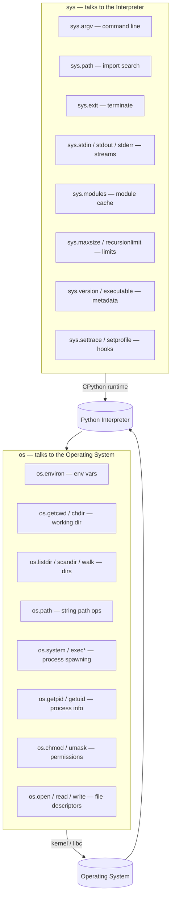
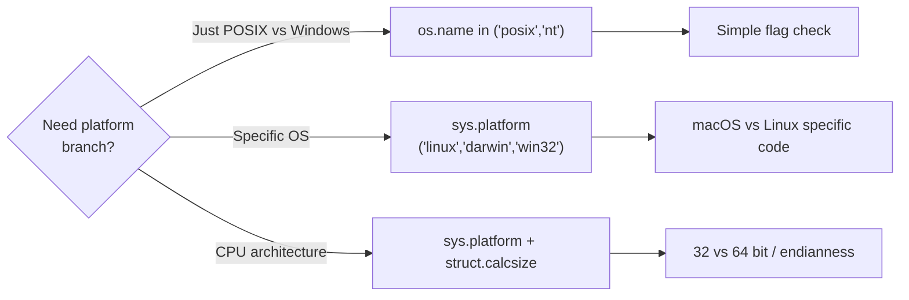

# 1. os and sys

> [!note] Why this note exists
> The `os` and `sys` modules are the two great escape hatches of CPython: `os` lets you talk to the operating system (files, processes, environment, paths), and `sys` lets you talk to the Python interpreter itself (arguments, modules, exit codes, standard streams). They look superficially similar — both are about "the environment your program runs in" — but they answer different questions. `os` answers "what does the OS give me?"; `sys` answers "what does Python give me?". This note covers the most useful members of both modules, the cross-platform pitfalls (`os.name`, `nt` vs `posix`), the modern alternatives (`pathlib` for paths, `subprocess` for `os.system`), and a clean mental model for which module owns which responsibility.

## Why It Matters

Every nontrivial Python program eventually needs to do one of the following:
- Read an environment variable.
- Get the command-line arguments.
- Find out where Python is installed.
- Exit early with a specific code.
- Talk to stdin/stdout/stderr as streams, not just `print`.
- List a directory.
- Spawn another program.

The `os` and `sys` modules are where these primitives live. They are the lowest layer above C — most other stdlib modules (pathlib, subprocess, shutil, logging) are built on top of them. Knowing them well means you can read almost any Python source code, because every serious library eventually reaches into `os` or `sys` somewhere.

## Background

### Two modules, two domains

| Module | Domain          | Talks to            | Examples                                  |
|--------|-----------------|---------------------|-------------------------------------------|
| `os`   | Operating system| Kernel / libc       | Files, processes, env vars, paths, uid    |
| `sys`  | Interpreter     | CPython runtime     | argv, path, modules, exit, stdin/stdout   |

A useful mnemonic: **`os` is for "outside" (the OS); `sys` is for "self" (the interpreter).**

### History

Both modules have been in Python since version 1.x. `os` grew organically as a thin wrapper over POSIX and Windows APIs; `sys` grew as a grab bag of interpreter knobs. Over time, several `os` features have been "promoted" to better, more Pythonic modules:
- `os.path` → `pathlib` (Python 3.4+) — see [[2. pathlib and shutil]].
- `os.system` / `os.popen` → `subprocess` (Python 2.4+) — see [[2. pathlib and shutil]] and Ch 28.
- `os.walk` is still good, but `pathlib.Path.rglob` is often cleaner.

That said, `os` and `sys` are **not deprecated** — many things have no replacement (e.g., `os.environ`, `os.getpid`, `sys.setrecursionlimit`).

## Main content

### The `os` module

#### Environment variables: `os.environ`

`os.environ` is a mapping (dict-like) of the process environment. It is loaded once at interpreter startup and reflects whatever the parent process passed in.

```python
import os

# Read
home = os.environ.get("HOME", "/tmp")         # safe (default)
path = os.environ["PATH"]                       # KeyError if missing
lang = os.getenv("LANG", "C")                   # same as .get, but in os namespace

# Write (also updates the real environment for child processes)
os.environ["MYAPP_DEBUG"] = "1"

# Delete
del os.environ["MYAPP_DEBUG"]
```

> [!tip] `os.getenv` vs `os.environ.get`
> They are equivalent. `os.getenv` exists because it reads slightly better in scripts that already use `os` heavily. There is no performance difference.

Changes to `os.environ` propagate to child processes spawned later via `subprocess` or `os.exec*`, because Python writes through to the C-level ` environ`.

#### Working directory: `os.getcwd`, `os.chdir`

```python
print(os.getcwd())        # /home/alice/projects
os.chdir("/tmp")          # now /tmp
```

> [!warning] `os.chdir` is process-global state
> Changing the working directory affects every thread and every module in the process. Libraries that rely on relative paths will silently break. Prefer absolute paths or `pathlib` over `os.chdir` in any code that runs in a long-lived process.

#### Listing directories: `os.listdir` vs `os.scandir` vs `os.walk`

```python
# Simple list (just names, no metadata)
for name in os.listdir("/etc"):
    print(name)

# Faster, gives you DirEntry objects with cached stat()
with os.scandir("/etc") as it:
    for entry in it:
        if entry.is_file():
            print(entry.name, entry.stat().st_size)

# Recursive walk
for root, dirs, files in os.walk("/home/alice/projects"):
    for f in files:
        print(os.path.join(root, f))
```

`os.scandir` (3.5+) is meaningfully faster than `os.listdir` + `os.stat` because the OS returns file type information in the directory listing itself, avoiding a separate stat call per entry. The stdlib `pathlib.Path.iterdir` uses `scandir` internally.

#### Path operations: `os.path`

`os.path` is a submodule of `os` containing string-based path utilities. It is mostly superseded by `pathlib` but still appears in older code.

```python
os.path.join("a", "b", "c")           # 'a/b/c' on POSIX
os.path.basename("/usr/bin/python")   # 'python'
os.path.dirname("/usr/bin/python")    # '/usr/bin'
os.path.split("/usr/bin/python")      # ('/usr/bin', 'python')
os.path.splitext("archive.tar.gz")    # ('archive.tar', '.gz')
os.path.exists("/etc/passwd")         # True
os.path.isfile("/etc/passwd")         # True
os.path.isdir("/etc")                 # True
os.path.expanduser("~/.bashrc")       # '/home/alice/.bashrc'
os.path.expandvars("$HOME/.bashrc")   # '/home/alice/.bashrc'
os.path.abspath("../x")               # resolves to cwd + ../x
os.path.realpath("/usr/bin/python")   # follows symlinks
```

For new code, prefer `pathlib`. See [[2. pathlib and shutil]].

#### Running programs: `os.system` (and why you shouldn't)

```python
# Returns the exit status (encoded), not the output
os.system("ls -la")
```

`os.system` shells out via `system(3)`. It is:
- **Insecure** if you interpolate user input (shell injection).
- **Lossy** — you don't capture stdout/stderr.
- **Blocking** — there is no async equivalent.

Use `subprocess.run` instead:

```python
import subprocess
result = subprocess.run(
    ["ls", "-la"],
    capture_output=True, text=True, check=True,
)
print(result.stdout)
```

The only legitimate uses of `os.system` are throwaway scripts where you don't care about the output.

#### Process and system info

```python
os.getpid()              # current process ID
os.getppid()             # parent process ID
os.getuid(), os.getgid() # user/group ID (POSIX only)
os.getlogin()            # login name (can be unreliable)
os.uname()               # os/system info (POSIX), like `uname -a`
os.cpu_count()           # number of logical CPUs
os.get_terminal_size()   # columns, rows
```

#### Cross-platform name: `os.name`

```python
print(os.name)   # 'posix' on Linux/macOS, 'nt' on Windows
```

Use this (or `sys.platform`) when you must branch on platform:

```python
if os.name == "nt":
    APPDATA = os.environ["APPDATA"]
else:
    APPDATA = os.path.expanduser("~/.config")
```

> [!tip] `sys.platform` is usually more precise
> `os.name` only distinguishes POSIX vs Windows. `sys.platform` gives you `'linux'`, `'darwin'`, `'win32'`, `'cygwin'`, etc. Prefer `sys.platform` when you need OS-specific behavior (e.g., macOS vs Linux).

#### File permissions and ownership

```python
os.chmod("/tmp/script.sh", 0o755)        # octal mode
os.chown("/tmp/file", uid=1000, gid=1000)  # POSIX only
os.umask(0o077)                            # set process umask
os.access("/etc/passwd", os.R_OK)          # permission check
```

#### File descriptors (low level)

```python
fd = os.open("/tmp/x", os.O_RDWR | os.O_CREAT, 0o644)
try:
    os.write(fd, b"hello")
    os.lseek(fd, 0, os.SEEK_SET)
    data = os.read(fd, 1024)
finally:
    os.close(fd)
```

You almost never need this in application code — use `open()` instead. File descriptors matter when you're writing a server (e.g., non-blocking I/O with `selectors`).

### The `sys` module

#### Command-line arguments: `sys.argv`

`sys.argv` is the list of command-line arguments passed to the script. `argv[0]` is the script name; the rest are user arguments.

```python
# script.py
import sys
print(sys.argv)
# Run: python script.py --foo bar
# Output: ['script.py', '--foo', 'bar']
```

For anything more than two trivial args, use `argparse` — see [[8. argparse]].

#### Import path: `sys.path`

`sys.path` is the list of directories Python searches when you `import` a module. It is initialized from:
1. The script's directory (or `''` for the REPL).
2. `PYTHONPATH` env var.
3. Installation-dependent defaults (`site-packages`, stdlib).

You can mutate it at runtime:

```python
import sys
sys.path.insert(0, "/opt/myapp/libs")
import mylib   # now found in /opt/myapp/libs
```

> [!warning] Mutating `sys.path` is fragile
> Prefer installing your code as a proper package (`pip install -e .`) over manipulating `sys.path` in scripts. Path manipulation is the source of mysterious "module not found" errors in CI.

#### Exiting: `sys.exit`

```python
sys.exit()             # exit with code 0
sys.exit(1)            # exit with code 1 (nonzero = error)
sys.exit("oops")       # prints "oops" to stderr, exits with code 1
```

`sys.exit` raises `SystemExit`, which can be caught (but shouldn't be, normally). At the top level, CPython handles `SystemExit` by terminating with the given code.

> [!tip] `exit()` vs `sys.exit()` vs `os._exit()`
> - `exit()` and `quit()` are interactive-only helpers; using them in scripts works but raises a `SystemExit` and prints a "use quit()" banner if used in a non-interactive session in older Pythons. Prefer `sys.exit`.
> - `sys.exit()` is the polite, cleanup-friendly way (flushes buffers, runs `atexit` handlers).
> - `os._exit()` exits **immediately** without cleanup — use only in forked child processes before `exec`.

#### Standard streams: `sys.stdin`, `sys.stdout`, `sys.stderr`

```python
sys.stdout.write("no newline added\n")
sys.stderr.write("this goes to stderr\n")
line = sys.stdin.readline()
```

These are `TextIOWrapper` objects by default. You can replace them — useful for capturing output in tests:

```python
import io
buf = io.StringIO()
sys.stdout = buf
print("captured")
sys.stdout = sys.__stdout__   # restore
print(buf.getvalue())         # 'captured\n'
```

The `__stdout__` / `__stdin__` / `__stderr__` attributes preserve the original streams so you can always restore them.

#### Module registry: `sys.modules`

`sys.modules` is the dict of every module currently imported by the interpreter.

```python
import sys
print("json" in sys.modules)   # False until json is imported
import json
print("json" in sys.modules)   # True
print(sys.modules["json"])     # <module 'json' ...>
```

This is how `importlib.reload` works and how you can detect circular imports. It is also the closest thing Python has to a global "module cache".

#### Interpreter limits and metadata

```python
sys.maxsize           # largest int on this platform (2**63-1 on 64-bit)
sys.maxunicode        # largest Unicode code point (1114111)
sys.recursionlimit    # default 1000
sys.setrecursionlimit(5000)   # raise it — but beware C stack overflow
sys.version           # '3.12.0 (main, ...)'
sys.version_info      # sys.version_info(major=3, minor=12, ...)
sys.executable        # path to the python binary
sys.prefix            # where the stdlib lives
sys.byteorder         # 'little' or 'big'
sys.int_info          # integer internal representation
sys.float_info        # floating point properties
```

#### `sys.flags` and `sys._xoptions`

```python
sys.flags             # command-line flags as named tuple
sys.flags.debug       # was -d given?
sys.flags.optimize    # -O level (0, 1, 2)
```

`sys._xoptions` holds `-X` flags (e.g., `python -X dev`).

#### `sys.getrecursionlimit` and stack considerations

The default recursion limit is 1000, which is conservative. You can raise it with `sys.setrecursionlimit`, but be careful: CPython's C stack is finite. If you raise the limit too far on a deeply recursive function, you'll get a hard crash (segfault) instead of a clean `RecursionError`. The safe upper bound depends on the platform and the function — typically 5000-10000 on a 64-bit system with default thread stacks.

For genuinely deep recursion, you have three options:
1. Rewrite as iteration (almost always possible).
2. Use `threading` with a larger stack: `threading.stack_size(64 * 1024 * 1024)` then run your recursive code in a thread.
3. Use `sys.setrecursionlimit` cautiously and test on all target platforms.

#### `sys.getsizeof` and `sys.getrefcount`

```python
import sys
x = [1, 2, 3]
sys.getsizeof(x)      # 88 (bytes, shallow — does not include the items)
sys.getrefcount(x)    # 2 (the variable `x` plus the temporary in getrefcount)
```

`getsizeof` returns the **shallow** size — the container's own memory, not the items inside. For deep size, use `pympler` or walk recursively. `getrefcount` is mostly a curiosity — it tells you how many references exist to an object, which can be useful for debugging leaks.

#### Environment introspection

```python
sys.executable          # /usr/bin/python3.12 — useful for spawning subprocesses
sys.prefix              # /usr — where the stdlib lives
sys.base_prefix         # /usr — same unless in a venv
sys.base_exec_prefix    # for venvs: original Python, not the venv
sys.builtin_module_names  # tuple of stdlib modules built into the interpreter
```

These matter for tools that need to find Python's installation: `pip`, `virtualenv`, `pyenv`, IDEs. If you're writing a Python-aware tool, knowing `sys.executable` and `sys.prefix` is the difference between "works in any environment" and "only works on my machine".

#### Hooks: `sys.settrace`, `sys.setprofile`, `sys.displayhook`

These let you intercept execution:
- `sys.settrace(fn)` — call `fn` on every line, call, return. Used by debuggers (pdb).
- `sys.setprofile(fn)` — call `fn` on call/return. Lower overhead than trace. Used by profilers (cProfile).
- `sys.displayhook(obj)` — called when an expression in the REPL produces a value.

You almost never call these directly; they're infrastructure for tooling.

## Mermaid diagrams

### `os` vs `sys` responsibilities



### Cross-platform branching strategy



## Code examples

### Example 1: portable config directory

```python
import os
import sys

def config_dir(app_name: str) -> str:
    """Return the OS-appropriate config directory for `app_name`."""
    if sys.platform == "win32":
        base = os.environ.get("APPDATA", os.path.expanduser("~"))
    elif sys.platform == "darwin":
        base = os.path.expanduser("~/Library/Application Support")
    else:  # linux / other posix
        base = os.environ.get("XDG_CONFIG_HOME", os.path.expanduser("~/.config"))
    path = os.path.join(base, app_name)
    os.makedirs(path, exist_ok=True)
    return path

print(config_dir("myapp"))
```

### Example 2: reading stdin as a stream

```python
import sys

def word_counts(stream):
    counts = {}
    for line in stream:
        for word in line.split():
            counts[word] = counts.get(word, 0) + 1
    return counts

# Works as a pipe: cat file.txt | python script.py
if __name__ == "__main__":
    for word, n in sorted(word_counts(sys.stdin).items()):
        print(f"{word}\t{n}")
```

### Example 3: exit codes for shell integration

```python
import sys

def main():
    if len(sys.argv) < 2:
        sys.stderr.write("usage: script.py <input>\n")
        sys.exit(2)              # 2 = usage error (convention)
    try:
        process(sys.argv[1])
    except FileNotFoundError as e:
        sys.stderr.write(f"not found: {e}\n")
        sys.exit(127)            # 127 = command not found (convention)
    except Exception as e:
        sys.stderr.write(f"error: {e}\n")
        sys.exit(1)              # 1 = generic error
    sys.exit(0)                  # 0 = success

if __name__ == "__main__":
    main()
```

### Example 4: detecting the Python version

```python
import sys

if sys.version_info < (3, 10):
    sys.exit("This program requires Python 3.10+ (for match/case).")

# Use match/case freely below
```

### Example 5: walking with metadata

```python
import os

def total_size(root: str) -> int:
    """Sum the size of every regular file under `root`."""
    total = 0
    for dirpath, _dirs, files in os.walk(root):
        for name in files:
            fp = os.path.join(dirpath, name)
            if not os.path.islink(fp):       # skip symlinks
                try:
                    total += os.path.getsize(fp)
                except OSError:
                    pass
    return total
```

### Example 6: redirecting stdout for capture or testing

```python
import sys
import io

def capture_print(func, *args, **kwargs):
    """Run func, return everything it printed to stdout."""
    backup = sys.stdout
    buf = io.StringIO()
    sys.stdout = buf
    try:
        func(*args, **kwargs)
    finally:
        sys.stdout = backup
    return buf.getvalue()

print(capture_print(print, "hello", "world"))   # 'hello world\n'
```

This pattern is the foundation of test frameworks' `capsys` fixture (pytest) and `contextlib.redirect_stdout` (which is the recommended, race-condition-free way to do the same thing).

## Common Pitfalls

- **`os.system` with f-strings** — `os.system(f"ls {user_input}")` is a shell-injection vulnerability. Always use `subprocess.run([...], ...)`.
- **Trusting `os.environ` to be set** — `os.environ["MY_VAR"]` raises `KeyError` if unset. Use `os.environ.get("MY_VAR", default)` or `os.getenv`.
- **`os.chdir` in libraries** — global state mutation that breaks callers. Use absolute paths.
- **`sys.exit` inside a `try/finally`** — `finally` runs (good), but if you catch `SystemExit` you'll prevent the exit (bad).
- **Mutating `sys.path` in module code** — works today, breaks tomorrow in CI because the order depends on import order. Install packages properly.
- **`os.path.exists` followed by `open`** — TOCTOU race. Just `open()` and catch `FileNotFoundError`.
- **`sys.argv[1]` without checking `len(sys.argv)`** — `IndexError` for the user. Use `argparse`.
- **Comparing `os.name == "mac"`** — there is no `'mac'` value. macOS is `'posix'` for `os.name` and `'darwin'` for `sys.platform`.
- **`sys.setrecursionlimit(100000)` without testing** — can crash the interpreter with a C stack overflow. Increase incrementally.
- **Treating `os.environ` as a snapshot** — writes to it from a parent thread or signal handler can race with reads in another thread. For mission-critical values, snapshot them at startup.
- **Assuming `os.sep` is `/`** — it's `\` on Windows. `pathlib` handles this for you; raw string concatenation doesn't.
- **Catching `SystemExit` to "continue"** — almost always wrong. `SystemExit` is how the interpreter politely asks to stop; let it.

## Tips and Tricks

- **`sys.intern(str)`** — interns a string for fast identity comparison. Useful when parsing huge log files with repeated tokens.
- **`os.cpu_count()` vs `multiprocessing.cpu_count()`** — `os.cpu_count()` is the lower-level call; both return `None` if undeterminable.
- **`os.replace(src, dst)`** — atomic rename across filesystems on POSIX, replaces existing files on Windows. Prefer over `os.rename` (which fails on Windows if `dst` exists).
- **`sys.argv` is mutable** — you can rewrite it before calling a library that reads `argv` itself.
- **`os.sched_setaffinity` (Linux)** — pin your process to specific CPUs. Useful for benchmarks.
- **`sys.setrecursionlimit` + `threading.stack_size`** — for deep recursion, you need both. The default thread stack is small.
- **`os.pipe()` + `os.fork()`** — only on POSIX, but lets you build pipelines without subprocess.
- **`sys.getsizeof(obj)`** — shallow size in bytes. Useful for debugging memory.
- **`os.register_at_fork`** (3.7+) — register pre/post fork hooks for multiprocessing.
- **`os.fsencode` / `os.fsdecode`** — convert between `str` and `bytes` filenames using the filesystem encoding (handles surrogateescape).

## Active Recall

1. What is the difference between `os.name` and `sys.platform`? When would you use each?
2. Why is `os.system` discouraged? What is the modern replacement?
3. What does `sys.argv[0]` contain when you run `python script.py`?
4. How can you safely read an environment variable that may not be set?
5. What is `sys.modules`, and how is it used by `importlib.reload`?
6. Why does `sys.exit("message")` exit with code 1 instead of 0?
7. When would you use `os._exit` instead of `sys.exit`?
8. How does `os.scandir` outperform `os.listdir` + `os.stat`?
9. What is the TOCTOU race, and which `os.path` function triggers it most often?
10. What is `sys.intern` good for?
11. What is the convention for exit code `2`? Exit code `127`?
12. Why is mutating `sys.path` at runtime considered fragile?

## Next Steps

- Continue to [[2. pathlib and shutil]] to see how `pathlib` replaces most of `os.path` and how `shutil` builds on `os` for high-level file operations.
- For the full story on file handling, see Chapter 6 — Files and Serialization.
- For CLI argument parsing built on `sys.argv`, see [[8. argparse]].
- For logging that respects `sys.stderr` and exit semantics, see [[7. logging]].
- For the interpreter's import machinery (where `sys.path` and `sys.modules` live), see [[8. Object-Oriented Programming]] and Ch 17 — Metaprogramming.
