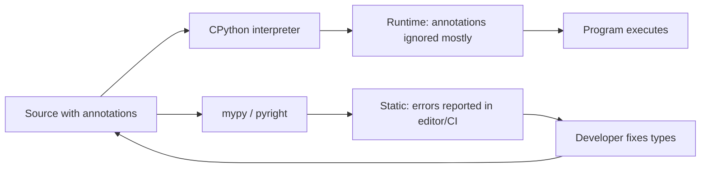
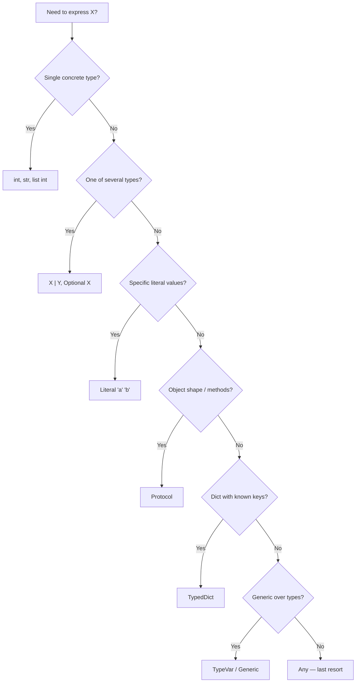

# 10. typing

> [!note] Why this note exists
> The `typing` module is Python's static-type system: a vocabulary for expressing the types of values so that tools like `mypy`, `pyright`, and IDEs can check your code without running it. Since Python 3.9, you can write `list[int]` instead of `List[int]`; since 3.10, you can write `int | str` instead of `Union[int, str]`. The modern `typing` module is the gateway to safer refactors, better autocomplete, and self-documenting APIs. This note covers the built-in generics, `Optional`/`Union`, `Callable`, `TypeVar` and `Generic`, `Protocol` (structural typing), `TypedDict`, `Literal`/`Final`, `ClassVar`, `ParamSpec`/`TypeVarTuple` (advanced), `@overload`, `@final`, and the runtime-vs-static distinction that everyone trips over once.

## Why It Matters

Consider this function:

```python
def process(data):
    return data.get("items", [])
```

What is `data`? A dict? A `defaultdict`? Something with a `.get` method? What does it return — a list? Of what? You can't tell without reading the call sites or the implementation. Now this:

```python
def process(data: dict[str, list[int]]) -> list[int]:
    return data.get("items", [])
```

You can read the contract at a glance. The type checker can verify that callers pass the right thing. The IDE can autocomplete `data.[Tab]` with the methods of `dict`. Refactoring is safe — change the return type and the checker tells you every call site that broke.

Types are **opt-in** in Python: the runtime ignores them (mostly). They are a development aid, not a runtime safety net. The benefit is in the editor, in CI, and in communication with future readers (including yourself in six months).

## Background

### Static vs runtime

Python is dynamically typed. The `typing` module **does not** enforce types at runtime — `int` annotations on a function don't prevent you from passing a string. They are metadata for static analysis tools (`mypy`, `pyright`, `pytype`), IDEs (PyCharm, VS Code), and documentation generators.

You **can** enforce types at runtime with libraries like `pydantic`, `typeguard`, or `beartype`, but that's a separate decision from "should I annotate my code".

### A brief timeline

- **3.5** — `typing` module introduced. `List`, `Dict`, `Optional`, `Union`, `Callable`, `TypeVar`, `Generic`, `Any`.
- **3.6** — variable annotations (`x: int = 0`).
- **3.7** — `from __future__ import annotations` (PEP 563 — all annotations become strings, evaluated lazily).
- **3.8** — `Literal`, `TypedDict`, `Final`, `Protocol`.
- **3.9** — built-in generics (`list[int]`, `dict[str, int]`). `typing.List` etc. are now soft-deprecated.
- **3.10** — `X | Y` syntax for unions. `ParamSpec`, `TypeAlias`.
- **3.11** — `ExceptionGroup`, `tomllib`, `Self`, `LiteralString`, `Required`, `NotRequired`, `dataclass_transform`.
- **3.12** — PEP 695: `type X = ...`, `class C[T]:`, `def f[T](...)` syntax. Generic syntax is now native.
- **3.13** — `TypeVar` defaults, improved `ReadOnly`, `NoDefault`.

If you're on 3.10+, prefer the modern syntax (`list[int]`, `int | None`). Use the `typing` module only for things that don't have a built-in equivalent (`Callable`, `Protocol`, `TypedDict`, `Literal`, `TypeVar`).

## Main content

### Built-in generics (3.9+)

```python
def count(items: list[int]) -> int:
    return sum(items)

def lookup(table: dict[str, list[int]], key: str) -> list[int] | None:
    return table.get(key)

def unique(xs: set[int]) -> list[int]:
    return sorted(xs)

def pairs(d: tuple[int, str]) -> None:
    ...
```

For backward compatibility with 3.8 and earlier, you can still `from typing import List, Dict, Set, Tuple` — but in modern code, use the built-ins.

For tuples:
- `tuple[int, str]` — a 2-tuple of (int, str).
- `tuple[int, ...]` — a tuple of any length, all ints.
- `tuple[int, str, float]` — a 3-tuple.

### `Optional`, `Union` (or `|`)

```python
from typing import Optional, Union

# 3.10+ — prefer |
def f(x: int | None) -> str | None: ...

# Older — Optional/Union
def f(x: Optional[int]) -> Optional[str]: ...   # equivalent
def f(x: Union[int, str, bool]) -> None: ...    # equivalent to int | str | bool
```

`Optional[X]` is exactly `X | None`. It's a readability hint, not a separate type.

### `Any` and `object`

```python
def log_anything(x: Any) -> None:   # any type is accepted; no checks done
    print(x)

def log_anything_safe(x: object) -> None:   # any type accepted, but you can only call object methods
    print(x)
```

`Any` opts out of type checking. `object` is the top type — every value is an `object`, but the type checker only lets you call `object` methods on it. Prefer `object` when you genuinely mean "any value", and `Any` only for dynamic typing escape hatches.

### `Callable`

```python
from typing import Callable

# Callable[[ArgTypes...], ReturnType]
def apply(fn: Callable[[int, int], int], a: int, b: int) -> int:
    return fn(a, b)

# Callable[..., int] — any signature, returns int
def log_call(fn: Callable[..., int]) -> int:
    return fn()

# In 3.10+ you can also use collections.abc.Callable
from collections.abc import Callable as CCallable
```

For `Callable` with keyword-only args or complex signatures, use `ParamSpec` (see below).

### `TypeVar` — generic type variables

```python
from typing import TypeVar

T = TypeVar("T")

def first(xs: list[T]) -> T:
    return xs[0]

# Bounded TypeVar — T must be a subtype of a base class
Number = TypeVar("Number", bound=int | float)
def add(a: Number, b: Number) -> Number:
    return a + b

# Constrained TypeVar — T must be one of these exact types
StrOrBytes = TypeVar("StrOrBytes", str, bytes)
def concat(a: StrOrBytes, b: StrOrBytes) -> StrOrBytes:
    return a + b[0:1]   # type-checks because str and bytes both support + and [0:1]
```

A `TypeVar` says "the same type in all positions". `def first(xs: list[T]) -> T` means "if you give me a list of ints, you get an int back; if you give me a list of strings, you get a string back".

> [!tip] Name TypeVars with single capitals
> `T`, `K`, `V`, `A`, `B` — by convention. This makes them visually distinct from real types.

#### PEP 695 (3.12+): native generic syntax

```python
# Old:
T = TypeVar("T")
def first(xs: list[T]) -> T: ...

# New (3.12+):
def first[T](xs: list[T]) -> T: ...

class Stack[T]:
    def push(self, x: T) -> None: ...
    def pop(self) -> T: ...
```

The new syntax eliminates the need to declare TypeVars at module level.

### `Generic` — generic classes

```python
from typing import Generic, TypeVar

T = TypeVar("T")

class Stack(Generic[T]):
    def __init__(self) -> None:
        self._items: list[T] = []
    def push(self, x: T) -> None:
        self._items.append(x)
    def pop(self) -> T:
        return self._items.pop()

# Usage:
s: Stack[int] = Stack()
s.push(1)
s.push("two")   # type error
```

### `Protocol` — structural typing

`Protocol` lets you say "anything with these methods", without inheritance. It's Python's answer to Go interfaces.

```python
from typing import Protocol

class SupportsClose(Protocol):
    def close(self) -> None: ...

def close_all(*resources: SupportsClose) -> None:
    for r in resources:
        r.close()

class File:
    def close(self) -> None: ...
class DbConn:
    def close(self) -> None: ...

close_all(File(), DbConn())   # OK — both have close()
```

`File` and `DbConn` don't inherit from `SupportsClose`; they just happen to have a `close` method. The type checker uses structural matching: "does this object have all the methods the protocol requires?"

Protocols can be `runtime_checkable`:

```python
from typing import Protocol, runtime_checkable

@runtime_checkable
class Drawable(Protocol):
    def draw(self) -> None: ...

isinstance(x, Drawable)   # works — checks for .draw method
```

But runtime checking only verifies method **existence**, not signatures.

#### Common stdlib protocols

```python
from typing import Protocol, runtime_checkable
from collections.abc import Sized, Iterable, Iterator, Container, Sequence, Mapping
```

`collections.abc` defines `Sized` (`__len__`), `Iterable` (`__iter__`), `Container` (`__contains__`), `Hashable` (`__hash__`), and more. Use these instead of writing your own protocols when they fit.

### `TypedDict` — typed dicts

For dicts with a known set of keys:

```python
from typing import TypedDict

class User(TypedDict):
    id: int
    name: str
    email: str

u: User = {"id": 1, "name": "Alice", "email": "alice@example.com"}
u["id"] = "x"   # type error

# Optional keys (3.11+):
from typing import NotRequired
class UserOptional(TypedDict):
    id: int
    name: str
    email: NotRequired[str]

# Total=False — all keys optional by default:
class UserPartial(TypedDict, total=False):
    id: int
    name: str
```

`TypedDict` is purely a type-system construct — at runtime, a `User` instance is just a `dict`. The keys aren't enforced; only the type checker sees them.

### `Literal` — a specific value as a type

```python
from typing import Literal

def set_mode(mode: Literal["dev", "staging", "prod"]) -> None: ...

set_mode("dev")       # OK
set_mode("production") # type error
```

`Literal` is great for string enums without actually using `enum.Enum`. Combine with `Literal["A"] | Literal["B"]` for unions of literals.

`Literal` lets you model function overloading:

```python
def parse(s: str, as_type: Literal["int", "float", "str"]) -> int | float | str:
    if as_type == "int":
        return int(s)
    elif as_type == "float":
        return float(s)
    return s
```

For better precision, use `@overload` (below).

### `Final` — a name that can't be reassigned

```python
from typing import Final

MAX_RETRIES: Final[int] = 3
MAX_RETRIES = 5   # type error

class Config:
    VERSION: Final[str] = "1.0.0"
```

`Final` is the type-system's way of saying "this is a constant". The runtime doesn't enforce it; the type checker does.

### `ClassVar` — attributes that belong to the class, not instances

```python
from typing import ClassVar

class Counter:
    total: ClassVar[int] = 0   # shared across instances, not per-instance
    value: int                  # per-instance

    def __init__(self) -> None:
        self.value = 0
        Counter.total += 1
```

Without `ClassVar`, the type checker (and `dataclasses`) would treat `total` as an instance attribute.

### `@overload` — multiple signatures, one implementation

```python
from typing import overload

@overload
def parse(x: int) -> int: ...
@overload
def parse(x: str) -> str: ...
@overload
def parse(x: list[int]) -> list[int]: ...
def parse(x):
    # Implementation handles all cases
    if isinstance(x, int):
        return x
    elif isinstance(x, str):
        return x
    return list(x)
```

The `@overload` decorators are for the type checker only — they're erased at runtime. The final implementation (without `@overload`) is what runs. Use `@overload` when a function's return type depends on its argument types in a way `Literal` can't express.

### `@final` — classes and methods that can't be subclassed/overridden

```python
from typing import final

@final
class Leaf:
    ...

class Base:
    @final
    def hook(self) -> None: ...
```

The type checker rejects subclasses of `@final` classes and overrides of `@final` methods. The runtime doesn't enforce it.

### `ParamSpec` and `TypeVarTuple` (3.10+) — advanced generics

#### `ParamSpec` — capture a callable's full parameter list

```python
from typing import ParamSpec, TypeVar, Callable
import functools

P = ParamSpec("P")
R = TypeVar("R")

def log_calls(fn: Callable[P, R]) -> Callable[P, R]:
    @functools.wraps(fn)
    def wrapper(*args: P.args, **kwargs: P.kwargs) -> R:
        print(f"calling {fn.__name__}")
        return fn(*args, **kwargs)
    return wrapper

@log_calls
def add(a: int, b: int) -> int:
    return a + b
# add is typed as (int, int) -> int
```

Without `ParamSpec`, decorators that wrap arbitrary callables lose the wrapped function's signature. `ParamSpec` solves this.

#### `TypeVarTuple` — variadic generics

```python
from typing import TypeVarTuple, Generic

Ts = TypeVarTuple("Ts")

class Array(Generic[*Ts]):
    """A multi-dimensional array; shape is the type parameter."""
    def __init__(self, shape: tuple[*Ts]):
        self.shape = shape

arr2d: Array[int, int] = Array((10, 20))
arr3d: Array[int, int, int] = Array((10, 20, 30))
```

Useful for libraries like NumPy that have naturally variadic type parameters.

### `Self` (3.11+) — return type of "the same class"

```python
from typing import Self

class Builder:
    def set_name(self, name: str) -> Self:
        self.name = name
        return self

class SubBuilder(Builder):
    def set_age(self, age: int) -> Self:
        self.age = age
        return self

b = SubBuilder().set_name("Alice").set_age(30)   # types check
```

Before 3.11, you'd use `T = TypeVar("T", bound="Builder")` and `def set_name(self: T, ...) -> T`, which is verbose and fragile.

### Type aliases

```python
# 3.10+: TypeAlias
from typing import TypeAlias
Vector: TypeAlias = list[float]

# 3.12+: type statement
type Vector = list[float]
type Matrix = list[Vector]

# Both make Vector a synonym for list[float].
```

### `Never` and `NoReturn`

```python
from typing import NoReturn, Never

def fail(msg: str) -> NoReturn:   # or Never (3.11+)
    raise RuntimeError(msg)

def infinite_loop() -> NoReturn:
    while True:
        ...
```

`NoReturn` (or `Never`, same thing in 3.11+) tells the type checker that the function doesn't return normally. Useful for `sys.exit`, `raise`, infinite loops, and exhaustive type narrowing.

### Type narrowing with `TypeGuard` (3.10+) and `TypeIs` (3.13+)

```python
from typing import TypeGuard

def is_str_list(xs: list[object]) -> TypeGuard[list[str]]:
    return all(isinstance(x, str) for x in xs)

def process(xs: list[object]) -> None:
    if is_str_list(xs):
        for s in xs:
            print(s.upper())   # xs is now typed as list[str]
```

`TypeGuard` tells the type checker "if this function returns True, the argument is of this type". `TypeIs` (3.13+) is stricter and narrows in both branches.

### `__future__ import annotations`

```python
from __future__ import annotations
```

This PEP 563 import makes all annotations **strings** (lazily evaluated). It avoids the cost of evaluating complex types at import time and lets you use types that aren't yet defined (forward references) without quotes. It will become the default in a future Python. Use it in new modules.

### Type-checking tools

- **`mypy`** — the original Python type checker. Strict, configurable.
- **`pyright`** (Microsoft) — fast, used by VS Code's Pylance. Generally more permissive than `mypy` strict mode.
- **`pytype`** (Google) — infers types for unannotated code.

### Running the type checker

```bash
pip install mypy
mypy mypackage/
mypy --strict mypackage/
```

`mypy` strict mode enables a bunch of flags at once: `--disallow-untyped-defs`, `--disallow-any-generics`, `--warn-return-any`, etc.

## Mermaid diagrams

### `typing` module landscape

```mermaid
flowchart TB
    T[typing module]
    T --> CORE[Core types]
    T --> GEN[Generics]
    T --> STR[Structural]
    T --> SPEC[Specificity]
    T --> ADV[Advanced]
    T --> META[Meta]

    CORE --> ANY[Any — opt out]
    CORE --> OBJ[object — top type]
    CORE --> NUL[None / NoReturn / Never]

    GEN --> BG[Built-in generics: list dict set tuple, 3.9+]
    GEN --> TV[TypeVar]
    GEN --> GC[Generic base class]
    GEN --> PS[ParamSpec — capture arg list, 3.10+]
    GEN --> TVT[TypeVarTuple — variadic, 3.10+]
    GEN --> NAT[Native generic syntax, 3.12+]

    STR --> PROT[Protocol — structural interface]
    STR --> TD[TypedDict — typed dict keys]
    STR --> ABC[collections.abc protocols]

    SPEC --> OPT[Optional / Union / |]
    SPEC --> LIT[Literal — value as type]
    SPEC --> FIN[Final — constant]
    SPEC --> CV[ClassVar — class attribute]
    SPEC --> SELF[Self — same class, 3.11+]

    ADV --> OVL["@overload"]
    ADV --> TG[TypeGuard / TypeIs]
    ADV --> FNL["@final"]

    META --> ALIAS[TypeAlias / type X = ...]
    META --> FUT["from __future__ import annotations"]
```

### Static vs runtime types



### Choosing a type expression



## Code examples

### Example 1: typed data processing pipeline

```python
from typing import NamedTuple
from collections.abc import Iterable

class Reading(NamedTuple):
    sensor_id: str
    value: float
    timestamp: int   # epoch seconds

def average(readings: Iterable[Reading]) -> float | None:
    total = 0.0
    count = 0
    for r in readings:
        total += r.value
        count += 1
    return total / count if count else None

data = [Reading("A", 1.0, 0), Reading("A", 2.0, 1)]
print(average(data))   # 1.5
```

### Example 2: `Protocol` for plugin systems

```python
from typing import Protocol

class Storage(Protocol):
    def get(self, key: str) -> bytes | None: ...
    def put(self, key: str, value: bytes) -> None: ...

class FileStorage:
    def __init__(self, root): self.root = root
    def get(self, key): ...
    def put(self, key, value): ...

class S3Storage:
    def get(self, key): ...
    def put(self, key, value): ...

def run(storage: Storage) -> None:
    storage.put("x", b"hello")
    print(storage.get("x"))

run(FileStorage("/tmp"))   # OK
run(S3Storage())           # OK
```

### Example 3: `@overload` for precise types

```python
from typing import overload

@overload
def as_list(x: int) -> list[int]: ...
@overload
def as_list(x: str) -> list[str]: ...
@overload
def as_list(x: None) -> list[None]: ...
def as_list(x):
    return [x]

reveal_type(as_list(1))     # list[int]
reveal_type(as_list("a"))   # list[str]
reveal_type(as_list(None))  # list[None]
```

### Example 4: `ParamSpec` for a typed decorator

```python
from typing import Callable, ParamSpec, TypeVar, Type
import functools
import time

P = ParamSpec("P")
R = TypeVar("R")

def timed(fn: Callable[P, R]) -> Callable[P, R]:
    @functools.wraps(fn)
    def wrapper(*args: P.args, **kwargs: P.kwargs) -> R:
        start = time.perf_counter()
        try:
            return fn(*args, **kwargs)
        finally:
            print(f"{fn.__name__}: {time.perf_counter()-start:.3f}s")
    return wrapper

@timed
def greet(name: str, *, excited: bool = False) -> str:
    return f"Hello {name}{'!' if excited else ''}"

# greet is typed as (str, *, excited: bool = False) -> str
```

### Example 5: `TypedDict` for config

```python
from typing import TypedDict, NotRequired

class ServerConfig(TypedDict):
    host: str
    port: int
    debug: NotRequired[bool]
    workers: NotRequired[int]

def serve(cfg: ServerConfig) -> None:
    host = cfg["host"]
    port = cfg["port"]
    debug = cfg.get("debug", False)
    workers = cfg.get("workers", 1)
    print(f"serving on {host}:{port} (debug={debug}, workers={workers})")

serve({"host": "0.0.0.0", "port": 8080})
```

### Example 6: `Literal` for status enums

```python
from typing import Literal

Status = Literal["pending", "running", "complete", "failed"]

def transition(current: Status, event: str) -> Status:
    if current == "pending" and event == "start":
        return "running"
    if current == "running" and event == "finish":
        return "complete"
    if current == "running" and event == "error":
        return "failed"
    return current

s: Status = "pending"
s = transition(s, "start")   # OK
s = transition(s, "pause")   # type error: 'pause' not a valid event (caught at call site? actually no)
```

> [!note] Literal narrows, but doesn't enumerate
> `Literal` doesn't validate at runtime. If you want runtime validation, use `enum.Enum` or `pydantic`.

### Example 7: generic class with `Generic`

```python
from typing import Generic, TypeVar

K = TypeVar("K")
V = TypeVar("V")

class LRUCache(Generic[K, V]):
    def __init__(self, capacity: int) -> None:
        self.capacity = capacity
        self._data: dict[K, V] = {}
        self._order: list[K] = []

    def get(self, key: K) -> V | None:
        if key in self._data:
            self._order.remove(key)
            self._order.append(key)
            return self._data[key]
        return None

    def put(self, key: K, value: V) -> None:
        if key in self._data:
            self._order.remove(key)
        self._data[key] = value
        self._order.append(key)
        if len(self._data) > self.capacity:
            oldest = self._order.pop(0)
            del self._data[oldest]

cache: LRUCache[str, int] = LRUCache(3)
cache.put("a", 1)
print(cache.get("a"))   # 1
```

### Example 8: `Self` for builder pattern

```python
from typing import Self

class QueryBuilder:
    def __init__(self) -> None:
        self._filters: list[str] = []

    def where(self, condition: str) -> Self:
        self._filters.append(condition)
        return self

    def build(self) -> str:
        return "SELECT * FROM t" + (" WHERE " + " AND ".join(self._filters) if self._filters else "")

q = QueryBuilder().where("a = 1").where("b = 2").build()
print(q)
```

## Common Pitfalls

- **`Optional[X]` doesn't mean "optional argument".** It means `X | None`. For optional arguments, use a default: `def f(x: int = 0) -> None`.
- **`list[int]` only works in 3.9+.** On 3.8 and earlier, use `typing.List[int]`. Same for `dict`, `set`, `tuple`.
- **`X | Y` only works in 3.10+.** On older versions, use `Union[X, Y]`.
- **Type annotations are not enforced at runtime** by default. `def f(x: int): f("hi")` runs fine. Use `mypy`/`pyright` to catch it.
- **`Any` is contagious.** Once you use `Any` somewhere, the type checker can't track the type through it. Prefer `object` or a `Protocol`.
- **`Callable` doesn't capture keyword-only args well.** Use `ParamSpec` for precise decorator typing.
- **Forward references need quotes** unless `from __future__ import annotations` is active. `def f(x: "MyClass") -> "MyClass"` is the pre-3.10 idiom.
- **`TypedDict` doesn't enforce keys at runtime.** A `User` instance is a plain dict; missing keys aren't checked.
- **`@overload` implementations must come last** and must handle every case the overloads declare.
- **`TypeVar` without a bound can be too permissive.** `def add(a: T, b: T) -> T` lets the checker infer any `T`; it doesn't enforce that `T` supports `+`.
- **`Protocol` and `isinstance`** only work for `@runtime_checkable` protocols, and only check method names, not signatures.
- **`Literal[1]` and `Literal[1.0]` are different.** `1 == 1.0` is True, but they're different literals.

## Tips and Tricks

- **Run `mypy --strict`** on new modules to catch missing annotations and overly-permissive types.
- **Use `reveal_type(x)` in your code** to ask the type checker what it thinks the type of `x` is. It's a debugging tool for type errors.
- **Use `cast(T, x)`** to override the type checker's inference. Use sparingly — it's an "I know better" escape hatch.
- **`TYPE_CHECKING` block** lets you import types only the type checker sees, avoiding runtime circular imports:
  ```python
  from typing import TYPE_CHECKING
  if TYPE_CHECKING:
      from .models import User
  ```
- **`typing.TYPE_CHECKING`** is `False` at runtime and `True` in mypy/pyright.
- **For variadic callable signatures**, use `Protocol` with `__call__` instead of `Callable[...]` when the args are complex.
- **`typing.assert_never(x)`** (3.11+) is a runtime check for exhaustiveness. If the type checker thinks `x` is `Never`, but at runtime it isn't, this raises.
- **`@dataclass` + types** is the modern way to declare typed records. Use `slots=True` (3.10+) for memory efficiency.
- **Pydantic v2** uses type hints for runtime validation. `class User(BaseModel): id: int; name: str` — `User(**data)` validates and raises on bad input.
- **`from __future__ import annotations`** in every new module — eliminates most forward-reference issues.
- **`typing.get_type_hints(obj)`** is the runtime way to resolve string annotations into real types.
- **`typing.Annotated[T, metadata]`** lets you attach metadata to a type (e.g., `Annotated[int, Range(0, 100)]`) that pydantic and friends can read.

## Active Recall

1. What's the difference between `list[int]` and `typing.List[int]`? When was each introduced?
2. What does `Optional[X]` mean, and what's the modern equivalent?
3. What's the difference between `Any` and `object`?
4. When would you use `Protocol` instead of an abstract base class?
5. What does `TypeVar("T", bound=int)` enforce?
6. How does `@overload` work, and what's the runtime behavior?
7. What is `ParamSpec` for, and what problem does it solve?
8. What's the difference between `Final` and `@final`?
9. Why might you write `from __future__ import annotations`?
10. What does `TypedDict` provide that a regular `dict` type doesn't?
11. What does `Literal["a", "b"]` give you over `str`?
12. How can you check types at runtime if `typing` doesn't enforce them?

## Next Steps

- This concludes Chapter 9 — Standard Library Deep Dive. Return to [[0. Python Roadmap]] for the next chapter.
- For a deeper dive on type hints in real codebases, see Ch 11 — Type Hinting.
- For runtime validation using type hints, see `pydantic` (Ch 28) and `attrs`/`cattrs`.
- For the full PEP index, see [peps.python.org](https://peps.python.org) — PEPs 484, 526, 585, 604, 612, 613, 646, 655, 673, 675, 692, 695, 698, 702, 712, 742 are all typing-related.
- For static analysis tools, install `mypy` and `pyright` and configure them in CI.
- For the typing ecosystem, see `typeshed` (the central repository of stub files for stdlib and third-party packages).
