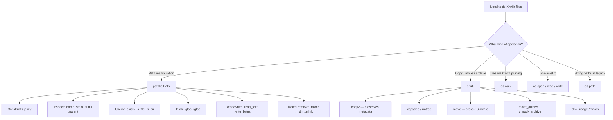

# 2. pathlib and shutil

> [!note] Why this note exists
> `pathlib` is the modern, object-oriented way to handle filesystem paths; `shutil` is the high-level Swiss-army knife for file operations that `pathlib` deliberately doesn't cover (copy, move, recursive delete, archive). Together they replace nearly all of the `os.path` + `os.system("cp ...")` legacy code you'll find in tutorials older than 2015. This note covers the full `pathlib` API (parts, parents, glob, read/write helpers, mkdir/rmdir/unlink), the full `shutil` API (copy, copy2, copytree, rmtree, move, make_archive, disk_usage, which), a side-by-side comparison of `os.path` vs `pathlib`, and the dividing line between the two modules — when do you reach for `pathlib` and when for `shutil`?

## Why It Matters

Consider the everyday task: "copy every `.csv` file from `~/Downloads` into `~/data`, preserving modification times, and remove the originals." The legacy approach uses `os`, `os.path`, `shutil`, and `glob` — four imports and a wall of string concatenation. The modern approach is two lines of `pathlib` plus one `shutil` call.

```python
from pathlib import Path
import shutil

src = Path.home() / "Downloads"
dst = Path.home() / "data"
dst.mkdir(exist_ok=True)

for csv in src.glob("*.csv"):
    shutil.copy2(csv, dst / csv.name)
    csv.unlink()
```

The benefits of this style compound as the program grows:
- **Paths are objects** — `.name`, `.stem`, `.suffix`, `.parent` are attributes, not nested function calls.
- **Cross-platform by default** — `/` joins paths on Windows too. `Path("a") / "b"` produces a `WindowsPath` with backslashes internally but the code reads the same.
- **Method chaining** — `Path.cwd().parent / "data" / "x.csv"` reads left to right.
- **Globbing built in** — `rglob("*.py")` recurses, `glob("*.py")` doesn't.
- **Read/write shortcuts** — `path.read_text()` / `path.write_text(...)` eliminate the `with open(...)` boilerplate for one-shot file ops.

## Background

### `pathlib` — what it is, what it isn't

`pathlib` was added in Python 3.4 (PEP 428). It exposes:
- `PurePath` — path manipulation only, no filesystem access. Subclasses: `PurePosixPath`, `PureWindowsPath`. Useful for parsing paths from another OS.
- `Path` — concrete path with filesystem access. Subclasses: `PosixPath`, `WindowsPath`. The platform picks one automatically.

You almost always just use `Path`. The `Pure*` variants exist for tools that need to, say, parse Windows paths on a Linux CI server without touching the filesystem.

### `shutil` — the "shell utilities" module

`shutil` is named after the Unix `sh` (shell). It provides high-level operations on files and directories that mirror common shell commands:

| Shell command   | `shutil` function        |
|-----------------|--------------------------|
| `cp src dst`    | `shutil.copy(src, dst)`  |
| `cp -p src dst` | `shutil.copy2(src, dst)` |
| `cp -r src dst` | `shutil.copytree(src, dst)` |
| `rm -r dst`     | `shutil.rmtree(dst)`     |
| `mv src dst`    | `shutil.move(src, dst)`  |
| `tar -czf`      | `shutil.make_archive(...)` |
| `du -sh`        | `shutil.disk_usage(...)` |
| `which python`  | `shutil.which("python")` |

The key design principle: **`pathlib` is for path objects; `shutil` is for operations between paths**. `Path` deliberately does not have `.copy()` because the design team wanted to keep `Path` focused on path manipulation; `shutil` functions accept any path-like (string or `Path`).

### The path-like protocol: `os.PathLike`

Python 3.6+ introduced `os.PathLike` (dunder method `__fspath__`). Anything that implements `__fspath__()` returning a string is "path-like" and can be passed to any stdlib function that accepts paths — `open()`, `shutil`, `os`, etc. Both `Path` and `str` satisfy this (str implicitly via `os.fspath`).

## Main content

### `pathlib.Path` essentials

#### Construction and parts

```python
from pathlib import Path

p = Path("/home/alice/projects/myapp/src/main.py")
p.name        # 'main.py'
p.stem        # 'main'
p.suffix      # '.py'
p.suffixes    # ['.py']
p.parent      # PosixPath('/home/alice/projects/myapp/src')
p.parents[0]  # same as .parent
p.parents[1]  # PosixPath('/home/alice/projects/myapp')
p.anchor      # '/'  (the root or drive)
p.parts       # ('/', 'home', 'alice', 'projects', 'myapp', 'src', 'main.py')
p.as_posix()  # '/home/alice/projects/myapp/src/main.py' (always forward slashes)
p.as_uri()    # 'file:///home/alice/projects/myapp/src/main.py'
```

The `parts` tuple is the most underused feature — it lets you iterate path segments without re-splitting.

#### Joining paths

```python
Path("/usr") / "local" / "bin"            # PosixPath('/usr/local/bin')
Path("/usr/local").joinpath("bin", "py")  # PosixPath('/usr/local/bin/py')

# joinpath handles absolute overrides:
Path("/a").joinpath("/b")   # PosixPath('/b')   <-- /b is absolute, replaces /a
```

#### Class methods for common roots

```python
Path.cwd()          # current working directory
Path.home()         # user's home directory
```

#### Existence, type, and permissions

```python
p = Path("/etc/passwd")
p.exists()        # True
p.is_file()       # True
p.is_dir()        # False
p.is_symlink()    # False
p.is_socket()     # False
p.is_mount()      # False

# Permissions
p.owner()         # 'root'  (POSIX)
p.group()         # 'root'  (POSIX)
p.stat().st_mode  # 0o100644
p.stat().st_size  # 2715
p.stat().st_mtime # 1700000000.0 (epoch seconds)
p.lstat()         # like stat() but doesn't follow symlinks
p.chmod(0o600)
```

#### Resolving paths

```python
Path("a/../b/./c").resolve()
# PosixPath('/home/alice/projects/myapp/b/c')  -- absolute, no '..' or '.'

Path("/usr/bin/python3").resolve()
# PosixPath('/usr/bin/python3.11')  -- follows symlinks

Path("/var/log/../tmp/./x").absolute()
# PosixPath('/var/log/../tmp/./x')  -- absolute but NOT normalized (resolve does both)
```

> [!tip] `resolve()` vs `absolute()`
> `absolute()` just prepends the cwd; it doesn't collapse `..` or follow symlinks. `resolve()` does both. `resolve()` may also touch the filesystem; `absolute()` doesn't. For robust path comparison, use `resolve(strict=False)`.

#### Globbing

```python
list(Path("/etc").glob("*.conf"))            # non-recursive
list(Path("/etc").rglob("*.conf"))           # recursive
list(Path("/etc").glob("**/*.conf"))         # same as rglob

# Pattern syntax:
#   *       any non-/ chars
#   **      any chars including / (recursive)
#   ?       single char
#   [abc]   char class
#   [!abc]  negated char class
```

Python 3.12 added the `case_sensitive` argument (default `None`, which means platform-dependent — case-insensitive on Windows, case-sensitive on POSIX).

#### Iterating a directory

```python
for entry in Path("/etc").iterdir():
    print(entry.name)

# Sorted:
for entry in sorted(Path("/etc").iterdir()):
    ...
```

`iterdir` returns `Path` objects (not strings). It does not recurse — use `rglob` for that.

#### File creation and deletion

```python
# Directories
p = Path("/tmp/myapp/subdir")
p.mkdir(parents=True, exist_ok=True)   # like `mkdir -p`
p.rmdir()                              # only works if empty

# Files
f = Path("/tmp/x.txt")
f.touch()                              # create empty, or update mtime
f.unlink()                             # delete file
f.unlink(missing_ok=True)              # 3.8+, no error if missing
f.unlink(missing_ok=True) if f.exists() else None  # 3.7 fallback

# Symlinks
f.symlink_to("/etc/passwd")            # create a symlink
f.readlink()                           # read the target (3.9+)
```

#### Reading and writing

`Path` has convenience methods for small files:

```python
# Text
Path("/tmp/x.txt").write_text("hello\n", encoding="utf-8")
content = Path("/tmp/x.txt").read_text(encoding="utf-8")

# Bytes
Path("/tmp/data.bin").write_bytes(b"\x00\x01\x02")
data = Path("/tmp/data.bin").read_bytes()

# Appending (3.10+ has no append_text, use open)
with Path("/tmp/log.txt").open("a") as f:
    f.write("more\n")
```

> [!warning] `write_text` truncates
> `Path.write_text` always opens in write mode, truncating any existing file. For log-style appending, use `with path.open("a") as f:`.

#### Open as a context manager

```python
with Path("/etc/passwd").open(encoding="utf-8") as f:
    for line in f:
        print(line.rstrip())
```

`Path.open` is a thin wrapper over `open` — same arguments, same behavior. Use it when you want streaming I/O.

#### Modifying file metadata

```python
p = Path("/tmp/x")
p.chmod(0o600)
p.rename("/tmp/y")            # like os.rename (fails if dst exists on Windows)
p.replace("/tmp/z")           # like os.replace (always replaces)
p.unlink()
```

#### New in 3.13+: `Path.full_match`, `Path.from_uri`

Python 3.13 added a few conveniences, including `Path.full_match(pattern)` (like `match` but anchors the entire path) and `Path.from_uri("file:///tmp/x")`.

### `shutil` essentials

#### Copy operations

```python
import shutil

shutil.copy(src, dst)         # copies content + permission bits, returns dst
shutil.copy2(src, dst)        # also copies metadata (mtime, atime, xattrs) -- use this
shutil.copyfile(src, dst)     # only content, no metadata
shutil.copymode(src, dst)     # only permission bits
shutil.copystat(src, dst)     # only metadata
```

**`shutil.copy2` is almost always what you want.** It preserves timestamps, which matters for incremental backup tooling and `make`-like systems.

#### Recursive copy

```python
shutil.copytree("src_dir", "dst_dir")
# dst_dir must NOT exist (use dirs_exist_ok=True to merge into existing, 3.8+)
shutil.copytree("src_dir", "dst_dir", dirs_exist_ok=True)

# With a filter:
def ignore_pyc(directory, contents):
    return [c for c in contents if c.endswith(".pyc")]

shutil.copytree("src", "dst", ignore=ignore_pyc)
```

#### Recursive delete

```python
shutil.rmtree("dst_dir")                        # rm -rf
shutil.rmtree("dst_dir", ignore_errors=True)    # never raise
shutil.rmtree("dst_dir", onerror=handler)       # 3.11 and earlier: callback per error
```

Python 3.12 deprecated `onerror` in favor of `onexc` (which receives an exception instance, not a 3-tuple).

#### Move

```python
shutil.move(src, dst)
```

`move` is a "best effort" operation:
- If `dst` is a directory, the file is moved into it.
- If src and dst are on the same filesystem, it's an `os.rename` (atomic, fast).
- If they're on different filesystems, it copies then deletes (slower, non-atomic).

For predictable behavior on cross-filesystem moves, check first and decide explicitly:

```python
import os
from pathlib import Path
import shutil

def safe_move(src: Path, dst: Path) -> None:
    """Move src to dst, raising on partial failure."""
    try:
        os.rename(src, dst)
    except OSError:  # cross-device link error
        shutil.copy2(src, dst)
        src.unlink()
```

The cross-device case is silent in `shutil.move`, which can mask problems if the copy fails partway and leaves a half-written destination. For critical data, do an explicit `copy2` + verify + `unlink`.

#### Archives

```python
# Create
shutil.make_archive(
    base_name="archive",       # creates archive.tar.gz (extension added)
    format="gztar",            # 'zip', 'tar', 'gztar', 'bztar', 'xztar'
    root_dir="/home/alice",    # chdir here first
    base_dir="projects/myapp", # what to include (relative to root_dir)
)

# Extract
shutil.unpack_archive("archive.tar.gz", extract_dir="/tmp/out")

# Register custom formats
shutil.register_archive_format(name="zstd", function=..., extensions=["zst"], description="...")
```

#### Disk usage

```python
total, used, free = shutil.disk_usage("/")
# usage(total=500107862016, used=300000000000, free=200000000000)
```

#### `which` — find an executable

```python
python_path = shutil.which("python")    # /usr/bin/python
# Equivalent to `which python` in shell.
# Honors PATH, PATHEXT on Windows. Returns None if not found.

shutil.which("python", path="/opt/bin:" + os.environ["PATH"])
shutil.which("python", mode=os.X_OK)
```

`shutil.which` is the right way to find an executable from Python — never shell out to `which` or `where`. It honors the same PATH lookup rules the shell does, including `PATHEXT` on Windows (so it finds `python.exe` when you ask for `"python"`).

#### `shutil.get_archive_formats` and `register_unpack_format`

```python
shutil.get_archive_formats()
# [('bztar', "bzip2'ed tar-file"), ('gztar', "gzip'ed tar-file"),
#  ('tar', 'uncompressed tar file'), ('xztar', "xz'ed tar-file"), ('zip', 'ZIP file')]

shutil.get_unpack_formats()   # formats that unpack_archive understands
```

You can register your own formats with `register_archive_format` and `register_unpack_format`, which is handy if your tool needs to support `.zst`, `.lz4`, or other less-common formats without writing custom dispatch code.

#### `shutil.chown` and other niche helpers

```python
shutil.chown(path, user="alice", group="staff")   # POSIX only
shutil.ignore_patterns("*.pyc", "__pycache__")     # factory for copytree's ignore=
```

`ignore_patterns` returns a callable suitable for `copytree`'s `ignore=` argument — it returns the names of files that should be skipped. It's the easiest way to exclude build artifacts and cache directories from a copy.

### `os.path` vs `pathlib` — the migration table

| Operation                  | `os.path`                                  | `pathlib`                              |
|----------------------------|--------------------------------------------|----------------------------------------|
| Join                       | `os.path.join(a, b, c)`                    | `Path(a) / b / c`                      |
| Basename                   | `os.path.basename(p)`                      | `Path(p).name`                         |
| Dirname                    | `os.path.dirname(p)`                       | `Path(p).parent`                       |
| Splitext                   | `os.path.splitext(p)`                      | `Path(p).suffix` (and `.stem`)         |
| Exists                     | `os.path.exists(p)`                        | `Path(p).exists()`                     |
| Is file / dir              | `os.path.isfile(p)` / `isdir(p)`           | `Path(p).is_file()` / `is_dir()`       |
| Expanduser                 | `os.path.expanduser("~/x")`                | `Path("~").expanduser() / "x"` or `Path.home() / "x"` |
| Realpath                   | `os.path.realpath(p)`                      | `Path(p).resolve()`                    |
| Get size                   | `os.path.getsize(p)`                       | `Path(p).stat().st_size`               |
| Get mtime                  | `os.path.getmtime(p)`                      | `Path(p).stat().st_mtime`              |
| Glob (current dir)         | `glob.glob("*.py")`                        | `Path().glob("*.py")`                  |
| Recursive glob             | `glob.glob("**/*.py", recursive=True)`     | `Path().rglob("*.py")`                 |
| Read text                  | `open(p).read()` (with `with`)             | `Path(p).read_text()`                  |
| Write text                 | `open(p, "w").write(s)`                    | `Path(p).write_text(s)`                |
| Make dirs                  | `os.makedirs(p, exist_ok=True)`            | `Path(p).mkdir(parents=True, exist_ok=True)` |
| List dir                   | `os.listdir(p)`                            | `Path(p).iterdir()`                    |
| Walk                       | `os.walk(p)`                               | `Path(p).rglob("*")` (less flexible)   |

For walks with pruning, `os.walk` is still the better tool because it lets you mutate `dirs[:]` in-place to skip subtrees. `Path.rglob` doesn't support that.

### When to use what

- **`pathlib`** for path manipulation, existence checks, simple globs, and one-shot file reads/writes.
- **`shutil`** for cross-file operations (copy, move, archive) — anything that touches two paths.
- **`os.walk`** for tree walks where you need to prune subtrees.
- **`os.path`** only when maintaining legacy code or interfacing with libraries that still take strings.
- **`os.open`/`os.read`** for low-level fd work (servers, async I/O).

## Mermaid diagrams

### File operations toolkit



### `os.path` → `pathlib` migration

```mermaid
flowchart LR
    A[Legacy code] --> B{Reach for what?}
    B -->|`os.path.join`| C[`Path() / 'x'`]
    B -->|`os.path.exists`| D[`Path.exists`]
    B -->|`os.path.basename`| E[`Path.name`]
    B -->|`glob.glob`| F[`Path.glob / rglob`]
    B -->|`open().read`| G[`Path.read_text`]
    B -->|`os.makedirs`| H[`Path.mkdir parents=True`]
    B -->|`os.walk` w/ prune| I[Keep os.walk]
    B -->|`shutil.copy` etc| J[Keep shutil]
    C & D & E & F & G & H --> K[Modern pathlib code]
```

## Code examples

### Example 1: incremental backup

```python
from pathlib import Path
import shutil

def backup(src: Path, dst: Path) -> int:
    """Copy every file from src to dst that's newer than its counterpart.
       Returns the number of files copied."""
    dst.mkdir(parents=True, exist_ok=True)
    copied = 0
    for s in src.rglob("*"):
        if not s.is_file():
            continue
        rel = s.relative_to(src)
        d = dst / rel
        if not d.exists() or s.stat().st_mtime > d.stat().st_mtime:
            d.parent.mkdir(parents=True, exist_ok=True)
            shutil.copy2(s, d)
            copied += 1
    return copied

src = Path.home() / "projects" / "myapp"
dst = Path("/mnt/backup") / "myapp"
print(f"backed up {backup(src, dst)} files")
```

### Example 2: organize downloads by extension

```python
from pathlib import Path
import shutil

def organize(downloads: Path) -> None:
    for entry in downloads.iterdir():
        if not entry.is_file():
            continue
        target_dir = downloads / (entry.suffix.lstrip(".") or "noext")
        target_dir.mkdir(exist_ok=True)
        shutil.move(str(entry), str(target_dir / entry.name))

organize(Path.home() / "Downloads")
```

### Example 3: archive a project, excluding venv

```python
from pathlib import Path
import shutil

def archive_project(project: Path, out: Path) -> Path:
    out.mkdir(exist_ok=True)
    archive_base = out / project.name
    return Path(shutil.make_archive(
        base_name=str(archive_base),
        format="gztar",
        root_dir=str(project.parent),
        base_dir=project.name,
    ))

# Note: make_archive doesn't support ignore=. To exclude venv,
# copy to a temp dir first, or use tarfile directly with a filter.
```

### Example 4: walk with pruning

```python
from pathlib import Path

def list_python_files(root: Path, skip_dirs=("venv", ".git", "__pycache__")):
    """Yield every .py file under root, skipping common noise directories."""
    for path in root.rglob("*.py"):
        if any(part in skip_dirs for part in path.parts):
            continue
        yield path
```

> [!note] For real pruning, `os.walk` is faster
> `os.walk` lets you mutate `dirs[:]` in-place to prevent recursion. `rglob` doesn't. For huge trees with many excluded subtrees, `os.walk` can be dramatically faster.

### Example 5: safely find a writable config path

```python
from pathlib import Path

def find_config_dir(app: str) -> Path:
    candidates = [
        Path("/etc") / app,
        Path.home() / ".config" / app,
        Path.cwd() / "config",
    ]
    for c in candidates:
        if c.is_dir() and os.access(c, os.W_OK):
            return c
    # Fall back to creating one
    fallback = Path.home() / ".config" / app
    fallback.mkdir(parents=True, exist_ok=True)
    return fallback
```

### Example 6: atomic file replacement for safe writes

```python
from pathlib import Path
import os, tempfile

def atomic_write(path: Path, data: str) -> None:
    """Write `data` to `path` atomically: write to a temp file, fsync, rename."""
    path.parent.mkdir(parents=True, exist_ok=True)
    # Create the temp file in the SAME directory so the rename is atomic.
    tmp = Path(tempfile.mkstemp(dir=path.parent, prefix=path.name + ".")[1])
    try:
        with tmp.open("w", encoding="utf-8") as f:
            f.write(data)
            f.flush()
            os.fsync(f.fileno())
        os.replace(tmp, path)   # atomic on POSIX, replaces on Windows
    except Exception:
        tmp.unlink(missing_ok=True)
        raise
```

The atomic-write pattern is essential for configuration files, log rotations, and any case where a crash mid-write would leave a corrupt file. `os.replace` is the key primitive: on POSIX, `rename(2)` is atomic within the same filesystem; on Windows, `os.replace` does the equivalent `MoveFileEx` with `MOVEFILE_REPLACE_EXISTING`.

## Common Pitfalls

- **`Path` is immutable but `Path` objects do compare equal across platforms?** They don't — `PurePosixPath("/a") != PureWindowsPath("\\a")`. Within the same platform, equal paths compare equal regardless of normalization (`Path("a/../b") != Path("b")` — use `.resolve()` first).
- **`shutil.copy` does not preserve mtime** — use `shutil.copy2` for backups.
- **`Path.rmdir` only removes empty directories** — use `shutil.rmtree` for non-empty.
- **`Path.unlink` raises `FileNotFoundError` if the file is missing** — pass `missing_ok=True` (3.8+).
- **`shutil.copytree` to an existing directory fails by default** — pass `dirs_exist_ok=True` (3.8+).
- **`Path("/a").joinpath("/b")` returns `Path("/b")`** — absolute args override. Easy to miss in dynamic code.
- **`rglob("*")` returns directories too** — filter with `.is_file()` if you only want files.
- **`shutil.move` is non-atomic across filesystems** — it falls back to copy+delete.
- **`make_archive` doesn't support `ignore=`** — to exclude files, copy first or use `tarfile` directly with a custom filter.
- **`Path.touch()` does not create parent directories** — call `.parent.mkdir(parents=True, exist_ok=True)` first.
- **`glob` patterns don't match hidden files (starting with `.`)** by default — use `.*` explicitly or set `case_sensitive`/recursive flags.

## Tips and Tricks

- **`Path.read_text(encoding="utf-8")` is your default** — always pass encoding explicitly; the platform default varies.
- **`Path.with_suffix(".bak")`** returns a sibling path with a new extension — perfect for backup files.
- **`Path.with_name("other.txt")`** returns a sibling with a new name (whole filename).
- **`Path.relative_to(other)`** raises `ValueError` if not relative — Python 3.12 added `relative_to(other, walk_up=True)` to allow `..` traversal.
- **`Path.is_relative_to(other)`** (3.9+) — safer than try/except.
- **`Path.hardlink_to(target)`** (3.10+) — create a hard link.
- **`Path.owner()` is slow on Windows** — cache it if you call it many times.
- **`shutil.rmtree(path, onexc=...)`** (3.12+) replaces `onerror`. Upgrade your callbacks.
- **`shutil.copy2` preserves xattrs on Linux** — useful for SELinux contexts.
- **`Path.iterdir()` order is OS-dependent** — `sorted(Path.iterdir(...))` if you need determinism.
- **`Path.stat()` follows symlinks; `Path.lstat()` doesn't.**
- **Use `Path.as_uri()` to get a `file://` URL** for libraries that expect URLs.

## Active Recall

1. What is the difference between `Path.resolve()` and `Path.absolute()`?
2. Why is `shutil.copy2` preferred over `shutil.copy` for backups?
3. How do you make `Path("/tmp/x").mkdir(parents=True, exist_ok=True)` and `os.makedirs("/tmp/x", exist_ok=True)` differ?
4. What is the `os.PathLike` protocol and what dunder does it use?
5. How would you copy a directory tree while excluding `.pyc` files?
6. When does `shutil.move` fall back to copy+delete?
7. What does `Path("/a/b").joinpath("/c")` return, and why?
8. How would you create a `.tar.gz` archive of a project root?
9. Why does `Path.rglob("*")` not let you prune subtrees, and what's the alternative?
10. What is `shutil.which` equivalent to at the shell?
11. What's the difference between `Path.suffix` and `Path.suffixes`?
12. How would you read just the first line of a file using `pathlib`?

## Next Steps

- Continue to [[3. datetime and time]] for the standard library's time and date modules.
- Revisit Chapter 6 — Files and Serialization for `Path.open` and `with` patterns in depth.
- For low-level file descriptors and `os.open`, see [[1. os and sys]].
- For archives beyond what `shutil` offers, see the `zipfile`, `tarfile`, and `gzip` stdlib modules.
- For walking huge trees efficiently, see the `scandir` discussion in [[1. os and sys]].
