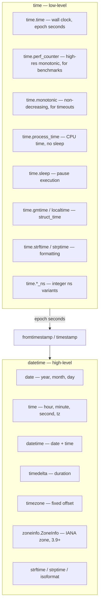
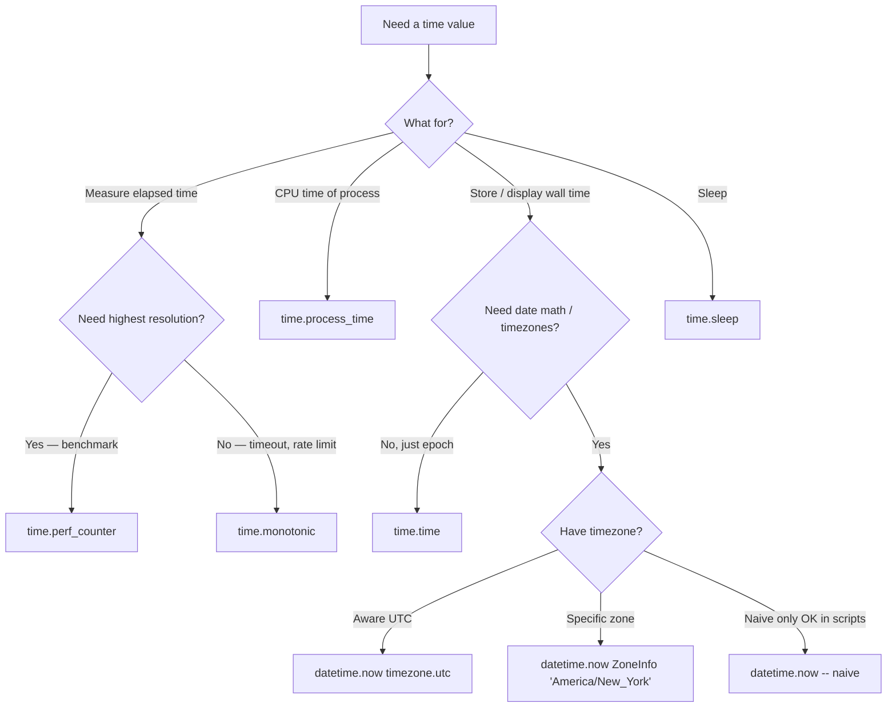
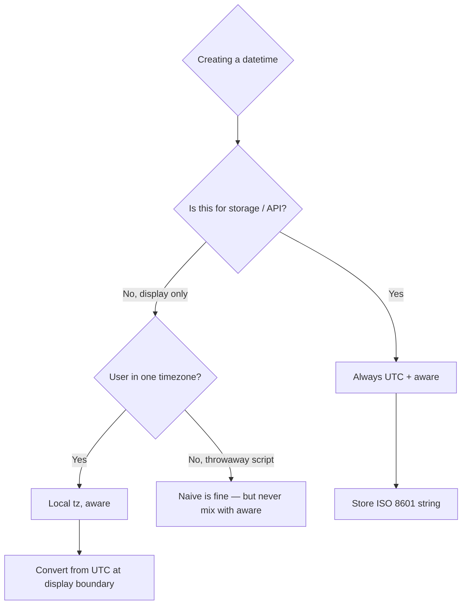

# 3. datetime and time

> [!note] Why this note exists
> Time is the most universally mishandled concept in programming. The Python standard library gives you two modules for it: `time` (low-level C bindings — epoch seconds, sleeps, CPU time) and `datetime` (high-level date/time objects with calendar arithmetic and optional time zones). Knowing which one to reach for, and how to avoid the 90% of bugs that come from time zones, will save you weeks of pain. This note covers `time.time`/`time.perf_counter`/`time.sleep`/`time.monotonic`, the `datetime` class quartet (`date`, `time`, `datetime`, `timedelta`), `tzinfo`, the modern `zoneinfo` module (3.9+) that replaces `pytz`, `strftime`/`strptime` formatting, and a decision tree for "naive vs aware vs epoch".

## Why It Matters

Every program that logs, schedules, caches, polls, or displays timestamps has to deal with time. Here are four bugs you'll write at least once:

1. **Storing local time without a timezone** — and then your user in another country sees "yesterday".
2. **Comparing naive to aware datetimes** — `TypeError: can't compare offset-naive and offset-aware datetimes`.
3. **Using `time.time()` for elapsed measurement** — gets jumpy if NTP adjusts the clock; use `time.perf_counter()`.
4. **Adding 24 hours to skip a DST day** — you land on the wrong wall-clock hour because the day had 23 or 25 hours.

The Python standard library gives you the tools to avoid all four, but only if you understand the difference between **naive** (no tz info), **aware** (has tz info), and **monotonic** (only useful for elapsed time, not wall clock) times.

## Background

### Two modules, two layers

| Module      | Layer      | Uses                                              | What it gives you                              |
|-------------|------------|---------------------------------------------------|------------------------------------------------|
| `time`      | Low-level  | Epoch seconds, system clock, CPU time, sleep      | Numbers and `struct_time` tuples               |
| `datetime`  | High-level | Calendar dates, clock times, timedeltas, timezones| `date`, `time`, `datetime`, `timedelta` objects |

`time` is essentially the C `<time.h>` library thinly wrapped. `datetime` is a pure-Python layer on top of it that knows about months, leap years, and time zones.

### The three clocks

Python distinguishes three clocks you should never conflate:

- **Wall clock** — `time.time()`. What your wristwatch shows. Can jump backward or forward (NTP, manual changes, DST). Use for timestamps you store.
- **Monotonic clock** — `time.monotonic()`. Only increases; never affected by NTP. Use for measuring elapsed time.
- **Performance counter** — `time.perf_counter()`. Highest-resolution monotonic clock, includes time elapsed during sleep. Use for benchmarking.

There's also `time.process_time()` (CPU time, excluding sleep) and `time.thread_time()` (per-thread CPU time).

### The class quartet in `datetime`

```
date        year, month, day
time        hour, minute, second, microsecond, tzinfo  (NOT a point in time!)
datetime    date + time
timedelta   duration between two datetimes (or two dates, or two times)
tzinfo      abstract base class for timezones (ZoneInfo implements it)
```

A `datetime.time` is **not** a moment — it's "10:30" with no date attached. This is a frequent source of confusion for people coming from languages where "Time" means an instant.

### Naive vs aware

A `datetime` is **naive** if its `tzinfo` is `None`. It's **aware** if `tzinfo` is set. Naive datetimes are ambiguous — "2024-03-15 10:30" in whose timezone?

The golden rule for production code: **always store aware datetimes, in UTC, and convert to local only at the display boundary.**

## Main content

### The `time` module

#### `time.time()` — wall clock, epoch seconds

```python
import time
now = time.time()           # 1718000000.123456 (float seconds since 1970-01-01 UTC)
time.ctime(now)             # 'Mon Jun 10 12:34:56 2024'  (local time string)
time.gmtime(now)            # struct_time in UTC
time.localtime(now)         # struct_time in local time
```

`struct_time` is a named tuple with fields `tm_year`, `tm_mon`, `tm_mday`, `tm_hour`, `tm_min`, `tm_sec`, `tm_wday`, `tm_yday`, `tm_isdst`. Mostly you'll use `datetime` instead.

#### `time.sleep(seconds)`

```python
time.sleep(0.5)              # float seconds, can be sub-millisecond
```

`sleep` may oversleep slightly; the OS scheduler decides when to wake you. It can also return early if a signal interrupts it (then the caller should check).

#### `time.perf_counter()` — for benchmarking

```python
start = time.perf_counter()
do_work()
end = time.perf_counter()
print(f"{end - start:.6f}s")
```

`perf_counter` has the highest available resolution (often nanoseconds). Use this for measuring elapsed time, **not** `time.time()`.

#### `time.monotonic()` — guaranteed non-decreasing

```python
deadline = time.monotonic() + 30.0
while time.monotonic() < deadline:
    if got_result():
        break
    time.sleep(0.1)
```

`monotonic` never goes backward, even if the system clock is adjusted. It's the right choice for timeouts and rate limits.

#### `time.process_time()` — CPU time

```python
start = time.process_time()
compute_intensive()
end = time.process_time()
# end - start = CPU seconds consumed by this process
```

Excludes sleep and time the OS spent on other processes. Useful for benchmarking CPU-bound work.

#### `time.strftime` / `time.strptime`

```python
time.strftime("%Y-%m-%d %H:%M:%S", time.localtime())   # '2024-06-10 12:34:56'
t = time.strptime("2024-06-10", "%Y-%m-%d")            # struct_time
```

You'll usually use the `datetime` versions instead.

#### Other useful bits

```python
time.get_clock_info("monotonic")   # namespace with resolution, monotonic, etc.
time.thread_time()                  # per-thread CPU time
time.time_ns()                      # nanoseconds since epoch (int, 3.7+)
time.perf_counter_ns()              # ns version of perf_counter
time.monotonic_ns()
```

The `_ns` variants return `int` instead of `float`, avoiding float precision loss for very large epoch values.

### The `datetime` module

#### Creating dates and times

```python
from datetime import date, time, datetime, timedelta, timezone

d = date(2024, 6, 10)               # a date, no time
t = time(10, 30, 0)                 # 10:30:00, naive
dt_naive = datetime(2024, 6, 10, 10, 30, 0)
dt_utc = datetime(2024, 6, 10, 10, 30, 0, tzinfo=timezone.utc)

today = date.today()                 # today's date (local)
now_local = datetime.now()           # local datetime, naive
now_utc = datetime.now(timezone.utc) # aware UTC datetime
now_utc2 = datetime.utcnow()         # DEPRECATED in 3.12 — returns naive UTC!
```

> [!warning] `datetime.utcnow()` is deprecated
> Since 3.12 it's deprecated because it returns a **naive** datetime (no tzinfo), which leads to bugs. Use `datetime.now(timezone.utc)` for an aware UTC datetime.

#### `datetime.fromtimestamp` and `timestamp`

```python
import time
ts = time.time()                                    # 1718000000.0
dt = datetime.fromtimestamp(ts, tz=timezone.utc)    # aware
back = dt.timestamp()                                # back to epoch seconds
```

`fromtimestamp` is the bridge from `time.time()` to `datetime`. Always pass `tz=` to make it aware.

#### Arithmetic with `timedelta`

```python
from datetime import timedelta

one_day = timedelta(days=1)
two_hours = timedelta(hours=2)
weird = timedelta(weeks=1, days=2, hours=3, minutes=4, seconds=5, microseconds=6)

tomorrow = date.today() + one_day
later = datetime.now(timezone.utc) + two_hours

# timedelta arithmetic
print(two_hours.total_seconds())   # 7200.0
print(two_hours * 3)                # timedelta(hours=6)
print(one_day - two_hours)          # timedelta(days=1, hours=-2)
print(timedelta(seconds=-1))        # timedelta(days=-1, seconds=86399) -- normalized
```

`timedelta` normalizes to days, seconds, microseconds internally. `total_seconds()` is the cleanest way to compare or convert.

> [!tip] Use `timedelta` for "exactly N hours"
> Adding `timedelta(hours=24)` to a datetime gives you the same UTC instant 24 hours later. It does **not** give you "the same wall-clock time tomorrow" in a timezone with DST — for that, see "calendar arithmetic" below.

#### Calendar arithmetic with months and years

`timedelta` only has days/weeks/seconds/microseconds. There's no `timedelta(months=1)` because months aren't a fixed length. For month arithmetic, use the `relativedelta` from `dateutil`, or compute manually:

```python
def add_months(d: date, months: int) -> date:
    month = d.month - 1 + months
    year = d.year + month // 12
    month = month % 12 + 1
    # clamp the day if the target month is shorter
    import calendar
    day = min(d.day, calendar.monthrange(year, month)[1])
    return date(year, month, day)
```

Or just use `dateutil.relativedelta`:

```python
from dateutil.relativedelta import relativedelta
next_quarter = date.today() + relativedelta(months=3)
```

#### Comparison and sorting

```python
a = datetime(2024, 6, 10, tzinfo=timezone.utc)
b = datetime(2024, 6, 11, tzinfo=timezone.utc)
a < b                     # True
a == b                    # False
max([a, b])               # b
```

Aware datetimes with different offsets are compared correctly (instant comparison):

```python
utc = datetime(2024, 6, 10, 12, 0, tzinfo=timezone.utc)
ny = datetime(2024, 6, 10, 8, 0, tzinfo=ZoneInfo("America/New_York"))
utc == ny    # True! Same instant.
```

Comparing naive to aware raises `TypeError`. This is by design — Python refuses to guess.

#### Formatting: `strftime` and `strptime`

```python
dt = datetime(2024, 6, 10, 14, 30, 45)
dt.strftime("%Y-%m-%d %H:%M:%S")    # '2024-06-10 14:30:45'
dt.strftime("%B %d, %Y")            # 'June 10, 2024'
dt.strftime("%Y-%m-%dT%H:%M:%S%z")  # '2024-06-10T14:30:45'  (no tz on naive)

parsed = datetime.strptime("2024-06-10 14:30:45", "%Y-%m-%d %H:%M:%S")
```

Common format codes:
- `%Y` 4-digit year, `%y` 2-digit
- `%m` month (01-12), `%d` day (01-31)
- `%H` 24h hour, `%I` 12h hour, `%M` minute, `%S` second
- `%p` AM/PM, `%f` microseconds (6 digits)
- `%A` weekday name, `%a` abbreviated, `%w` weekday number (0=Sun)
- `%B` month name, `%b` abbreviated
- `%z` UTC offset (+HHMM), `%Z` timezone name
- `%j` day of year (001-366), `%U`/`%W` week number
- `%%` literal `%`

> [!tip] ISO 8601 is your friend
> `datetime.isoformat()` produces `'2024-06-10T14:30:45'` (or with tz: `'2024-06-10T14:30:45+00:00'`). `datetime.fromisoformat()` parses it back. Use ISO 8601 for storage and APIs — it's unambiguous, sortable, and standard. The `Z` suffix for UTC is supported by `fromisoformat` in 3.11+.

### Timezones: `timezone`, `zoneinfo`, and the death of `pytz`

#### The built-in `timezone` class

```python
from datetime import timezone, timedelta

utc = timezone.utc
est = timezone(timedelta(hours=-5))     # fixed offset, no DST
pst = timezone(timedelta(hours=-8))

dt = datetime.now(utc)
dt_est = dt.astimezone(est)
```

`timezone` is good for fixed offsets but doesn't know about DST or historical zone changes. For real zones ("America/New_York"), you need `zoneinfo`.

#### `zoneinfo` (Python 3.9+)

```python
from zoneinfo import ZoneInfo
from datetime import datetime

tz = ZoneInfo("America/New_York")
dt = datetime(2024, 6, 10, 12, 0, tzinfo=tz)       # EDT (UTC-4)
dt_utc = dt.astimezone(timezone.utc)               # 2024-06-10 16:00:00+00:00

# DST is handled automatically
winter = datetime(2024, 1, 10, 12, 0, tzinfo=tz)   # EST (UTC-5)
winter.astimezone(timezone.utc)                    # 2024-01-10 17:00:00+00:00
```

`zoneinfo` uses your OS's tz database (the IANA database, also called the Olson database). On Linux/macOS it's at `/usr/share/zoneinfo/`. On Windows, Python ships a bundled copy via the `tzdata` package (install it explicitly on Windows: `pip install tzdata`).

#### `pytz` vs `zoneinfo`

`pytz` was the de-facto standard before 3.9. Its API is **wrong by design** — you have to call `pytz.timezone(...).localize(dt)` instead of passing `tzinfo=` in the constructor, because `pytz` objects don't represent a single offset but a list of possible offsets:

```python
import pytz
tz = pytz.timezone("America/New_York")
dt_naive = datetime(2024, 6, 10, 12, 0)
dt_aware = tz.localize(dt_naive)   # CORRECT with pytz
# dt_aware = datetime(2024, 6, 10, 12, 0, tzinfo=tz)  # WRONG with pytz!
```

With `zoneinfo`, you pass `tzinfo=tz` in the constructor (the intuitive way) and it just works. **For new code, use `zoneinfo`**. Only use `pytz` for legacy compatibility.

#### `fold` — disambiguating DST transitions

```python
from zoneinfo import ZoneInfo
from datetime import datetime

tz = ZoneInfo("America/New_York")
# Nov 3, 2024, 1:30 AM happens twice (clocks fall back from 2 AM to 1 AM)
first = datetime(2024, 11, 3, 1, 30, tzinfo=tz, fold=0)  # EDT (UTC-4)
second = datetime(2024, 11, 3, 1, 30, tzinfo=tz, fold=1) # EST (UTC-5)
first.astimezone(timezone.utc)  # 2024-11-03 05:30:00+00:00
second.astimezone(timezone.utc) # 2024-11-03 06:30:00+00:00
```

`fold` is 0 for the first occurrence and 1 for the second. Without it, you can't distinguish them.

#### Converting between zones

```python
from zoneinfo import ZoneInfo
from datetime import datetime, timezone

meeting_utc = datetime(2024, 6, 10, 16, 0, tzinfo=timezone.utc)
meeting_nyc = meeting_utc.astimezone(ZoneInfo("America/New_York"))   # 12:00 EDT
meeting_tokyo = meeting_utc.astimezone(ZoneInfo("Asia/Tokyo"))       # 01:00 +09 (next day)
```

`astimezone` converts an aware datetime to another timezone. Always works on aware datetimes only.

### Calendar and time helpers

```python
import calendar
list(calendar.monthrange(2024, 2))   # [3, 29]  (Thu, 29 days — 2024 is leap)
calendar.isleap(2024)                # True
calendar.leapdays(2000, 2024)        # 6
calendar.weekday(2024, 6, 10)        # 0 (Monday)
```

## Mermaid diagrams

### `time` vs `datetime` responsibilities



### Choosing the right clock



### Aware vs naive — the decision tree



## Code examples

### Example 1: a benchmark decorator

```python
import time
from functools import wraps

def timed(fn):
    @wraps(fn)
    def wrapper(*args, **kwargs):
        start = time.perf_counter()
        result = fn(*args, **kwargs)
        elapsed = time.perf_counter() - start
        print(f"{fn.__name__}: {elapsed*1000:.2f}ms")
        return result
    return wrapper

@timed
def slow():
    time.sleep(0.1)
    return "done"

slow()   # slow: 100.34ms
```

### Example 2: a rate limiter

```python
import time
from collections import deque

class RateLimiter:
    def __init__(self, max_calls: int, per_seconds: float):
        self.max_calls = max_calls
        self.window = per_seconds
        self.calls = deque()

    def allow(self) -> bool:
        now = time.monotonic()
        while self.calls and self.calls[0] < now - self.window:
            self.calls.popleft()
        if len(self.calls) >= self.max_calls:
            return False
        self.calls.append(now)
        return True

rl = RateLimiter(max_calls=5, per_seconds=1.0)
for _ in range(10):
    print(rl.allow())   # True x5, False x5
```

### Example 3: storing timestamps in a database

```python
from datetime import datetime, timezone

def now_iso() -> str:
    """ISO 8601 UTC string with timezone — safe to store."""
    return datetime.now(timezone.utc).isoformat()

def parse_iso(s: str) -> datetime:
    """Parse ISO 8601 (possibly with 'Z') back to aware datetime."""
    return datetime.fromisoformat(s.replace("Z", "+00:00"))

stored = now_iso()                  # '2024-06-10T16:30:00.123456+00:00'
back = parse_iso(stored)            # aware datetime
back.timestamp()                    # epoch seconds
```

### Example 4: schedule a meeting in three timezones

```python
from datetime import datetime, timezone
from zoneinfo import ZoneInfo

def show_meeting(utc_dt: datetime, zones: list[str]) -> None:
    assert utc_dt.tzinfo is not None, "must be aware"
    print(f"UTC:        {utc_dt.isoformat()}")
    for z in zones:
        local = utc_dt.astimezone(ZoneInfo(z))
        print(f"{z:25s} {local.strftime('%Y-%m-%d %H:%M %Z')}")

meeting = datetime(2024, 6, 10, 16, 0, tzinfo=timezone.utc)
show_meeting(meeting, [
    "America/New_York",
    "Europe/London",
    "Asia/Kolkata",
    "Asia/Tokyo",
    "Australia/Sydney",
])
```

### Example 5: parse a human-friendly date with `dateutil`

```python
# pip install python-dateutil
from dateutil.parser import parse
parse("June 10, 2024")               # datetime(2024, 6, 10)
parse("2024-06-10T14:30:00Z")        # aware UTC
parse("next Tuesday")                # works in dateutil 2.9+
parse("2024-06-10", dayfirst=True)   # for European format
```

### Example 6: count down to a deadline

```python
import time
from datetime import datetime, timezone

def countdown(target: datetime) -> None:
    while True:
        now = datetime.now(timezone.utc)
        remaining = target - now
        if remaining.total_seconds() <= 0:
            print("done!")
            return
        days = remaining.days
        hours, rem = divmod(remaining.seconds, 3600)
        minutes, seconds = divmod(rem, 60)
        print(f"\r{days}d {hours:02d}:{minutes:02d}:{seconds:02d}", end="", flush=True)
        time.sleep(1)
```

## Common Pitfalls

- **Comparing naive to aware datetimes raises `TypeError`.** Either make both aware or both naive.
- **`datetime.utcnow()` returns a naive datetime** — deprecated since 3.12. Use `datetime.now(timezone.utc)`.
- **Adding 24 hours skips DST changes.** To advance a wall-clock time across DST, use `zoneinfo` + relative delta, not `timedelta(hours=24)`.
- **`time.time()` is not monotonic.** NTP can jump it. Use `time.monotonic()` for elapsed time.
- **`pytz` API is `tz.localize(naive)`**, not `datetime(..., tzinfo=tz)`. With `zoneinfo` it's the opposite. Mixing them silently gives wrong offsets.
- **`strptime` is locale-dependent for `%B`, `%A`, `%p`.** If you parse English dates on a French system, it may fail. Set `locale.setlocale(locale.LC_TIME, "C")` for predictability.
- **`%z` doesn't match `Z`** until Python 3.11. Older code must `.replace("Z", "+0000")` first.
- **Storing `datetime.isoformat()` of a naive datetime loses tz info silently.** Always store aware.
- **`datetime.fromtimestamp(ts)` without `tz=` returns local time.** Almost always a bug for portability — use `fromtimestamp(ts, tz=timezone.utc)`.
- **`timedelta(days=30)` is not "one month".** Use `dateutil.relativedelta(months=1)` for month arithmetic.
- **`time.sleep(0)` is not a no-op** — it yields the GIL. Sometimes that's what you want, but be aware.
- **Windows has lower `time.sleep` resolution** (~15ms) unless you call `time.beginthreadtimer` or set the timer resolution. For high-precision sleeps, consider a busy-wait loop on `perf_counter`.

## Tips and Tricks

- **`datetime.fromisoformat` got much better in 3.11** — it now handles `Z`, more ISO variants.
- **`date.isoweekday()`** returns 1=Mon..7=Sun (ISO 8601), unlike `date.weekday()` which is 0=Mon..6=Sun.
- **`date.isocalendar()`** returns `(ISO_year, ISO_week, ISO_weekday)` — handles year boundaries correctly for week-numbered calendars.
- **`datetime.combine(date, time)`** merges a `date` and `time` into a `datetime`.
- **`datetime.replace(tzinfo=...)`** changes the tz without converting. Use `astimezone` to convert, not `replace`.
- **`timedelta.max` is `timedelta(days=999999999)`.** Useful for "infinity" defaults.
- **`zoneinfo` caches `ZoneInfo` objects.** Reusing the same key returns the same instance, so equality comparisons are cheap.
- **`datetime.timestamp()`** returns a float; for very-far-future dates the precision is poor. Use `time.time_ns()` for high-precision epoch.
- **`calendar.timegm(time.gmtime())`** is the UTC equivalent of `time.mktime` — useful for converting UTC `struct_time` to epoch without going through local time.
- **`datetime.isoformat(timespec='seconds')`** trims sub-second precision — `'2024-06-10T16:30:00+00:00'` instead of `'...+00:00.123456'`.
- **`datetime.isoformat(timespec='minutes')`** trims to minutes — great for grouping by minute in logs.
- **`zoneinfo.ZoneInfo("UTC")` is valid** and equivalent to `timezone.utc`.

## Active Recall

1. What's the difference between `time.time()`, `time.monotonic()`, and `time.perf_counter()`?
2. Why is `datetime.utcnow()` deprecated, and what's the replacement?
3. How do you make a naive datetime aware?
4. What's the difference between `pytz`'s `localize` and `zoneinfo`'s direct construction?
5. How do you convert an aware UTC datetime to `America/New_York`?
6. Why doesn't `timedelta` have `months=`? How do you add a month?
7. What is `fold` for, and when does it matter?
8. How do you parse `"2024-06-10T14:30:00Z"` correctly?
9. What does `time.sleep(0)` do?
10. Why is comparing naive to aware datetimes an error?
11. What's the safe format for storing timestamps in a database?
12. How does Windows affect `time.sleep` precision?

## Next Steps

- Continue to [[4. collections]] for the standard library's data structure modules.
- For scheduling work using timers and deadlines, see Ch 14 — Concurrency.
- For high-resolution profiling, see Ch 15 — Memory and Performance.
- For parsing arbitrary date strings, install `python-dateutil` and read its docs.
- For calendar-aware recurring events (every 3rd Tuesday), see `dateutil.rrule`.
- The IANA timezone database is at https://iana.org/time-zones — keep your OS's copy updated.
