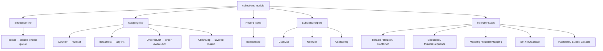

# 4. collections

> [!note] Why this note exists
> The `collections` module is the standard library's "data structures that should have been builtins" drawer. It contains `deque` (a fast double-ended queue), `Counter` (a multiset), `defaultdict` (a dict that lazily fills missing keys), `OrderedDict` (a dict that remembers insertion order, useful for LRU caches), `ChainMap` (a stack of dicts searched top-down), `namedtuple` (typed tuples with field names), and the `UserDict`/`UserList`/`UserString` trio (for safe subclassing of built-ins). Chapter 4 introduced these as data structures; this note goes deeper into their implementation details, performance characteristics, design idioms, and the patterns they unlock — like the two-line LRU cache and the layered-config lookup.

## Why It Matters

Without `collections`, half of your everyday "build a dict of lists" code looks like this:

```python
groups = {}
for item in items:
    key = item.category
    if key not in groups:
        groups[key] = []
    groups[key].append(item)
```

With `defaultdict`:

```python
from collections import defaultdict
groups = defaultdict(list)
for item in items:
    groups[item.category].append(item)
```

That's three lines saved per occurrence. Across a large codebase, `collections` saves thousands of lines and removes thousands of opportunities for `KeyError`. The same is true for `Counter` (counts, top-N, set arithmetic), `deque` (fixed-size buffers, O(1) pop from both ends), `ChainMap` (layered config without copying), `namedtuple` (self-documenting records at zero memory overhead), and `OrderedDict` (LRU caches, FIFO queues).

## Background

### The module at a glance

```
deque              double-ended queue (linked list of blocks)
Counter            dict subclass for counting hashables
OrderedDict        dict that remembers insertion order
defaultdict        dict that calls a factory for missing keys
ChainMap           stack of mappings, searched left-to-right
namedtuple         factory for tuple subclasses with named fields
UserDict           wrapper around dict for safe subclassing
UserList           wrapper around list for safe subclassing
UserString         wrapper around str for safe subclassing
abc                abstract base classes (Mapping, Sequence, etc.)
```

Since Python 3.7, plain `dict` also preserves insertion order, so `OrderedDict` is now redundant for "ordered dict" — but it still has unique methods (`move_to_end`, `popitem(last=...)`) that make it the right tool for LRU caches.

### When to reach for `collections`

The rule of thumb: **if you find yourself writing the same five lines of dict-initialization logic in three places, there's a `collections` type for it.** The same applies to:
- Counting → `Counter`.
- "Build a list/dict/set per key" → `defaultdict(list|dict|set)`.
- "Append left as well as right, or fixed-size buffer" → `deque`.
- "Look up in defaults, then user config, then env" → `ChainMap`.
- "Tuple of fields, but I want named access" → `namedtuple` or `typing.NamedTuple` (see [[10. typing]]).
- "Subclass dict but my overrides get ignored" → `UserDict`.

## Main content

### `deque`

A `deque` (pronounced "deck") is a doubly-linked list of fixed-size blocks. It supports O(1) `append` and `pop` on both ends, unlike `list` which is O(n) for `pop(0)` and `insert(0, x)`.

```python
from collections import deque

d = deque([1, 2, 3])
d.append(4)          # deque([1, 2, 3, 4])
d.appendleft(0)      # deque([0, 1, 2, 3, 4])
d.pop()              # 4
d.popleft()          # 0
d.extend([5, 6])
d.extendleft([0, -1])   # NOTE: extends in reverse: deque([-1, 0, 0, 1, 2, 3, 5, 6])
```

#### Bounded deque (sliding window)

```python
d = deque(maxlen=3)
d.extend([1, 2, 3, 4, 5])   # deque([3, 4, 5], maxlen=3)
d.append(6)                 # deque([4, 5, 6], maxlen=3) -- 3 silently dropped
```

A bounded `deque` is the standard "last N items" data structure. Use it for ring buffers, recent-event lists, and rolling statistics.

#### `rotate`

```python
d = deque([1, 2, 3, 4, 5])
d.rotate(2)     # deque([4, 5, 1, 2, 3])  -- positive rotates right
d.rotate(-1)    # deque([5, 1, 2, 3, 4])  -- negative rotates left
```

`rotate` is O(k) where k is the rotation amount. It's much faster than slicing-and-concatenating a list.

#### Performance

| Operation        | `list`     | `deque`    |
|------------------|------------|------------|
| `append`         | O(1) amort | O(1)       |
| `appendleft`     | O(n)       | O(1)       |
| `pop`            | O(1)       | O(1)       |
| `popleft`        | O(n)       | O(1)       |
| `d[i]` random access | O(1)   | O(n) (must walk blocks) |
| `insert(i, x)`   | O(n)       | O(n)       |

So `deque` is faster at the ends, slower for random access. Use it for queues, not for indexed storage.

### `Counter`

`Counter` is a `dict` subclass for counting hashable items. The keys are the items; the values are their counts.

```python
from collections import Counter

c = Counter("abracadabra")
print(c)              # Counter({'a': 5, 'b': 2, 'r': 2, 'c': 1, 'd': 1})
c["a"]                # 5
c["z"]                # 0  (Counter returns 0 for missing keys, not KeyError)
c.most_common(3)      # [('a', 5), ('b', 2), ('r', 2)]
c.elements()          # iterator: a a a a a b b r r c d
sorted(c.elements())  # ['a','a','a','a','a','b','b','c','d','r','r']
```

#### Multiset arithmetic

`Counter` supports the four multiset operations:

```python
a = Counter(a=3, b=1)
b = Counter(a=1, b=2)

a + b    # Counter({'a': 4, 'b': 3})   union (sum of counts)
a - b    # Counter({'a': 2})           difference (drops <= 0)
a & b    # Counter({'a': 1, 'b': 1})   intersection (min of counts)
a | b    # Counter({'a': 3, 'b': 2})   union (max of counts)
```

Note: `a - b` keeps only positive counts; counts of 0 or below are dropped. To get the "signed" difference, use a dict comprehension or `Counter({k: a[k] - b[k] for k in a | b})`.

#### `update` and `subtract`

```python
c = Counter()
c.update("abracadabra")        # add counts
c.update({"a": 10})            # add 10 to a
c.subtract({"a": 3})           # subtract 3 from a
```

#### Idioms

```python
# Top 5 most common words in a file
from collections import Counter
import re
text = open("/etc/passwd").read()
words = re.findall(r"\w+", text.lower())
print(Counter(words).most_common(5))

# Detect if two strings are anagrams
def is_anagram(a, b):
    return Counter(a) == Counter(b)
```

### `defaultdict`

A `defaultdict` calls a factory function when a key is missing, stores the result, and returns it. The factory takes no arguments.

```python
from collections import defaultdict

d = defaultdict(list)
d["a"].append(1)        # creates d["a"] = [] first
d["a"].append(2)
d["b"].extend([3, 4])

# Common factories:
defaultdict(list)          # list per key
defaultdict(set)           # set per key
defaultdict(int)           # 0 per key (int() returns 0)
defaultdict(dict)          # dict per key
defaultdict(lambda: [])    # equivalent to list
defaultdict(lambda: defaultdict(int))   # nested
```

#### Gotcha: missing keys now appear

```python
d = defaultdict(list)
d["x"]    # []   <-- this CREATES d["x"]
"x" in d  # True
```

If you just want to check existence, use `.get()` or `in` carefully. The factory is only invoked by `__getitem__`, not by `.get()` or `in` — so `d.get("missing")` returns `None` without creating the key.

#### Idioms

```python
# Group items by key
groups = defaultdict(list)
for item in items:
    groups[item.category].append(item)

# Index a list by some attribute
index = defaultdict(list)
for i, item in enumerate(items):
    index[item.name].append(i)

# Counter without Counter
counts = defaultdict(int)
for word in words:
    counts[word] += 1

# Two-level dict
two_level = defaultdict(lambda: defaultdict(int))
two_level["a"]["x"] += 1
two_level["a"]["y"] += 2
```

### `OrderedDict`

Since Python 3.7, plain `dict` preserves insertion order. So when do you still need `OrderedDict`?

1. **For the unique methods**: `move_to_end(key, last=True)` and `popitem(last=True)`.
2. **For explicit "ordered" intent** — code that uses `OrderedDict` is documenting that order matters.
3. **For equality semantics** — `OrderedDict` considers order in `==`, plain `dict` doesn't.

```python
from collections import OrderedDict

d = OrderedDict()
d["a"] = 1
d["b"] = 2
d["c"] = 3

d.move_to_end("a")          # move a to the end
d.popitem(last=True)        # ('a', 1)   -- LIFO
d.popitem(last=False)       # ('b', 2)   -- FIFO
```

#### LRU cache in 10 lines

```python
from collections import OrderedDict

class LRUCache:
    def __init__(self, capacity: int):
        self.capacity = capacity
        self.data = OrderedDict()

    def get(self, key):
        if key not in self.data:
            return None
        self.data.move_to_end(key)   # mark as recently used
        return self.data[key]

    def put(self, key, value):
        if key in self.data:
            self.data.move_to_end(key)
        self.data[key] = value
        if len(self.data) > self.capacity:
            self.data.popitem(last=False)   # evict oldest
```

This is exactly the pattern `functools.lru_cache` uses internally (see [[6. functools]]).

#### `OrderedDict` equality is order-sensitive

```python
OrderedDict([("a", 1), ("b", 2)]) == OrderedDict([("b", 2), ("a", 1)])  # False
{"a": 1, "b": 2} == {"b": 2, "a": 1}                                    # True
```

### `ChainMap`

`ChainMap` groups multiple mappings into a single view. Lookups search the maps in order; mutations affect only the first map.

```python
from collections import ChainMap

defaults = {"theme": "light", "lang": "en", "page_size": 20}
user = {"theme": "dark"}
env = {"lang": "fr"}

config = ChainMap(user, env, defaults)
config["theme"]       # "dark"   (from user)
config["lang"]        # "fr"     (from env)
config["page_size"]   # 20       (from defaults)

config["theme"] = "auto"   # writes to user (the first map)
list(config)                # ['theme', 'lang', 'page_size']
```

#### Use case: layered configuration

```python
import os
from collections import ChainMap

def load_config():
    return ChainMap(
        # highest priority first
        read_toml(".local.toml"),
        read_toml("config.toml"),
        {"debug": False, "port": 8000},   # defaults
    )
```

The advantage over `dict.update` is that `ChainMap` doesn't copy. If `config.toml` is reloaded, the `ChainMap` sees the new values. It's also faster to construct than merging big dicts.

#### Gotcha: writes only affect the first map

```python
config["port"] = 9000   # writes to .local.toml's dict, not to defaults
del config["port"]      # deletes from .local.toml's dict, NOT from defaults
# If 'port' isn't in the first map, `del` raises KeyError, even if it's in later maps.
```

### `namedtuple`

`namedtuple` is a factory that creates a tuple subclass with named fields.

```python
from collections import namedtuple

Point = namedtuple("Point", ["x", "y"])
p = Point(3, 4)
p.x          # 3
p.y          # 4
p[0]         # 3
p._asdict()  # {'x': 3, 'y': 4}
p._replace(x=10)   # Point(x=10, y=4)
Point._make([1, 2])   # Point(x=1, y=2)
p._fields    # ('x', 'y')
```

#### Pros and cons

**Pros:**
- Zero memory overhead beyond a normal tuple.
- Index-accessible (compatible with code expecting tuples).
- Immutable (hashable, safe as dict keys).
- Self-documenting (`Point(x=3, y=4)` in `repr`).

**Cons:**
- Subclassing a `namedtuple` is awkward.
- Default values are awkward before 3.7 (`Point.__new__.__defaults__ = (0,)`).
- Field names that start with `_` or are Python keywords are rejected unless you use `rename=True`.
- Can't add methods easily.

For richer records, use `typing.NamedTuple` (cleaner syntax, type hints, methods) or `dataclasses` (mutable, methods, full type system). See [[10. typing]].

```python
from typing import NamedTuple

class Point(NamedTuple):
    x: float
    y: float
    z: float = 0.0   # default

    def distance_to(self, other: "Point") -> float:
        return ((self.x - other.x) ** 2 + (self.y - other.y) ** 2) ** 0.5
```

#### `defaults` and `rename`

```python
from collections import namedtuple
Point = namedtuple("Point", ["x", "y", "z"], defaults=[0])
# z defaults to 0; x and y are required.
Point(1, 2)        # Point(x=1, y=2, z=0)
Point(1, 2, 3)     # Point(x=1, y=2, z=3)
```

### `UserDict`, `UserList`, `UserString`

These are wrappers around the corresponding built-in types, designed for **safe subclassing**. The built-in types like `dict` and `list` have C-level methods that bypass your Python-level overrides.

```python
class LowerDict(dict):
    def __setitem__(self, key, value):
        super().__setitem__(key.lower(), value)

d = LowerDict()
d["Hello"] = 1
print(d)                    # {'hello': 1}    <-- looks fine
d.update({"World": 2})
print(d)                    # {'hello': 1, 'World': 2}  <-- update bypassed!
```

The fix is to subclass `UserDict` instead:

```python
from collections import UserDict

class LowerDict(UserDict):
    def __setitem__(self, key, value):
        super().__setitem__(key.lower(), value)

d = LowerDict()
d["Hello"] = 1
d.update({"World": 2})      # update calls __setitem__ properly
print(d)                    # {'hello': 1, 'world': 2}
```

`UserDict` stores the actual data in `self.data` (a plain dict), so every operation routes through your overrides. The same applies to `UserList` (`self.data` is a list) and `UserString` (`self.data` is a string).

> [!tip] When to use UserDict
> Use `UserDict` whenever you want to override `__getitem__`, `__setitem__`, `__contains__`, etc., and you need every API (including `update`, `setdefault`, `get`, `pop`) to go through your overrides. The cost is some indirection — `UserDict` is slightly slower than raw `dict`.

### `collections.abc`

The `collections.abc` submodule defines abstract base classes: `Container`, `Iterable`, `Iterator`, `Sequence`, `MutableSequence`, `Mapping`, `MutableMapping`, `Set`, `MutableSet`, `Hashable`, `Sized`, `Callable`, etc.

These are useful for:
- Type-checking: `isinstance(x, collections.abc.Sequence)` is true for lists, tuples, strings, bytes, deques, and any class registered as a Sequence.
- Defining protocols in your own classes: `class MyView(collections.abc.Mapping): ...` and `abc` will tell you if you forgot a method.

## Mermaid diagrams

### `collections` module overview



### `deque` vs `list` performance

```mermaid
flowchart LR
    OP[Operation] --> Q{Which end?}
    Q -->|Right end| BOTH["O(1) for both list and deque"]
    Q -->|Left end| DEQUE["deque: O(1)"]
    Q -->|Left end| LIST["list: O(n) — must shift all elements"]
    Q -->|Random index i| Q2{Read or write?}
    Q2 -->|list| LISTIDX[O(1)]
    Q2 -->|deque| DEQUEIDX[O(n) — walks blocks]
```

### `defaultdict` lookup flow

```mermaid
flowchart TD
    GET[d['key']] --> CHECK{Key exists?}
    CHECK -->|Yes| RET1[Return value]
    CHECK -->|No| FAC[Call factory()]
    FAC --> STORE[Store result in d['key']]
    STORE --> RET2[Return result]
```

## Code examples

### Example 1: group-and-count in one pass

```python
from collections import defaultdict, Counter

def categorize(items):
    """Return {category: Counter(brands)} from a list of items."""
    out = defaultdict(Counter)
    for item in items:
        out[item.category][item.brand] += 1
    return out
```

### Example 2: sliding-window moving average

```python
from collections import deque

class MovingAverage:
    def __init__(self, window: int):
        self.window = window
        self.values = deque(maxlen=window)
        self.sum = 0.0

    def push(self, x: float) -> float:
        if len(self.values) == self.window:
            self.sum -= self.values[0]   # about to be evicted
        self.values.append(x)
        self.sum += x
        return self.sum / len(self.values)

ma = MovingAverage(3)
for v in [1, 2, 3, 4, 5]:
    print(ma.push(v))   # 1.0, 1.5, 2.0, 3.0, 4.0
```

### Example 3: thread-safe bounded log buffer

```python
from collections import deque
import threading

class LogBuffer:
    def __init__(self, capacity: int = 1000):
        self.buffer = deque(maxlen=capacity)
        self.lock = threading.Lock()

    def append(self, line: str) -> None:
        with self.lock:
            self.buffer.append(line)

    def snapshot(self) -> list[str]:
        with self.lock:
            return list(self.buffer)
```

### Example 4: LRU cache for an API

```python
from collections import OrderedDict
import time

class TimedLRU:
    def __init__(self, capacity: int, ttl: float):
        self.capacity = capacity
        self.ttl = ttl
        self.data: OrderedDict = OrderedDict()

    def get(self, key):
        if key in self.data:
            value, expires = self.data[key]
            if expires > time.monotonic():
                self.data.move_to_end(key)
                return value
            del self.data[key]
        return None

    def set(self, key, value) -> None:
        if key in self.data:
            self.data.move_to_end(key)
        self.data[key] = (value, time.monotonic() + self.ttl)
        if len(self.data) > self.capacity:
            self.data.popitem(last=False)
```

### Example 5: layered configuration

```python
from collections import ChainMap
import os, json
from pathlib import Path

def load_config():
    sources = []
    # 1. Environment overrides (highest priority)
    env_overrides = {k[7:].lower(): v for k, v in os.environ.items() if k.startswith("MYAPP_")}
    sources.append(env_overrides)
    # 2. User config
    user_cfg_path = Path.home() / ".myapp.json"
    if user_cfg_path.exists():
        sources.append(json.loads(user_cfg_path.read_text()))
    # 3. Project-local config
    local_cfg_path = Path.cwd() / ".myapp.json"
    if local_cfg_path.exists():
        sources.append(json.loads(local_cfg_path.read_text()))
    # 4. Built-in defaults (lowest priority)
    sources.append({"debug": False, "port": 8000, "log_level": "INFO"})
    return ChainMap(*sources)

cfg = load_config()
print(cfg["port"], cfg["debug"], cfg["log_level"])
```

### Example 6: a typed record using `namedtuple`

```python
from collections import namedtuple

# CSV row as a typed tuple
Row = namedtuple("Row", ["date", "ticker", "open", "high", "low", "close", "volume"],
                 defaults=[0])   # volume defaults to 0

with open("prices.csv") as f:
    header = f.readline().strip().split(",")
    rows = [Row._make(line.strip().split(",")) for line in f]

for r in rows[:3]:
    print(r.ticker, r.close)

# Convert to dicts for JSON
import json
print(json.dumps([r._asdict() for r in rows[:3]]))
```

### Example 7: `UserDict` for case-insensitive dict

```python
from collections import UserDict

class CaseInsensitiveDict(UserDict):
    def __setitem__(self, key, value):
        super().__setitem__(key.lower(), value)
    def __getitem__(self, key):
        return super().__getitem__(key.lower())
    def __contains__(self, key):
        return super().__contains__(key.lower())
    def __delitem__(self, key):
        super().__delitem__(key.lower())

d = CaseInsensitiveDict()
d["Content-Type"] = "application/json"
print(d["content-type"])   # application/json
print("CONTENT-TYPE" in d) # True
```

## Common Pitfalls

- **`defaultdict` creates keys on read.** `d["missing"]` returns the default value AND stores it. Use `d.get("missing")` if you want to peek without inserting.
- **`Counter` returns 0 for missing keys**, but `"x" in counter` is `False` if the count is 0. Mixing these semantics can lead to bugs.
- **`deque[0]` is O(n)** for random access. Don't use a `deque` as a list replacement.
- **`ChainMap` writes only affect the first map.** `del` raises `KeyError` if the key isn't in the first map, even if it's in later ones.
- **`Counter + Counter` keeps only positive counts.** Use signed subtraction manually if you need negative counts.
- **`namedtuple` field names can't start with `_` or be keywords** unless `rename=True`, which silently renames them to `_<index>`.
- **Subclassing `dict` directly doesn't route `update`, `get`, `setdefault` through your `__setitem__`/`__getitem__`.** Use `UserDict` for that.
- **`OrderedDict` is not `dict` since 3.7.** Equality is order-sensitive; `dict` equality isn't.
- **`namedtuple` instances are immutable**, but their fields can be mutable objects. `Point(x=[], y=[])` is mutable through `p.x.append(...)`.
- **`Counter.elements()` yields items in insertion order with counts, but the order is not guaranteed across Python versions for equal-count items.**
- **`deque(maxlen=0)` silently drops everything.** A surprising edge case — usually you want `maxlen >= 1`.

## Tips and Tricks

- **`Counter.most_common()` without an argument returns all items**, sorted by count descending. With `n`, returns top `n`.
- **`Counter.total()` (3.10+) returns the sum of all counts.** Before 3.10, use `sum(c.values())`.
- **`defaultdict` accepts any callable, not just `list`/`int`/`dict`.** Try `defaultdict(lambda: "N/A")` for a dict with a default string.
- **`deque` can be pickled**, unlike a generator.
- **`namedtuple._replace()` returns a new instance** with the named fields changed — perfect for immutable updates (think React state).
- **`namedtuple._fields` lets you iterate field names** — useful for serialization.
- **`ChainMap.new_child(m=None)` returns a new ChainMap with `m` (or `{}`) prepended.** Useful for scoped overrides without mutating the original.
- **`OrderedDict` is faster than `dict` for `move_to_end`** because the latter doesn't expose that operation.
- **`deque.extendleft` reverses the order of its argument.** `d.extendleft([1,2,3])` results in `[3,2,1,...]`.
- **Use `Counter` for histogram-style data**; use `defaultdict(int)` when you need to mutate counts in a more flexible way.
- **`collections.abc` is your friend for type checks.** `isinstance(x, collections.abc.Mapping)` accepts dicts, OrderedDicts, ChainMaps, and any registered Mapping.
- **`UserString` is great for domain-specific strings** (e.g., a `Filename` class that auto-strips whitespace).

## Active Recall

1. Why is `deque.popleft()` O(1) while `list.pop(0)` is O(n)?
2. What does `Counter` return for a missing key, and how is that different from `defaultdict`?
3. How do you write an LRU cache using `OrderedDict`?
4. Why does subclassing `dict` directly cause your overrides to be bypassed, and what's the fix?
5. What's the difference between `OrderedDict([("a",1),("b",2)]) == OrderedDict([("b",2),("a",1)])` and the same with `dict`?
6. What does `ChainMap` do when you write to a key, and what happens when you delete a key?
7. How do you give a `namedtuple` a default value for one of its fields?
8. When is `Counter.most_common()` faster than sorting `c.items()` yourself?
9. What is the `factory` argument to `defaultdict`, and what callable types are commonly used?
10. What are the five abstract base classes in `collections.abc` that you'd use most often?
11. Why doesn't `deque` support `d[i] = x` efficiently?
12. What is `_replace` on a `namedtuple` and why is it called that?

## Next Steps

- Continue to [[5. itertools]] to see how iterators pair with `collections` for streaming pipelines.
- For the data-structures-as-basics view, revisit Chapter 4 — Data Structures.
- For mutable, method-rich records, see `dataclasses` (Ch 8 — Object-Oriented Programming) and `typing.NamedTuple` in [[10. typing]].
- For thread-safe queues (similar to `deque` but blocking), see the `queue` module (Ch 14 — Concurrency).
- For `functools.lru_cache`, which uses `OrderedDict` internally, see [[6. functools]].
