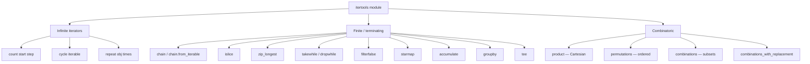
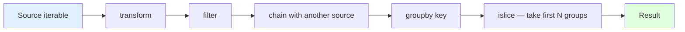
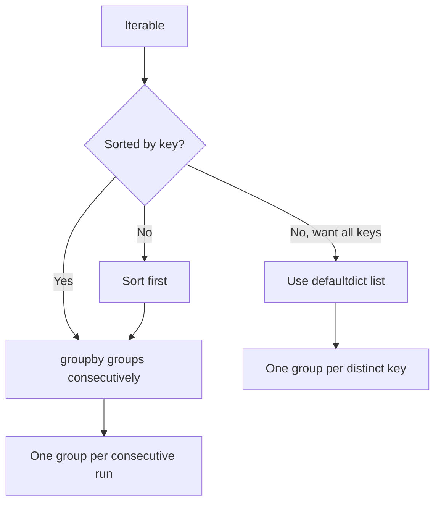

# 5. itertools

> [!note] Why this note exists
> `itertools` is a module of iterator-building functions written in C, all lazy, all memory-efficient, all composable. It is the closest thing Python has to a Lisp-style sequence library. Knowing it well means you can replace 90% of nested loops, list comprehensions, and `while` state machines with one-liners that read almost like English. This note covers the infinite iterators (`count`, `cycle`, `repeat`), the finite iterators (`chain`, `islice`, `zip_longest`, `takewhile`, `dropwhile`, `filterfalse`, `starmap`, `accumulate`, `groupby`), the combinatoric generators (`product`, `permutations`, `combinations`, `combinations_with_replacement`), the famous "itertools recipes" from the Python docs, and the patterns that make `itertools` the heart of functional-style Python.

## Why It Matters

Here is a typical data-cleaning loop, written three ways.

```python
# Imperative
result = []
for line in lines:
    line = line.strip()
    if line.startswith("#"):
        continue
    parts = line.split(",")
    if len(parts) < 2:
        continue
    result.append((parts[0], parts[1]))

# Comprehension
result = [
    (parts[0], parts[1])
    for line in lines
    if not (line := line.strip()).startswith("#")
    and len(parts := line.split(",")) >= 2
]

# itertools
from itertools import takewhile, dropwhile, starmap, islice
clean = (l.strip() for l in lines)
non_comment = (l for l in clean if not l.startswith("#"))
parts = (l.split(",") for l in non_comment)
valid = (p for p in parts if len(p) >= 2)
result = list((p[0], p[1]) for p in valid)
```

The itertools version is more verbose for this toy example, but it scales: every step is lazy, every step is a generator, and you can splice in `islice`, `takewhile`, `chain`, etc. without rewriting the loop. For pipelines that process gigabytes of data, this is the difference between "runs in 2 seconds" and "OOM-killed".

## Background

### What `itertools` actually is

`itertools` is a C module exposing ~20 functions, all of which:
- Return an **iterator** (not a list).
- Are **lazy** — they pull from their inputs only as needed.
- Are **composable** — the output of one is the input of the next.
- Are **memory-efficient** — they don't materialize intermediate sequences.

The CPython implementation is in C, so the per-element overhead is lower than a hand-rolled Python generator.

### The mental model: iterators vs iterables

- An **iterable** is anything you can `for` over: lists, dicts, strings, files, generators.
- An **iterator** is the *thing* doing the iteration. It has `__next__()` and raises `StopIteration` when exhausted.

`itertools` functions return iterators. Once consumed, they're done — you can't replay them. To replay, materialize the input into a list first, or use `itertools.tee`.

### Categories

The official Python docs group the functions into three categories:
1. **Infinite iterators** — `count`, `cycle`, `repeat`.
2. **Iterators terminating on the shortest input** — `chain`, `islice`, `zip_longest`, `takewhile`, `dropwhile`, `filterfalse`, `starmap`, `accumulate`, `groupby`, etc.
3. **Combinatoric generators** — `product`, `permutations`, `combinations`, `combinations_with_replacement`.

## Main content

### Infinite iterators

#### `count(start=0, step=1)`

```python
from itertools import count, islice

list(islice(count(10, 2), 5))    # [10, 12, 14, 16, 18]
```

`count` is the iterator equivalent of `range` without an end. You always pair it with something that limits it (`islice`, `takewhile`, `zip`).

#### `cycle(iterable)`

```python
from itertools import cycle, islice
list(islice(cycle("AB"), 5))     # ['A', 'B', 'A', 'B', 'A']

# Round-robin scheduling
players = ["alice", "bob", "carol"]
turns = (next(cycle(players)) for _ in range(9))
```

`cycle` caches the input internally so it can repeat it. Don't pass a one-shot iterator you need later — materialize first.

#### `repeat(obj, times=None)`

```python
from itertools import repeat
list(repeat("x", 3))             # ['x', 'x', 'x']
list(map(lambda x, y: x * y, [1, 2, 3], repeat(10)))   # [10, 20, 30]
```

`repeat` is often used to "pad" `map` arguments. It's also useful as a constant source.

### Finite iterators

#### `chain(*iterables)` and `chain.from_iterable`

```python
from itertools import chain
list(chain([1, 2], [3, 4], [5]))    # [1, 2, 3, 4, 5]

# When the iterables are themselves in an iterable:
lists = [[1, 2], [3, 4], [5]]
list(chain.from_iterable(lists))    # [1, 2, 3, 4, 5]

# Flatten one level of a nested list:
flat = list(chain.from_iterable([[1, [2]], [3]]))
# [1, [2], 3]   (only one level flattened!)
```

`chain.from_iterable` is the same as `chain(*xs)` but accepts a single iterable argument, so it works even when `xs` is itself a generator.

#### `islice(iterable, start, stop, step)` or `islice(iterable, stop)`

```python
from itertools import islice
list(islice(range(10), 3))           # [0, 1, 2]
list(islice(range(10), 2, 8))        # [2, 3, 4, 5, 6, 7]
list(islice(range(10), 2, 8, 2))     # [2, 4, 6]

# With a generator (the killer use case):
def naturals():
    n = 0
    while True:
        yield n
        n += 1

list(islice(naturals(), 5))          # [0, 1, 2, 3, 4]
```

`islice` doesn't support negative indices (because generators can't go backwards). For negative slicing, materialize first.

#### `zip_longest(*iterables, fillvalue=None)`

```python
from itertools import zip_longest
list(zip_longest([1, 2, 3], ["a", "b"], fillvalue="?"))
# [(1, 'a'), (2, 'b'), (3, '?')]

list(zip([1, 2, 3], ["a", "b"]))   # [(1, 'a'), (2, 'b')]  -- stops at shortest
```

#### `takewhile(predicate, iterable)` and `dropwhile`

```python
from itertools import takewhile, dropwhile

list(takewhile(lambda x: x < 3, [1, 2, 3, 4, 5]))   # [1, 2]   -- stops when False
list(dropwhile(lambda x: x < 3, [1, 2, 3, 4, 5]))   # [3, 4, 5] -- starts when False, keeps all after
```

`takewhile` is like `head` in lazy FP; `dropwhile` is like `tail`. Note that `dropwhile` only filters until the first False — after that it yields everything, even items that would fail the predicate.

#### `filterfalse(predicate, iterable)`

```python
from itertools import filterfalse

list(filterfalse(lambda x: x % 2, [1, 2, 3, 4, 5]))   # [2, 4]   -- keeps odd = False
```

Equivalent to `(x for x in it if not pred(x))`. Useful when you already have a predicate and want the negation without rewriting it.

#### `starmap(function, iterable)`

```python
from itertools import starmap

list(starmap(pow, [(2, 3), (3, 2), (10, 3)]))   # [8, 9, 1000]

# Equivalent to:
list(pow(*args) for args in [(2, 3), (3, 2), (10, 3)])
```

`starmap` is `map` for functions that take multiple arguments from a single iterable of tuples. It's the lazy version of the splat-into-map pattern.

#### `accumulate(iterable, func=operator.add, *, initial=None)`

```python
from itertools import accumulate
import operator

list(accumulate([1, 2, 3, 4]))                       # [1, 3, 6, 10]   -- running sum
list(accumulate([1, 2, 3, 4], operator.mul))         # [1, 2, 6, 24]   -- running product
list(accumulate([1, 2, 3, 4], max))                  # [1, 2, 3, 4]    -- running max
list(accumulate([1, 2, 3, 4], initial=10))           # [10, 11, 13, 16, 20]

# Running balance
balances = list(accumulate(
    [(+100,), (-30,), (-20,), (+50,)],
    lambda acc, t: acc + t[0],
    initial=0,
))   # [0, 100, 70, 50, 100]
```

`accumulate` is the prefix-scan / `reduce` that returns intermediate values. Since 3.8 it accepts `initial`.

#### `groupby(iterable, key=None)`

```python
from itertools import groupby

# Group consecutive equal elements
for k, g in groupby("AAABBBCCAAA"):
    print(k, list(g))
# A ['A', 'A', 'A']
# B ['B', 'B', 'B']
# C ['C', 'C']
# A ['A', 'A', 'A']   <-- the second group of A is separate!

# Sort first if you want all As together:
data = sorted(["apple", "avocado", "banana", "blueberry", "cherry"], key=lambda x: x[0])
for first_letter, group in groupby(data, key=lambda x: x[0]):
    print(first_letter, list(group))
# a ['apple', 'avocado']
# b ['banana', 'blueberry']
# c ['cherry']
```

> [!warning] `groupby` only groups **consecutive** equal elements.
> It is NOT SQL GROUP BY. If your data isn't sorted by the key, you'll get multiple groups with the same key. Sort first (or use a `defaultdict(list)` for unsorted grouping).

> [!tip] Consume the group iterator before advancing
> `groupby` is lazy — the next group isn't computed until you advance the outer iterator. If you store the group iterator for later, it will be empty by the time you look at it. Materialize each group immediately (`list(g)`), or use the `dict(groupby(...))` idiom for small data.

#### `tee(iterable, n=2)`

```python
from itertools import tee
a, b = tee(range(3), 2)
list(a)   # [0, 1, 2]
list(b)   # [0, 1, 2]
```

`tee` creates `n` independent iterators from one. Internally it stores the items the fastest consumer has pulled but the slowest hasn't — so it can use a lot of memory if the consumers are very out of sync. If you need to replay an iterator many times, just materialize it to a list.

### Combinatoric generators

#### `product(*iterables, repeat=1)` — Cartesian product

```python
from itertools import product

list(product("AB", "12"))         # [('A','1'),('A','2'),('B','1'),('B','2')]
list(product("AB", repeat=3))     # 8 pairs: AAA, AAB, ABA, ABB, BAA, BAB, BBA, BBB
```

`product` is the nested-`for` comprehension turned inside out:

```python
# These are equivalent:
list(product("AB", "CD", "EF"))
[(a, b, c) for a in "AB" for b in "CD" for c in "EF"]
```

`product(X, repeat=n)` is `product(X, X, ..., X)` n times.

#### `permutations(iterable, r=None)` — ordered arrangements

```python
from itertools import permutations
list(permutations("AB", 2))    # [('A','B'),('B','A')]
list(permutations("AB"))       # [('A','B'),('B','A')]   (r defaults to len(iterable))
list(permutations("ABC", 2))   # 6: AB, AC, BA, BC, CA, CB
```

Order matters: `permutations("AB")` gives both `(A,B)` and `(B,A)`.

#### `combinations(iterable, r)` — unordered subsets

```python
from itertools import combinations
list(combinations("AB", 2))    # [('A','B')]   -- order doesn't matter
list(combinations("ABCD", 2))  # 6 pairs
```

#### `combinations_with_replacement(iterable, r)`

```python
from itertools import combinations_with_replacement
list(combinations_with_replacement("AB", 2))   # [('A','A'),('A','B'),('B','B')]
```

### The famous "itertools recipes"

The Python docs include a "Recipes" section that's a goldmine of patterns. Here are some highlights.

#### `take(n, iterable)` — first N

```python
from itertools import islice
def take(n, iterable):
    return list(islice(iterable, n))
```

#### `flatten` — one level

```python
from itertools import chain
def flatten(iterable_of_iterables):
    return chain.from_iterable(iterable_of_iterables)
```

#### `ncycles(iterable, n)` — repeat a finite iterable

```python
from itertools import chain, repeat, starmap
def ncycles(iterable, n):
    return chain.from_iterable(repeat(tuple(iterable), n))
```

#### `pairwise` (Python 3.10+: built-in!)

```python
from itertools import pairwise
list(pairwise([1, 2, 3, 4]))   # [(1, 2), (2, 3), (3, 4)]

# Before 3.10:
def pairwise(iterable):
    a, b = tee(iterable)
    next(b, None)
    return zip(a, b)
```

#### `grouper` — chunk into fixed-size groups

```python
from itertools import zip_longest, repeat
def grouper(iterable, n, fillvalue=None):
    args = [iter(iterable)] * n
    return zip_longest(*args, fillvalue=fillvalue)

list(grouper("ABCDEFG", 3, "x"))
# [('A','B','C'), ('D','E','F'), ('G','x','x')]
```

#### `round_robin` — merge multiple iterables

```python
from itertools import cycle, islice
def round_robin(*iterables):
    "round_robin('ABC', 'D', 'EF') --> A D E B F C"
    num_active = len(iterables)
    nexts = cycle(iter(it).__next__ for it in iterables)
    while num_active:
        try:
            for next in nexts:
                yield next()
        except StopIteration:
            num_active -= 1
            nexts = cycle(islice(nexts, num_active))
```

#### `unique_everseen` — dedupe preserving order

```python
def unique_everseen(iterable, key=None):
    seen = set()
    for element in iterable:
        k = key(element) if key else element
        if k not in seen:
            seen.add(k)
            yield element

list(unique_everseen("ABCAABB"))   # ['A', 'B', 'C']
list(unique_everseen("aAbBcC", key=str.lower))   # ['a', 'b', 'c']
```

(This is also available as `more_itertools.unique_everseen` if you have the third-party `more-itertools` package.)

#### `partition` — split by predicate

```python
def partition(pred, iterable):
    t1, t2 = tee(iterable)
    return filterfalse(pred, t1), filter(pred, t2)

evens, odds = partition(lambda x: x % 2, [1, 2, 3, 4, 5])
list(evens), list(odds)   # ([2, 4], [1, 3, 5])
```

## Mermaid diagrams

### `itertools` iterator categories



### Pipeline pattern with `itertools`



### `groupby` vs SQL GROUP BY



## Code examples

### Example 1: parse a log file lazily

```python
from itertools import takewhile, dropwhile, islice

def log_entries(path):
    with open(path) as f:
        # Skip header
        body = dropwhile(lambda line: not line.startswith("== START =="), f)
        next(body, None)  # drop the START line itself
        # Take until end marker
        records = takewhile(lambda line: "END" not in line, body)
        # Parse each line
        for line in records:
            ts, level, msg = line.rstrip().split(" ", 2)
            yield ts, level, msg

# Get first 10 errors
for entry in islice((e for e in log_entries("app.log") if e[1] == "ERROR"), 10):
    print(entry)
```

### Example 2: sliding window over a stream

```python
from itertools import islice

def window(iterable, n):
    """Yield overlapping windows of size n."""
    it = iter(iterable)
    win = tuple(islice(it, n))
    if len(win) == n:
        yield win
    for x in it:
        win = win[1:] + (x,)
        yield win

list(window("ABCDE", 3))   # [('A','B','C'), ('B','C','D'), ('C','D','E')]
```

(For `n=2`, just use `itertools.pairwise`.)

### Example 3: enumerate combinations of feature flags

```python
from itertools import product, combinations

features = ["cache", "logging", "auth", "metrics"]

# All subsets (powerset) of features
def powerset(iterable):
    s = list(iterable)
    return (c for r in range(len(s) + 1) for c in combinations(s, r))

for subset in powerset(features):
    print(subset)
```

### Example 4: round-robin merge of multiple queues

```python
from itertools import islice, cycle

def round_robin_merge(*iterables):
    """Merge multiple iterables, alternating between them."""
    iters = list(iterables)
    active = list(range(len(iters)))
    while active:
        next_active = []
        for i in active:
            try:
                yield next(iters[i])
                next_active.append(i)
            except StopIteration:
                pass
        active = next_active

list(round_robin_merge([1, 2, 3], ["a"], [True, False]))
# [1, 'a', True, 2, False, 3]
```

### Example 5: chunk a large file for parallel processing

```python
from itertools import islice

def chunks_of(path, n):
    with open(path) as f:
        while True:
            chunk = list(islice(f, n))
            if not chunk:
                break
            yield chunk

for i, chunk in enumerate(chunks_of("big.csv", 1000)):
    process_chunk(i, chunk)
```

### Example 6: `accumulate` for running statistics

```python
from itertools import accumulate
import operator

# Running max drawdown of a price series
prices = [100, 105, 110, 95, 90, 100, 115]
running_max = list(accumulate(prices, max))         # [100, 105, 110, 110, 110, 110, 115]
drawdowns = [p / m - 1 for p, m in zip(prices, running_max)]
print(drawdowns)   # [0.0, 0.05, 0.10, -0.136, -0.182, -0.091, 0.0]
```

### Example 7: `groupby` for run-length encoding

```python
from itertools import groupby

def rle(s: str):
    """Run-length encode: 'AAABBC' -> [('A',3),('B',2),('C',1)]"""
    return [(k, len(list(g))) for k, g in groupby(s)]

print(rle("AAABBCAA"))   # [('A', 3), ('B', 2), ('C', 1), ('A', 2)]
```

## Common Pitfalls

- **`groupby` only groups consecutive items.** Sort first if you want all equal keys together.
- **Iterator from `groupby` becomes empty when you advance.** Always materialize the group with `list(g)` immediately.
- **`islice` doesn't support negative indices.** Use `collections.deque` with `maxlen` for "last N items" or materialize first.
- **`tee` can blow up memory.** If one consumer is far ahead, `tee` stores all the in-between items.
- **`zip_longest` with `None` as fillvalue** is ambiguous if your iterable contains `None`. Pick a sentinel.
- **`cycle` caches its input.** If you pass a generator, `cycle` materializes it. For huge inputs, this is a memory cost.
- **`product(*lists)` is exponential.** `product([1]*5, [1]*5, [1]*5)` is fine; `product(range(100), repeat=5)` is 10 billion items.
- **`filterfalse` keeps where pred is FALSY**, not where pred returns False. If your predicate returns `None` for "keep" and `False` for "drop", you'll get the opposite of what you want.
- **Infinite iterators must be paired with a terminator.** `list(count())` hangs forever.
- **`accumulate` requires an associative function** for predictable results with parallel evaluation (though CPython's implementation is sequential).
- **`chain.from_iterable` is not the same as `chain(*xs)`.** The latter eagerly unpacks `xs`; the former doesn't. Use `from_iterable` when `xs` is itself a generator.

## Tips and Tricks

- **`pairwise` (3.10+)** is one of the most-requested additions — use it instead of rolling your own.
- **`batched` (3.12+)** is the official "chunk into tuples of size N" function: `from itertools import batched; list(batched(range(10), 3))` → `[(0,1,2),(3,4,5),(6,7,8),(9,)]`.
- **Install `more-itertools`** for advanced recipes: `chunked`, `windowed`, `peekable`, `consume`, `ilen`, `first_true`, `numeric_range`, etc.
- **`itertools.count` is faster than `range` for huge numbers** because it doesn't materialize an end.
- **`starmap` + `repeat` is a common map-with-constant pattern.** `starmap(f, zip(iterable, repeat(const)))`.
- **`zip(*[iter(iterable)] * n)` chunks by reusing the same iterator.** Idiomatic but cryptic — prefer `batched` (3.12+) or write `grouper`.
- **`groupby` + `sorted` is the SQL GROUP BY pattern.** `for k, g in groupby(sorted(xs, key=k), key=k): ...`.
- **`islice(it, 1)` is the "peek" idiom** — but it consumes the first element.
- **`accumulate` with `max` gives running max.** With `min`, running min. With `lambda a, b: a + b`, running sum.
- **`itertools.product` is the right tool for nested `for` loops** when you want to combine parameters for testing: `for (a, b, c) in product(A, B, C): ...`.
- **`permutations(range(n))` is n! items.** Don't try `permutations(range(15))` — 1.3 trillion.
- **Generator pipelines can be inspected** by inserting `tee` and `islice` at any point.

## Active Recall

1. Why does `groupby` not group all equal keys together unless the input is sorted?
2. What's the difference between `zip` and `zip_longest`?
3. How would you chunk a list into groups of N items, padding the last group?
4. What does `takewhile` return when its predicate returns `False` for the very first element?
5. How is `starmap` different from `map`?
6. What is `pairwise` and when was it added to `itertools`?
7. Why is `tee` potentially memory-intensive?
8. What is the idiomatic way to compute a running sum, product, max, and min?
9. What is the difference between `permutations("AB", 2)` and `combinations("AB", 2)`?
10. How would you implement `unique_everseen` yourself?
11. What does `chain.from_iterable` give you that `chain(*xs)` doesn't?
12. When would you reach for `filterfalse` instead of writing a comprehension?

## Next Steps

- Continue to [[6. functools]] for higher-order functions that compose with `itertools`.
- For the data-structures side of collections (which `itertools` outputs often feed into), see [[4. collections]].
- For functional-style Python with iterators, see Ch 19 — Functional Python.
- For pipelines that consume iterators lazily, see Ch 14 — Concurrency (especially async generators).
- Install `more-itertools` (`pip install more-itertools`) for ~100 additional recipes, including `chunked`, `windowed`, `peekable`, and `consume`.
