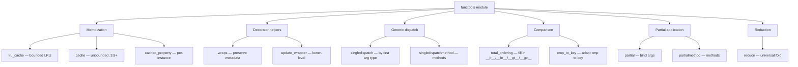
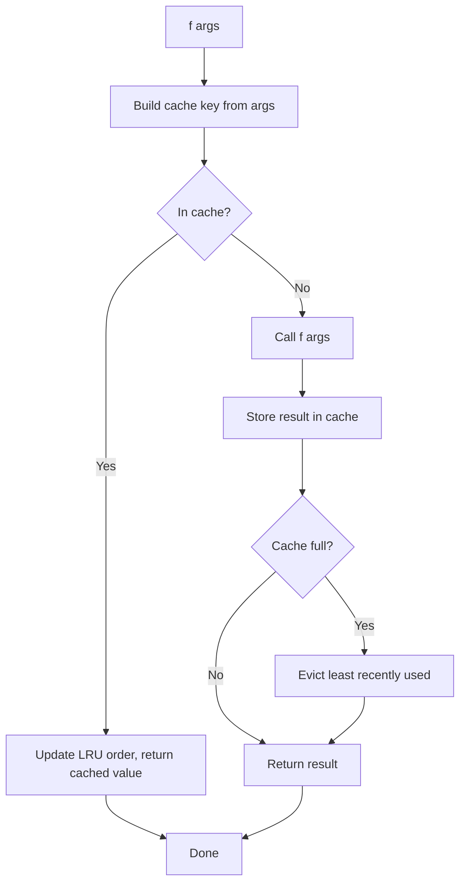
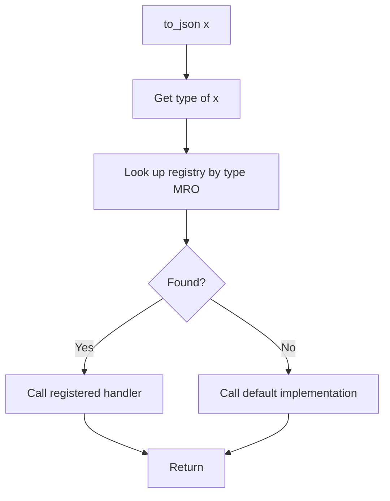

# 6. functools

> [!note] Why this note exists
> `functools` is Python's higher-order-function toolkit: it gives you decorators that fill in boilerplate (`@lru_cache`, `@wraps`, `@total_ordering`, `@cached_property`, `@singledispatch`), tools for partial application (`partial`, `partialmethod`), the universal fold (`reduce`), and utilities for ordering and comparison. This note covers each member with real examples, shows you when to reach for them (and when not to), and ties them to the broader patterns of memoization, decorator hygiene, generic dispatch, and functional-style Python.

## Why It Matters

Three small things that `functools` does are responsible for an enormous amount of clean, fast, and correct Python code:

1. **`@lru_cache` / `@cache`** — turn a pure function into a memoized one with a single line. Saves seconds-to-hours in scientific computing, web scraping, and dynamic programming.
2. **`@wraps`** — every well-behaved decorator in the ecosystem uses it; without it, decorated functions lose their name, docstring, and signature, breaking tools like Sphinx, `inspect`, and pytest.
3. **`@singledispatch`** — Python's answer to method overloading. Lets you write `len(x)`-style polymorphic functions without `isinstance` ladders.

Add in `@total_ordering` (write `__eq__` and `__lt__`, get all six comparisons for free), `@cached_property` (memoized property), `partial` (curry a function), and `reduce` (the fold), and you have a toolkit that touches most nontrivial Python programs.

## Background

### Higher-order functions

A **higher-order function** is a function that takes a function as an argument, returns a function, or both. `functools` is the standard library's home for these — both as standalone functions (`reduce`, `partial`) and as decorators (`lru_cache`, `wraps`).

A **decorator** is just a higher-order function applied with `@` syntax. `@decorator` above `def f(): ...` is sugar for `f = decorator(f)`. The decorators in `functools` are mostly "wrappers that preserve the wrapped function's metadata" or "factories that return decorators".

### Memoization: the core idea

Memoization = cache the result of a function call keyed by its arguments. The next call with the same arguments returns the cached value. Memoization is **safe** only for **pure functions** — same inputs always produce the same output, no side effects.

```python
def fib(n):
    if n < 2: return n
    return fib(n-1) + fib(n-2)

# fib(40) takes ~30 seconds — exponential blowup

from functools import lru_cache

@lru_cache(maxsize=None)
def fib(n):
    if n < 2: return n
    return fib(n-1) + fib(n-2)

# fib(40) is instant
```

The recursive version calls `fib(2)` millions of times; the memoized version calls it once.

## Main content

### `@lru_cache` — memoize with an LRU eviction policy

```python
from functools import lru_cache

@lru_cache(maxsize=128)
def expensive(x: int) -> int:
    print(f"computing {x}")
    return x * x

expensive(4)   # computing 4 -> 16
expensive(4)   # 16 (cached, no print)
expensive.cache_info()   # CacheInfo(hits=1, misses=1, maxsize=128, currsize=1)
expensive.cache_clear()  # empty the cache
```

Key facts:
- `maxsize` is the LRU bound. `None` means "unbounded" (the cache grows forever). `maxsize=128` evicts the least-recently-used entry when full.
- Arguments must be **hashable**. Lists and dicts can't be cached directly; convert to tuples or frozensets first.
- The cache is per-function, not per-instance. For instance methods, see `@cached_property` or pass `self` carefully.
- `typed=True` (3.3+) distinguishes `1` (int) from `1.0` (float) — they get separate cache entries.

```python
@lru_cache(maxsize=256, typed=True)
def parse(text: str) -> object:
    ...
```

#### When to use `lru_cache` vs `cache`

`@cache` (Python 3.9+) is shorthand for `@lru_cache(maxsize=None)` — unbounded. Use it when you know the argument space is small or you'll explicitly clear the cache periodically. Use `lru_cache(maxsize=N)` when unbounded growth would be a memory leak.

#### Caching instance methods

```python
class Data:
    def __init__(self, raw):
        self.raw = raw

    @lru_cache(maxsize=None)
    def parsed(self):
        return json.loads(self.raw)
```

This works but **holds a reference to `self` in the cache, preventing garbage collection of the instance.** For instance methods, prefer `@cached_property` (below) or use `weakref`-based caches.

#### Custom key function (3.8+)

```python
@lru_cache(maxsize=128)
def get_user(user_id: int) -> dict:
    ...

# Before 3.8 you couldn't cache calls with unhashable args. Now you can
# use a wrapper that converts lists to tuples, etc.:
def cacheable(fn):
    @lru_cache(maxsize=128)
    def inner(*args, **kwargs):
        return fn(*args, **kwargs)
    return inner
```

### `@cache` (Python 3.9+)

```python
from functools import cache

@cache
def factorial(n):
    return n * factorial(n - 1) if n else 1
```

Equivalent to `@lru_cache(maxsize=None)`. No eviction; use for functions with small argument spaces.

### `@cached_property` (Python 3.8+)

A `property` that's computed once per instance and stored on the instance. Subsequent accesses return the stored value.

```python
from functools import cached_property

class DataSet:
    def __init__(self, numbers):
        self.numbers = list(numbers)

    @cached_property
    def variance(self):
        m = sum(self.numbers) / len(self.numbers)
        return sum((x - m) ** 2 for x in self.numbers) / len(self.numbers)

ds = DataSet([1, 2, 3, 4, 5])
print(ds.variance)   # computes
print(ds.variance)   # cached
```

Key differences from `@property` + `@lru_cache`:
- The value is stored as an instance attribute (`__dict__` entry), so it's garbage-collected with the instance.
- It's **mutable** — you can delete it (`del ds.variance`) to force recomputation.
- It's **per-instance**, not per-function.
- It's **not thread-safe** by default. If two threads access it simultaneously, it may compute twice. Use a lock or `@functools.lru_cache` on a helper method.

> [!warning] `@cached_property` doesn't work with `__slots__`
> It needs `__dict__` to store the cached value. With `__slots__`, there's no `__dict__` — declare the slot explicitly and use `@property` with manual caching instead.

### `@wraps` — the decorator's best friend

When you write a decorator, the wrapped function inherits the wrapper's `__name__`, `__doc__`, `__module__`, and `__wrapped__`. `@wraps` copies these over so introspection still works.

```python
from functools import wraps

def log_calls(fn):
    @wraps(fn)
    def wrapper(*args, **kwargs):
        print(f"calling {fn.__name__}({args}, {kwargs})")
        return fn(*args, **kwargs)
    return wrapper

@log_calls
def greet(name):
    """Greet someone."""
    return f"hello {name}"

greet.__name__   # 'greet'    (without @wraps it would be 'wrapper')
greet.__doc__    # 'Greet someone.'
help(greet)      # shows the original signature and docstring
```

Without `@wraps`:
- `greet.__name__` is `'wrapper'` (debugging nightmare).
- Sphinx, pytest, and `inspect.signature` report wrong info.
- `pickle` may fail to round-trip.

> [!tip] Always use `@wraps(fn)` in your decorators
> It's a one-line addition that makes everything downstream work correctly. There is no reason not to.

`@wraps` also sets `__wrapped__` on the wrapper, which `inspect.signature` follows to report the original signature. This is how frameworks can introspect your decorated handlers.

### `@total_ordering` — fill in the comparison methods

Provide `__eq__` and one of `__lt__`, `__le__`, `__gt__`, `__ge__`; `@total_ordering` fills in the rest.

```python
from functools import total_ordering

@total_ordering
class Version:
    def __init__(self, major, minor, patch):
        self.major, self.minor, self.patch = major, minor, patch

    def __eq__(self, other):
        return (self.major, self.minor, self.patch) == \
               (other.major, other.minor, other.patch)

    def __lt__(self, other):
        return (self.major, self.minor, self.patch) < \
               (other.major, other.minor, other.patch)

v1 = Version(1, 2, 0)
v2 = Version(1, 2, 1)
v3 = Version(2, 0, 0)

v1 < v2           # True
v2 <= v3          # True (filled in)
v3 > v1           # True (filled in)
sorted([v3, v1, v2])  # [v1, v2, v3]
```

Without `@total_ordering`, you'd have to write `__le__`, `__gt__`, `__ge__` manually. The decorator derives them from `__lt__` and `__eq__`.

The derived methods are slightly slower than hand-written ones (they call two methods per comparison), so for performance-critical code, write all six by hand.

### `@singledispatch` — generic functions by type

`singledispatch` lets you write a function whose behavior depends on the type of its **first** argument. It's Python's answer to method overloading.

```python
from functools import singledispatch

@singledispatch
def to_json(obj) -> str:
    raise TypeError(f"can't serialize {type(obj)}")

@to_json.register
def _(obj: int) -> str:
    return str(obj)

@to_json.register
def _(obj: str) -> str:
    return f'"{obj}"'

@to_json.register(list)
def _(obj):
    return "[" + ", ".join(to_json(x) for x in obj) + "]"

@to_json.register(dict)
def _(obj):
    return "{" + ", ".join(f"{to_json(k)}: {to_json(v)}" for k, v in obj.items()) + "}"

print(to_json([1, "two", {"three": 3}]))
# [1, "two", {"three": 3}]
```

Key points:
- The first argument's type determines which implementation runs.
- You can register by annotation (`@to_json.register def _(obj: int): ...`) or explicitly (`@to_json.register(int)`).
- Dispatch is on the **runtime** type, not the declared type. `isinstance` is used internally.
- MRO is respected — a subclass's handler takes precedence over its parent's.
- `@singledispatchmethod` (3.8+) is the same idea for methods.

```python
from functools import singledispatchmethod

class Renderer:
    @singledispatchmethod
    def render(self, obj):
        raise TypeError(type(obj))

    @render.register
    def _(self, obj: str):
        return f"<text>{obj}</text>"

    @render.register
    def _(self, obj: int):
        return f"<num>{obj}</num>"
```

Use `singledispatch` to replace `if isinstance(x, A): ... elif isinstance(x, B): ...` ladders. The handlers can live in different modules, registered lazily.

### `partial` — partial application

`partial(fn, *args, **kwargs)` returns a callable that calls `fn` with the given args prepended.

```python
from functools import partial
import logging

# Fix some arguments
info = partial(logging.log, logging.INFO)
info("hello")      # equivalent to logging.log(logging.INFO, "hello")

# Bind a method to a specific instance
class Button:
    def __init__(self, name): self.name = name
    def click(self, event): print(f"{self.name} clicked at {event}")

b = Button("OK")
handler = partial(b.click)   # equivalent to b.click
handler(event="x")

# Use as a sort key
sorted(items, key=partial(my_key_func, weight=0.5))
```

`partial` is useful when you need a callable that "remembers" some arguments — for callbacks, sort keys, and adapter functions.

`partialmethod` (3.4+) is the same idea but for methods (it returns a descriptor, not a callable).

### `reduce` — the universal fold

`reduce(fn, iterable, initial=None)` applies `fn` cumulatively: `fn(fn(fn(initial, x1), x2), x3)`.

```python
from functools import reduce
import operator

reduce(operator.add, [1, 2, 3, 4])                  # 10  (((1+2)+3)+4)
reduce(operator.mul, [1, 2, 3, 4])                  # 24
reduce(operator.mul, [1, 2, 3, 4], 10)              # 240  (((10*1)*2)*3)*4
reduce(lambda acc, x: acc | {x}, [1, 2, 3], set())  # {1, 2, 3}

# Compose functions: f(g(h(x)))
def compose(*funcs):
    return lambda x: reduce(lambda acc, f: f(acc), reversed(funcs), x)

pipeline = compose(str.upper, str.strip, str.lower)
pipeline("  hello  ")   # "HELLO"
```

`reduce` was demoted from built-in (Python 2) to `functools` (Python 3) because most folds are clearer as `sum`, `min`, `max`, `any`, `all`, or a simple `for` loop. Guido famously wrote "I think dropping reduce() is OK" — reach for `reduce` only when the operation is genuinely a fold (composition, building a structure) and not when a clearer builtin exists.

### Other members

#### `cmp_to_key`

Converts an old-style Python 2 comparison function (`cmp(a, b)` returning -1/0/1) into a sort key. Useful for migrating old code or interfacing with libraries that still use cmp semantics.

```python
from functools import cmp_to_key

def cmp_len(a, b):
    return len(a) - len(b)

sorted(["aaa", "b", "cc"], key=cmp_to_key(cmp_len))
# ['b', 'cc', 'aaa']
```

#### `@lru_cache` on instance methods — the gotcha

```python
class Foo:
    @lru_cache(maxsize=128)
    def expensive(self, x):
        ...

f = Foo()
f.expensive(1)  # cached with key (f, 1)
del f           # f stays alive because the cache holds a reference!
```

To avoid the leak, either:
- Use `@cached_property` for zero-argument methods.
- Make the method take only hashable args and accept `self` separately.
- Use `weakref.WeakKeyDictionary` for instance-keyed caches.

## Mermaid diagrams

### `functools` capabilities map



### `@lru_cache` flow



### `singledispatch` dispatch



## Code examples

### Example 1: memoized recursive DFS

```python
from functools import lru_cache

@lru_cache(maxsize=None)
def ways_to_climb(n: int) -> int:
    """Number of ways to climb n stairs, taking 1 or 2 steps at a time."""
    if n <= 1:
        return 1
    return ways_to_climb(n - 1) + ways_to_climb(n - 2)

print(ways_to_climb(100))   # 573147844013817084101 — instant
```

### Example 2: cached HTTP fetcher

```python
from functools import lru_cache
import urllib.request
import json

@lru_cache(maxsize=128)
def fetch_json(url: str) -> dict:
    with urllib.request.urlopen(url) as r:
        return json.loads(r.read())

# Repeated calls within the cache lifetime don't hit the network.
```

### Example 3: decorator that preserves the signature

```python
from functools import wraps
import time
from typing import Callable, Any

def timed(fn: Callable) -> Callable:
    @wraps(fn)
    def wrapper(*args, **kwargs):
        start = time.perf_counter()
        try:
            return fn(*args, **kwargs)
        finally:
            elapsed = time.perf_counter() - start
            print(f"{fn.__name__}: {elapsed*1000:.2f}ms")
    return wrapper

@timed
def slow_add(a, b):
    """Add two numbers, slowly."""
    time.sleep(0.1)
    return a + b

import inspect
print(inspect.signature(slow_add))   # (a, b)   -- @wraps preserved it
print(slow_add.__doc__)              # 'Add two numbers, slowly.'
```

### Example 4: `@total_ordering` for a playing card

```python
from functools import total_ordering

@total_ordering
class Card:
    RANKS = "23456789TJQKA"
    SUITS = "cdhs"

    def __init__(self, code: str):
        self.code = code

    def __eq__(self, other):
        return self.code == other.code

    def __lt__(self, other):
        return (self.RANKS.index(self.code[0]), self.SUITS.index(self.code[1])) < \
               (self.RANKS.index(other.code[0]), self.SUITS.index(other.code[1]))

    def __hash__(self):
        return hash(self.code)

    def __repr__(self):
        return f"Card({self.code!r})"

hand = [Card("7h"), Card("Th"), Card("2c"), Card("Kd")]
print(sorted(hand))   # [Card('2c'), Card('7h'), Card('Th'), Card('Kd')]
```

### Example 5: `@singledispatch` for a config renderer

```python
from functools import singledispatch
from dataclasses import dataclass
from typing import Any

@singledispatch
def to_yaml(obj: Any, indent: int = 0) -> str:
    pad = " " * indent
    return f"{pad}{obj}\n"

@to_yaml.register(str)
def _(obj, indent=0):
    pad = " " * indent
    return f"{pad}{obj}\n" if obj.isalnum() else f'{pad}"{obj}"\n'

@to_yaml.register(list)
def _(obj, indent=0):
    pad = " " * indent
    return "".join(f"{pad}- {to_yaml(x, 0).strip()}\n" for x in obj)

@to_yaml.register(dict)
def _(obj, indent=0):
    pad = " " * indent
    return "".join(f"{pad}{k}:\n{to_yaml(v, indent + 2)}" for k, v in obj.items())

print(to_yaml({"server": {"host": "localhost", "ports": [80, 443]}}))
```

### Example 6: `partial` to pre-bind a logger

```python
from functools import partial
import logging

logging.basicConfig(level=logging.INFO)
log = partial(logging.log, logging.INFO)
log("started")
log("progress: %d%%", 50)
```

### Example 7: `reduce` to flatten one level

```python
from functools import reduce
import operator

nested = [[1, 2], [3, 4], [5]]
flat = reduce(operator.concat, nested, [])
print(flat)   # [1, 2, 3, 4, 5]

# Cleaner with itertools.chain.from_iterable, but reduce works too.
```

### Example 8: custom cache key for unhashable args

```python
from functools import lru_cache

def cache_by_json(fn):
    """Cache a function whose argument is a dict (converted to a JSON string)."""
    import json
    cached = lru_cache(maxsize=128)(lambda s: fn(json.loads(s)))
    return lambda d: cached(json.dumps(d, sort_keys=True))

@cache_by_json
def analyze(config: dict) -> float:
    # ... expensive analysis ...
    return sum(config.values()) / max(len(config), 1)

print(analyze({"a": 1, "b": 2}))
print(analyze({"b": 2, "a": 1}))   # same cache hit (sort_keys)
```

## Common Pitfalls

- **Caching methods with `@lru_cache` leaks the instance.** The cache holds `self`, preventing GC. Use `@cached_property` or weakref.
- **`@lru_cache` requires hashable arguments.** Lists, dicts, sets raise `TypeError`. Convert to tuples/frozensets first.
- **`@cached_property` + `__slots__` doesn't work.** The decorator needs `__dict__` to store the cached value.
- **`@cached_property` is not thread-safe.** Two threads can compute it simultaneously. Add a lock if needed.
- **`reduce` is often less readable than a `for` loop.** Use it only for genuine folds; use `sum`, `any`, `all`, `min`, `max` otherwise.
- **`@wraps` doesn't copy the signature.** It sets `__wrapped__`, which `inspect.signature` follows — but `inspect.getfullargspec` may not. Always test your decorators with the introspection tools your downstream uses.
- **`@total_ordering` derived methods are slower than hand-written ones** — they call two methods per comparison.
- **`@singledispatch` only dispatches on the first argument.** For multi-argument dispatch, use `multipledispatch` (third-party) or pattern matching (3.10+).
- **`partial` doesn't preserve `__name__` of the wrapped function.** Use `functools.update_wrapper(p, fn)` if you need it.
- **`@lru_cache(maxsize=None)` is a memory leak** if the argument space is unbounded. Use a finite `maxsize` or `@cache` only when the argument space is small.
- **`@lru_cache(typed=True)` rarely matters** — `1 == 1.0` in Python, so unless you specifically need int vs float separation, leave `typed=False`.

## Tips and Tricks

- **`@lru_cache` on a recursive function** is the cleanest memoization pattern in Python. Use it for DP problems.
- **`cache_info()` and `cache_clear()` are public API** — useful for testing and profiling.
- **`@cached_property` invalidates with `del instance.attr`** — perfect for cache-busting after state changes.
- **`@singledispatch` handlers can live in different modules.** Just import the function and call `.register` on it elsewhere. This makes adding new types a non-invasive change.
- **`@singledispatch` + dataclasses** is a clean alternative to method dispatch on `isinstance`.
- **`@wraps` exposes `__wrapped__`**, which lets you "unwrap" a decorated function: `original = greet.__wrapped__`.
- **`partial` is faster than a `lambda`** for binding args, because it's implemented in C.
- **`partial` objects are picklable**, unlike some lambdas.
- **`reduce` + `operator` is fast and clean for arithmetic folds** — `reduce(operator.add, xs)` is faster than `reduce(lambda a, b: a + b, xs)`.
- **`cmp_to_key` for legacy sort comparators** — but write key functions for new code.
- **`@lru_cache` + `hashable` dataclass** is a clean combination: dataclass with `frozen=True` makes instances hashable, perfect for cache keys.
- **You can register multiple types at once**: `@my_func.register(int).register(float)` chains registrations.

## Active Recall

1. What's the difference between `@lru_cache(maxsize=None)` and `@cache`?
2. Why does caching an instance method with `@lru_cache` cause a memory leak?
3. What does `@wraps` do, and what breaks without it?
4. What does `@total_ordering` require you to implement, and what does it give you?
5. How does `@singledispatch` decide which handler to call?
6. Why was `reduce` demoted from built-in to `functools`?
7. What's the difference between `partial` and `lambda` for binding arguments?
8. When does `@cached_property` not work?
9. How do you invalidate a `cached_property`?
10. What happens if you call `@singledispatch` with an unregistered type?
11. How do you cache a function whose argument is a list?
12. What's the purpose of `__wrapped__` set by `@wraps`?

## Next Steps

- Continue to [[7. logging]] for the next standard-library deep dive.
- For more on decorators and metaprogramming, see Ch 17 — Metaprogramming and Ch 19 — Functional Python.
- For `dataclasses` (which often pair with `@lru_cache` and `@total_ordering`), see Ch 8 — Object-Oriented Programming.
- For pattern matching as an alternative to `@singledispatch` (3.10+), see Ch 2 — Control Flow.
- For performance profiling of cached code, see Ch 15 — Memory and Performance.
