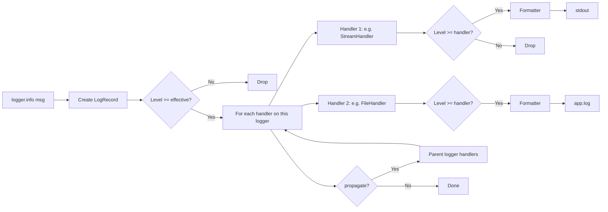
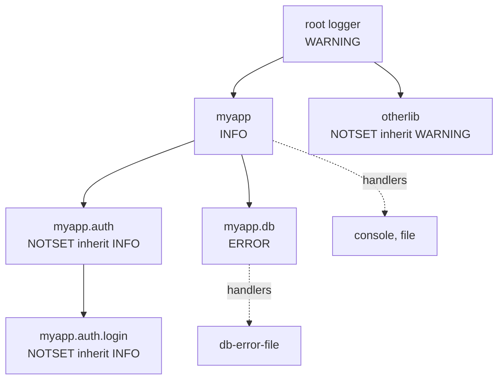
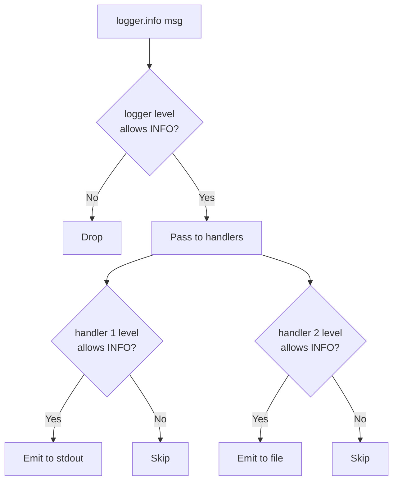

# 7. logging

> [!note] Why this note exists
> The `logging` module is the standard-library way to emit diagnostic, audit, and error messages from your program with structure, severity levels, and routing. This note is the **introduction** — for the full production treatment (structured logging, log shipping, correlation IDs, async logging, log aggregation pipelines), see Ch 13 — Logging. Here we cover the four-part mental model (logger → handler → formatter → filter), the five severity levels (`DEBUG`/`INFO`/`WARNING`/`ERROR`/`CRITICAL`), `basicConfig`, why `logging` is strictly better than `print`, the logger hierarchy, and the patterns you need to instrument a small-to-medium app properly.

## Why It Matters

Every program eventually needs to answer "what just happened?". The choice is between `print` (which goes to stdout, has no levels, no routing, no formatting, no time stamps) and `logging` (which has all of those). Here is the same event, four ways:

```python
# 1. print — everything to stdout, no metadata
print("user 42 logged in")

# 2. print with manual formatting
import time
print(f"{time.time()} INFO user 42 logged in")

# 3. logging.basicConfig — one line of setup
import logging
logging.basicConfig(level=logging.INFO, format="%(asctime)s %(levelname)s %(message)s")
logging.info("user %d logged in", 42)

# 4. structured logging (covered in Ch 13)
# {"timestamp": "...", "level": "INFO", "event": "login", "user_id": 42, ...}
```

The `print` version requires you to write and maintain the formatting code, doesn't let you turn off DEBUG messages in production, and can't be redirected to a file or syslog without shell plumbing. The `logging` version does all of that out of the box.

## Background

### The four moving parts

The `logging` module has a small but powerful object model:

| Object      | What it does                                      | Example                                  |
|-------------|---------------------------------------------------|------------------------------------------|
| **Logger**  | The entry point. You call `logger.info(...)`.     | `logging.getLogger("myapp.auth")`        |
| **Handler** | Where the log record goes (file, stderr, syslog). | `StreamHandler`, `FileHandler`, `SMTPHandler` |
| **Formatter**| How the record is rendered as a string.         | `"%Y-%m-%d %H:%M:%S [%(levelname)s] %(message)s"` |
| **Filter**  | Decides whether a record is emitted.              | Drop DEBUG, only emit from "myapp.db"    |

A logger has many handlers; a handler has one formatter and any number of filters. Log records flow: logger → (filter) → handlers → (filter) → formatter → destination.

### The five severity levels

| Level      | Numeric | When to use                                              |
|------------|---------|----------------------------------------------------------|
| `DEBUG`    | 10      | Detailed diagnostic info (only in dev)                   |
| `INFO`     | 20      | Confirmation that things are working as expected         |
| `WARNING`  | 30      | Something unexpected, but the program can keep going     |
| `ERROR`    | 40      | A serious problem; the program couldn't do something     |
| `CRITICAL` | 50      | A fatal error; the program cannot continue               |

There's also `NOTSET` (0) which means "inherit from parent".

You can define custom levels, but it's rarely worth it — the five standard levels cover 99% of cases.

### Why `logging` > `print`

1. **Severity levels.** You can leave DEBUG calls in your code and silence them in production with one config change. With `print`, you'd have to comment them out or wrap them in `if DEBUG:`.
2. **Routing.** Send INFO to stdout, ERROR to stderr, CRITICAL to email. With `print` you'd need separate streams and wrapper functions.
3. **Timestamps and metadata.** The formatter adds timestamps, source file, line number, thread ID — automatically.
4. **Logger hierarchy.** A library can have its own logger; the application can configure it without code changes to the library.
5. **Thread safety.** `logging` is thread-safe by design. `print` can interleave output from concurrent threads.
6. **Lazy formatting.** `logging.info("user %d", user_id)` only formats the string if the level passes the threshold. `print(f"user {user_id}")` always formats — expensive if `user_id` requires a database query to compute.
7. **Integration.** Pytest captures logging; Sentry captures logging; systemd captures logging; log shippers (fluentd, vector) capture logging. `print` is invisible to all of them.

### The logger hierarchy

Loggers form a tree, rooted at the **root logger**. A logger named `"myapp.auth.login"` is a child of `"myapp.auth"`, which is a child of `"myapp"`, which is a child of the root.

When you call `logger.info("msg")`:
1. The logger creates a `LogRecord` with the message, level, timestamp, source location.
2. The logger checks its **effective level** (walks up the tree until it finds a non-NOTSET level).
3. If the record's level is high enough, the logger passes it to all its handlers.
4. By default, **the record also propagates to all parent loggers' handlers**, all the way to the root.

This is why `basicConfig` on the root logger affects everything: all loggers propagate to it.

## Main content

### `logging.basicConfig` — quick start

```python
import logging

logging.basicConfig(
    level=logging.INFO,
    format="%(asctime)s [%(levelname)s] %(name)s: %(message)s",
    filename="app.log",
    filemode="a",
)
logging.info("started")        # 2024-06-10 14:30:00,123 [INFO] root: started
```

`basicConfig` configures the **root logger**. It's a one-shot, idempotent call — the first call wins; subsequent calls are no-ops unless you pass `force=True` (3.8+).

Common arguments:
- `level` — minimum level to emit (default `WARNING`).
- `format` — printf-style format string for the log line.
- `filename` — write to a file instead of stderr.
- `filemode` — `"a"` (default) or `"w"`.
- `datefmt` — format for `%asctime` (strftime format).
- `handlers` — list of pre-built handlers (3.3+). If given, `filename`/`stream` are ignored.
- `force` — reset the root logger's handlers first (3.8+).
- `encoding` — file encoding (3.9+).

`basicConfig` is for scripts and quick prototypes. For apps, configure loggers explicitly.

### Getting a logger

```python
import logging

logger = logging.getLogger(__name__)   # best practice: use module name
logger.info("hello")
```

The convention is to call `getLogger(__name__)` at module level. `__name__` is the module's dotted name (e.g., `"myapp.auth.login"`), which gives you a hierarchy that matches your package structure.

```python
# Top-level package
logger = logging.getLogger("myapp")
logger.setLevel(logging.INFO)

# Submodule
logger = logging.getLogger("myapp.auth")  # inherits INFO from myapp
```

### Logging messages

```python
logger.debug("debug message")
logger.info("info message")
logger.warning("warning message")
logger.error("error message")
logger.critical("critical message")

# Lazy formatting (preferred):
logger.info("user %s logged in from %s", user, ip)

# Exceptions — call this inside an except block:
try:
    do_something()
except Exception:
    logger.exception("failed to do something")   # includes traceback
    # equivalent to logger.error("...", exc_info=True)

# Or pass exc_info explicitly:
try:
    do_something()
except Exception as e:
    logger.error("failed", exc_info=e)
```

> [!tip] Always use lazy formatting
> `logger.info("user %s logged in", user)` is better than `logger.info(f"user {user} logged in")` because the format string isn't evaluated if the level is below INFO. The first version costs a method call; the second always formats the string.

#### Lazy formatting in depth

The "lazy" in lazy formatting refers to *deferring the work until we know we need the result*. Consider:

```python
# Bad: this always evaluates get_full_state(), even if DEBUG is filtered out
logger.debug(f"state: {get_full_state()}")

# Good: get_full_state() is only called if DEBUG is enabled
logger.debug("state: %s", get_full_state())

# Best: short-circuit for very expensive computations
if logger.isEnabledFor(logging.DEBUG):
    logger.debug("state: %s", get_full_state())
```

The lazy form (`%s` with positional args) is implemented in C and costs almost nothing when the level is filtered. The f-string form always runs the interpolation, even if the result is then thrown away by the logger. For log statements inside hot loops (e.g., per-row logging in a data pipeline), this difference can be a 10x slowdown.

### Format strings

| %(name)s        | Description                                            |
|-----------------|--------------------------------------------------------|
| `%(name)s`      | Name of the logger                                     |
| `%(levelno)s`   | Numeric logging level                                  |
| `%(levelname)s` | Text logging level (`'INFO'`, `'WARNING'`, ...)        |
| `%(pathname)s`  | Full pathname of the source file                       |
| `%(filename)s`  | Filename                                               |
| `%(module)s`    | Module name                                            |
| `%(lineno)d`    | Source line number                                     |
| `%(funcName)s`  | Function name                                          |
| `%(asctime)s`   | Human-readable time (use `datefmt` to format)          |
| `%(created)f`   | Time as epoch float                                    |
| `%(msecs)d`     | Millisecond part of `asctime`                          |
| `%(message)s`   | The logged message                                     |
| `%(process)d`   | Process ID                                             |
| `%(thread)d`    | Thread ID                                              |
| `%(threadName)s`| Thread name                                            |
| `%(taskName)s`  | asyncio task name (3.12+)                              |

### Handlers

```python
import logging

# Console
console = logging.StreamHandler()
console.setLevel(logging.INFO)

# File (rotating by size)
from logging.handlers import RotatingFileHandler
rotating = RotatingFileHandler(
    "app.log", maxBytes=10_000_000, backupCount=5
)

# File (rotating by date)
from logging.handlers import TimedRotatingFileHandler
daily = TimedRotatingFileHandler(
    "app.log", when="midnight", backupCount=30
)

# Syslog (Unix)
from logging.handlers import SysLogHandler
syslog = SysLogHandler(address="/dev/log")

# Email on ERROR+
from logging.handlers import SMTPHandler
mail = SMTPHandler(
    mailhost=("smtp.example.com", 587),
    fromaddr="app@example.com",
    toaddrs=["oncall@example.com"],
    subject="Application error",
    credentials=("user", "pass"),
)

# Queue handler (for thread-safe logging from workers)
from logging.handlers import QueueHandler, QueueListener
import queue
q = queue.Queue(-1)
qh = QueueHandler(q)
listener = QueueListener(q, console, file_handler)
listener.start()
```

Each handler has its own level. The logger's level is the first gate; the handler's level is the second. So a logger at INFO with a DEBUG-level file handler and a WARNING-level console handler will write DEBUG to the file and only WARNING+ to console.

### Formatters

```python
formatter = logging.Formatter(
    fmt="%(asctime)s [%(levelname)s] %(name)s:%(lineno)d %(message)s",
    datefmt="%Y-%m-%d %H:%M:%S",
)
handler.setFormatter(formatter)
```

A formatter belongs to one handler. Different handlers can use different formatters (e.g., terse for console, verbose for the file).

### Filters

```python
class OnlyAuthFilter(logging.Filter):
    def filter(self, record):
        return record.name.startswith("myapp.auth")

handler.addFilter(OnlyAuthFilter())

# Or use the simpler logging.Filter with a logger name:
handler.addFilter(logging.Filter("myapp.auth"))
```

Filters can also modify records (set `record.correlation_id = ...`) — useful for structured logging.

### Configuring with `dictConfig`

For real apps, configure logging with a dict (often loaded from YAML):

```python
import logging.config

LOGGING = {
    "version": 1,
    "disable_existing_loggers": False,
    "formatters": {
        "verbose": {
            "format": "{asctime} [{levelname}] {name}:{lineno} {message}",
            "style": "{",
        },
        "simple": {"format": "{levelname} {message}", "style": "{"},
    },
    "handlers": {
        "console": {
            "class": "logging.StreamHandler",
            "level": "INFO",
            "formatter": "simple",
            "stream": "ext://sys.stderr",
        },
        "file": {
            "class": "logging.handlers.RotatingFileHandler",
            "level": "DEBUG",
            "formatter": "verbose",
            "filename": "app.log",
            "maxBytes": 10485760,
            "backupCount": 5,
        },
    },
    "loggers": {
        "myapp": {"level": "DEBUG", "handlers": ["console", "file"], "propagate": False},
        "myapp.db": {"level": "INFO"},  # quieter for the noisy DB layer
    },
    "root": {"level": "WARNING", "handlers": ["console"]},
}

logging.config.dictConfig(LOGGING)
```

`style="{"` (3.2+) lets you use `str.format` syntax; `style="$"` uses `string.Template`. The default is `%`-style for backward compat.

### Library logging best practices

**Libraries should never call `basicConfig`.** They should add a `NullHandler` to their top-level logger so that if the application doesn't configure logging, library log records are silently dropped:

```python
# mylib/__init__.py
import logging
logging.getLogger(__name__).addHandler(logging.NullHandler())
```

This is the famous "no handlers could be found for logger X" warning fix.

### `logging.setLogRecordFactory` (3.2+)

If you need to add fields to every log record (e.g., a correlation ID), subclass `LogRecord` and register the factory:

```python
import logging
import contextvars

correlation_id: contextvars.ContextVar[str] = contextvars.ContextVar("correlation_id", default="-")

class CorrelatedLogRecord(logging.LogRecord):
    def __init__(self, *args, **kwargs):
        super().__init__(*args, **kwargs)
        self.correlation_id = correlation_id.get()

logging.setLogRecordFactory(CorrelatedLogRecord)

# Now any formatter can use %(correlation_id)s
```

## Mermaid diagrams

### The logging pipeline



### Logger hierarchy



### Level filtering at a glance



## Code examples

### Example 1: script-friendly setup

```python
import logging
import sys

def setup_logging(verbose: bool = False) -> None:
    level = logging.DEBUG if verbose else logging.INFO
    logging.basicConfig(
        level=level,
        format="%(asctime)s [%(levelname)s] %(name)s: %(message)s",
        datefmt="%Y-%m-%d %H:%M:%S",
        stream=sys.stderr,
    )

setup_logging(verbose=True)
log = logging.getLogger(__name__)
log.info("starting up")
log.debug("debug details only visible with --verbose")
```

### Example 2: per-module log levels

```python
import logging

logging.basicConfig(level=logging.INFO, format="%(name)s %(levelname)s %(message)s")

# Quiet down a noisy library
logging.getLogger("urllib3").setLevel(logging.WARNING)
logging.getLogger("asyncio").setLevel(logging.WARNING)

# Crank up our own modules
logging.getLogger("myapp").setLevel(logging.DEBUG)

logging.getLogger("myapp.auth").info("auth module loaded")
```

### Example 3: rotating file + console

```python
import logging
from logging.handlers import RotatingFileHandler

logger = logging.getLogger("myapp")
logger.setLevel(logging.DEBUG)

# Console: INFO and above
console = logging.StreamHandler()
console.setLevel(logging.INFO)
console.setFormatter(logging.Formatter("%(levelname)s %(name)s: %(message)s"))
logger.addHandler(console)

# File: DEBUG and above, rotated at 10MB, keep 5 backups
file_h = RotatingFileHandler(
    "myapp.log", maxBytes=10_000_000, backupCount=5, encoding="utf-8"
)
file_h.setLevel(logging.DEBUG)
file_h.setFormatter(logging.Formatter(
    "%(asctime)s [%(levelname)s] %(name)s:%(lineno)d %(message)s"
))
logger.addHandler(file_h)

logger.info("application started")
logger.debug("debug detail")
```

### Example 4: exception logging

```python
import logging
log = logging.getLogger(__name__)

def process(item):
    try:
        risky_work(item)
    except ValueError as e:
        log.warning("invalid item %r: %s", item, e)
    except Exception:
        log.exception("unexpected failure processing %r", item)
        # log.exception is equivalent to log.error(..., exc_info=True)
        raise
```

### Example 5: correlation ID via contextvars

```python
import logging
import contextvars
import uuid

request_id = contextvars.ContextVar("request_id", default="-")

old_factory = logging.getLogRecordFactory()
def factory(*args, **kwargs):
    record = old_factory(*args, **kwargs)
    record.request_id = request_id.get()
    return record
logging.setLogRecordFactory(factory)

logging.basicConfig(format="%(asctime)s [%(request_id)s] %(levelname)s %(message)s")

# In a request handler:
request_id.set(str(uuid.uuid4())[:8])
logging.info("handling request")
```

### Example 6: structured logging (JSON)

```python
import logging
import json

class JsonFormatter(logging.Formatter):
    def format(self, record):
        payload = {
            "ts": self.formatTime(record, self.datefmt),
            "level": record.levelname,
            "logger": record.name,
            "msg": record.getMessage(),
            "file": f"{record.pathname}:{record.lineno}",
        }
        if record.exc_info:
            payload["exc"] = self.formatException(record.exc_info)
        return json.dumps(payload, ensure_ascii=False)

handler = logging.StreamHandler()
handler.setFormatter(JsonFormatter())
logging.basicConfig(level=logging.INFO, handlers=[handler])
log = logging.getLogger("myapp")
log.info("user logged in", extra={"user_id": 42})
```

> [!note] For production structured logging, see Ch 13 — Logging
> This example shows the mechanics. Real apps use `structlog` or `python-json-logger` for richer features like `extra` validation, schema enforcement, and log shipping.

### Example 7: `QueueHandler` for thread-safe logging

```python
import logging
import logging.handlers
import queue
import threading

q = queue.Queue(-1)
qh = logging.handlers.QueueHandler(q)
logger = logging.getLogger("worker")
logger.addHandler(qh)
logger.setLevel(logging.INFO)

# The actual handlers run in a single listener thread — workers never block on I/O.
file_handler = logging.FileHandler("workers.log")
listener = logging.handlers.QueueListener(q, file_handler)
listener.start()

def worker(n):
    for i in range(100):
        logger.info("worker %d: item %d", n, i)

threads = [threading.Thread(target=worker, args=(i,)) for i in range(8)]
for t in threads: t.start()
for t in threads: t.join()
listener.stop()
```

## Common Pitfalls

- **Calling `basicConfig` after a logger has been used is a no-op** (unless `force=True`). Always configure logging **before** any module that logs.
- **`logging.info(...)` (module-level) uses the root logger.** This bypasses any per-module configuration. Prefer `logger = logging.getLogger(__name__)` then `logger.info(...)`.
- **Forgetting to call `logger.setLevel`** — the default level is `WARNING`, so INFO/DEBUG calls are silently dropped.
- **Adding the same handler twice** — every log record gets emitted twice. Common when `basicConfig` is called and you also `addHandler`.
- **`propagate = False` misunderstandings.** If you set it, your logger's records don't reach the root handler — you must add a handler to your logger, or the records disappear.
- **Libraries calling `basicConfig`** — clobber the application's logging setup. Libraries should only `addHandler(NullHandler())`.
- **`logger.exception` outside `except`** — raises `KeyError` for traceback. Use `logger.error(..., exc_info=True)` only inside `except`, or pass an exception explicitly.
- **`%(message)s` vs lazy formatting** — `logger.info("hi %s", name)` is lazy; `logger.info(f"hi {name}")` always formats. Always use the lazy form.
- **`FileHandler` doesn't rotate.** Use `RotatingFileHandler` or `TimedRotatingFileHandler` for production logs, or your file grows unbounded.
- **`StreamHandler` defaults to `sys.stderr`** — not stdout. This is correct (logs and output should be separate streams) but surprises people who try to pipe logs to another command.
- **Not setting `encoding` on `FileHandler`** — defaults to platform locale, which can mangle UTF-8. Always pass `encoding="utf-8"`.
- **Logging inside hot loops.** A million `logger.debug` calls per second, even when filtered out, cost CPU. Use `if logger.isEnabledFor(logging.DEBUG):` to short-circuit.

## Tips and Tricks

- **Use `logger = logging.getLogger(__name__)` at module level** — gives you the package hierarchy for free.
- **`logger.isEnabledFor(level)`** short-circuits expensive log computation:
  ```python
  if logger.isEnabledFor(logging.DEBUG):
      logger.debug("state: %s", expensive_serialization())
  ```
- **`logging.lastResort`** is a fallback handler used when no handlers are configured. It prints WARNING+ to stderr. You can replace it.
- **`logging.raiseExceptions = False`** silences logging-internal errors in production (e.g., a broken pipe to syslog).
- **`logging.captureWarnings(True)`** routes `warnings.warn` calls through the logging system.
- **Use `extra={...}`** to add custom fields per log call: `logger.info("x", extra={"user_id": 42})`. The formatter can reference them as `%(user_id)s`.
- **`logging.config.dictConfig`** is the canonical way to configure complex setups. Load the dict from YAML for environment-specific config.
- **`QueueHandler` + `QueueListener`** decouples logging from I/O — critical for high-throughput apps.
- **`RotatingFileHandler` reopens on rotation** — works with `logrotate` if you use the `delay=True` flag.
- **`TimedRotatingFileHandler` with `when="W0"`** rolls weekly on Monday.
- **`SMTPHandler` for CRITICAL errors** — get paged when the database dies.
- **`SysLogHandler` and `NTEventLogHandler`** integrate with OS-level logging.

## Active Recall

1. What are the four objects in the `logging` module, and how do they relate?
2. What's the difference between `logging.info(msg)` and `logger.info(msg)`?
3. Why should libraries add `NullHandler` instead of calling `basicConfig`?
4. What happens if you call `basicConfig` twice in the same program?
5. How do you log an exception with its traceback?
6. What's the difference between lazy formatting (`logger.info("%s", x)`) and eager (`logger.info(f"{x}")`)?
7. What does `propagate = False` do, and when would you use it?
8. Why is `logging.StreamHandler()` the wrong choice for a million-records-per-second app?
9. How do you add a custom field like `request_id` to every log record?
10. What's the default level of the root logger? What's the default level of a new logger?
11. How do you rotate log files at 10MB with 5 backups?
12. What's the difference between `logging.getLogger("myapp")` and `logging.getLogger(__name__)`?

## Next Steps

- For the production deep-dive (structured logging, log shipping, async logging, ELK integration), see Ch 13 — Logging.
- For thread-safe patterns using `QueueHandler`, see Ch 14 — Concurrency.
- For correlation IDs across async tasks, see Ch 20 — Advanced Async.
- For CLI tools that need `--verbose` and `--quiet`, see [[8. argparse]].
- For exception handling that pairs with logging, see Chapter 5 — Error Handling.
- For testing logging (asserting log records are emitted), see Ch 12 — Testing (`caplog` fixture).
