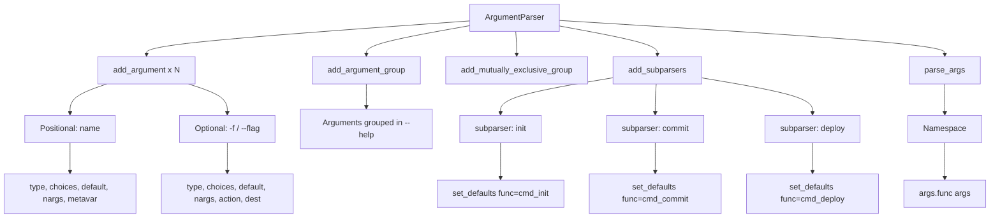
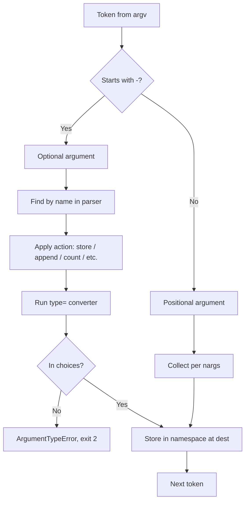
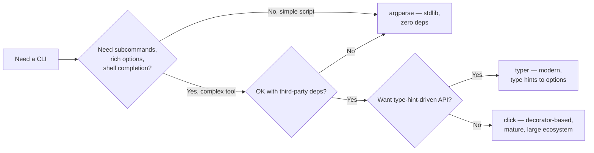

# 8. argparse

> [!note] Why this note exists
> `argparse` is the standard-library module for building command-line interfaces with positional args, optional flags, type conversion, validation, subcommands, mutually exclusive groups, and automatic `--help`. It's what every Python CLI tool uses when it can't justify a third-party dependency. This note covers the `ArgumentParser` API, positional vs optional arguments, `type`/`choices`/`default`/`nargs`/`action`/`metavar`, subcommands (`add_subparsers`), mutually exclusive groups, argument groups (for help formatting), the `dest`/`set_defaults` patterns, and a comparison with `click` and `typer` so you know when to reach for something else.

## Why It Matters

Without `argparse`, your CLI looks like this:

```python
import sys
def main():
    if len(sys.argv) < 3:
        print("usage: script.py <input> <output> [--verbose]", file=sys.stderr)
        sys.exit(2)
    verbose = "--verbose" in sys.argv
    ...
```

Add a few flags, optional values, type conversions, and `--help`, and you're writing 200 lines of fragile parsing code. With `argparse`:

```python
import argparse

def main():
    p = argparse.ArgumentParser(description="Process some data.")
    p.add_argument("input", help="input file path")
    p.add_argument("output", help="output file path")
    p.add_argument("-v", "--verbose", action="store_true", help="verbose output")
    p.add_argument("-n", "--dry-run", action="store_true")
    args = p.parse_args()
    if args.verbose:
        print(f"processing {args.input} -> {args.output}")
    if not args.dry_run:
        process(args.input, args.output)
```

You get:
- Automatic `--help` with usage, descriptions, and per-arg docs.
- Type conversion (`type=int`, `type=Path`, custom callables).
- Validation (`choices=["A", "B", "C"]`).
- Mutually exclusive flags.
- Subcommands (`git`-style `init`, `commit`, `push`).
- Standard exit codes (`0` success, `2` usage error).
- Shell completion (via `argcomplete`).

## Background

### Three generations of CLI parsing in the stdlib

1. **`getopt`** — C-style option parsing. Still in the stdlib, but you should never use it for new code.
2. **`optparse`** (2.3) — first Pythonic parser. Deprecated since 2.7; don't use for new code.
3. **`argparse`** (2.7) — the modern stdlib choice. Compatible with `optparse` concepts but more powerful (subparsers, mutually exclusive groups, custom actions).

### The `argparse` mental model

You build a parser tree:
- `ArgumentParser` is the top-level parser.
- `add_argument(...)` adds an argument (positional or optional).
- `add_subparsers(...)` adds a subcommand dispatcher, which itself is an `ArgumentParser` factory.
- `parse_args(argv=None)` parses `sys.argv` (or a list) and returns a `Namespace`.

Arguments have a **dest** — the attribute name on the returned `Namespace`. By default:
- For `--foo-bar`, `dest` is `foo_bar`.
- For a positional `input`, `dest` is `input`.

### Why not `click` or `typer`?

`argparse` is the stdlib choice — always available, no dependencies, sufficient for most tools. `click` and `typer` are better for complex CLIs:
- **`click`** — decorator-based, composable, mature. Excellent for tools with many subcommands and options.
- **`typer`** — built on `click`, uses type hints to declare options. Modern, but adds a dependency.

For a script you want to ship without dependencies, use `argparse`. For a major CLI tool (`mytool init`, `mytool deploy`, `mytool logs -f`), `click` or `typer` will save you time.

## Main content

### Creating a parser

```python
import argparse

parser = argparse.ArgumentParser(
    prog="mytool",                       # shown in usage
    description="A tool that does things.",
    epilog="See https://example.com for more.",   # shown after help
    formatter_class=argparse.RawDescriptionHelpFormatter,  # preserve formatting
)
```

`formatter_class` options:
- `HelpFormatter` (default) — wraps text to terminal width.
- `RawDescriptionHelpFormatter` — preserves your description/epilog formatting.
- `RawTextHelpFormatter` — preserves formatting for all text.
- `ArgumentDefaultsHelpFormatter` — adds `(default: X)` to each option.

### Positional vs optional arguments

- **Positional** — no `-` prefix. Required by default. Example: `add_argument("input")`.
- **Optional** — has `-` prefix. Not required by default. Example: `add_argument("-v", "--verbose")`.

```python
parser.add_argument("input")              # positional
parser.add_argument("output")             # positional
parser.add_argument("-v", "--verbose")    # optional, default False
args = parser.parse_args(["in.txt", "out.txt", "-v"])
# Namespace(input='in.txt', output='out.txt', verbose=True)
```

### `type` — convert the argument string

```python
parser.add_argument("--count", type=int, default=1)
parser.add_argument("--rate", type=float)
parser.add_argument("--input", type=argparse.FileType("r"))   # opens the file
parser.add_argument("--output", type=argparse.FileType("w", encoding="utf-8"))

from pathlib import Path
parser.add_argument("--config", type=Path)   # any callable works

# Custom validator
def positive_int(s: str) -> int:
    n = int(s)
    if n <= 0:
        raise argparse.ArgumentTypeError(f"must be positive, got {n}")
    return n

parser.add_argument("--retries", type=positive_int, default=3)
```

`FileType` is a built-in callable that opens the file for you (and handles `-` as stdin/stdout). Since 3.9, `pathlib.Path` is the recommended `type` for path arguments — it gives you a `Path` object instead of a string.

### `choices` — restrict to a set

```python
parser.add_argument("--mode", choices=["dev", "staging", "prod"], default="dev")
parser.add_argument("--log-level", choices=["DEBUG", "INFO", "WARNING", "ERROR"])
```

If the user passes an invalid choice, argparse prints an error and exits with code 2.

### `default` — value when the argument is absent

```python
parser.add_argument("--port", type=int, default=8000)
parser.add_argument("--host", default="127.0.0.1")
parser.add_argument("--config", default=None)   # explicit None default

# Use argparse.SUPPRESS to omit the attribute entirely when not given:
parser.add_argument("--debug", default=argparse.SUPPRESS)
# args won't have a "debug" attribute unless --debug was passed.
```

### `nargs` — how many values to consume

| `nargs`     | Meaning                                          | Example input              | Stored as       |
|-------------|--------------------------------------------------|----------------------------|-----------------|
| (default)   | Single value                                     | `--name Alice`             | `"Alice"`       |
| `?`         | Zero or one (with `default` for absent, `const` for present-without-value) | `--verbose` | `True` (from const) |
| `*`         | Zero or more                                     | `--files a b c`            | `["a","b","c"]` |
| `+`         | One or more                                      | `--files a b c`            | `["a","b","c"]` |
| `N`         | Exactly N                                        | `--point 1 2 3`            | `["1","2","3"]` |
| `argparse.REMAINDER` | Pass everything else through to a subprocess | `-- mycmd --flag x` | `["mycmd","--flag","x"]` |

```python
parser.add_argument("files", nargs="+", help="one or more input files")
parser.add_argument("--point", nargs=3, type=float, metavar=("X", "Y", "Z"))
parser.add_argument("--verbose", nargs="?", const=True, default=False)
# `--verbose` -> True
# `--verbose 5` -> "5"
# (absent) -> False
```

### `action` — what to do when the argument is seen

| Action              | Effect                                               |
|---------------------|------------------------------------------------------|
| `store` (default)   | Store the value                                      |
| `store_const`       | Store a constant (`const=...`)                       |
| `store_true`        | Store `True` (no value taken)                        |
| `store_false`       | Store `False`                                        |
| `append`            | Append to a list (allows repeating the flag)         |
| `append_const`      | Append a constant                                    |
| `count`             | Increment a counter (e.g., `-vvv` → 3)               |
| `extend` (3.8+)     | Extend a list with multiple values                   |
| `help`              | Show help (built-in as `-h/--help`)                  |
| `version`           | Print version and exit                               |
| Custom (subclass)   | Your own behavior                                    |

```python
parser.add_argument("-v", "--verbose", action="count", default=0)   # -v, -vv, -vvv
parser.add_argument("--tag", action="append", default=[])            # --tag a --tag b -> ["a","b"]
parser.add_argument("--include", action="extend", nargs="+", default=[])
parser.add_argument("--dry-run", action="store_true")
parser.add_argument("--no-cache", action="store_false", dest="use_cache")
parser.add_argument("--version", action="version", version="%(prog)s 1.0")
```

### `metavar` — how the argument appears in usage

By default, `argparse` uppercases the dest (e.g., `--port PORT`). Override with `metavar`:

```python
parser.add_argument("--port", type=int, metavar="N")
parser.add_argument("--input", metavar="FILE")   # displays as --input FILE
```

For multi-value args, pass a tuple:

```python
parser.add_argument("--point", nargs=3, metavar=("X", "Y", "Z"))
```

### `dest` — explicit attribute name

```python
parser.add_argument("--foo-bar", dest="foo_bar")   # default would be foo_bar anyway
parser.add_argument("-x", dest="excluded", action="store_true")
```

### Subcommands (`add_subparsers`)

Git-style subcommands (`mytool init`, `mytool commit`):

```python
parser = argparse.ArgumentParser(prog="mytool")
subparsers = parser.add_subparsers(dest="command", required=True, metavar="COMMAND")

# init
p_init = subparsers.add_parser("init", help="initialize a project")
p_init.add_argument("--name", required=True)
p_init.add_argument("--template", default="basic")
p_init.set_defaults(func=cmd_init)

# commit
p_commit = subparsers.add_parser("commit", help="commit changes")
p_commit.add_argument("-m", "--message", required=True)
p_commit.add_argument("--amend", action="store_true")
p_commit.set_defaults(func=cmd_commit)

# deploy
p_deploy = subparsers.add_parser("deploy", help="deploy to an environment")
p_deploy.add_argument("env", choices=["dev", "staging", "prod"])
p_deploy.set_defaults(func=cmd_deploy)

args = parser.parse_args()
args.func(args)   # dispatch
```

Key patterns:
- `dest="command"` stores the subcommand name on the namespace.
- `required=True` (3.7+) makes a subcommand mandatory.
- `set_defaults(func=...)` lets you dispatch in one line: `args.func(args)`.
- Each subparser is its own `ArgumentParser`, with its own `--help`.

#### Subcommand aliases

`add_parser` accepts an `aliases` list (3.7+), letting users invoke a command under multiple names:

```python
p_install = subparsers.add_parser("install", aliases=["i", "add"], help="install a package")
```

Now `mytool install`, `mytool i`, and `mytool add` all dispatch to the same handler. The chosen alias is available on `args.command` (or whatever `dest` you set), which lets you log the exact invocation if needed.

#### Nested subcommands

Subparsers can themselves have subparsers, allowing `git remote add`-style commands:

```python
parser = argparse.ArgumentParser(prog="mytool")
sub = parser.add_subparsers(dest="command", required=True)

p_remote = sub.add_parser("remote")
remote_sub = p_remote.add_subparsers(dest="remote_command", required=True)
p_remote_add = remote_sub.add_parser("add")
p_remote_add.add_argument("name")
p_remote_add.add_argument("url")
p_remote_rm = remote_sub.add_parser("rm")
p_remote_rm.add_argument("name")
```

The downside is that `--help` gets cluttered. For deep command trees, consider a docopt-style library or `click`'s groups.

### Mutually exclusive arguments

```python
group = parser.add_mutually_exclusive_group()
group.add_argument("--verbose", action="store_true")
group.add_argument("--quiet", action="store_true")
# argparse errors if both --verbose and --quiet are given.

group2 = parser.add_mutually_exclusive_group(required=True)
group2.add_argument("--from-file", type=Path)
group2.add_argument("--from-stdin", action="store_true")
# Exactly one must be given.
```

### Argument groups (for help formatting)

Group related args so `--help` reads well:

```python
parser = argparse.ArgumentParser(prog="server")
input_group = parser.add_argument_group("Input")
input_group.add_argument("--input", type=Path, required=True)
input_group.add_argument("--format", choices=["json", "yaml"], default="json")

output_group = parser.add_argument_group("Output")
output_group.add_argument("--output", type=Path)
output_group.add_argument("--pretty", action="store_true")

# --help will show:
# Input:
#   --input INPUT
#   --format {json,yaml}
#
# Output:
#   --output OUTPUT
#   --pretty
```

### Parsing

```python
args = parser.parse_args()                 # parses sys.argv[1:]
args = parser.parse_args(["--port", "80"]) # parses a custom list
args = parser.parse_known_args()           # returns (Namespace, [unknown])
```

`parse_known_args` is useful when you want to pass through unknown args to a subprocess.

### `set_defaults` for shared values

```python
parser.set_defaults(log_level="INFO")
sub = parser.add_subparsers()
p1 = sub.add_parser("cmd1")
p1.set_defaults(log_level="DEBUG")   # override for this subcommand
```

### Custom actions

```python
class RangeAction(argparse.Action):
    def __call__(self, parser, namespace, values, option_string=None):
        if not (0 <= values <= 100):
            raise argparse.ArgumentError(self, f"{values} not in [0, 100]")
        setattr(namespace, self.dest, values)

parser.add_argument("--percent", type=int, action=RangeAction)
```

### `exit` and error reporting

```python
parser.error("something went wrong")   # prints usage + message, exits 2
parser.exit(status=0, message="done\n")  # exit with status and message
```

### Shell completion

`argparse` itself doesn't generate completion scripts, but `argcomplete` (third-party) does:

```bash
pip install argcomplete
activate-global-python-argcomplete
# Then add `# PYTHON_ARGCOMPLETE_OK` near the top of your script.
```

## Mermaid diagrams

### `argparse` structure



### Argument processing flow



### `argparse` vs `click` vs `typer`



## Code examples

### Example 1: a simple script with `--verbose`/`--quiet`

```python
import argparse
import logging
import sys

def main():
    p = argparse.ArgumentParser(description="My tool.")
    p.add_argument("input", help="input file")
    p.add_argument("-o", "--output", help="output file (default: stdout)")
    group = p.add_mutually_exclusive_group()
    group.add_argument("-v", "--verbose", action="count", default=0,
                       help="increase verbosity (repeat for more)")
    group.add_argument("-q", "--quiet", action="store_true", help="quiet mode")
    args = p.parse_args()

    level = logging.WARNING
    if args.quiet:
        level = logging.ERROR
    elif args.verbose >= 2:
        level = logging.DEBUG
    elif args.verbose == 1:
        level = logging.INFO
    logging.basicConfig(level=level, stream=sys.stderr,
                        format="%(levelname)s %(message)s")

    process(args.input, args.output)

if __name__ == "__main__":
    main()
```

### Example 2: a git-like CLI with subcommands

```python
import argparse
from pathlib import Path

def cmd_init(args):
    print(f"initializing {args.name} from template {args.template}")

def cmd_commit(args):
    print(f"committing: {args.message}" + (" (amend)" if args.amend else ""))

def cmd_deploy(args):
    print(f"deploying to {args.env}")

def build_parser():
    p = argparse.ArgumentParser(prog="mytool")
    sub = p.add_subparsers(dest="command", required=True, metavar="COMMAND")

    p_init = sub.add_parser("init", help="initialize a project")
    p_init.add_argument("--name", required=True)
    p_init.add_argument("--template", default="basic")
    p_init.set_defaults(func=cmd_init)

    p_commit = sub.add_parser("commit", help="commit changes")
    p_commit.add_argument("-m", "--message", required=True)
    p_commit.add_argument("--amend", action="store_true")
    p_commit.set_defaults(func=cmd_commit)

    p_deploy = sub.add_parser("deploy", help="deploy to an environment")
    p_deploy.add_argument("env", choices=["dev", "staging", "prod"])
    p_deploy.set_defaults(func=cmd_deploy)

    return p

def main():
    parser = build_parser()
    args = parser.parse_args()
    args.func(args)

if __name__ == "__main__":
    main()
```

### Example 3: typed arguments and validation

```python
import argparse
from pathlib import Path

def existing_path(s: str) -> Path:
    p = Path(s)
    if not p.exists():
        raise argparse.ArgumentTypeError(f"no such file: {p}")
    return p

def positive_int(s: str) -> int:
    n = int(s)
    if n <= 0:
        raise argparse.ArgumentTypeError(f"must be positive, got {n}")
    return n

p = argparse.ArgumentParser()
p.add_argument("input", type=existing_path)
p.add_argument("--retries", type=positive_int, default=3)
p.add_argument("--timeout", type=float, default=30.0)
p.add_argument("--mode", choices=["sync", "async"], default="sync")
args = p.parse_args()
```

### Example 4: multiple input files + glob expansion

```python
import argparse
import sys

p = argparse.ArgumentParser()
p.add_argument("files", nargs="+", help="input files")
p.add_argument("--suffix", default=".out")
args = p.parse_args()

# Note: shell expands globs before argparse sees them.
# `python script.py *.txt` -> args.files is a list of .txt files.
for f in args.files:
    print(f, "->", f + args.suffix)
```

### Example 5: mutually exclusive input source

```python
import argparse
import sys
from pathlib import Path

p = argparse.ArgumentParser()
src = p.add_mutually_exclusive_group(required=True)
src.add_argument("--file", type=Path, help="read from file")
src.add_argument("--stdin", action="store_true", help="read from stdin")
p.add_argument("--encoding", default="utf-8")
args = p.parse_args()

if args.file:
    data = args.file.read_text(encoding=args.encoding)
else:
    data = sys.stdin.read()
```

### Example 6: version + epilog with custom formatter

```python
import argparse

p = argparse.ArgumentParser(
    prog="mytool",
    description="A tool that does things.",
    epilog="""\
Examples:
  mytool init --name myproj
  mytool commit -m "first commit"
  mytool deploy prod
""",
    formatter_class=argparse.RawDescriptionHelpFormatter,
)
p.add_argument("--version", action="version", version="%(prog)s 1.2.3")
```

The `RawDescriptionHelpFormatter` preserves the multi-line formatting of the epilog, so the examples appear as a clean block in `--help` instead of being rewrapped to terminal width. For programs with complex examples or long descriptions, this is the difference between readable and unreadable help output.

### Example 7: equivalent `typer` version

```python
# pip install typer
import typer
from pathlib import Path

app = typer.Typer()

@app.command()
def init(name: str, template: str = "basic"):
    """Initialize a project."""
    print(f"initializing {name} from {template}")

@app.command()
def commit(message: str = typer.Option(..., "-m", "--message"), amend: bool = False):
    """Commit changes."""
    print(f"committing: {message}" + (" (amend)" if amend else ""))

@app.command()
def deploy(env: str = typer.Argument(..., help="Target environment")):
    """Deploy to an environment."""
    print(f"deploying to {env}")

if __name__ == "__main__":
    app()
```

Compare this to the `argparse` version above. `typer` reads the type hints (`name: str`) and turns them into arguments automatically. Default values become defaults; `...` (Ellipsis) means required. Booleans become `--amend/--no-amend` flags. The docstring becomes the help text. This is the modern, type-hint-driven style of writing CLIs — at the cost of a third-party dependency and slightly less control over edge cases like custom actions.

## Common Pitfalls

- **Forgetting `nargs="?"` for `--flag VALUE`** — by default, `--flag VALUE` consumes `VALUE` as the argument, but `--flag` alone errors out unless you set `nargs="?"` and a `const`.
- **`action="store_true"` with `default=False`** — redundant. `store_true` defaults to `False` automatically. But `default=argparse.SUPPRESS` is useful if you want to detect "was the flag given?".
- **`type=int` doesn't validate range.** Use a custom type function.
- **`choices` validates before `type` converts.** Wait, no — `type` runs first. So `choices=[1, 2, 3]` with `type=int` works.
- **`subparsers` is not required by default** (pre-3.7). Pass `required=True` to force one.
- **`set_defaults(func=...)` for dispatch.** Otherwise you have to `if/elif` on `args.command`.
- **`add_argument` with both a short and long name** must use both: `add_argument("-v", "--verbose")`. The `dest` will be `verbose` (from the long form).
- **`default=[]` is shared across calls** — for `append` actions, use `default=None` and treat `None` as `[]` in code, or use `default=argparse.SUPPRESS`.
- **`parse_args()` on a list with `-h` will exit.** That's intentional; `--help` is built-in. If you're embedding argparse in a REPL, catch `SystemExit`.
- **Mutually exclusive groups don't compose with required individual args.** A flag in a group can't be marked `required=True` independently.
- **Subparsers can have their own subparsers**, but the help text gets cluttered. Use `metavar` to keep it tidy.
- **`-h` and `--help` are reserved.** You can disable them with `add_help=False` if you want to define your own.

## Tips and Tricks

- **`argparse.FileType("r")` handles `-` as stdin** — common idiom for CLI filters.
- **`argparse.ArgumentParser.fromargs`** isn't a thing; build manually.
- **Use `argparse.ArgumentDefaultsHelpFormatter`** to show defaults in `--help` automatically:
  ```python
  parser = argparse.ArgumentParser(formatter_class=argparse.ArgumentDefaultsHelpFormatter)
  ```
- **`nargs=argparse.REMAINDER`** for "everything after `--`" — useful for `-- command --arg1 --arg2` patterns.
- **`parser.parse_known_args()` returns `(ns, unknown_list)`** — handy for tools that wrap another CLI.
- **`parser.convert_arg_line_to_args`** can be overridden to support `@file` for reading args from a file.
- **`prog` defaults to `sys.argv[0]`**, which can be ugly. Set it explicitly.
- **`metavar` is just for display**; it doesn't affect parsing.
- **Use `set_defaults` for computed values** like `func`, `verbose_level`, etc.
- **`p.add_argument("-c", "--config", default=argparse.SUPPRESS)`** — `args.config` exists only if `--config` was passed. Useful for "fall back to environment" logic.
- **`p.print_help()`** for embedding usage in error messages.
- **For large CLIs, generate the parser in a separate function** (`build_parser()`) so tests can call `parser.parse_args([...])` without going through `sys.argv`.

## Active Recall

1. What's the difference between positional and optional arguments in `argparse`?
2. How do you make `--verbose` settable via `-v`, `-vv`, `-vvv`?
3. What does `nargs="?"` do, and what's the role of `const`?
4. How do you ensure at least one of `--file` and `--stdin` is given, but not both?
5. What's the canonical pattern for dispatching on a subcommand?
6. How do you validate that an int argument is in `[0, 100]`?
7. What's the purpose of `set_defaults(func=...)`?
8. How do you make `--help` show the default values?
9. Why is `default=[]` for `append` actions a footgun?
10. What's the difference between `type=Path` and `type=argparse.FileType("r")`?
11. How do you handle `--` as a separator between options and positional args?
12. When would you choose `typer` over `argparse`?
13. What is the difference between `parse_args` and `parse_known_args`, and when would the latter be useful?
14. How do you disable the built-in `-h/--help` so you can provide your own?
15. What does `argparse.SUPPRESS` as a default do, and why is it useful for distinguishing "user passed the flag" from "user didn't pass the flag"?

## Next Steps

- Continue to [[9. re (Regular Expressions)]] for the next standard-library deep dive.
- For logging integration with `--verbose` flags, see [[7. logging]].
- For a complete CLI tool example, see Ch 28 — Software Engineering Practices.
- For type-hint-driven CLIs, install `typer` (`pip install typer`) and read its docs.
- For shell completion of `argparse` scripts, install `argcomplete`.
- For exit-code conventions, see [[1. os and sys]].
