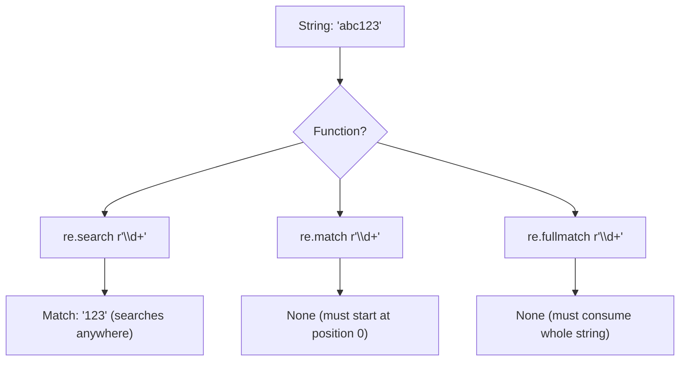
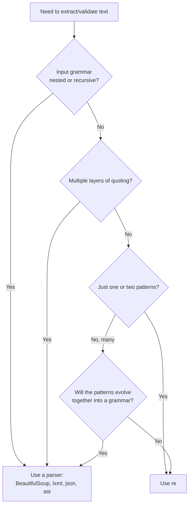

# 9. re (Regular Expressions)

> [!note] Why this note exists
> The `re` module is Python's regular-expression engine — a faithful, slightly conservative implementation of the classic POSIX/Perl regex syntax with named groups, lookaround, and Unicode awareness. Regexes are the right tool for tokenizing, validating format, extracting structured data from semi-structured text, and small parsing tasks; they are the wrong tool for parsing HTML, JSON, or nested grammars (use a real parser). This note covers the API surface (`search`, `match`, `fullmatch`, `findall`, `finditer`, `sub`, `split`, `compile`), the syntax (character classes, anchors, quantifiers, groups, lookaround, backreferences), compiled patterns and their performance, the differences between greedy and non-greedy, and the regex-or-not decision tree.

## Why It Matters

Two real-world examples that show the range:

```python
import re

# 1. Validate that a string looks like an email (good use of regex)
EMAIL = re.compile(r"^[a-zA-Z0-9._%+-]+@[a-zA-Z0-9.-]+\.[a-zA-Z]{2,}$")
if EMAIL.match(user_input):
    ...

# 2. Extract all URLs from a Markdown doc
URL = re.compile(r"\[([^\]]+)\]\(([^)]+)\)")
for text, href in URL.findall(markdown):
    print(text, "->", href)
```

Compare those to writing a hand-rolled state machine for the same job — five times the code, ten times the bugs. Regex is a domain-specific language for "find patterns in strings", and Python's `re` is a competent, fast, Unicode-aware implementation.

But the same module will lead you astray if you try to parse nested HTML with it (`<div.*?>` does not work the way you think it does), to validate RFC-compliant email addresses (the real RFC 5322 grammar is not regular), or to match balanced parentheses (regular expressions can't count). Knowing the limits is half the battle.

## Background

### What `re` actually is

`re` is a backtracking regex engine implemented in C. It supports:
- The standard regex syntax (character classes, anchors, quantifiers, alternation).
- Grouping (capturing, non-capturing, named).
- Backreferences (`\1`, `\g<name>`).
- Lookaround (lookahead and lookbehind, positive and negative).
- Unicode categories (`\w`, `\d`, `\s` are Unicode-aware by default in Python 3).
- Flags: `IGNORECASE`, `MULTILINE`, `DOTALL`, `VERBOSE`, `ASCII`, `LOCALE`.

The alternative third-party `regex` module (`pip install regex`) adds recursive patterns, overlapping matches, and better Unicode support. For most work, the stdlib `re` is enough.

### Regex vs parsing

| Use regex when...                         | Use a parser when...                          |
|-------------------------------------------|------------------------------------------------|
| Format validation (email, phone, date)    | The grammar is nested or recursive             |
| Tokenizing (splitting into tokens)        | The input is HTML, XML, JSON, or code          |
| Extracting fields from log lines          | You need to handle escaping/quoting            |
| Simple substitutions                      | The structure matters semantically             |
| One-shot "is X in this string?"           | You'll add features later that need context    |

If you find yourself writing `(?:[^<>]|<[^>]*>)*` to match HTML, **stop** — use `BeautifulSoup` or `lxml` instead.

### The compile vs inline trade-off

```python
# Inline (compile happens on every call, but cached):
re.search(r"\d{4}-\d{2}-\d{2}", text)

# Compiled once, reused:
DATE = re.compile(r"\d{4}-\d{2}-\d{2}")
DATE.search(text)
```

`re` keeps an internal cache of recently compiled patterns (default size 512), so inline calls are not catastrophically slow. But compiling once is faster if you use the pattern in a hot loop, and pre-compiled patterns are clearer (you give them names).

## Main content

### The API surface

#### `re.search(pattern, string, flags=0)` — find anywhere

Returns a `Match` object for the first match, or `None`. Searches anywhere in the string.

```python
m = re.search(r"\d+", "abc123def")
m.group()    # '123'
m.start()    # 3
m.end()      # 6
m.span()     # (3, 6)
```

#### `re.match(pattern, string, flags=0)` — match at the start

Only matches at the beginning of the string (not the whole string — for that use `fullmatch`).

```python
re.match(r"\d+", "123abc")   # Match: 123
re.match(r"\d+", "abc123")   # None
```

#### `re.fullmatch(pattern, string, flags=0)` — match the whole string

```python
re.fullmatch(r"\d+", "123")     # Match
re.fullmatch(r"\d+", "123abc")  # None
```

#### `re.findall(pattern, string, flags=0)` — all matches, as a list

Returns a list of strings (or tuples of groups, if there are groups).

```python
re.findall(r"\d+", "a1 b22 c333")            # ['1', '22', '333']
re.findall(r"(\w+)=(\d+)", "a=1 b=2")         # [('a', '1'), ('b', '2')]
```

#### `re.finditer(pattern, string, flags=0)` — all matches, as an iterator

Like `findall` but yields `Match` objects, so you get spans and named groups.

```python
for m in re.finditer(r"\d+", "a1 b22 c333"):
    print(m.group(), m.span())
# 1 (1, 2)
# 22 (4, 6)
# 333 (8, 11)
```

#### `re.sub(pattern, repl, string, count=0, flags=0)` — substitute

`repl` can be a string (with `\1`, `\g<name>` backrefs) or a function.

```python
re.sub(r"\d+", "N", "a1 b22 c333")              # 'aN bN cN'
re.sub(r"(\w+)=(\d+)", r"\2=\1", "x=1 y=2")      # '1=x 2=y'
re.sub(r"\d+", lambda m: str(int(m.group()) * 2), "a1 b22")  # 'a2 b44'

# count limits the number of replacements
re.sub(r"\s+", "_", "a  b   c", count=1)         # 'a_b   c'
```

#### `re.subn` — like `sub`, returns (new_string, count)

```python
new, n = re.subn(r"\d+", "N", "a1 b22 c333")
# new = 'aN bN cN', n = 3
```

#### `re.split(pattern, string, maxsplit=0, flags=0)` — split

```python
re.split(r"\s+", "a  b   c")         # ['a', 'b', 'c']
re.split(r"(\s+)", "a  b   c")       # ['a', '  ', 'b', '   ', 'c']   (with group, separator kept)
re.split(r",", "a,b,c", maxsplit=1)  # ['a', 'b,c']
```

If the pattern has a capturing group, the separators are kept in the result. If it has more than one group, you get tuples.

#### `re.compile(pattern, flags=0)` — precompile a pattern

```python
DATE = re.compile(r"\d{4}-\d{2}-\d{2}")
DATE.search("2024-06-10")         # Match
DATE.findall("2024-06-10 and 2024-07-15")
```

Compiled patterns have the same methods as the `re` module-level functions: `.search`, `.match`, `.fullmatch`, `.findall`, `.finditer`, `.sub`, `.subn`, `.split`. They're slightly faster in loops because they skip the cache lookup.

#### `re.escape(string)` — escape regex metacharacters

```python
re.escape("1.5")   # '1\\.5'   -- the dot is now literal
```

Use this when you want to search for a literal user-provided string.

### Syntax: character classes and anchors

| Token         | Meaning                                                  |
|---------------|----------------------------------------------------------|
| `.`           | Any char except newline (use `DOTALL` for newline too)   |
| `\d`          | Digit (`[0-9]`, or Unicode digits by default)            |
| `\D`          | Non-digit                                                |
| `\w`          | Word char (`[a-zA-Z0-9_]` + Unicode letters/digits)      |
| `\W`          | Non-word char                                            |
| `\s`          | Whitespace (space, tab, newline, ...)                    |
| `\S`          | Non-whitespace                                           |
| `[abc]`       | Any of `a`, `b`, `c`                                     |
| `[^abc]`      | None of `a`, `b`, `c`                                    |
| `[a-z]`       | Range                                                    |
| `^`           | Start of string (or start of line with `MULTILINE`)      |
| `$`           | End of string (or end of line with `MULTILINE`)          |
| `\A`          | Start of string (always, regardless of `MULTILINE`)      |
| `\Z`          | End of string (always)                                   |
| `\b`          | Word boundary                                            |
| `\B`          | Non-word boundary                                        |

### Quantifiers

| Token    | Meaning                          | Greedy? |
|----------|----------------------------------|---------|
| `*`      | 0 or more                        | Yes     |
| `+`      | 1 or more                        | Yes     |
| `?`      | 0 or 1                           | Yes     |
| `{n}`    | Exactly n                        | Yes     |
| `{n,}`   | n or more                        | Yes     |
| `{n,m}`  | Between n and m                  | Yes     |
| `*?`     | 0 or more, lazy (non-greedy)     | No      |
| `+?`     | 1 or more, lazy                  | No      |
| `??`     | 0 or 1, lazy                     | No      |
| `{n,m}?` | Between n and m, lazy            | No      |
| `*+`, `++`, `?+` | Possessive (NOT supported in Python `re` — use `regex`) | - |

> [!tip] Greedy vs lazy
> `<.*>` on `<a><b>` matches `<a><b>` (greedy). `<.*?>` matches `<a>` then `<b>` (lazy). The default is greedy; add `?` for lazy.

### Groups

| Token           | Meaning                                          |
|-----------------|--------------------------------------------------|
| `(...)`         | Capturing group (numbered 1, 2, 3, ...)          |
| `(?:...)`       | Non-capturing group                              |
| `(?P<name>...)` | Named capturing group                            |
| `(?P=name)`     | Backreference to a named group                   |
| `\1`, `\2`, ... | Backreference to a numbered group                |
| `(?#comment)`   | Comment (ignored)                                |

```python
m = re.match(r"(?P<year>\d{4})-(?P<month>\d{2})-(?P<day>\d{2})", "2024-06-10")
m.group()           # '2024-06-10'
m.group(1)          # '2024'
m.group("year")     # '2024'
m.groups()          # ('2024', '06', '10')
m.groupdict()       # {'year': '2024', 'month': '06', 'day': '10'}

# Backreference: match repeated word
re.search(r"\b(\w+)\s+\1\b", "the the cat")   # Match: 'the the'
```

### Lookaround (zero-width assertions)

| Token         | Meaning                                       |
|---------------|-----------------------------------------------|
| `(?=...)`     | Positive lookahead — must match what follows  |
| `(?!...)`     | Negative lookahead — must NOT match what follows |
| `(?<=...)`    | Positive lookbehind — must match what precedes|
| `(?<!...)`    | Negative lookbehind — must NOT precede        |

```python
# Find "cat" only when followed by "dog"
re.findall(r"cat(?=dog)", "cat catdog cat")   # ['cat']  (the one before 'dog')

# Find "cat" NOT followed by "dog"
re.findall(r"cat(?!dog)", "cat catdog cat")   # ['cat', 'cat']

# Find "$100" (number preceded by $)
re.findall(r"(?<=\$)\d+", "$100 $50 and 25")   # ['100', '50']

# Find numbers NOT preceded by $
re.findall(r"(?<!\$)\b\d+", "$100 25")   # ['25']
```

> [!warning] Lookbehind must be fixed-width
> Python's `re` requires lookbehinds to have a fixed length. `(?<=a|bc)` is invalid because `a` is 1 char and `bc` is 2. Use the third-party `regex` module for variable-width lookbehind.

### Flags

```python
re.IGNORECASE  # re.I  — case insensitive
re.MULTILINE   # re.M  — ^ and $ match at line boundaries
re.DOTALL      # re.S  — . matches newlines too
re.VERBOSE     # re.X  — allow whitespace and comments in pattern
re.ASCII       # re.A  — \w, \d, \s match only ASCII (no Unicode)
re.LOCALE      # re.L  — \w, \d, \s depend on current locale (deprecated)
re.UNICODE     # default in Python 3

# Combine with | :
re.compile(r"hello", re.IGNORECASE | re.MULTILINE)
```

#### `re.VERBOSE` — readable patterns

```python
EMAIL = re.compile(r"""
    ^
    [a-zA-Z0-9._%+-]+   # local part
    @
    [a-zA-Z0-9.-]+      # domain
    \.
    [a-zA-Z]{2,}        # TLD
    $
""", re.VERBOSE)
```

In VERBOSE mode, whitespace in the pattern is ignored (unless escaped or in a character class), and `#` starts a comment. Use this for any pattern longer than 30 chars.

### Performance considerations

Python's `re` is a **backtracking** engine. It can exhibit **catastrophic backtracking** on patterns like `(a+)+b` against strings of `a`s without a `b`. The fix is to make patterns more specific:

```python
# Bad — exponential backtracking on "aaaaaaaaaaaaaaaaaaaaaa" (no b at end)
re.search(r"(a+)+b", "a" * 30)

# Better — anchor and minimize:
re.search(r"^a+b", s)   # linear
```

Other performance tips:
- **Pre-compile** patterns used in loops.
- **Anchor patterns** with `^`, `$`, or `\b` when possible.
- **Avoid nested quantifiers** like `(a+)+` — they're the classic catastrophic-backtracking trigger.
- **Use `re.search` over `re.findall`** when you only need the first match.
- **Use `finditer` over `findall`** for huge inputs — it returns an iterator, not a list.
- **Profile** if a regex is suspected of being slow. `cProfile` shows `re._compile` time.

### Unicode

In Python 3, `\w`, `\d`, `\s` are Unicode-aware by default. `\d` matches `١` (Arabic-Indic digit 1). For ASCII-only matching, use the `re.ASCII` flag:

```python
re.findall(r"\d+", "abc١٢٣def")   # ['١٢٣']   (Unicode)
re.findall(r"\d+", "abc١٢٣def", re.ASCII)   # []   (ASCII only)
```

## Mermaid diagrams

### Regex metacharacter categories

```mermaid
flowchart TB
    RE[Regex syntax]
    RE --> CHAR[Character classes]
    RE --> ANC[Anchors]
    RE --> QUANT[Quantifiers]
    RE --> GRP[Groups]
    RE --> LOOK[Lookaround]
    RE --> BACK[Backrefs]

    CHAR --> C1[. any]
    CHAR --> C2[\d \w \s and uppercase]
    CHAR --> C3["[abc] [^abc] [a-z]"]

    ANC --> A1["^ start / $ end"]
    ANC --> A2["\A \Z always start/end"]
    ANC --> A3["\b \B word boundaries"]

    QUANT --> Q1["* 0+ greedy"]
    QUANT --> Q2["+ 1+ greedy"]
    QUANT --> Q3["? 0 or 1"]
    QUANT --> Q4["{n,m}"]
    QUANT --> Q5["*? +? ?? lazy variants"]

    GRP --> G1["( ... ) capturing"]
    GRP --> G2["(?: ... ) non-capturing"]
    GRP --> G3["(?P<name> ...) named"]

    LOOK --> L1["(?=...) positive lookahead"]
    LOOK --> L2["(?!...) negative lookahead"]
    LOOK --> L3["(?<=...) positive lookbehind"]
    LOOK --> L4["(?<!...) negative lookbehind"]

    BACK --> B1["\1 \2 backrefs"]
    BACK --> B2["(?P=name)"]
```

### `search` vs `match` vs `fullmatch`



### Decision: regex or parser?



## Code examples

### Example 1: validate and parse a date

```python
import re
from datetime import date

DATE = re.compile(r"(?P<year>\d{4})-(?P<month>\d{2})-(?P<day>\d{2})")

def parse_date(s: str) -> date | None:
    m = DATE.fullmatch(s)
    if not m:
        return None
    return date(int(m["year"]), int(m["month"]), int(m["day"]))

print(parse_date("2024-06-10"))   # datetime.date(2024, 6, 10)
print(parse_date("2024-6-10"))    # None (needs zero-padding)
```

### Example 2: extract all URLs from Markdown

```python
import re

MD_LINK = re.compile(r"\[([^\]]+)\]\(([^)]+)\)")

def extract_links(markdown: str) -> list[tuple[str, str]]:
    return MD_LINK.findall(markdown)

text = """
See [Python docs](https://docs.python.org) and
[PEP 8](https://peps.python.org/pep-0008/).
"""
print(extract_links(text))
# [('Python docs', 'https://docs.python.org'), ('PEP 8', 'https://peps.python.org/pep-0008/')]
```

### Example 3: tokenize a config file

```python
import re

TOKEN = re.compile(r"""
    \s+                  # whitespace (skip)
  | \#[^\n]*             # comment (skip)
  | (?P<key>[a-zA-Z_]\w*)   # identifier
  | =
  | (?P<string>"[^"]*")     # quoted string
  | (?P<number>\d+\.?\d*)   # number
""", re.VERBOSE)

def tokenize(text: str):
    pos = 0
    while pos < len(text):
        m = TOKEN.match(text, pos)
        if not m:
            raise SyntaxError(f"unexpected char at {pos}: {text[pos]!r}")
        pos = m.end()
        if m.lastgroup:
            yield m.lastgroup, m.group()

for kind, value in tokenize('timeout = 30  # seconds\nname = "alice"'):
    print(kind, value)
# key timeout
# number 30
# key name
# string "alice"
```

### Example 4: redact sensitive data

```python
import re

PATTERNS = {
    "EMAIL": re.compile(r"\b[\w.+-]+@[\w-]+\.[\w.-]+\b"),
    "PHONE": re.compile(r"\b\d{3}[-.\s]?\d{3}[-.\s]?\d{4}\b"),
    "SSN":   re.compile(r"\b\d{3}-\d{2}-\d{4}\b"),
}

def redact(text: str) -> str:
    for label, pat in PATTERNS.items():
        text = pat.sub(f"[{label}]", text)
    return text

print(redact("Contact alice@example.com or 555-123-4567. SSN: 123-45-6789"))
# Contact [EMAIL] or [PHONE]. SSN: [SSN]
```

### Example 5: camelCase to snake_case

```python
import re

CAMEL = re.compile(r"(?<!^)(?=[A-Z])")

def snake(s: str) -> str:
    return CAMEL.sub("_", s).lower()

print(snake("camelCaseName"))    # 'camel_case_name'
print(snake("HTTPResponse"))     # 'h_t_t_p_response'   (not ideal — but it's a one-liner)
```

### Example 6: log line parser with named groups

```python
import re

LOG = re.compile(
    r"(?P<ts>\d{4}-\d{2}-\d{2} \d{2}:\d{2}:\d{2},\d{3})"
    r"\s+\[(?P<level>\w+)\]"
    r"\s+(?P<logger>[\w.]+)"
    r":\s+(?P<msg>.*)"
)

for line in open("app.log"):
    m = LOG.match(line)
    if m:
        print(m["level"], m["logger"], m["msg"])
```

### Example 7: substitution with a function

```python
import re

def double(match):
    n = int(match.group())
    return str(n * 2)

print(re.sub(r"\d+", double, "a1 b22 c333"))   # 'a2 b44 c666'
```

### Example 8: `VERBOSE` pattern with comments

```python
import re

URI = re.compile(r"""
    (?P<scheme>[a-zA-Z][a-zA-Z0-9+.-]*)://    # scheme
    (?P<host>[^/:]+)                            # host
    (?::(?P<port>\d+))?                         # optional port
    (?P<path>/[^?#]*)?                          # optional path
    (?:\?(?P<query>[^#]*))?                     # optional query
    (?:\#(?P<fragment>.*))?                     # optional fragment
""", re.VERBOSE)

m = URI.match("https://example.com:8443/path?q=1#frag")
print(m.groupdict())
# {'scheme': 'https', 'host': 'example.com', 'port': '8443',
#  'path': '/path', 'query': 'q=1', 'fragment': 'frag'}
```

## Common Pitfalls

- **Greedy `.*` matches too much.** `<.*>` on `<a><b>` matches the whole thing. Use `<.*?>` or a character class like `<[^>]*>`.
- **`re.match` only matches at the start.** It doesn't anchor the end — use `fullmatch` for that.
- **Forgetting `re.DOTALL` when matching across newlines.** `.` doesn't match `\n` by default.
- **Using `re.split` with a capturing group changes the result.** `re.split(r"(\s+)", ...)` keeps the separators.
- **Catastrophic backtracking** on patterns like `(a+)+b`. Avoid nested quantifiers.
- **Backrefs can't be used in character classes.** `[abc\1]` is a syntax error.
- **Lookbehind must be fixed-width.** `(?<=a|bb)` is invalid.
- **`\b` at the start of a word doesn't work for non-ASCII in `re.ASCII` mode.** Default Unicode mode is usually what you want.
- **`re.sub` with a string `repl` interprets backslashes.** To use a literal `\1`, escape it: `r"\\1"`. Or use a function `repl`.
- **`re.escape` on a user-provided string is required** if you want to search for it literally.
- **`re.findall` returns tuples when there are multiple groups**, and just strings when there's one. Don't assume the shape.
- **`^` and `$` in `MULTILINE` mode** match at line boundaries, not just string boundaries. `\A` and `\Z` always match string boundaries.

## Tips and Tricks

- **`re.fullmatch` is your friend for validation.** It's clearer than `^...$`.
- **`re.VERBOSE` for any non-trivial pattern.** Comments save you from yourself six months later.
- **Named groups (`?P<name>...`)** make patterns self-documenting.
- **`Match.__getitem__` (3.6+)** lets you do `m["year"]` instead of `m.group("year")`.
- **`re.split` with `maxsplit=1`** is great for "split on the first occurrence".
- **`re.subn`** returns the count of replacements — useful for "did we replace anything?".
- **Pre-compile patterns used in hot loops.** Naming them as module-level constants is good documentation.
- **Use `re.escape(literal)`** to search for user-provided text.
- **For overlapping matches**, `re` doesn't support them — use the third-party `regex` module or a manual loop with `finditer` and `start + 1`.
- **`re.compile` is idempotent** — calling it twice with the same pattern returns the same cached object.
- **The `regex` module** (`pip install regex`) is a drop-in replacement with extra features: variable-width lookbehind, recursive patterns, atomic groups, `(?<name>...)` alternative syntax, and better Unicode.
- **For HTML/XML, use `BeautifulSoup` or `lxml`.** For JSON, use `json`. For Python source, use `ast`. Regex is the wrong tool for these.

## Active Recall

1. What's the difference between `re.search`, `re.match`, and `re.fullmatch`?
2. What does `re.DOTALL` do, and which metacharacter does it affect?
3. How do you make `.*` non-greedy?
4. How do you write a named capturing group, and how do you retrieve its value?
5. What's the difference between `(?=...)` and `(?!...)`?
6. Why can't Python's `re` do variable-width lookbehind?
7. How do you keep the separator when using `re.split`?
8. What is catastrophic backtracking, and how do you avoid it?
9. What does `re.VERBOSE` do?
10. How do you substitute using a function instead of a string?
11. When should you use `re.escape`?
12. What's the rule for when to use a parser instead of regex?

## Next Steps

- Continue to [[10. typing]] for the final note in this chapter.
- For parsing HTML, see the `BeautifulSoup` and `lxml` libraries.
- For parsing JSON, see Chapter 6 — Files and Serialization.
- For tokenizing Python source, see the `ast` and `tokenize` stdlib modules.
- For advanced regex (recursive patterns, atomic groups), install the third-party `regex` module.
- For more on string handling, see Chapter 3 — Strings.
