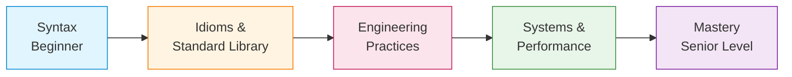
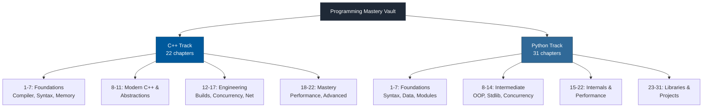
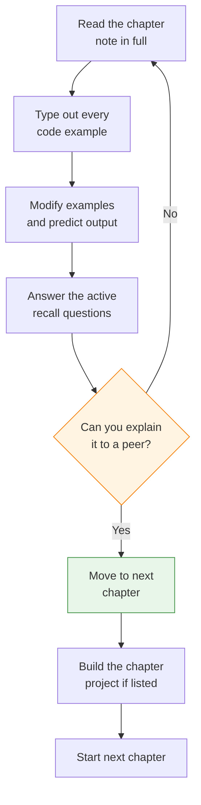

# Programming Mastery Vault

A complete, ground-up rebuild of an Obsidian vault designed to take you from **forgotten basics** to **mastery** in both **C++** and **Python**. This is not a tutorial dump — it is a long-term reference and learning system organized as a strict progression of chapters, each building on the previous one.

> [!info] How to use this vault
> - Work through chapters **in order** within each language track. Each chapter assumes you have understood the previous one.
> - Every note is self-contained: it explains the *why*, the *how*, the *gotchas*, and the *mental model* — you should not need to look anything up externally.
> - Use Obsidian's graph view to see cross-references between notes.
> - Diagrams are all Mermaid — install the **Mermaid** community plugin (or use Obsidian's built-in support) to render them inline.

---

## Learning Philosophy

Most developers stop at "I know the syntax" and never reach the layer that turns coding into engineering. This vault targets the **missing intermediate layer** that sits between beginner tutorials and senior-level work:

---

## Vault Layout

---

## C++ Track — 22 Chapters

| # | Chapter | Purpose |
|---|---------|---------|
| 1 | Compiler and Toolchain | Understand GCC, Clang, MSVC, the build pipeline, and free-software context |
| 2 | C++ Fundamentals | Syntax, types, operators, literals, control flow, arrays |
| 3 | Strings and Character Data | C-strings, `std::string`, `std::string_view` |
| 4 | Functions and Program Structure | Pass-by-value/pointer/reference, overloading, constexpr |
| 5 | Structs, Unions, and Bit-Fields | User-defined aggregates and low-level memory packing |
| 6 | Pointers and References | Memory addresses, pointer arithmetic, const correctness |
| 7 | Memory Management | Stack vs heap, RAII, smart pointers, allocators |
| 8 | Modern C++ | `auto`, move semantics, lambdas, optional/variant, C++20/23 |
| 9 | Object-Oriented Programming | Classes, inheritance, polymorphism, the Rule of 0/3/5 |
| 10 | Templates and Metaprogramming | Function/class templates, SFINAE, concepts, CRTP |
| 11 | STL Deep Dive | Containers, iterators, algorithms, ranges |
| 12 | Build Systems and Project Structure | Make, CMake, libraries, project layout |
| 13 | Error Handling and Exceptions | try/catch, exception safety, `std::expected` |
| 14 | Concurrency and Multithreading | `std::thread`, mutexes, atomics, thread pools, coroutines |
| 15 | Debugging and Profiling | GDB, Valgrind, sanitizers, perf, flamegraphs |
| 16 | Testing | Google Test, Catch2, gMock |
| 17 | Networking | Sockets, TCP/UDP, non-blocking I/O, Boost.Asio |
| 18 | Software Engineering Practices | SOLID, design patterns, architecture, refactoring |
| 19 | Performance Optimization | Cache locality, SIMD, branch prediction, profiling |
| 20 | Advanced C++ Topics | Coroutines, modules, ranges deep-dive, C++23 |
| 21 | C++ and Python Interoperability | pybind11, embedding, NumPy interop |
| 22 | Projects | Build-your-own Vector, String, thread pool, HTTP server, Redis |
| 99 | Reference Cards | Quick-lookup C and C++ reference |

→ **Full chapter list and progression**: see [[0. C++ Roadmap]]

---

## Python Track — 31 Chapters

| # | Chapter | Purpose |
|---|---------|---------|
| 1 | Python Fundamentals | Variables, types, operators, I/O |
| 2 | Control Flow | if/match/loops, comprehensions |
| 3 | Functions | Parameters, closures, decorators, generators |
| 4 | Data Structures | Lists, tuples, sets, dicts, strings deep-dive |
| 5 | Error Handling | try/except, custom exceptions, context managers |
| 6 | Files and Serialization | File I/O, pathlib, CSV/JSON, pickle |
| 7 | Modules and Packages | import system, `__init__.py`, venvs, packaging |
| 8 | Object-Oriented Programming | Classes, inheritance, magic methods |
| 9 | Standard Library Deep Dive | os, pathlib, collections, itertools, functools, logging |
| 10 | Pythonic Programming | Comprehensions, generators, EAFP, duck typing |
| 11 | Type Hinting | Generics, Protocols, TypedDict, mypy |
| 12 | Testing | unittest, pytest, fixtures, mocking |
| 13 | Logging | The `logging` module, structured logging |
| 14 | Concurrency | threading, multiprocessing, asyncio, the GIL |
| 15 | Memory and Performance | Memory model, GC, profiling, optimization |
| 16 | Python Internals | CPython, bytecode, the execution model |
| 17 | Metaprogramming | `__dict__`, metaclasses, descriptors |
| 18 | Advanced OOP | ABCs, Protocols, mixins, dataclasses |
| 19 | Functional Python | functools, partial, singledispatch |
| 20 | Advanced Async | Event loops, async generators, task groups |
| 21 | Packaging and Distribution | Wheels, build systems, publishing |
| 22 | Native Extensions | ctypes, cffi, Cython, Numba, pybind11 |
| 23 | NumPy | Array creation, broadcasting, ufuncs |
| 24 | Pandas | Series, DataFrames, groupby, time series |
| 25 | Matplotlib | Line plots, styling, subplots, advanced viz |
| 26 | Image Processing | Pillow, OpenCV, NumPy for images |
| 27 | Networking and Sockets | socket module, TCP/UDP servers, asyncio networking |
| 28 | Software Engineering Practices | Project structure, design patterns, SOLID |
| 29 | Notebooks and Interactive Computing | Jupyter, Colab, Kaggle comparison |
| 30 | ML and AI Libraries | Scikit-Learn, PyTorch, TensorFlow fundamentals |
| 31 | Projects | CLI tools, scrapers, chat servers, data pipelines |

→ **Full chapter list and progression**: see [[0. Python Roadmap]]

---

## Cross-Language Comparisons

Throughout the vault, you will find direct comparisons between C++ and Python. These are intentional — understanding **why** C++ is fast and **why** Python is slow teaches you more about both languages than studying them in isolation.

Key cross-reference topics:

- **The GIL vs No-GIL** — why multithreading behaves differently in each
- **Reference counting + GC** (Python) vs **manual ownership** (C++) vs **RAII** (modern C++)
- **Duck typing** (Python) vs **static templates/concepts** (C++)
- **Interpreted bytecode** vs **compiled native code**
- **pybind11** — bridging the two worlds

---

## How Each Note Is Structured

Every lesson note follows the same internal structure for consistency:

1. **Title and YAML frontmatter** — Obsidian metadata
2. **Why this matters** — motivation and where it fits in the bigger picture
3. **Background** — prerequisite concepts you must already understand
4. **Core explanation** — the concept itself, in depth
5. **Code examples** — annotated, idiomatic, runnable
6. **Mermaid diagrams** — visual mental models (never ASCII art)
7. **Common pitfalls** — what students miss
8. **Tips and tricks** — practical heuristics
9. **Active recall questions** — self-test
10. **Next steps** — links to related notes

---

## How to Study

---

## Estimated Time

At a steady pace of **one chapter per week** (reading + coding + project), expect:

- C++ track: **~22 weeks** (~5–6 months)
- Python track: **~31 weeks** (~7–8 months)
- Both in parallel: **~8 months**

This is a marathon, not a sprint. The goal is **mastery**, not speed.

---

## Source Material Acknowledgment

This vault was rebuilt from an earlier, incomplete version. The original notes (which covered only compiler basics, C++ pointers/memory/multithreading, and scattered Python topics) were used as a starting point. Every note has been rewritten from scratch with deeper explanations, missing context filled in, correct progression restored, and Mermaid diagrams replacing ASCII art.

---

Start here:
- → [[0. C++ Roadmap]]
- → [[0. Python Roadmap]]
