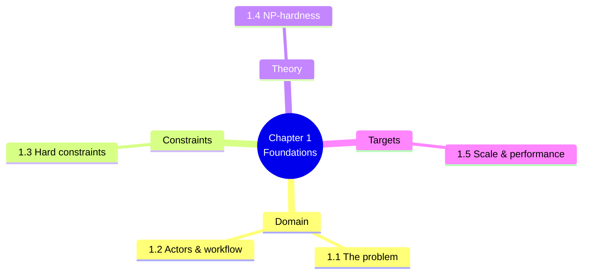

# 1. MOC — Foundations and Problem Domain

> [!abstract] Chapter goal
> Before tearing into the legacy code or designing the V2 replacement, you need to understand **what problem we are solving**, **who cares about it**, **why it is hard**, and **what success looks like**. This chapter sets the technical and business context for everything that follows.

## Notes in this chapter

| Note | Title | What you learn |
|---|---|---|
| 1.1 | [[1.1. The University Exam Scheduling Problem]] | The real-world problem: 13,000+ students, 200+ formations, finite rooms, finite professors, hard deadline. |
| 1.2 | [[1.2. Actors Roles and Workflow]] | The five actor types (Vice-Doyen, Admin Planification, Chef Dept, Student, Professor) and how they interact. |
| 1.3 | [[1.3. Hard Constraints and Business Rules]] | The six non-negotiable constraints from the academic brief, and what each one actually means. |
| 1.4 | [[1.4. Why Scheduling Is NP-Hard]] | Why this problem generalizes graph coloring, bin packing, and job-shop scheduling — and why greedy fails. |
| 1.5 | [[1.5. Scale Targets and Performance Budget]] | 13k → 100k students, 130k → 800k inscriptions, <45 s baseline, <5 min max scale. What these numbers force. |

## Why this chapter comes first

Every architectural decision in V2 is a response to a real constraint from this chapter. If you skip it, the V2 design will look over-engineered. If you read it, every V2 choice will feel inevitable.

## Where to go next

After finishing Chapter 1, proceed to [[2. MOC|The V1 Architecture and Its Pathologies]] to see how the legacy prototype tried (and failed) to solve this problem.
