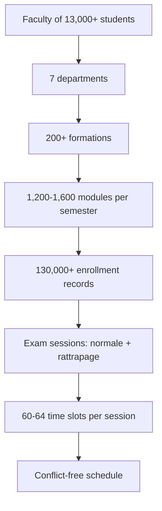

# 1.1. The University Exam Scheduling Problem

> [!abstract] What this note teaches you
> Before any architecture, any algorithm, any database design — you must understand the *actual* problem the platform solves. This note describes the real-world context: how a faculty of 13,000+ students ends up with hundreds of thousands of enrollment records that all need to be turned into a conflict-free exam schedule in under 45 seconds.

## The real-world setting

The original academic brief (in French) describes a faculty with the following scale:

- **13,000+ students** spread across **7 departments** (Computer Science, Mathematics, Physics, Chemistry, Biology, Geology, Architecture — a typical Algerian faculté).
- **200+ formations** (program streams): L1 Informatique, L2 Mathématiques, M1 Réseaux, etc. Each formation offers **6 to 9 modules per semester**.
- **130,000+ inscriptions** — enrollment records linking students to modules. A single L2 student typically takes 6–8 modules per semester, so 13k × ~10 modules ≈ 130k records is the baseline.
- The faculty runs **exam sessions** twice a year: a *session normale* (main exam period) and a *session de rattrapage* (make-up exam period). Each session lasts about 2–3 weeks and has **4 time slots per day** (e.g. 08:30, 10:30, 13:30, 15:30), yielding roughly **60–64 creneaux** (time slots) per session.

## What "scheduling" actually means

Given a session (a 2–3 week window), the platform must produce an **assignment** for every module that needs an exam in that session. Concretely, for each module `m` the system must choose:

1. A **creneau** (time slot) — when the exam happens.
2. A **lieu** (room) — where the exam happens. May be split across multiple rooms if the cohort is too large for any single hall.
3. A **surveillant principal** (head proctor) — which professor invigilates.
4. Zero or more secondary **surveillances** — additional proctors for large exams.

The assignment must satisfy a set of **hard constraints** (see [[1.3. Hard Constraints and Business Rules]]) and should optimize a set of **soft constraints** (student spread, professor fairness, room utilization, department priority — see [[4.5. The 7 Soft Constraints and Objective]]).

## Why this is harder than it looks

A naive reading of the brief suggests a simple greedy loop: "for each module, find a free slot, room, and professor, and insert." That is exactly what the V1 prototype did (see [[2.4. The Greedy First-Fit Scheduling Algorithm]]), and it fails for several reasons:

1. **The conflict graph is dense.** Two modules are in conflict if they share at least one student. With 1,200 modules and an average of 8 modules per student, each module shares students with dozens of others. A greedy loop that places modules earliest-slot-first paints itself into a corner — see the "Greedy Trap" example in [[4.1. Why Greedy Fails on NP-Hard Problems]].

2. **The problem is provably NP-hard.** University exam scheduling generalizes graph coloring, bin packing, and job-shop scheduling. Even feasibility is NP-complete. See [[1.4. Why Scheduling Is NP-Hard]].

3. **Real cohorts are bigger than real rooms.** An introductory CS module can have 800+ students. No single amphi holds 800 students under exam conditions (which require 50% empty-seat spacing). The schema must allow splitting a single exam across multiple rooms — see [[2.6. The Fatal UNIQUE Constraint]] for the V1 bug that made this impossible.

4. **The professor workload constraint is global, not local.** The brief requires that all professors do roughly the same number of surveillances across the whole session. A greedy loop that picks the least-loaded prof *today* ends up giving the same handful of professors all the work over the whole session. See [[4.5. The 7 Soft Constraints and Objective]] for the V2 fairness objective.

## The five actor types

The brief specifies five actor types, each with different responsibilities. V2 implements all five with a real RBAC layer (see [[6.4. RBAC with spatie laravel-permission]]):

| Actor | Role in V2 | What they do |
|---|---|---|
| Vice-Doyen / Doyen | `vice_doyen` | Strategic global view, KPIs, final validation, publish. |
| Admin Planification | `admin_planification` | Trigger generation, monitor runs, manual conflict resolution. |
| Chef de Département | `chef_dept` | Validate per-department schedule, request revisions. |
| Professeur | `professeur` | View own surveillance schedule, declare availability. |
| Étudiant | `etudiant` | View own exam schedule, report conflicts, request accommodations. |

V1 had four Streamlit pages for these roles but **no actual auth** — any visitor could click "Valider le planning" (which was a fake button anyway). See [[2.8. Missing Security and Multi-Tenancy]].

## What success looks like

The brief sets one explicit performance target: **schedule generation in under 45 seconds** for the baseline 13,000-student faculty. V2 raises the bar with two explicit targets (see [[1.5. Scale Targets and Performance Budget]]):

- **Baseline (13k students, 130k inscriptions):** complete scheduling run in < 45 seconds.
- **Maximum scale (100k students, 800k inscriptions):** complete scheduling run in < 5 minutes.

These targets are not arbitrary — they shape every architectural decision in V2. The 45 s budget forces async queueing (the HTTP request cannot block on the solver). The 5 min budget forces partitioning, materialized views, and the CP-SAT solver (no greedy PL/pgSQL loop will finish). See [[10.1. The 130k to 800k Inscriptions Scaling Path]] for the full scaling analysis.

## Why V1 failed at this problem

V1 shipped a working *demo* but failed the actual brief on multiple hard requirements. The full scorecard is in [[2.9. V1 Brief Compliance Scorecard]], but the headline is:

- 4 / 12 hard requirements met
- 3 / 12 partially met
- 5 / 12 missing or unverified
- The two required deliverables (technical report PDF, performance benchmarks file) were **empty files**

The V2 redesign exists to actually meet the brief — and to extend it to a multi-tenant SaaS that can serve 100+ universities on the same codebase.

## Common junior developer mistakes

- **Treating the brief as a checklist of features.** The brief is a constraint satisfaction problem. You cannot add "constraint X" as a feature; you must model the whole problem globally.
- **Optimizing for the demo dataset.** The seed generates 13k students and 130k inscriptions, but a greedy algorithm that works at 13k fails catastrophically at 100k. Always test at 5–10× the production target.
- **Trusting the README.** V1's README claimed "< 45 second generation time" but the benchmarks file was empty. Never trust performance claims without an executable benchmark.
- **Skipping the conflict graph.** Many junior schedulers try to "just check for conflicts at insert time" without precomputing the module-module conflict matrix. At 100k students this is a 5-minute operation on its own — see [[10.2. Query Plan Analysis with EXPLAIN ANALYZE]].

## What to read next

- [[1.2. Actors Roles and Workflow]] — the five actor types and their interactions in detail.
- [[1.3. Hard Constraints and Business Rules]] — the six non-negotiable constraints from the brief.
- [[2.1. V1 Repository Layout and Dual Implementations]] — how V1 was actually organized (spoiler: badly).
