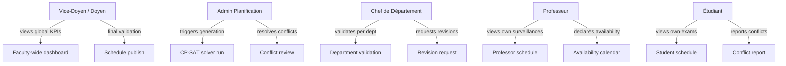
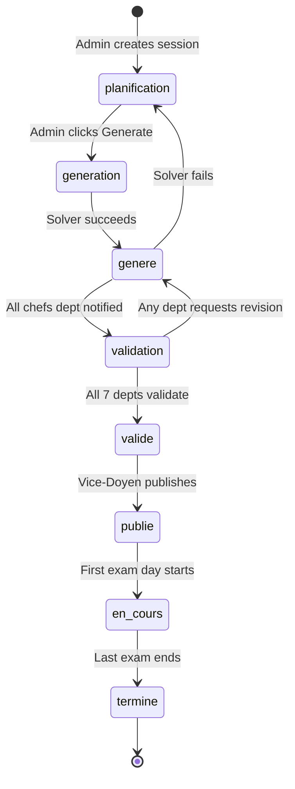

# 1.2. Actors, Roles, and Workflow

> [!abstract] What this note teaches you
> The platform has five distinct user types, each with a different view of the schedule and a different set of permissions. This note describes who they are, what they need to do, and how they interact through the V2 system. V1 had Streamlit pages for each role but no real auth — V2 implements proper RBAC.

## The five actors

The original academic brief (`Projet-Num_Exam.pdf`) enumerates four actor types. V2 splits the fourth into two distinct roles (Professor and Student) because their permissions and views are very different, yielding **five roles**:

## 1. Vice-Doyen / Doyen

**V2 role:** `vice_doyen`

The Vice-Doyen is the strategic owner of the whole exam session. They don't schedule exams themselves, but they:

- See faculty-wide KPIs: total modules, scheduled rate, conflict count, room utilization, professor workload distribution, average fill rate.
- See per-department breakdowns to spot struggling departments before they become problems.
- Give **final validation** once all departments have approved the schedule.
- Trigger the **publish** action, which makes the schedule visible to students and professors and sends notifications.

V1 had a `01_Vice_Doyen_Dashboard.py` page that called 5 sequential Supabase RPCs to build the dashboard. V2 collapses this into a single `get_dashboard_data` stored function that returns everything in one round-trip — see [[10.2. Query Plan Analysis with EXPLAIN ANALYZE]].

## 2. Admin Planification

**V2 role:** `admin_planification`

The Admin is the operator who runs the scheduling engine. Their workflow:

1. Open the session (verify it's in `planification` status).
2. Click "Generate schedule" — this dispatches the `GenerateScheduleJob` to the `optimization-workers` queue (see [[7.2. The GenerateScheduleJob Lifecycle]]).
3. Poll the `ScheduleRun` row for live status (`en_attente` → `en_cours` → `succes` or `echec`).
4. If `succes`, review the conflict list (`schedule_conflicts` table) and either accept or manually override specific exams.
5. Notify department heads that the schedule is ready for validation.

In V1, this entire workflow was a fake progress bar followed by a single blocking Supabase RPC. If the user closed the tab mid-generation, the work was lost. See [[2.4. The Greedy First-Fit Scheduling Algorithm]].

## 3. Chef de Département

**V2 role:** `chef_dept`

Each of the 7 department heads sees only their own department's exams. Their job:

1. After the Admin generates a schedule, the Chef de Dept sees a "Pending validation" badge.
2. They review the per-formation breakdown of their department's exams.
3. They either **validate** (set `session_validations.statut = 'valide'`) or **request revision** (`statut = 'a_reviser'` with a comment).
4. Once all 7 departments have validated, the session automatically transitions to `valide` status, and the Vice-Doyen is notified.

> [!warning] The V1 fake button
> V1's `03_Chef_Dept_Validation.py` had a "✅ Valider le planning" button that called `st.success(...)` and `st.balloons()` but never wrote anything to the database. The TODO comment in the source literally said `# TODO: Update session status in DB`. The entire validation workflow was theater. See [[2.8. Missing Security and Multi-Tenancy]] and [[8.5. Validation State Machines in the UI]].

## 4. Professeur

**V2 role:** `professeur`

Professors are both *consumers* and *inputs* of the schedule:

- **Consumer side:** they view their own surveillance assignments (which exams they proctor, when, where).
- **Input side:** they declare unavailability (e.g. "I'm at a conference on March 12–14") via the `professeur_indisponibilites` table. The CP-SAT solver respects these — see hard constraint 11 in [[4.4. The 16 Hard Constraints]].
- They can request **swaps** with other professors (workflow: request → other prof accepts/rejects → admin approves).

V1 had no `professeur_indisponibilites` table at all — the scheduler would happily assign a professor who was on vacation to an exam.

## 5. Étudiant

**V2 role:** `etudiant`

Students are the most numerous actor (~13,000 in baseline, ~100,000 at max scale). Their needs are simple but strict:

- View their own exam schedule (filtered by their `etudiant_id`).
- Export the schedule as ICS (calendar) or PDF.
- Report a conflict (e.g. "I have two exams at the same time") — this should be impossible if the solver is correct, but the report button exists as a safety net.
- Request accommodations (extra time, separate room, etc.) — these feed into `lieu_indisponibilites` and `professeur_indisponibilites` for future runs.

V1's `04_Consultation_Planning.py` let any visitor search any student by matricule or surname substring — a clear FERPA/GDPR violation. V2's `etudiant` role can only see their own schedule. See [[6.5. PII Redaction and GDPR FERPA Compliance]].

## The workflow as a state machine

The session lifecycle is a state machine that all five actors traverse together:

Each transition is guarded by an explicit precondition (see [[7.5. State Machines for Session and Validation]]). V1 had no transition guards — a stray UPDATE could send a `termine` session back to `planification`, corrupting the audit history.

## The permission matrix

V2's RBAC layer enforces which role can do what. The full matrix is in [[6.4. RBAC with spatie laravel-permission]]; the headline permissions are:

| Action | vice_doyen | admin_planification | chef_dept | professeur | etudiant |
|---|---|---|---|---|---|
| View faculty-wide KPIs | ✅ | ✅ | ❌ | ❌ | ❌ |
| Generate schedule | ❌ | ✅ | ❌ | ❌ | ❌ |
| Validate dept | ❌ | ❌ | ✅ (own dept) | ❌ | ❌ |
| Publish schedule | ✅ | ❌ | ❌ | ❌ | ❌ |
| View own schedule | ✅ | ✅ | ✅ | ✅ | ✅ |
| View any student's schedule | ✅ | ✅ | ✅ (own dept) | ❌ | ❌ |
| Declare unavailability | ❌ | ❌ | ❌ | ✅ (self) | ❌ |
| Report conflict | ✅ | ✅ | ✅ | ✅ | ✅ |

## Common junior developer mistakes

- **Conflating "page" with "role".** V1 had one Streamlit page per role and assumed that navigation was the same as authorization. It isn't. V2 enforces permissions at the API layer (Laravel Policies) and at the database layer (RLS), so even a forged request cannot bypass them.
- **Forgetting that professors are inputs, not just consumers.** A scheduling system that doesn't let professors declare unavailability will produce schedules that professors can't honor. The `professeur_indisponibilites` table is not optional.
- **Letting students see other students' schedules.** This is a FERPA/GDPR violation. The `etudiant` role must be scoped to the authenticated user's own `etudiant_id`.
- **No state machine for session status.** V1's `sessions_examen.statut` was a free-text enum with no transition guard. A typo could publish a schedule that wasn't validated.

## What to read next

- [[1.3. Hard Constraints and Business Rules]] — the six constraints every workflow must satisfy.
- [[6.4. RBAC with spatie laravel-permission]] — the V2 permission system in detail.
- [[7.5. State Machines for Session and Validation]] — the full state machine implementation.
- [[8.5. Validation State Machines in the UI]] — replacing V1's fake buttons with real API calls.
