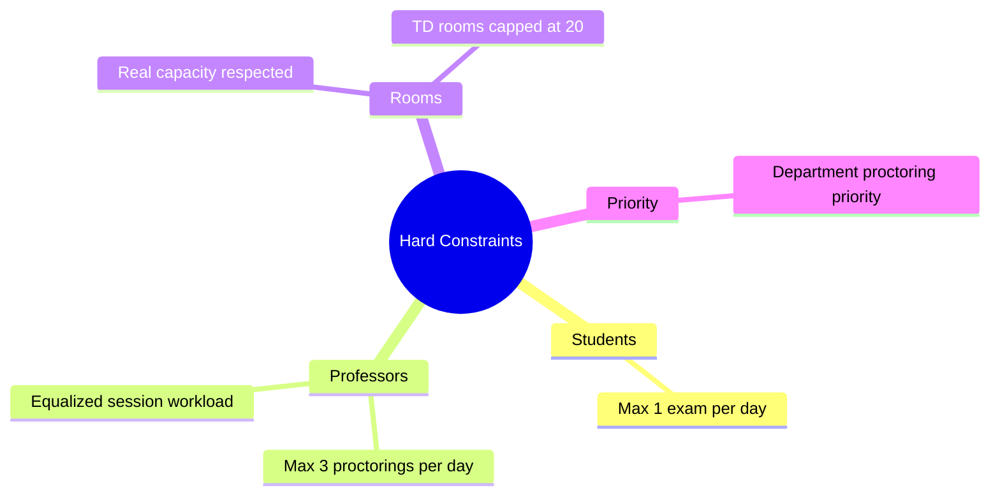

# 1.3. Hard Constraints and Business Rules

> [!abstract] What this note teaches you
> The academic brief lists six "critical constraints to model". This note explains each one precisely, shows how V1 implemented (or failed to implement) it, and previews how V2 enforces it via the CP-SAT model and the database schema. Every constraint here becomes a hard constraint in [[4.4. The 16 Hard Constraints]].

## The six critical constraints

The original brief (`Projet-Num_Exam.pdf`) lists five constraints; V2 adds a sixth (the TD-room 20-student cap) that the brief mentions in the *Contexte* section but does not enumerate in the constraints list. Together they form the **hard constraint set** that every valid schedule must satisfy:

## Constraint 1: Students — maximum 1 exam per day

**Brief text (translated):** "Students: Maximum 1 exam per day."

**What it actually means:** For each student `s` and each calendar day `d`, the number of exams `s` has on `d` is at most `max_exams_per_day` (default 1).

**Why it matters:** A student with three exams on the same day cannot perform at their best on any of them. The brief enforces 1 exam/day as the strict default.

**V1 implementation:** The scheduler's pre-check loop maintained a `temp_student_daily_counts` table and `CONTINUE`d to the next creneau if any student in the module already had `p_max_exams_per_day` exams on that date. The check was correct but **not enforced at the database level** — a manual `INSERT INTO examens` bypassing the scheduler would create a violation. The UI exposed a slider allowing the user to set `max_exams_per_day` to 3, silently violating the brief.

> [!danger] V1 footgun
> The slider `st.slider("Max exams per day", 1, 3, 1)` allowed the user to pick 3 with no warning. V2's `GenerateScheduleRequest` validates `max_exams_per_day => ['sometimes', 'integer', 'min:1', 'max:2']` with the message *"Le maximum d'examens par jour est de 2 (la valeur 3 violerait les règles académiques)."* — see [[5.6. Form Requests and Validation]].

**V2 implementation:** CP-SAT hard constraint 3: for each student `s` and day `d`, `sum_{c on day d} sum_{m enrolled by s} x[m, c] <= max_exams_per_day`. See [[4.4. The 16 Hard Constraints]].

## Constraint 2: Professors — maximum 3 proctorings per day

**Brief text:** "Professors: Maximum 3 exam surveillances per day."

**What it means:** For each professor `p` and day `d`, the number of exams `p` proctors (as principal or secondary) on `d` is at most `p.max_surveillances_jour` (default 3).

**V1 implementation:** Schema had `professeurs.max_surveillances_jour INTEGER DEFAULT 3`. A trigger `trg_check_professor_daily_limit` counted only `surveillant_principal_id` rows — secondary surveillants in the `surveillances` table were not counted. The `surveillances` table was created but never populated, so the bug was latent.

**V2 implementation:** CP-SAT hard constraint 9: `sum_{m, c on day d} z[m, p, c] <= max_surveillances_jour(p)`. The `surveillances` table is fully used. See [[4.4. The 16 Hard Constraints]] constraint 9.

## Constraint 3: Rooms — real capacity respected

**Brief text:** "Salles et amphis: Respect capacité réelle."

**What it means:** For each exam placed in room `r`, the number of students enrolled in the exam's module must be ≤ `r.capacite`. Under exam conditions, **TD rooms are capped at exactly 20** (see constraint 6 below).

**V1 implementation:** Schema had `lieu_examen.capacite INTEGER NOT NULL CHECK (capacite > 0)`. A trigger `check_room_capacity` compared `NEW.nb_etudiants_prevus` to the room's capacity. The trigger used the *stored* `nb_etudiants_prevus` column (good — O(1)), but that column could fall out of sync with actual enrollments if a student added the module after scheduling. V1 had no generated column to keep `nb_etudiants_prevus` in sync.

**V2 implementation:** CP-SAT hard constraints 4 (room capacity) and 5 (one room per scheduled module, or multiple rooms for split exams). The `nb_inscrits_actifs` is computed live from `inscriptions` (or read from `mv_module_enrollments` materialized view) so it can never be stale. See [[4.4. The 16 Hard Constraints]].

## Constraint 4: Department proctoring priority

**Brief text:** "Priorités: Examens du département sont priorisés (un enseignant surveille les examens de son département en priorité)."

**What it means:** When choosing a proctor for an exam of module `m` (which belongs to department `dept(m)`), prefer professors of the same department. Other-department professors are allowed as a fallback but should be minimized.

**V1 implementation:** `find_available_professor` ordered candidates by `CASE WHEN p.departement_id = p_departement_id THEN 0 ELSE 1 END` then by least-loaded. So same-dept professors were always picked first, but there was **no global objective** to minimize cross-department assignments — if the greedy loop had to pick a cross-dept prof early, it would, with no penalty.

**V2 implementation:** CP-SAT soft constraint W3 (weight 10): `sum_{m, p, c} z[m, p, c]` where `dept(p) != dept(m)`. The objective minimizes this sum, so the solver will use same-dept proctors whenever possible. When infeasible, it will accept the cross-dept assignment (because it's a soft constraint, not a hard one). See [[4.5. The 7 Soft Constraints and Objective]].

## Constraint 5: Equalized professor workload across the session

**Brief text:** "Tous les enseignants doivent avoir le même nombre de surveillances."

**What it means:** After scheduling the whole session, the variance in total proctoring assignments across professors should be as close to zero as possible. This is a **global** constraint — it cannot be enforced by per-day or per-exam rules.

**V1 implementation:** **Missing entirely.** V1's `find_available_professor` picked the least-loaded prof on that day, but this only minimized *daily* variance, not *session* variance. The same few professors who happened to be available early got assigned all the work; the rest got nothing. This directly violated the brief.

> [!danger] The fairness failure
> This is the single most consequential V1 failure. The brief explicitly required it; V1 didn't even model it. Any production deployment would have triggered immediate complaints from professors.

**V2 implementation:** CP-SAT soft constraint W2 (weight 100, second-highest after the unscheduled penalty): `W2 * sum_p (workload(p) - avg_workload)^2`. This is the **variance** of professor workloads. The solver minimizes it, producing a schedule where every professor does roughly the same number of surveillances. See [[4.5. The 7 Soft Constraints and Objective]].

## Constraint 6: TD rooms capped at 20 students during exam conditions

**Brief text (Contexte section):** "salles limitées à 20 étudiants max (en période d'examen)."

**What it means:** Classrooms (Salles TD) have a normal seating capacity of, say, 40, but during exams they can only hold 20 students because of the 50% empty-seat spacing rule.

**V1 implementation:** **Missing.** The schema had `lieu_examen.type CHECK (type IN ('amphi', 'salle', 'labo'))` — no `'TD'` type. The seeder set `capacite=20` for "Salle" rows as a data convention, but nothing in the schema enforced that a `salle` couldn't have `capacite=500`. An admin could insert a salle with capacity 100 and the scheduler would happily put 100 students in it.

**V2 implementation:** Two layers. Schema: `rooms.exam_capacity INT NOT NULL CHECK (exam_capacity > 0)` plus `CONSTRAINT chk_exam_capacity CHECK (exam_capacity <= seating_capacity)`. CP-SAT hard constraint 15: `y[m, r, c] = 1 AND type(r) = 'salle' => enrollment(m) <= 20`. See [[4.4. The 16 Hard Constraints]] constraint 15.

## How the constraints interact

The six constraints are not independent. They interact in non-obvious ways:

- **Constraint 1 + Constraint 5 trade off.** Spreading student exams across many days (constraint 1) increases professor workload variance (constraint 5) because professors must be present on more days.
- **Constraint 4 + Constraint 5 trade off.** Same-dept proctoring priority (constraint 4) can force a small department's professors to do far more surveillances than a large department's professors, violating constraint 5.
- **Constraint 3 + Constraint 6 conflict for large cohorts.** A 400-student module needs at least 20 TD rooms or 1 large amphi. If the faculty has only 5 amphis and they're all booked, the scheduler must either split across 20 TD rooms (constraint 3 satisfied, constraint 6 satisfied) or fail.

This is exactly why a global solver (CP-SAT) is required — a greedy algorithm cannot reconcile these trade-offs. See [[4.1. Why Greedy Fails on NP-Hard Problems]].

## Common junior developer mistakes

- **Enforcing constraints only in the scheduler.** A manual INSERT bypassing the scheduler must not violate constraints. V2 enforces the most important ones at the DB level (EXCLUDE, partial UNIQUE, CHECK) and the rest at the service layer (Laravel Form Requests + Policies).
- **Treating fairness as a per-day problem.** Fairness is a session-level property. A greedy "least-loaded today" heuristic actively harms session-level fairness.
- **Hardcoding the 20-student TD cap in seed data.** The cap is a *business rule*, not a data convention. It belongs in the schema (CHECK constraint) and in the solver (hard constraint), not in the seeder.
- **Allowing the UI to override business rules silently.** V1's slider let the user set `max_exams_per_day = 3` with no warning. V2's Form Request rejects values > 2 with a French message explaining why.

## What to read next

- [[1.4. Why Scheduling Is NP-Hard]] — why these six constraints cannot be satisfied greedily.
- [[2.4. The Greedy First-Fit Scheduling Algorithm]] — V1's algorithm and why it fails on these constraints.
- [[4.4. The 16 Hard Constraints]] — the full V2 constraint formulation.
- [[4.5. The 7 Soft Constraints and Objective]] — how V2 turns constraint 4 (priority) and constraint 5 (fairness) into weighted objective terms.
