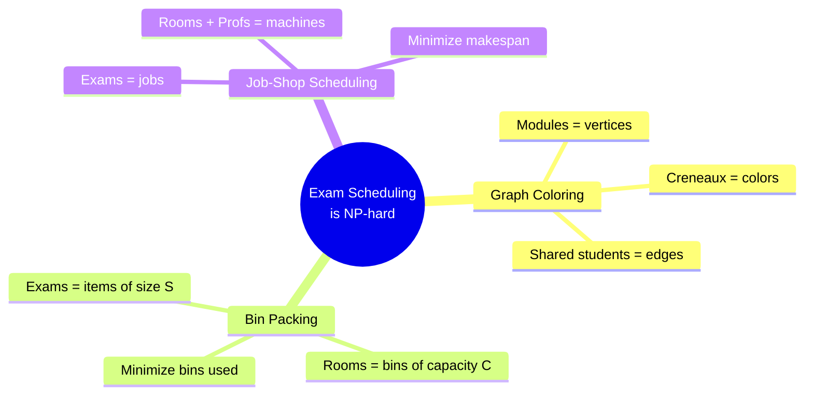

# 1.4. Why Scheduling Is NP-Hard

> [!abstract] What this note teaches you
> The university exam scheduling problem is provably NP-hard. This note explains what that means formally, why it forces the choice of a constraint-programming solver (CP-SAT) over a greedy heuristic, and what "proven optimal" and "proven infeasible" actually mean in practice.

## What "NP-hard" means

A problem is **NP-hard** if every problem in the NP complexity class can be reduced to it in polynomial time. Practically: there is no known polynomial-time algorithm that solves all instances of the problem, and most computer scientists believe no such algorithm exists.

The practical consequence for an engineer: **the runtime of any exact algorithm grows exponentially with input size in the worst case**. For a 1,000-module schedule, a brute-force search would explore on the order of `1000!` possible assignments — a number with 2,567 digits. Even with pruning, you cannot enumerate them.

## The exam scheduling problem generalizes three NP-hard problems

The university exam scheduling problem is not just *like* an NP-hard problem — it *contains* three classic NP-hard problems as special cases:

### 1. Graph coloring

If you ignore rooms and professors and only ask "can I assign each module to a creneau such that no two conflicting modules share a creneau?", you have reduced the problem to **graph k-colorability**:

- Modules = vertices.
- "Two modules share at least one student" = edge.
- Creneaux = colors.
- Question: can the graph be colored with `k = |creneaux|` colors?

Graph k-colorability is one of the canonical NP-complete problems (Karp, 1972). Even feasibility (does a k-coloring exist?) is NP-complete.

### 2. Bin packing

If you ignore conflicts and professors and only ask "can I fit each exam into a room such that no room is over capacity?", you have reduced to **bin packing**:

- Exams = items with size = enrollment count.
- Rooms = bins with capacity = `room.capacite`.
- Question: can all items be packed into the bins?

Bin packing is NP-hard (Garey & Johnson, 1979). The V1 `find_available_room` function used Best-Fit Decreasing — a classical approximation algorithm with a $\frac{11}{9}$ guarantee — but applied it greedily without backtracking, which is the trap discussed in [[4.1. Why Greedy Fails on NP-Hard Problems]].

### 3. Job-shop scheduling

If you model rooms and professors as **machines** and exams as **jobs** that need 1 unit of "room machine" time and 1 unit of "professor machine" time simultaneously, you have reduced to **job-shop scheduling**:

- Exams = jobs.
- Rooms + Professors = machines (each exam needs one of each).
- Question: can all jobs be scheduled on the machines without overlap?

Job-shop scheduling is NP-hard (Garey, Johnson, Sethi, 1976). It is one of the most-studied NP-hard scheduling problems.

## What this means for the algorithm choice

Because exam scheduling contains three NP-hard subproblems, **any** algorithm that tries to solve it exactly must, in the worst case, explore exponentially many assignments. There are three families of approaches:

| Approach | Guarantees | Cost | Used in |
|---|---|---|---|
| **Greedy heuristic** | Feasibility only, no optimality, no proof of infeasibility | O(poly) | V1 |
| **Constraint Programming (CP-SAT)** | Proven optimal *or* proven infeasible *or* best-effort within time budget | Exponential worst case, but practical on real instances | **V2** |
| **Integer Linear Programming (ILP/MIP)** | Same as CP-SAT, but with continuous relaxations | Same; commercial solvers (Gurobi, CPLEX) cost $$$ | Rejected by V2 |

V2 picks CP-SAT because:
1. It is **free** (Google OR-Tools is Apache-2 licensed).
2. It uses **lazy clause generation** — currently the best known approach for sparse constraint graphs, which is exactly what exam scheduling conflict graphs are. See [[4.2. CP-SAT and Lazy Clause Generation]].
3. It has won international timetabling competitions (PATAT, ITC).
4. It supports **both** feasibility and optimization (soft constraints) in one solver.

## What "proven infeasible" means in practice

A greedy algorithm that fails to find a schedule says "X modules unscheduled" — but it cannot tell you whether a feasible schedule exists. The unscheduled modules might be genuinely infeasible, or the greedy heuristic might just have painted itself into a corner.

A CP-SAT solver, when it returns `INFEASIBLE`, has **mathematically proven** that no assignment exists that satisfies the hard constraints. This is enormously valuable:

- If the solver says INFEASIBLE on a real dataset, you know the constraints themselves are too tight (e.g. not enough creneaux for the conflict graph density) and you must relax something — see the 5-level fallback strategy in [[4.8. The Fallback Strategy]].
- If the solver says OPTIMAL, you have a guarantee that no better schedule exists under the current objective weights.
- If the solver returns FEASIBLE within the time budget, you have a valid schedule but no optimality guarantee — the search was cut short by `max_time_in_seconds`.

## Why V1's greedy cannot scale

The V1 greedy loop has worst-case complexity **$O(M \cdot C \cdot (R + P + S))$** where:
- $M$ = number of modules (~1,200 at baseline, ~5,000 at max scale)
- $C$ = number of creneaux (~64)
- $R$ = number of rooms (~50)
- $P$ = number of professors (~200)
- $S$ = students per module (avg ~100, max ~800)

At baseline: $1200 \cdot 64 \cdot (50 + 200 + 100) \approx 27$ million operations per scheduling run.

At max scale: $5000 \cdot 64 \cdot (200 + 1000 + 400) \approx 512$ million operations.

This is *per scheduling run*. But the deeper problem isn't the operation count — it's that the greedy loop has **no backtracking**. If module A is placed in creneau 1 and that prevents module B from being placed at all, the greedy loop reports "B unscheduled" and moves on. A CP-SAT solver would backtrack, try A in creneau 2, and find a feasible assignment for both.

See [[4.1. Why Greedy Fails on NP-Hard Problems]] for the worked "Greedy Trap" example.

## The complexity-theoretic takeaway

You do not need a PhD in complexity theory to internalize the practical lesson:

> [!important] The single most important algorithmic fact in this vault
> The university exam scheduling problem is NP-hard. Any algorithm that solves it exactly must, in the worst case, take exponential time. Greedy heuristics do not solve NP-hard problems — they merely produce *some* answer, with no guarantee of feasibility, optimality, or infeasibility proof. The V2 redesign uses CP-SAT because it is the only approach that can simultaneously produce feasible schedules, prove infeasibility, and optimize for soft constraints — all within a 30–120 second time budget.

## Common junior developer mistakes

- **"Let's just use a greedy algorithm and see if it works."** It will appear to work on the demo dataset (13k students, sparse conflicts) and fail catastrophically at production scale (100k students, dense conflicts). Always test on 5–10× the production target.
- **"Genetic algorithms are great for scheduling."** GAs have no convergence guarantee, are hard to tune, and don't prove optimality. They are worse than CP-SAT on this problem class. See [[4.9. Alternative Algorithms ILP GA SA Tabu]].
- **"If the solver times out, we can just retry with a longer timeout."** If CP-SAT times out, the right answer is to relax a constraint (see [[4.8. The Fallback Strategy]]), not to throw more time at the same model. The model is the bottleneck, not the time budget.
- **"Let's add one more hard constraint to be safe."** Every hard constraint shrinks the feasible region exponentially. The right way to express preferences is as soft constraints (weighted objective terms), not hard constraints.

## What to read next

- [[1.5. Scale Targets and Performance Budget]] — how the 45-second and 5-minute targets shape the architecture.
- [[2.4. The Greedy First-Fit Scheduling Algorithm]] — the V1 algorithm in detail.
- [[4.1. Why Greedy Fails on NP-Hard Problems]] — the Greedy Trap worked example.
- [[4.2. CP-SAT and Lazy Clause Generation]] — how CP-SAT solves what greedy cannot.
