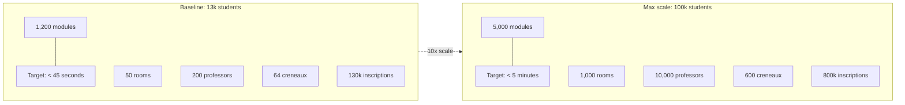

# 1.5. Scale Targets and Performance Budget

> [!abstract] What this note teaches you
> Every architectural decision in V2 is a response to a specific performance budget. This note explains the two explicit time targets (45 seconds baseline, 5 minutes max scale), the dataset sizes they imply, and how the budget gets distributed across the scheduling pipeline.

## The two explicit targets

The original academic brief (`Projet-Num_Exam.pdf`) sets one explicit time target: **schedule generation in less than 45 seconds** for the baseline faculty (13,000 students, 130,000 inscriptions).

V2 raises the bar with a second target for the multi-tenant SaaS scale: **under 5 minutes** for the maximum scale (100,000 students, 800,000 inscriptions).



## Where the time goes

A scheduling run is not a single operation — it is a pipeline. V2 distributes the budget like this (for the baseline 13k case):

| Phase | Budget | What happens |
|---|---|---|
| 1. API request + auth + validation | < 100 ms | Laravel Form Request validates, Policy authorizes, middleware sets tenant context |
| 2. Acquire Redis lock + advisory lock | < 50 ms | `SET NX EX` + `pg_advisory_lock(session_id)` |
| 3. Refresh `mv_module_conflicts` | 1–5 s | `REFRESH MATERIALIZED VIEW CONCURRENTLY` |
| 4. Load solver input data | 200–500 ms | Eager-load exams, rooms, timeslots, student_cohorts |
| 5. **CP-SAT solve** | **5–30 s** | The dominant phase — `solver.parameters.max_time_in_seconds = 30` |
| 6. Persist solution in `DB::transaction` | 200–500 ms | Soft-delete previous exams, insert new ones |
| 7. Update `ScheduleRun` row + release locks | < 50 ms | Status update + `pg_advisory_unlock` + `Redis::del` |
| **Total** | **< 45 s** | Leaves 10–35 s of headroom for variance |

At max scale (100k students), phases 3 and 5 grow the most:
- Phase 3: refreshing `mv_module_conflicts` on 800k inscriptions takes ~30 s.
- Phase 5: CP-SAT solve on 5,000 modules and 600 creneaux takes 60–180 s.
- Phases 4 and 6 grow modestly because they are O(N) and benefit from partition pruning.

Total max-scale budget: ~5 minutes, with headroom.

## What the budget forces

Each phase's budget forces a specific architectural decision:

### Phase 2 (lock acquisition) forces the 3-layer lock stack

You cannot use a single lock because:
- Redis lock is cross-instance but not transactional with Postgres.
- `pg_advisory_lock` is transactional but not cross-instance.
- `lockForUpdate` is per-row, not per-session.

So V2 uses all three. See [[7.3. Distributed Locks Redis vs Advisory]].

### Phase 3 (MV refresh) forces materialized views

The naive alternative — compute the conflict matrix on every scheduling run with a `WITH temp_module_conflicts AS (...)` CTE — takes 30+ seconds at 100k students. The materialized view precomputes it and refreshes incrementally. See [[10.4. The Materialized View Refresh Strategy]].

### Phase 5 (CP-SAT solve) forces async queueing

A 30-second solver call cannot happen inside an HTTP request — the web gateway timeout (30 s typical, 60 s on ALB) would kill it. So V2 dispatches a queued job and the HTTP request returns immediately with a `ScheduleRun` ID. The frontend polls `/schedule-runs/{id}` for status. See [[7.2. The GenerateScheduleJob Lifecycle]].

> [!warning] The 30-second gateway timeout
> V1 called the scheduler synchronously from Streamlit, which called Supabase RPC. Supabase's free tier has a 60-second RPC timeout. The Pro tier has 5 minutes. At 100k students, even Pro would fail. V2's async pattern sidesteps the gateway timeout entirely.

### Phase 6 (persist) forces transactional soft-delete

V1 did `DELETE FROM examens WHERE creneau_id IN (...)` before each regenerate — destructive, no rollback. V2 wraps the swap in `DB::transaction`, soft-deletes the old exams (`deleted_at = NOW(), statut = 'annule'`), and inserts the new ones. If anything fails, the transaction rolls back and the old schedule is untouched. See [[7.4. Transaction Safety and Concurrency]].

## Dataset size implications

The 13k → 100k scaling path touches every layer:

| Layer | 13k baseline | 100k max scale | Growth |
|---|---|---|---|
| Students | 13,000 | 100,000 | 7.7× |
| Modules | 1,200 | 5,000 | 4.2× |
| Inscriptions | 130,000 | 800,000 | 6.2× |
| Rooms | 50 | 1,000 | 20× |
| Professors | 200 | 10,000 | 50× |
| Conflict pairs (module-module) | ~50,000 | ~500,000 | 10× |
| Schedule rows per session | ~1,200 | ~5,000 | 4.2× |
| Audit log rows per year | ~50,000 | ~500,000 | 10× |

V2 handles each growth axis with a specific mechanism:

- **Inscriptions** → `PARTITION BY LIST (annee_universitaire)` — see [[3.5. Table Partitioning LIST and RANGE]].
- **Audit log** → `PARTITION BY RANGE (created_at)` (yearly) + BRIN index — see [[3.5. Table Partitioning LIST and RANGE]].
- **Conflict pairs** → precomputed in `mv_module_conflicts` materialized view — see [[3.6. Materialized Views and Refresh Strategies]].
- **Concurrent users** → PgBouncer transaction pooling + horizontal Laravel web tier — see [[10.3. Connection Pooling with PgBouncer]].

## The conflict-matrix explosion

The single biggest scaling risk is the conflict matrix. V1 computed it as a temp table:

```sql
SELECT i1.module_id AS m1, i2.module_id AS m2
FROM inscriptions i1
JOIN inscriptions i2 ON i1.etudiant_id = i2.etudiant_id
WHERE i1.module_id < i2.module_id
```

At 13k students with ~8 modules each, this self-join produces ~13,000 × 28 = 364,000 conflict pairs. Postgres handles this in ~5 seconds.

At 100k students with ~8 modules each, it produces ~100,000 × 28 = 2.8 million conflict pairs, and the **intermediate result before grouping is hundreds of millions of rows**. Postgres will spill to disk, and the operation takes minutes — violating the 5-minute total budget just for setup.

V2 fixes this with the `mv_module_conflicts` materialized view, refreshed incrementally before each run. See [[10.1. The 130k to 800k Inscriptions Scaling Path]] for the full analysis.

## Common junior developer mistakes

- **Testing only at the demo scale.** A 13k-student seed dataset is great for development but tells you nothing about production behavior. Always test at 5–10× the production target.
- **Setting solver timeout = business target.** The 30-second solver budget is *inside* the 45-second business target. You need 15 seconds of headroom for MV refresh, persistence, and lock overhead.
- **Forgetting the gateway timeout.** Any HTTP request that takes > 30 s will be killed by the load balancer. Long-running operations must be async.
- **Trusting "it works on my laptop".** The V1 author claimed 45 s scheduling in the README but the benchmarks file was empty. V2 has executable Pest benchmarks — see [[10.7. Load Testing with Locust and k6]].

## What to read next

- [[2.4. The Greedy First-Fit Scheduling Algorithm]] — why V1 missed the 45-second target.
- [[4.7. Solver Parameters and Time Budgets]] — how V2 sets CP-SAT parameters to hit the budget.
- [[7.2. The GenerateScheduleJob Lifecycle]] — the full async pipeline.
- [[10.1. The 130k to 800k Inscriptions Scaling Path]] — the detailed scaling analysis.
