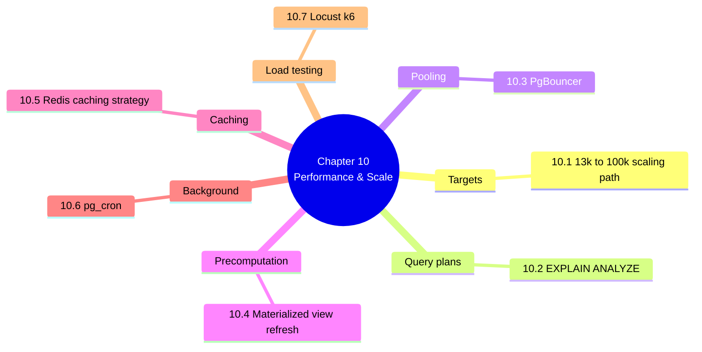

# 10. MOC — Performance Engineering and Scale

> [!abstract] Chapter goal
> V1's benchmarks file was empty. V2 has concrete performance targets (13k students < 45 s, 100k students < 5 min) and the engineering to hit them. This chapter teaches you the query plans, indexes, partitioning, materialized views, connection pooling, and load tests that make those numbers real.

## Notes in this chapter

| Note | Title | What you learn |
|---|---|---|
| 10.1 | [[10.1. The 130k to 800k Inscriptions Scaling Path]] | Where V1 breaks at 100k students (conflict matrix explodes, RPC timeout, O(N²) self-join). How V2 stays under 5 min (CP-SAT, partitioning, materialized views, async job). |
| 10.2 | [[10.2. Query Plan Analysis with EXPLAIN ANALYZE]] | Reading `EXPLAIN ANALYZE` output. Why V1's `detect_student_time_conflicts` O(N²) self-join won't finish at 100k. The `GROUP BY ... HAVING COUNT(*) > 1` O(N log N) fix. |
| 10.3 | [[10.3. Connection Pooling with PgBouncer]] | Transaction pooling mode, why Postgres process-per-connection doesn't scale to thousands of Streamlit users, read replicas. |
| 10.4 | [[10.4. The Materialized View Refresh Strategy]] | `mv_module_enrollments` nightly, `mv_module_conflicts` before each run, `REFRESH MATERIALIZED VIEW CONCURRENTLY` requires unique index, `pg_cron` schedule. |
| 10.5 | [[10.5. Caching Strategy with Redis]] | `Cache::remember("session.{id}.kpis", 60, ...)` with event-driven invalidation on `ScheduleGenerated`. Don't cache the schedule itself. |
| 10.6 | [[10.6. The pg-cron Scheduler for Background DB Jobs]] | `SELECT cron.schedule('refresh_enrollments', '0 2 * * *', 'REFRESH MATERIALIZED VIEW CONCURRENTLY mv_module_enrollments');`. Auto-creating next year's partitions. |
| 10.7 | [[10.7. Load Testing with Locust and k6]] | Locust: 100 concurrent admins browsing dashboard. k6: 1000 students checking schedule simultaneously. Run monthly in staging. |

## Why this chapter matters

Performance is not a feature you add at the end — it's a property you engineer from the schema up. V1 treated performance as a TODO. V2 treats it as a constraint with a budget, a measurement plan, and a regression test.

## Where to go next

After mastering performance, proceed to [[11. MOC|Migration Path and Final Synthesis]] to see how to actually get from V1 to V2 without losing data or users.
