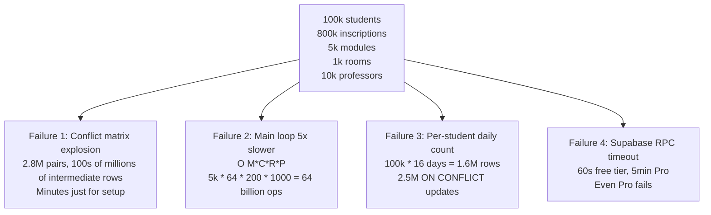

# 10.1. The 130k to 800k Inscriptions Scaling Path

> [!abstract] What this note teaches you
> V1 broke at 100k students in 4 specific ways: conflict matrix explosion, main loop 5× slowdown, per-student daily count table bloat, and Supabase RPC timeout. V2 fixes each with partitioning, materialized views, CP-SAT, and async jobs. This note is the scaling analysis.

## The 4 V1 failure modes at 100k students



## Failure 1: Conflict matrix explosion

V1's `temp_module_conflicts`:

```sql
SELECT i1.module_id AS m1, i2.module_id AS m2
FROM inscriptions i1
JOIN inscriptions i2 ON i1.etudiant_id = i2.etudiant_id
WHERE i1.module_id < i2.module_id
```

At 13k students with ~8 modules each: ~13,000 × 28 = 364,000 conflict pairs. Postgres handles this in ~5s.

At 100k students with ~8 modules each: ~100,000 × 28 = **2.8 million conflict pairs**. The intermediate result (before GROUP BY) is **hundreds of millions of rows**. Postgres spills to disk. Estimated time: **minutes**, not seconds.

**V2 fix:** `mv_module_conflicts` materialized view, refreshed before each run. See [[3.6. Materialized Views and Refresh Strategies]].

## Failure 2: Main loop 5× slowdown

V1's main loop: `O(M × C × (d + R + P))`.

At 13k: 1200 × 64 × (20 + 50 + 200) ≈ 21M ops.
At 100k: 5000 × 64 × (50 + 200 + 1000) ≈ 400M ops. **~20× slower**.

If 13k took 45s, 100k takes ~15 minutes — 3× over the 5-minute budget.

**V2 fix:** CP-SAT solver with lazy clause generation. Typical solve time at 100k: 60–120s. See [[4.7. Solver Parameters and Time Budgets]].

## Failure 3: Per-student daily count table bloat

V1's `temp_student_daily_counts`:

```
100k students × 16 days = 1.6M rows
```

The `ON CONFLICT DO UPDATE` per module: O(students_in_module) updates per module. With cohorts of 500+, that's 500 updates × 5000 modules = **2.5M row updates**. Slow.

**V2 fix:** CP-SAT constraint 3 — `sum_{c on day d} x[m, c] <= max_per_day` per (student, day). No SQL table; the constraint is in the solver's memory.

## Failure 4: Supabase RPC timeout

Supabase free tier: 60s RPC timeout. Pro: 5 minutes. Even Pro fails at 100k.

**V2 fix:** Self-hosted Postgres + async Horizon job. No RPC timeout — the job runs as long as needed (up to `timeout = 600s`). See [[7.1. Laravel Horizon and Redis Queues]].

## The V2 scaling profile

| Metric | 13k baseline | 100k max scale | How V2 handles |
|---|---|---|---|
| Inscriptions | 130k | 800k | LIST partition by year — see [[3.5. Table Partitioning LIST and RANGE]] |
| Conflict pairs | 364k | 2.8M | Materialized view — see [[3.6. Materialized Views and Refresh Strategies]] |
| Scheduling run | 45s | 5min | CP-SAT + async job — see [[7.2. The GenerateScheduleJob Lifecycle]] |
| Concurrent users | 10 | 1000 | PgBouncer + horizontal Laravel — see [[10.3. Connection Pooling with PgBouncer]] |
| Audit log rows/year | 50k | 500k | RANGE partition by year + BRIN index |
| Dashboard load | 500ms (5 RPCs) | 50ms (1 batched RPC) | `get_dashboard_data` stored function |

## The scaling checklist

Before deploying to a new scale tier:

1. **Seed production-sized data.** Use the production seeder at 5× target.
2. **Run `EXPLAIN ANALYZE` on hot queries.** See [[10.2. Query Plan Analysis with EXPLAIN ANALYZE]].
3. **Run the benchmark suite.** `ScheduleGenerationBench` Pest tests — see [[10.7. Load Testing with Locust and k6]].
4. **Load test with Locust/k6.** Simulate 1000 concurrent students.
5. **Check partition pruning.** Verify queries scan only the current year's partition.
6. **Check materialized view refresh time.** Must fit in the scheduling budget.
7. **Check PgBouncer pool stats.** No connection exhaustion.
8. **Check Prometheus metrics.** p95 latency, error rate, queue depth all in green.

## Common junior developer mistakes

- **Testing only at demo scale.** 13k students works fine in dev. 100k breaks everything. Always test at 5–10× target.
- **No partitioning.** A single `inscriptions` table at 800k rows is slow to VACUUM, slow to scan, slow to backup.
- **No materialized views.** Recomputing the conflict matrix on every run is wasteful.
- **Synchronous scheduling.** A 60-second solve blocks the HTTP request. Async.
- **No connection pooling.** 1000 Laravel workers × 1 connection each = 1000 Postgres backends. Postgres dies.

## What to read next

- [[10.2. Query Plan Analysis with EXPLAIN ANALYZE]] — reading query plans.
- [[10.3. Connection Pooling with PgBouncer]] — handling concurrent users.
- [[10.4. The Materialized View Refresh Strategy]] — the conflict matrix fix.
- [[1.5. Scale Targets and Performance Budget]] — the business targets.
