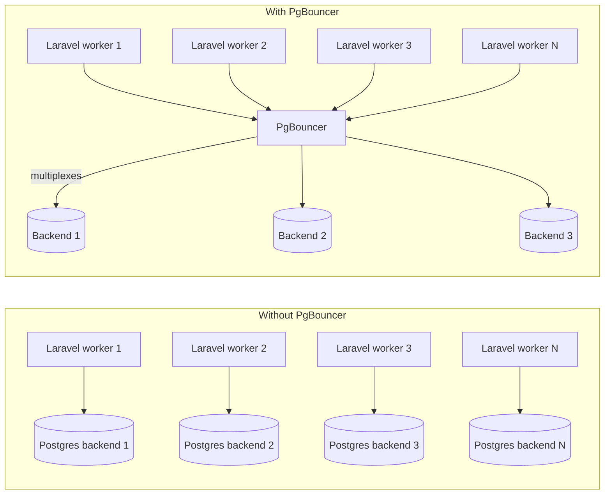

# 10.3. Connection Pooling with PgBouncer

> [!abstract] What this note teaches you
> PostgreSQL allocates a separate OS process per connection. 1000 Laravel workers = 1000 Postgres backends = OOM. V2 puts PgBouncer in transaction pooling mode between Laravel and Postgres, multiplexing thousands of connections onto ~50 backends. This note explains PgBouncer and the pooling mode trade-offs.

## Why Postgres needs a pooler



Postgres uses a **process-per-connection** model. Each connection spawns a backend process (~5MB RAM). 1000 connections = 5GB just for backends. Plus context-switching overhead.

PgBouncer sits between Laravel and Postgres. It maintains a small pool of real Postgres connections (~50) and multiplexes thousands of client connections onto them.

## The 3 pooling modes

| Mode | When a backend is held | Session variables | V2 use |
|---|---|---|---|
| **Session pooling** | For the entire client session | Preserved | Laravel web tier |
| **Transaction pooling** | For one transaction | Reset between transactions | Queue workers, batch jobs |
| **Statement pooling** | For one statement | Reset between statements | Not used (incompatible with prepared statements) |

### Session pooling

```
Client connects → assigned backend #7 → uses #7 for all queries → disconnects → #7 returned to pool
```

Session variables (`SET app.current_university_id = 42`) persist. Good for V2's `SetTenantContext` middleware.

**Downside:** backend is held even when the client is idle. With 1000 idle workers, you need 1000 backends.

### Transaction pooling

```
Client sends BEGIN → assigned backend #7 → ... queries ... → COMMIT → #7 returned to pool
```

Backend is held only during a transaction. Between transactions, the backend is reused by other clients. 1000 clients can share 50 backends.

**Downside:** session variables are reset between transactions. `SET app.current_university_id = 42` set in one transaction is gone in the next. Use `SET LOCAL` inside each transaction instead.

## V2's hybrid approach

V2 uses **session pooling for the web tier** and **transaction pooling for queue workers**:

```ini
# pgbouncer.ini
[databases]
univexam = host=postgres-primary dbname=univexam
univexam_readonly = host=postgres-replica dbname=univexam

[pgbouncer]
listen_addr = 0.0.0.0
listen_port = 6432

pool_mode = session  ; default for web tier
default_pool_size = 50
max_client_conn = 5000
reserve_pool_size = 10
reserve_pool_timeout = 3

; Per-database overrides
[db:univexam_queue]
pool_mode = transaction  ; for queue workers
pool_size = 20
```

Laravel config:

```php
// config/database.php
'connections' => [
    'pgsql' => [  // web tier
        'driver' => 'pgsql',
        'host' => env('DB_HOST', 'pgbouncer'),
        'port' => env('DB_PORT', '6432'),
        'database' => env('DB_DATABASE', 'univexam'),
        'username' => env('DB_USERNAME'),
        'password' => env('DB_PASSWORD'),
        'pool_mode' => 'session',
    ],
    'pgsql_queue' => [  // queue workers
        'driver' => 'pgsql',
        'host' => env('DB_HOST', 'pgbouncer'),
        'port' => env('DB_PORT', '6432'),
        'database' => 'univexam_queue',
        'username' => env('DB_USERNAME'),
        'password' => env('DB_PASSWORD'),
        'pool_mode' => 'transaction',
    ],
],
```

Queue workers connect to `pgsql_queue` and use `SET LOCAL`:

```php
// In a queued job
DB::connection('pgsql_queue')->transaction(function () use ($tenantId) {
    DB::statement("SET LOCAL app.current_university_id = ?", [$tenantId]);
    DB::statement("SET LOCAL app.current_user_id = ?", [$this->userId]);
    // ... job logic ...
});
```

`SET LOCAL` scopes the variables to the current transaction. At COMMIT, they reset. Safe with transaction pooling.

## Read replicas

V2 routes read-only queries to replicas:

```php
// config/database.php
'connections' => [
    'pgsql_read' => [
        'driver' => 'pgsql',
        'host' => env('DB_READ_HOST', 'pgbouncer-read'),
        // ... points to read replica
    ],
],

// In code:
$kpis = DB::connection('pgsql_read')->select('SELECT get_dashboard_data(?)', [$sessionId]);
```

The dashboard (90% reads) goes to replicas; writes go to primary. This halves the primary's load.

> [!warning] Replication lag
> Read replicas lag the primary by a few milliseconds to seconds. Don't read from a replica immediately after a write — you'll get stale data. For "read after write" patterns, read from the primary.

## Common PgBouncer pitfalls

### 1. Prepared statements

PgBouncer in transaction/statement mode **does not support prepared statements** across transactions. Laravel's `pgsql` driver uses prepared statements by default. Disable:

```php
'connections' => [
    'pgsql' => [
        // ...
        'options' => [
            PDO::ATTR_EMULATE_PREPARES => true,  // emulate in PHP, not Postgres
        ],
    ],
],
```

Or use `PDO::PGSQL_ATTR_DISABLE_PREPARES = true`.

### 2. `SET` without `LOCAL`

```php
// Bad — doesn't persist across transactions in transaction pooling mode
DB::statement("SET app.current_university_id = ?", [$tenantId]);

// Good — persists for the current transaction
DB::statement("SET LOCAL app.current_university_id = ?", [$tenantId]);
```

### 3. Session-level features

`LISTEN`/`NOTIFY`, advisory locks, temp tables — all session-level features that don't work with transaction pooling. Use session pooling for connections that need them.

### 4. Connection limits

PgBouncer's `max_client_conn` (default 100) is the limit on client connections. `default_pool_size` (default 20) is the limit on real Postgres backends. Tune both based on your load.

## Common junior developer mistakes

- **No pooler.** 1000 Laravel workers × 1 Postgres backend each = OOM. Always use PgBouncer in production.
- **Transaction pooling for everything.** Session-level features (LISTEN/NOTIFY, advisory locks) break. Use session pooling for the web tier.
- **Forgetting `SET LOCAL`.** `SET` without `LOCAL` doesn't persist across transactions in transaction pooling mode.
- **Not disabling prepared statements.** PgBouncer transaction mode + prepared statements = "prepared statement does not exist" errors.
- **Reading from replica after write.** Replication lag gives stale data. Read-after-write from primary.
- **Not monitoring pool stats.** PgBouncer has a stats admin interface — `SHOW POOLS;`, `SHOW CLIENTS;`. Monitor for pool exhaustion.

## What to read next

- [[3.7. Row-Level Security for Multi-Tenancy]] — how RLS interacts with pooling.
- [[6.2. Tenant Context Middleware]] — `SET LOCAL` in the middleware.
- [[10.1. The 130k to 800k Inscriptions Scaling Path]] — why pooling matters at scale.
