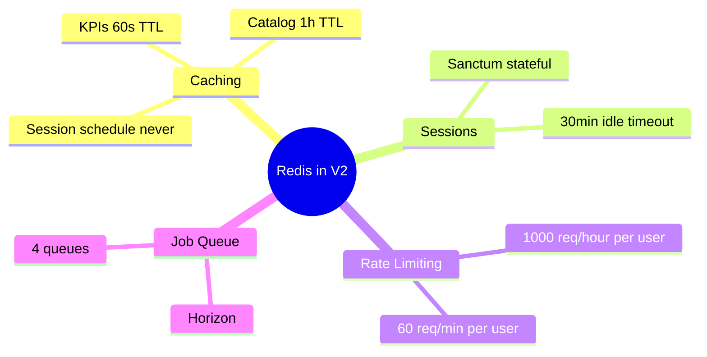

# 10.5. Caching Strategy with Redis

> [!abstract] What this note teaches you
> V2 uses Redis for 4 purposes: caching, session storage, rate limiting, and job queues. This note is the caching layer — what to cache, what not to cache, TTLs, and event-driven invalidation.

## The 4 Redis uses



This note covers caching. Sessions are covered in [[6.3. OAuth2 with Sanctum Fortify Socialite]], rate limiting in [[6.3. OAuth2 with Sanctum Fortify Socialite]], and queues in [[7.1. Laravel Horizon and Redis Queues]].

## What to cache

### Cache: KPIs (60s TTL)

```php
$kpis = Cache::remember("session.{$sessionId}.kpis", 60, function () use ($sessionId) {
    return DB::selectOne('SELECT get_dashboard_data(?)', [$sessionId]);
});
```

KPIs are computed by a stored function and don't change every second. 60s TTL is a good balance between freshness and load.

### Cache: catalog data (1h TTL)

```php
$departments = Cache::remember("university.{$universityId}.departments", 3600, function () use ($universityId) {
    return Departement::where('university_id', $universityId)
        ->whereNull('deleted_at')
        ->get();
});
```

Departments, formations, modules change rarely (maybe once per semester). 1-hour TTL is fine.

### Cache: user permissions (1h TTL)

```php
$permissions = Cache::remember("user.{$userId}.permissions", 3600, function () use ($userId) {
    return User::find($userId)->getAllPermissions()->pluck('name');
});
```

Permissions change rarely. Cache them per user.

## What NOT to cache

### Don't cache: the schedule itself

The schedule can change at any moment (admin generates a new one). If you cache it, you'll show stale data. Always query the DB.

### Don't cache: per-user data with shared keys

```php
// BAD — all users share the same cache key
$mySchedule = Cache::remember("schedule", 60, function () {
    return Examen::where('surveillant_principal_id', Auth::user()->professeur_id)->get();
});
```

User A's schedule gets cached under "schedule", then user B sees user A's schedule. Always include the user ID in the cache key:

```php
// GOOD
$mySchedule = Cache::remember("user.{$userId}.schedule", 60, function () use ($userId) {
    return Examen::where('surveillant_principal_id', $userId)->get();
});
```

### Don't cache: write paths

Caching is for reads. Don't try to "cache" a write operation; you'll lose data.

## Event-driven cache invalidation

When `ScheduleGenerated` fires, the KPI cache for that session must be invalidated:

```php
// app/Modules/Scheduling/Listeners/InvalidateKpiCache.php
class InvalidateKpiCache implements ShouldQueue
{
    public function handle(ScheduleGenerated $event): void
    {
        Cache::forget("session.{$event->run->session_id}.kpis");
        Cache::forget("session.{$event->run->session_id}.dashboard");
        
        // Invalidate per-user schedules for affected professors
        $professorIds = Examen::where('session_id', $event->run->session_id)
            ->whereNotNull('surveillant_principal_id')
            ->pluck('surveillant_principal_id')
            ->unique();
        
        foreach ($professorIds as $pid) {
            Cache::forget("user.{$pid}.schedule");
        }
    }
}
```

Registered in `EventServiceProvider`:

```php
ScheduleGenerated::class => [
    InvalidateKpiCache::class,
    // ... other listeners
],
```

## The cache-aside pattern

V2 uses the **cache-aside** pattern:

```php
function getKpis($sessionId) {
    $key = "session.{$sessionId}.kpis";
    
    // 1. Try cache
    $data = Cache::get($key);
    if ($data !== null) {
        return $data;
    }
    
    // 2. Cache miss — fetch from DB
    $data = DB::selectOne('SELECT get_dashboard_data(?)', [$sessionId]);
    
    // 3. Store in cache
    Cache::put($key, $data, 60);
    
    return $data;
}
```

Laravel's `Cache::remember` does this in one call:

```php
$data = Cache::remember($key, 60, function () use ($sessionId) {
    return DB::selectOne('SELECT get_dashboard_data(?)', [$sessionId]);
});
```

## Redis configuration

V2's Redis is a 3-node cluster (for HA) with AOF persistence:

```ini
# redis.conf
appendonly yes
appendfsync everysec
maxmemory 4gb
maxmemory-policy allkeys-lru
timeout 300
tcp-keepalive 60
```

- **AOF** (Append-Only File) — every write is logged to disk. Survives restarts.
- **`maxmemory-policy allkeys-lru`** — when Redis is full, evict least-recently-used keys.
- **`timeout 300`** — idle connections close after 5 minutes.

## Common junior developer mistakes

- **Caching without TTL.** `Cache::put($key, $data)` (no TTL) stores forever. Stale data accumulates. Always set a TTL.
- **Caching user-specific data with a shared key.** Cross-user data leakage. Include user ID in the key.
- **No cache invalidation on writes.** "The cache will expire eventually" — yes, but in the meantime users see stale data. Invalidate on events.
- **Caching the schedule.** Schedules change too often. Always query the DB.
- **Using `Cache::forever`.** Keys never expire. Use a long TTL (86400 = 1 day) instead, so they eventually refresh.
- **Not handling cache failures.** If Redis is down, `Cache::remember` throws. Wrap in try/catch and fall back to direct DB query.

## What to read next

- [[7.1. Laravel Horizon and Redis Queues]] — Redis as a queue backend.
- [[5.7. Laravel Events Listeners and Notifications]] — events that trigger invalidation.
- [[9.2. Laravel pulse Horizon Telescope Sentry]] — monitoring Redis health.
