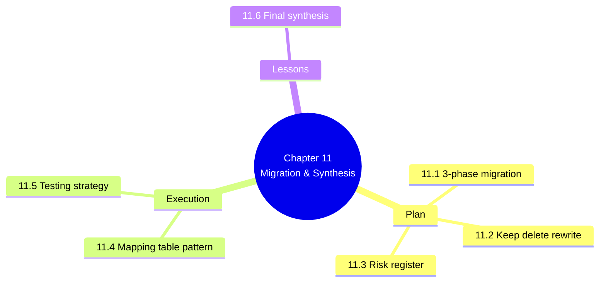

# 11. MOC — Migration Path and Final Synthesis

> [!abstract] Chapter goal
> Knowing what V2 should look like is one thing. Getting there from V1 without losing data, breaking users, or introducing regressions is another. This chapter teaches you the 3-phase migration plan, the testing strategy that proves it works, and the lessons you should take with you to your next project.

## Notes in this chapter

| Note | Title | What you learn |
|---|---|---|
| 11.1 | [[11.1. The V1 to V2 Migration Plan]] | Phase 1: DB migration. Phase 2: Solver integration. Phase 3: API & UI launch. Sequenced, risk-rated, with success criteria. |
| 11.2 | [[11.2. What to Keep Delete and Rewrite from V1]] | Keep: partial indexes, RPC pattern, batched inserts, status enums. Delete: dual codebases, fake buttons, empty test files. Rewrite: schema, scheduler, frontend, auth. |
| 11.3 | [[11.3. Risk Register and Mitigations]] | Data loss, scheduling regression, auth bypass, performance regression, tenant data leak. Each with severity, probability, mitigation. |
| 11.4 | [[11.4. The Migration Mapping Table Pattern]] | `temp_migration_mapping (legacy_id INT, new_uuid UUID, entity_type VARCHAR)` with index on `(legacy_id, entity_type)`. Legacy `departements` → tenants, `lieu_examen` → rooms with 20-seat TD cap rule. |
| 11.5 | [[11.5. Testing Strategy Unit Integration E2E Property-Based]] | Test pyramid: 75% unit (Pest, pytest), 20% integration (HTTP + DB), 5% E2E (Playwright). pgTAP for DB constraints. Hypothesis for solver property tests. Locust/k6 for load. Coverage targets per layer. |
| 11.6 | [[11.6. Final Synthesis and Lessons Learned]] | The 20 biggest V1 mistakes, reconciled. The conflict-resolution log between source documents. The mindset shift from "looking done" to "being done". |

## Why this chapter is last

Migration is where theory meets reality. Every chapter before this one tells you what V2 should be. This chapter tells you how to get there from V1 — which forces you to confront every trade-off in the redesign.

## Where to go next

After finishing this chapter, you have completed the vault. Re-read [[README|the root MOC]] and pick a chapter to deepen. The recommended next read is [[4. MOC|The Algorithmic Core CP-SAT Solver]] because the CP-SAT formulation is the single highest-leverage piece of the whole V2 design.
