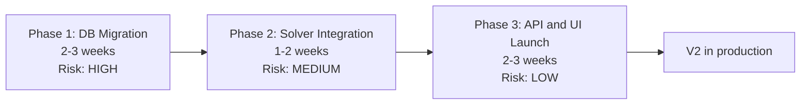

# 11.1. The V1 to V2 Migration Plan

> [!abstract] What this note teaches you
> Getting from V1 to V2 without losing data or breaking users requires a phased approach. V2 migrates in 3 phases: database, solver, then API/UI. This note is the sequenced plan with risk ratings and success criteria.

## The 3-phase migration



## Phase 1: Database Migration (HIGH risk)

**Goal:** deploy the V2 schema alongside V1, migrate all data, verify integrity.

**Duration:** 2–3 weeks.

**Steps:**

1. **Provision V2 infrastructure.** Postgres 17, Redis 7, PgBouncer, Laravel app, Python solver microservice. All in staging first.

2. **Run V2 migrations on an empty database.** Verify schema, RLS policies, indexes, materialized views all create cleanly.

3. **Create the migration mapping table** (see [[11.4. The Migration Mapping Table Pattern]]):
   ```sql
   CREATE TABLE temp_migration_mapping (
       legacy_id INT NOT NULL,
       new_uuid UUID PRIMARY KEY DEFAULT gen_random_uuid(),
       entity_type VARCHAR(100) NOT NULL
   );
   ```

4. **Migrate reference data** (departments → tenants, formations → programs, modules, rooms, professors, students). See [[11.4. The Migration Mapping Table Pattern]] for the full SQL.

5. **Migrate transactional data** (inscriptions, examens, schedule_logs). This is the bulk of the data — 130k+ inscriptions at baseline.

6. **Verify data integrity.** Row counts, FK integrity, unique constraints. Run `VACUUM ANALYZE` on all tables.

7. **Set up RLS policies.** Verify tenant isolation by querying as different tenants.

8. **Set up pg_cron jobs.** MV refresh, partition creation, retention purges.

**Success criteria:**
- All V1 data is present in V2 (row counts match ±0).
- RLS policies reject cross-tenant queries.
- Materialized views refresh successfully.
- pg_cron jobs run on schedule.

**Risk:** data loss, schema corruption, RLS misconfiguration. Mitigation: do it in staging first, with a full backup.

## Phase 2: Solver Integration (MEDIUM risk)

**Goal:** replace the V1 greedy PL/pgSQL scheduler with the V2 CP-SAT Python solver.

**Duration:** 1–2 weeks.

**Steps:**

1. **Deploy the Python solver microservice.** FastAPI + OR-Tools, behind HMAC-signed HTTP.

2. **Run the solver on V2 data in staging.** Compare results to V1's greedy on the same input:
   - Scheduling rate (V2 should be ≥ V1).
   - Conflict count (V2 should be ≤ V1).
   - Fairness variance (V2 should be ≪ V1).
   - Duration (V2 should be ≤ V1 at 13k; may be longer at 100k but within budget).

3. **Run property-based tests** (see [[11.5. Testing Strategy Unit Integration E2E Property-Based]]) — verify the solver never schedules conflicting modules together, never exceeds room capacity, etc.

4. **Wire the solver to `GenerateScheduleJob`.** The job acquires locks, refreshes `mv_module_conflicts`, calls the solver, persists the result.

5. **Run end-to-end scheduling tests** in staging:
   - Trigger generation.
   - Verify schedule persists.
   - Verify audit log records the run.
   - Verify notifications fire.

**Success criteria:**
- Solver returns `OPTIMAL` or `FEASIBLE` on baseline 13k dataset within 30s.
- Solver returns `FEASIBLE` on 100k dataset within 120s.
- All 16 hard constraints satisfied on every test instance.
- Fallback strategy triggers on deliberately-infeasible inputs.

**Risk:** solver bugs, performance regression, integration failures. Mitigation: extensive property-based testing, comparison to V1 on same inputs.

## Phase 3: API and UI Launch (LOW risk)

**Goal:** deploy the Laravel API and the two frontends (Streamlit admin, Blade+Livewire portal).

**Duration:** 2–3 weeks.

**Steps:**

1. **Deploy Laravel API behind a load balancer.** All endpoints behind `auth:sanctum` + `tenant` middleware.

2. **Migrate admin users.** Create accounts with their V1 roles mapped to V2 RBAC.

3. **Deploy the Streamlit admin portal.** OAuth2 auth, role-filtered navigation.

4. **Deploy the Blade+Livewire student/professor portal.** Self-service schedule view, ICS export, availability declaration.

5. **Run the V2 frontend in parallel with V1.** Both point to the same V2 database. Users can switch at their own pace.

6. **Cutover.** Decommission V1. Redirect V1 URLs to V2.

**Success criteria:**
- All 5 actor types can log in and perform their workflows.
- Audit log captures every write.
- p95 latency < 500ms on dashboard load.
- Zero data loss (compared to pre-cutover backup).

**Risk:** UX regression, missing features, auth issues. Mitigation: parallel running, gradual cutover per department.

## The risk-rated task list

| Task | Phase | Risk | Mitigation |
|---|---|---|---|
| Provision V2 infra | 1 | LOW | IaC (Terraform), tested in staging |
| Run V2 migrations | 1 | MEDIUM | Test on copy of prod data first |
| Migrate reference data | 1 | MEDIUM | Mapping table, idempotent inserts |
| Migrate transactional data | 1 | HIGH | Bulk insert in batches, verify counts |
| Configure RLS | 1 | HIGH | Test cross-tenant queries, expect zero rows |
| Set up pg_cron | 1 | LOW | Verify jobs in cron.job table |
| Deploy Python solver | 2 | MEDIUM | Property-based tests |
| Compare V2 solver to V1 | 2 | HIGH | Run both on same input, compare metrics |
| Wire GenerateScheduleJob | 2 | MEDIUM | End-to-end tests in staging |
| Deploy Laravel API | 3 | LOW | Blue-green, canary 5% |
| Migrate users | 3 | MEDIUM | Per-department cutover |
| Deploy Streamlit admin | 3 | LOW | Parallel running with V1 |
| Deploy Blade portal | 3 | LOW | New feature, no V1 equivalent |
| Cutover | 3 | HIGH | Full backup, rollback plan, off-peak timing |

## Common junior developer mistakes

- **Big-bang migration.** "We'll switch everything on Monday morning." No. Phase it. Roll back per phase if needed.
- **No rollback plan.** If Phase 2 fails, can you go back to V1's greedy? You should be able to.
- **Migrating without a backup.** Always take a full backup before any data migration.
- **Not testing in staging.** "It'll work in prod" — no, it won't. Test in staging with prod data.
- **Migrating during peak hours.** Schedule the cutover for a weekend or low-traffic period.
- **Forgetting to migrate audit logs.** V1's `schedule_logs` should be preserved in V2's `audit_log` for compliance.
- **No user communication.** Users should know the cutover is happening, with a clear timeline and support contact.

## What to read next

- [[11.2. What to Keep Delete and Rewrite from V1]] — what survives the migration.
- [[11.3. Risk Register and Mitigations]] — the full risk analysis.
- [[11.4. The Migration Mapping Table Pattern]] — the data migration technique.
- [[11.5. Testing Strategy Unit Integration E2E Property-Based]] — proving it works.
