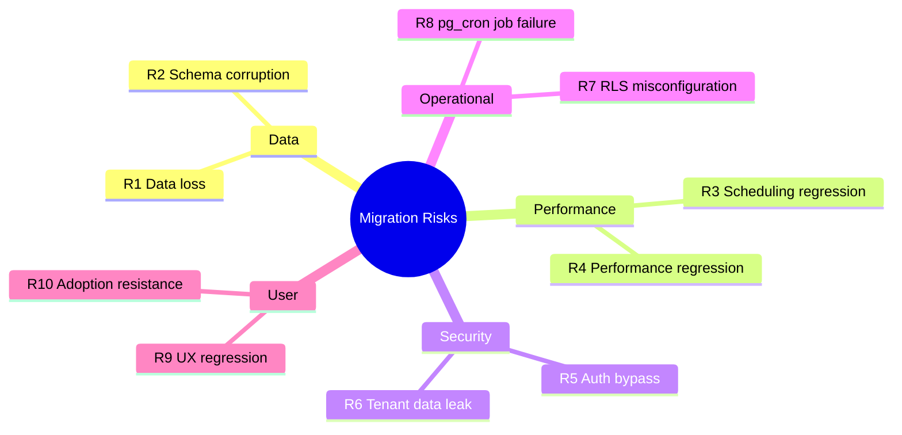

# 11.3. Risk Register and Mitigations

> [!abstract] What this note teaches you
> Every migration has risks. V2's risk register catalogs the top 10 risks with severity, probability, and mitigation. This note is the engineering manager's view of "what could go wrong and what we're doing about it".

## The top 10 risks

## R1: Data loss during migration

**Severity:** Critical
**Probability:** Medium
**Impact:** Loss of student records, schedules, audit history.

**Mitigations:**
- Full backup before any migration step.
- Test the migration on a copy of prod data first.
- Use `INSERT ... ON CONFLICT DO NOTHING` for idempotent re-runs.
- Verify row counts before and after each table migration.
- Keep V1 read-only for 30 days after cutover as a fallback.

## R2: Schema corruption

**Severity:** Critical
**Probability:** Low
**Impact:** Inconsistent state, broken FKs, orphan rows.

**Mitigations:**
- Run V2 migrations on an empty DB first, verify schema with `\d+`.
- Use `BEGIN; ... COMMIT;` for each migration step.
- Run `amcheck` extension for heap corruption: `SELECT bt_index_check('idx_name');`.
- Test all constraints with deliberate-violation inserts (should fail).

## R3: Scheduling regression

**Severity:** High
**Probability:** Medium
**Impact:** V2 produces worse schedules than V1 (more unscheduled modules, worse fairness).

**Mitigations:**
- Run both V1 greedy and V2 CP-SAT on the same input, compare:
  - Scheduling rate (V2 ≥ V1).
  - Fairness variance (V2 ≪ V1).
  - Conflict count (V2 ≤ V1).
- Property-based tests verify hard constraints always satisfied.
- If V2 regresses, tune the objective weights (W1–W7) before cutover.

## R4: Performance regression

**Severity:** High
**Probability:** Medium
**Impact:** Dashboard load > 5s, schedule generation > 5min.

**Mitigations:**
- Load tests in staging with prod-sized data — see [[10.7. Load Testing with Locust and k6]].
- `EXPLAIN ANALYZE` on every dashboard query.
- Verify partition pruning on `inscriptions` and `examens`.
- Verify materialized view refresh times fit the budget.
- Set up Prometheus alerts on p95 latency — see [[9.3. Prometheus Metrics and Grafana Dashboards]].

## R5: Auth bypass

**Severity:** Critical
**Probability:** Low
**Impact:** Unauthorized users can generate/clear/validate schedules.

**Mitigations:**
- Penetration test before cutover (Burp Suite, OWASP ZAP).
- Every endpoint behind `auth:sanctum` + Policy.
- Token scopes enforced in Form Request `authorize()`.
- Audit log captures every write; alert on unusual patterns.
- Bug bounty program post-launch.

## R6: Tenant data leak

**Severity:** Critical
**Probability:** Low
**Impact:** University A sees University B's data. GDPR/FERPA violation.

**Mitigations:**
- RLS on every tenant-scoped table — see [[3.7. Row-Level Security for Multi-Tenancy]].
- Test cross-tenant queries as different users; expect zero rows.
- `SetTenantContext` middleware runs on every request.
- Defense-in-depth: RLS + RBAC + token scopes + explicit `WHERE university_id = ?` in service queries.

## R7: RLS misconfiguration

**Severity:** High
**Probability:** Medium
**Impact:** Either too restrictive (users see no data) or too permissive (users see other tenants' data).

**Mitigations:**
- Test with `SET app.current_university_id = ?` as different tenants.
- Monitor `pg_stat_statements` for queries returning zero rows unexpectedly.
- Have a rollback plan: `ALTER TABLE etudiants DISABLE ROW LEVEL SECURITY;` (use only in emergency).

## R8: pg_cron job failure

**Severity:** Medium
**Probability:** Medium
**Impact:** Materialized views go stale, partitions not created, audit log not purged.

**Mitigations:**
- Monitor `cron.job_run_details` for failures.
- Prometheus alert on `pg_cron_failed_jobs_total > 0`.
- Manual run command for each job as a fallback.
- Document the manual run procedure in the ops runbook.

## R9: UX regression

**Severity:** Medium
**Probability:** Medium
**Impact:** Users find V2 harder to use than V1. Adoption stalls.

**Mitigations:**
- User testing with real admins before cutover.
- Parallel running (V1 and V2 both available) for 2 weeks.
- Training sessions for each actor type.
- Feedback channel (Slack/Teams) with fast response.
- Iterative UI improvements based on feedback.

## R10: Adoption resistance

**Severity:** Medium
**Probability:** Medium
**Impact:** Users refuse to switch to V2.

**Mitigations:**
- Executive sponsorship (Vice-Doyen announces the migration).
- Training and documentation (this vault!).
- V1 goes read-only on a clear date.
- V1 becomes unavailable 30 days after cutover.
- Address user concerns promptly.

## The risk burndown

| Risk | Pre-migration | During migration | Post-migration |
|---|---|---|---|
| R1 Data loss | Backup strategy tested | Daily backups + verification | 30-day V1 fallback |
| R2 Schema corruption | Schema tested in staging | Per-step verification | amcheck weekly |
| R3 Scheduling regression | Comparison tests | Staging runs compared | Continuous monitoring |
| R4 Performance regression | Load tests in staging | p95 monitored | Prometheus alerts |
| R5 Auth bypass | Pen test | Pen test repeated | Bug bounty |
| R6 Tenant leak | RLS tests | Cross-tenant queries monitored | Quarterly RLS audit |
| R7 RLS misconfig | RLS tests | Daily spot checks | Quarterly audit |
| R8 pg_cron failure | Manual run documented | Daily job_run_details check | Prometheus alert |
| R9 UX regression | User testing | Feedback channel | Iterative improvements |
| R10 Adoption resistance | Executive sponsorship | Training | V1 decommission |

## Common junior developer mistakes

- **"It'll be fine."** No. Things go wrong. Have a risk register.
- **No severity rating.** "Data loss" and "UX nitpick" are not the same. Rate them differently.
- **No mitigation owner.** "We'll mitigate" — who? Assign owners.
- **Not reviewing the register regularly.** Risks change. Update the register weekly during migration.
- **No rollback plan.** If everything fails, can you go back to V1? You should be able to, within 4 hours.

## What to read next

- [[11.1. The V1 to V2 Migration Plan]] — the phased plan.
- [[11.5. Testing Strategy Unit Integration E2E Property-Based]] — proving risks are mitigated.
- [[9.6. CI-CD with GitHub Actions Blue-Green Canary]] — deployment risk mitigation.
