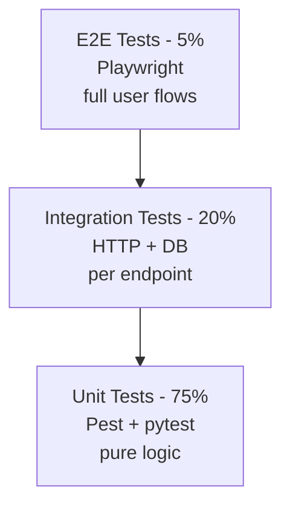

# 11.5. Testing Strategy: Unit, Integration, E2E, Property-Based

> [!abstract] What this note teaches you
> V1 had two empty test files. V2 has a full test pyramid: 75% unit (Pest + pytest), 20% integration (HTTP + DB), 5% E2E (Playwright). Plus pgTAP for DB constraints, Hypothesis for solver properties, Locust/k6 for load. This note is the V2 testing strategy.

## The test pyramid



The pyramid shape: many cheap, fast unit tests at the base; few expensive, slow E2E tests at the top.

## Coverage targets

| Layer | Target | Tool |
|---|---|---|
| Services | 90% | Pest (PHP) + pytest (Python) |
| Controllers | 70% | Pest HTTP tests |
| Models | 60% | Pest |
| Database constraints | 100% | pgTAP |
| Scheduler (CP-SAT) | 80% | pytest + OR-Tools test framework |
| Streamlit pages | 50% | Playwright |
| Blade components | 70% | Pest Dusk |

## Unit tests (Pest for PHP)

```php
// tests/Unit/Modules/Scheduling/ScheduleServiceTest.php
describe('ScheduleService::generate', function () {
    it('throws if session is not in planification status', function () {
        $session = Session::factory()->create(['statut' => 'valide']);
        
        expect(fn() => $this->service->generate($session->id, 1, []))
            ->toThrow(SessionNotInPlanificationException::class);
    });
    
    it('throws if a run is already in progress', function () {
        $session = Session::factory()->create(['statut' => 'planification']);
        ScheduleRun::factory()->create([
            'session_id' => $session->id,
            'statut' => 'en_cours',
        ]);
        
        expect(fn() => $this->service->generate($session->id, 1, []))
            ->toThrow(ScheduleAlreadyRunningException::class);
    });
    
    it('dispatches GenerateScheduleJob on success', function () {
        $session = Session::factory()->create(['statut' => 'planification']);
        
        $this->service->generate($session->id, 1, []);
        
        Queue::assertPushed(GenerateScheduleJob::class);
    });
});
```

## Integration tests (HTTP + DB)

```php
// tests/Feature/Scheduling/GenerateScheduleTest.php
describe('POST /sessions/{id}/generate', function () {
    it('returns 202 with run_id when authorized', function () {
        $user = User::factory()->create();
        $user->assignRole('admin_planification');
        $user->givePermissionTo('schedule:write');
        
        $session = Session::factory()->create([
            'university_id' => $user->university_id,
            'statut' => 'planification',
        ]);
        
        $token = $user->createToken('test', ['schedule:write'])->plainTextToken;
        
        $response = $this->withHeader('Authorization', "Bearer $token")
            ->postJson("/api/v1/sessions/{$session->id}/generate", [
                'algorithm' => 'cp_sat',
                'max_exams_per_day' => 1,
            ]);
        
        $response->assertStatus(202);
        $response->assertJsonStructure(['message', 'status', 'run_id']);
    });
    
    it('returns 403 without schedule:write scope', function () {
        $user = User::factory()->create();
        $user->assignRole('etudiant');  // wrong role
        $token = $user->createToken('test', ['schedule:read'])->plainTextToken;  // wrong scope
        
        $session = Session::factory()->create();
        
        $this->withHeader('Authorization', "Bearer $token")
            ->postJson("/api/v1/sessions/{$session->id}/generate")
            ->assertStatus(403);
    });
    
    it('returns 422 when max_exams_per_day > 2', function () {
        // ... see [[5.6. Form Requests and Validation]]
    });
    
    it('returns 409 when a run is already in progress', function () {
        // ...
    });
});
```

## E2E tests (Playwright)

```typescript
// tests/e2e/admin-schedule-generation.spec.ts
import { test, expect } from '@playwright/test';

test('admin can generate a schedule', async ({ page }) => {
    await page.goto('/login');
    await page.fill('[name=email]', 'admin@test.univ.dz');
    await page.fill('[name=password]', 'test-password');
    await page.click('button[type=submit]');
    
    await page.goto('/sessions/1/generate');
    await page.click('button:has-text("🚀 Lancer la génération")');
    
    // Wait for the run to complete (polling UI)
    await expect(page.locator('text=✅')).toBeVisible({ timeout: 60000 });
    
    // Verify schedule is visible
    await expect(page.locator('table')).toBeVisible();
});
```

## pgTAP for DB constraints

```sql
-- tests/Database/ConstraintsTest.sql
BEGIN;
SELECT plan(15);

-- Test CHECK constraint
SELECT throws_ok(
    'INSERT INTO rooms (name, seating_capacity, exam_capacity, type) VALUES (''Test'', 100, 200, ''classroom'')',
    'check constraint',
    'exam_capacity > seating_capacity should fail'
);

-- Test partial UNIQUE
SELECT lives_ok(
    'INSERT INTO etudiants (university_id, matricule, nom, prenom, formation_id, annee_inscription, annee_universitaire_id) VALUES (1, ''DUP1'', ''A'', ''B'', 1, ''2026-01-01'', 1)',
    'first insert should succeed'
);

SELECT throws_ok(
    'INSERT INTO etudiants (university_id, matricule, nom, prenom, formation_id, annee_inscription, annee_universitaire_id) VALUES (1, ''DUP1'', ''C'', ''D'', 1, ''2026-01-01'', 1)',
    'unique constraint',
    'duplicate matricule should fail'
);

-- Test EXCLUDE constraint
SELECT throws_ok(
    'INSERT INTO examens (lieu_id, creneau_id, ...) VALUES (1, 1, ...)',
    'exclusion constraint',
    'overlapping exam in same room should fail'
);

-- Test RLS
SELECT is(
    'SELECT COUNT(*) FROM etudiants WHERE university_id = 1',
    'SELECT COUNT(*) FROM etudiants',  -- with tenant context set
    'RLS should filter by tenant'
);

SELECT * FROM finish();
ROLLBACK;
```

## Property-based tests (Hypothesis for Python solver)

```python
# scheduler/tests/test_scheduler_properties.py
from hypothesis import given, strategies as st, settings
from scheduler.cp_sat_solver import ExamScheduler

@given(
    n_modules=st.integers(min_value=1, max_value=100),
    conflict_density=st.floats(min_value=0, max_value=1),
    n_rooms=st.integers(min_value=1, max_value=20),
    n_creneaux=st.integers(min_value=1, max_value=20),
)
@settings(max_examples=50, deadline=30000)  # 30s per example
def test_solver_never_schedules_conflicting_modules_together(
    n_modules, conflict_density, n_rooms, n_creneaux
):
    """Property: for any input, the solver never places two conflicting
    modules in the same creneau."""
    data = generate_test_data(n_modules, conflict_density, n_rooms, n_creneaux)
    solution = ExamScheduler(data).solve(timeout_seconds=5)
    
    if solution.is_feasible:
        for (m1, m2) in data.conflicts:
            for c in data.creneaux:
                assert not (solution.scheduled[m1, c] and solution.scheduled[m2, c]), \
                    f"Conflicting modules {m1} and {m2} both scheduled at creneau {c}"

@given(
    n_modules=st.integers(min_value=1, max_value=50),
    n_rooms=st.integers(min_value=1, max_value=10),
    n_creneaux=st.integers(min_value=1, max_value=10),
)
def test_solver_never_exceeds_room_capacity(n_modules, n_rooms, n_creneaux):
    """Property: for any input, no room is over capacity."""
    data = generate_test_data(n_modules, 0.5, n_rooms, n_creneaux)
    solution = ExamScheduler(data).solve(timeout_seconds=5)
    
    if solution.is_feasible:
        for assignment in solution.assignments:
            room = next(r for r in data.rooms if r.id == assignment['room_id'])
            module = next(m for m in data.modules if m.id == assignment['module_id'])
            assert module.enrollment <= room.capacity, \
                f"Module {module.id} ({module.enrollment} students) in room {room.id} (cap {room.capacity})"

@given(
    n_modules=st.integers(min_value=1, max_value=50),
)
def test_solver_schedules_all_modules_when_feasible(n_modules):
    """Property: if the input is feasible (more creneaux than modules, 
    no conflicts), all modules are scheduled."""
    data = generate_test_data(
        n_modules=n_modules,
        conflict_density=0,  # no conflicts
        n_rooms=1,
        n_creneaux=n_modules + 5,  # plenty of slots
    )
    solution = ExamScheduler(data).solve(timeout_seconds=10)
    
    assert solution.is_feasible
    assert solution.scheduled_count == n_modules
```

Property-based tests generate hundreds of random inputs and verify invariants hold for all of them. This catches edge cases that hand-written tests miss.

## Load tests

See [[10.7. Load Testing with Locust and k6]] for the full Locust and k6 setups.

## Common junior developer mistakes

- **No tests at all.** V1's empty test files were worse than no test files — they implied tests were planned but not written.
- **Only unit tests.** Unit tests don't catch integration bugs (wrong DB column name, missing migration).
- **Only E2E tests.** E2E tests are slow and don't pinpoint failures.
- **No property-based tests for the solver.** Hand-written tests can't cover the solver's input space. Use Hypothesis.
- **Testing the happy path only.** Test 403s, 422s, 500s, timeouts, concurrent requests.
- **No DB constraint tests.** pgTAP verifies that `CHECK`, `EXCLUDE`, and RLS policies actually enforce what they claim.
- **Tests not in CI.** Tests that don't run automatically don't exist. Wire them into GitHub Actions.

## What to read next

- [[9.6. CI-CD with GitHub Actions Blue-Green Canary]] — how tests run in CI.
- [[10.7. Load Testing with Locust and k6]] — load tests.
- [[4.4. The 16 Hard Constraints]] — what the property tests verify.
- [[3.8. Constraints vs Triggers When to Use Each]] — what pgTAP tests.
