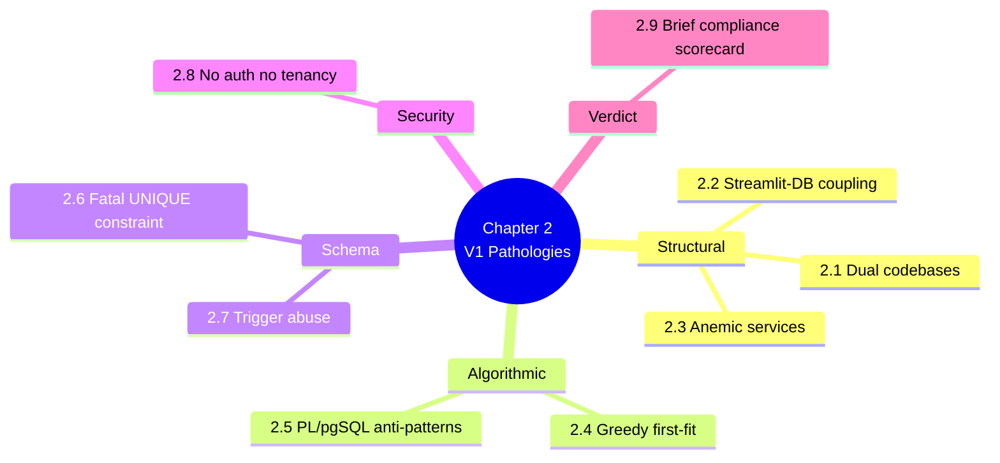

# 2. MOC — The V1 Architecture and Its Pathologies

> [!abstract] Chapter goal
> A brutally honest, no-spin teardown of the legacy prototype. By the end of this chapter you will be able to articulate exactly **why the V1 code cannot be saved** and which patterns to never repeat. Every claim is backed by a verbatim V1 code snippet.

## Notes in this chapter

| Note | Title | What you learn |
|---|---|---|
| 2.1 | [[2.1. V1 Repository Layout and Dual Implementations]] | Two parallel codebases (`bda_test_univ_exam/` and `univ_exam_optimizer/`) with different schemas, different drivers, no shared main branch. |
| 2.2 | [[2.2. Streamlit to Database Coupling]] | Streamlit pages import the Supabase client directly and run raw `select("*")` queries, bypassing any service layer. |
| 2.3 | [[2.3. The Anemic Service Layer]] | `AnalyticsService` and `SchedulingService` are pure pass-through wrappers with zero business logic. |
| 2.4 | [[2.4. The Greedy First-Fit Scheduling Algorithm]] | The PL/pgSQL greedy loop — no backtracking, no objective, no fairness, no split rooms, no relaxation. |
| 2.5 | [[2.5. PL-pgSQL Anti-Patterns]] | Temp tables in loops, subtransaction exhaustion, the `EXTRACT(MILLISECONDS)` bug, `SET LOCAL statement_timeout = 0`. |
| 2.6 | [[2.6. The Fatal UNIQUE Constraint]] | `UNIQUE(module_id, creneau_id)` mathematically forbids split-room scheduling for large cohorts. |
| 2.7 | [[2.7. Trigger Abuse for Control Flow]] | Using `BEFORE INSERT` triggers as control flow, swallowing `EXCEPTION WHEN OTHERS` in loops, exact-time match for conflicts. |
| 2.8 | [[2.8. Missing Security and Multi-Tenancy]] | No auth, no RBAC, Supabase service key in the frontend, no tenant isolation, PII publicly searchable. |
| 2.9 | [[2.9. V1 Brief Compliance Scorecard]] | The original academic brief had 12 hard requirements. V1 met 4, partially met 3, missed 5. |

## Why this chapter is so long

The V1 codebase is genuinely instructional — not because it is good, but because every mistake in it is a mistake that junior engineers make in their first 2–3 years. Cataloguing them precisely is the fastest way to never repeat them.

> [!warning] Do not skip the V1 code snippets
> Even if you wrote the V1 code yourself, read the snippets. The point of this chapter is to make the failure modes **visceral**, not abstract.

## Where to go next

Once you can name every V1 pathology, proceed to [[3. MOC|Database Layer Deep-Dive]] to learn the PostgreSQL features that V2 uses to fix them.
