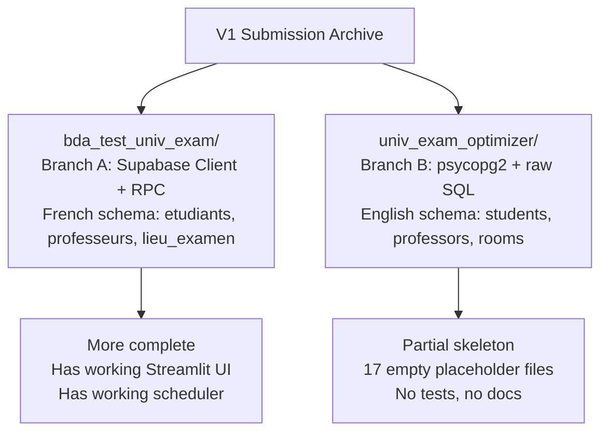
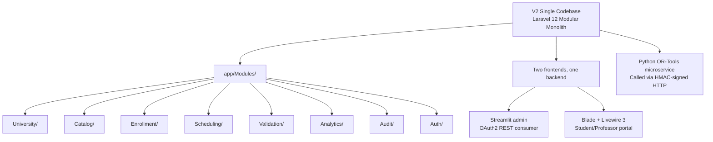

# 2.1. V1 Repository Layout and Dual Implementations

> [!abstract] What this note teaches you
> The V1 submission contained **two parallel, divergent codebases** in the same archive: `bda_test_univ_exam/` (Supabase + RPC, French schema) and `univ_exam_optimizer/` (psycopg2 + raw SQL, English schema). This note catalogues both layouts, explains why this is a structural pathology, and shows how V2 consolidates into a single Laravel modular monolith.

## The two V1 codebases



### Branch A: `bda_test_univ_exam/`

This is the more complete of the two implementations. Layout:

```
bda_test_univ_exam/
├── database/
│   ├── procedures/
│   │   ├── calculate_kpis.sql               # 7 KPI functions
│   │   ├── detect_conflicts.sql             # 5 conflict-detection functions
│   │   └── generate_schedule.sql            # The greedy scheduler + helpers
│   ├── schema/
│   │   ├── 01_create_tables.sql             # 11 tables + 2 views
│   │   ├── 02_constraints_triggers.sql      # 4 triggers + 2 report fns
│   │   └── 03_indexes.sql                   # 19 indexes incl. 4 partial
│   └── seeds/
│       └── seed_data.py                     # Faker-style seeder, 13k students
├── src/
│   ├── backend/
│   │   ├── services/
│   │   │   ├── analytics_service.py
│   │   │   └── scheduling_service.py
│   │   └── db_manager.py                    # Supabase client wrapper
│   └── frontend/
│       ├── pages/
│       │   ├── 01_Vice_Doyen_Dashboard.py
│       │   ├── 02_Admin_Planification.py
│       │   ├── 03_Chef_Dept_Validation.py
│       │   └── 04_Consultation_Planning.py
│       └── app.py                           # Streamlit entry
├── render.yaml                              # Render.com deploy config
└── requirements.txt
```

Branch A is what we will mostly analyze in this chapter — it is the "primary" implementation that actually runs.

### Branch B: `univ_exam_optimizer/`

A partial skeleton. 17 of its files are **zero-byte placeholders** (empty `services/`, empty `models/`, empty `tests/`, empty `components/`, empty `utils/`, empty `docs/`). The only files with real content are the schema, the optimization procedure, a trivial KPI function, the seeder, the db_manager, and 4 stub frontend pages.

Layout (showing only non-empty files):

```
univ_exam_optimizer/
├── database/
│   ├── procedures/
│   │   ├── 01_conflict_detection.sql        # EMPTY
│   │   ├── 02_optimization_algo.sql         # generate_exam_schedule PROCEDURE
│   │   └── 03_kpi_calculations.sql          # get_dashboard_stats()
│   ├── schema/
│   │   ├── 01_create_tables.sql             # 8 tables, starts with DROP CASCADE
│   │   ├── 02_constraints_triggers.sql      # 2 triggers
│   │   └── 03_indexes_partitioning.sql      # EMPTY (no indexes defined anywhere!)
│   └── seeds/
│       └── dataset_generator.py             # psycopg2 seeder, 50 students/formation
├── src/
│   ├── backend/
│   │   ├── core/db_manager.py               # psycopg2 connection wrapper
│   │   └── config.py                        # Hardcoded DB_PASSWORD='password'
│   └── frontend/
│       └── pages/ (4 pages with raw SQL)
├── docs/
│   ├── benchmarks_performances.md           # EMPTY
│   └── rapport_technique.md                 # EMPTY
├── tests/
│   ├── test_db_constraints.py               # EMPTY
│   └── test_optimization_logic.py           # EMPTY
├── docker-compose.yml                       # postgres:latest, password='password'
└── README.md
```

## Why this is a structural pathology

Having two parallel codebases in one submission is not just messy — it is a **process failure**. The V1 review's verdict (verbatim):

> *"Two juniors each wrote half and never spoke to each other."*

The consequences:

1. **Different schemas, different naming.** Branch A uses French (`etudiants`, `professeurs`, `lieu_examen`, `examens`, `creneaux`). Branch B uses English (`students`, `professors`, `rooms`, `exams`). A reviewer cannot tell which is the "real" submission.

2. **Different database drivers.** Branch A uses the Supabase Python client (HTTP/REST). Branch B uses psycopg2 (direct Postgres socket). They cannot share connection pooling, transactions, or even error handling.

3. **Different algorithms.** Branch A's `generate_schedule` is a PL/pgSQL function. Branch B's `generate_exam_schedule` is a PL/pgSQL PROCEDURE. They produce different results on the same input.

4. **Different feature sets.** Branch A has session support, conflict detection, KPIs, and 5 Streamlit pages. Branch B has none of these — only the optimization procedure and a single KPI function.

5. **Empty deliverables.** Branch B's `benchmarks_performances.md` and `rapport_technique.md` are empty. The brief explicitly required both as deliverables.

## What V2 does instead

V2 is a **single Laravel 12 modular monolith**. There is one codebase, one schema, one algorithm, one frontend split. See [[5.1. The Modular Monolith Pattern]].



## Common junior developer mistakes

- **"Let's keep both versions for reference."** No. Delete the weaker one. A repo with two parallel implementations of the same thing rots faster than either alone. V2 explicitly deletes `univ_exam_optimizer/` entirely and keeps `bda_test_univ_exam/` only as a V1 reference snapshot.
- **Inconsistent naming conventions.** Pick one language for identifiers (table names, column names, file names) and stick with it. V2 keeps French domain terms (`etudiants`, `professeurs`, `lieu_examen`) because they match the source domain, but uses English for all code comments and UI strings.
- **Empty placeholder files committed to look professional.** A reviewer can `wc -l` your files. Empty `tests/` directories are worse than no `tests/` directory because they imply you knew tests were needed and chose not to write them.
- **No README at the root explaining which version is canonical.** The V1 archive had no top-level README. V2's root `README.md` (the vault's root MOC) explicitly states which codebase is canonical.

## The V1 file inventory

The V1 review catalogued 35+ files across both branches. The complete inventory with notes is in the source digest, but the highlights:

| File | Status | Notes |
|---|---|---|
| `bda_test_univ_exam/database/procedures/generate_schedule.sql` | Real content | The greedy scheduler — analyzed in [[2.4. The Greedy First-Fit Scheduling Algorithm]] |
| `bda_test_univ_exam/database/schema/01_create_tables.sql` | Real content | 11 tables + the fatal UNIQUE constraint — see [[2.6. The Fatal UNIQUE Constraint]] |
| `bda_test_univ_exam/src/backend/db_manager.py` | Real content | Supabase client wrapper — see [[2.2. Streamlit to Database Coupling]] |
| `bda_test_univ_exam/src/backend/services/scheduling_service.py` | Real content | Pure pass-through — see [[2.3. The Anemic Service Layer]] |
| `univ_exam_optimizer/tests/test_db_constraints.py` | **EMPTY** | 0 bytes |
| `univ_exam_optimizer/tests/test_optimization_logic.py` | **EMPTY** | 0 bytes |
| `univ_exam_optimizer/docs/benchmarks_performances.md` | **EMPTY** | 0 bytes — required deliverable missing |
| `univ_exam_optimizer/docs/rapport_technique.md` | **EMPTY** | 0 bytes — required deliverable missing |

## What to read next

- [[2.2. Streamlit to Database Coupling]] — how Branch A's frontend bypassed its own service layer.
- [[2.3. The Anemic Service Layer]] — why the V1 "services" were not services.
- [[5.1. The Modular Monolith Pattern]] — the V2 alternative.
- [[11.2. What to Keep Delete and Rewrite from V1]] — the consolidation plan.
