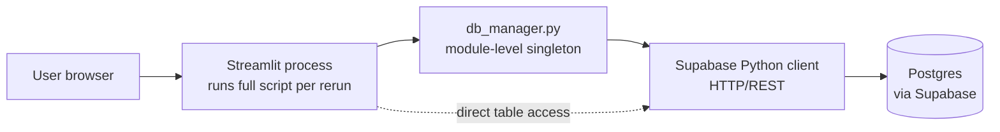
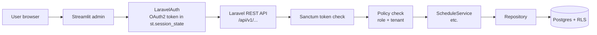

# 2.2. Streamlit to Database Coupling

> [!abstract] What this note teaches you
> V1's Streamlit pages imported the Supabase client directly and ran raw `select("*")` queries, bypassing any service layer. This note shows the exact code, explains why this anti-pattern kills maintainability and security, and previews how V2 decouples the UI via a Laravel REST API.

## The V1 architecture (such as it was)



The intended layering was:

```
Streamlit page → Service layer (analytics_service, scheduling_service) → db_manager → Supabase
```

The actual layering was:

```
Streamlit page → db_manager.supabase.table(...).select("*")...   (skipping the service layer)
Streamlit page → scheduling_service.generate(...) → db.generate_schedule(...)   (thin wrapper)
```

## The smoking gun: direct Supabase calls from a Streamlit page

From `bda_test_univ_exam/src/frontend/pages/04_Consultation_Planning.py`, verbatim:

```python
# Student search — bypasses the service layer entirely
if search_type == "Matricule":
    response = db.supabase.table("etudiants").select("*").eq("matricule", matricule).execute()
else:
    response = db.supabase.table("etudiants").select("*").ilike("nom", f"%{nom}%").execute()
```

And a few lines later for the professor tab:

```python
response = db.supabase.table("professeurs").select("*, departements(nom)").eq("matricule", prof_matricule).execute()
```

Five distinct problems in four lines of code:

1. **`db.supabase`** — the page reaches *through* the `db_manager` abstraction to grab the underlying Supabase client. The `db_manager` was supposed to encapsulate the Supabase client; instead, it exposes it as a public property.

2. **`.select("*")`** — fetches every column including `email`, which is PII. Any visitor can enumerate all student emails by searching `%`. This is a GDPR/FERPA violation — see [[6.5. PII Redaction and GDPR FERPA Compliance]].

3. **`.ilike("nom", f"%{nom}%")`** — leading-wildcard LIKE forces a sequential scan on `etudiants`. At 13k students this is slow; at 100k it is a denial-of-service vector.

4. **No authentication, no authorization** — any visitor can search any student. No role check, no audit log of who queried whom.

5. **No error handling specific to the operation** — wrapped in a generic `try/except Exception as e: st.error(str(e))` that leaks SQL errors to the user.

## Why this is bad

### 1. You cannot migrate off Supabase without rewriting the UI

If you ever want to switch from Supabase to self-hosted Postgres, or to a different ORM, or to a different DB altogether, you have to find and rewrite every `db.supabase.table(...)` call scattered across the Streamlit pages. There is no single chokepoint to swap.

### 2. The UI is untestable

To unit-test `04_Consultation_Planning.py`, you would have to mock `db.supabase.table().select().eq().execute()` — a five-method chain on a property of a module-level singleton. This is why V1 has zero tests (see [[2.8. Missing Security and Multi-Tenancy]]).

### 3. Schema changes silently break the UI

If you rename `etudiants.matricule` to `etudiants.student_id`, no compiler or test will catch it. The Streamlit page will silently return empty results because `.eq("matricule", ...)` no longer matches any rows.

### 4. PII exposure is baked in

`.select("*")` is the default. There is no field whitelist. A new column added to `etudiants` (say, `date_naissance` for age verification) is immediately exposed to every frontend caller.

### 5. No batching, no caching

Each Streamlit rerun triggers fresh `db.supabase` calls. There is no `@st.cache_data`, no batched endpoint, no HTTP cache headers. Every page load is a full round-trip to Supabase.

## The complete catalogue of direct DB access points

From the V1 source review, every place where a Streamlit page imports a DB client or runs raw SQL:

| File | Line | What |
|---|---|---|
| `app.py` | L3065 | `from backend.db_manager import db` |
| `01_Vice_Doyen_Dashboard.py` | L2343 | `from backend.db_manager import db` |
| `02_Admin_Planification.py` | L2499 | `from backend.db_manager import db` |
| `02_Admin_Planification.py` | L2601 | `db.get_daily_schedule(session_id)` (RPC) |
| `03_Chef_Dept_Validation.py` | L2709 | `from backend.db_manager import db` |
| `03_Chef_Dept_Validation.py` | L2773 | `db.get_formations(selected_dept_id)` (loop) |
| `03_Chef_Dept_Validation.py` | L2779 | `db.get_modules(formation_id=..., semestre=...)` (N+1) |
| `04_Consultation_Planning.py` | L2896 | **Raw**: `db.supabase.table("etudiants").select("*").eq("matricule", matricule).execute()` |
| `04_Consultation_Planning.py` | L2898 | **Raw**: `db.supabase.table("etudiants").select("*").ilike("nom", f"%{nom}%").execute()` |
| `04_Consultation_Planning.py` | L2983 | **Raw**: `db.supabase.table("professeurs").select("*, departements(nom)").eq("matricule", prof_matricule).execute()` |
| `04_Consultation_Planning.py` | L2985 | **Raw**: `db.supabase.table("professeurs").select("*, departements(nom)").ilike("nom", f"%{prof_nom}%").execute()` |

Branch B (`univ_exam_optimizer`) is even worse — every page runs raw SQL via `pd.read_sql`:

```python
# 01_Vice_Doyen_Dashboard.py, Branch B
db = DBManager()
kpis = db.get_dataframe("SELECT * FROM get_dashboard_stats()")
df_dept = db.get_dataframe("""
    SELECT d.name, COUNT(e.id) as count
    FROM exams e
    JOIN modules m ON e.module_id = m.id
    JOIN formations f ON m.formation_id = f.id
    JOIN departments d ON f.dept_id = d.id
    WHERE e.is_scheduled = TRUE
    GROUP BY d.name
""")
```

## The V2 alternative: decoupled REST API

V2's Streamlit pages never touch a database. They talk to a Laravel REST API over HTTPS with an OAuth2 bearer token:



A typical V2 Streamlit call:

```python
# streamlit_app/views/vice_doyen.py
@st.cache_data(ttl=60, show_spinner="Fetching KPIs...")
def fetch_kpis(api, session_id):
    return api.get(f"/sessions/{session_id}/dashboard")

def render(api):
    session = require_session(api)
    data = fetch_kpis(api, session['id'])
    # ... render KPIs ...
```

The `api.get(...)` call:
- Sends `Authorization: Bearer {oauth_token}` header.
- Hits Laravel route `/api/v1/sessions/{id}/dashboard`.
- Laravel's `auth:sanctum` middleware validates the token.
- Laravel's `tenant` middleware sets `app.current_university_id` for RLS.
- Laravel's `SessionPolicy` checks `view` permission.
- The controller calls `ScheduleService::getDashboardData($sessionId)`.
- The service calls `DB::selectOne('SELECT get_dashboard_data(?)', [$sessionId])`.
- The result is returned as JSON.

Every layer is testable, every layer is replaceable, and PII never leaks because Laravel Resources (DTOs) explicitly whitelist fields.

## Common junior developer mistakes

- **Exposing the DB client as a public property.** If your `db_manager` has `db.supabase` as a public attribute, every page will reach through it. Make it private (`_supabase`) and expose only typed methods.
- **Using `select("*")` out of laziness.** Always list the columns you need. It documents the contract, prevents PII leaks, and lets the DB planner use covering indexes.
- **Forgetting that Streamlit reruns everything.** A `db = DBManager()` at module level runs on every rerun. Use `@st.cache_resource` for connection objects.
- **Letting the UI format SQL.** SQL belongs in the DB layer (stored functions) or the repository layer (parameterized queries). It never belongs in a UI file.
- **No service layer between UI and DB.** Even a thin service layer that just forwards calls gives you a place to add validation, logging, and audit later. V1's "anemic service layer" is bad, but no service layer is worse — see [[2.3. The Anemic Service Layer]].

## What to read next

- [[2.3. The Anemic Service Layer]] — why V1's service layer existed but added no value.
- [[2.8. Missing Security and Multi-Tenancy]] — the security consequences of UI-to-DB coupling.
- [[5.6. Form Requests and Validation]] — how V2 validates at the API boundary.
- [[8.3. The Decoupled Streamlit Admin Portal]] — the V2 frontend architecture.
