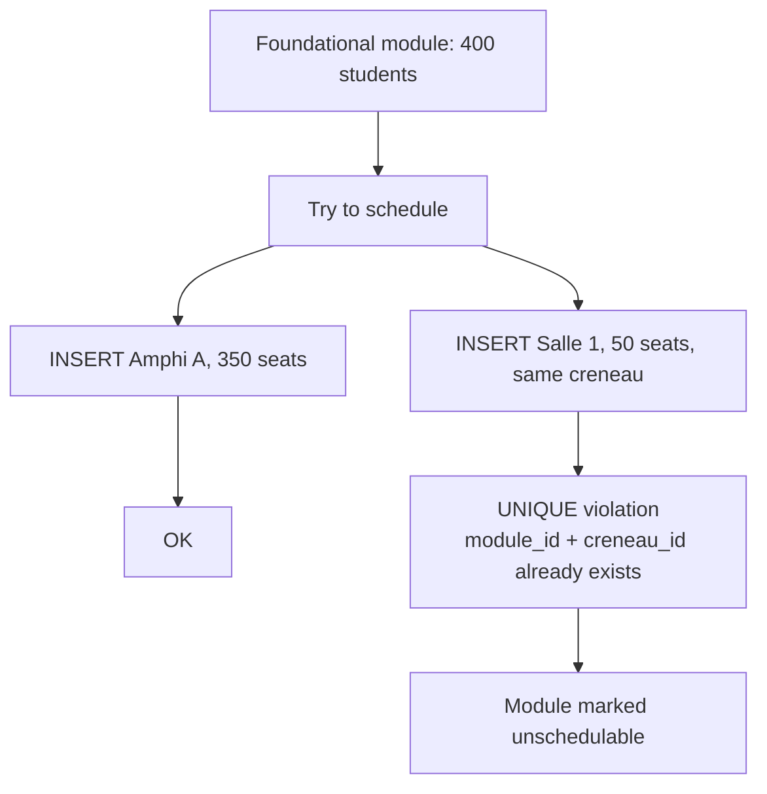

# 2.6. The Fatal UNIQUE Constraint

> [!abstract] What this note teaches you
> V1's `examens` table had `UNIQUE(module_id, creneau_id)` — a single constraint that mathematically forbids split-room scheduling for large cohorts. A 400-student module with no single 400-seat room cannot be scheduled at all. This note explains the constraint, the failure mode, and the V2 schema redesign that fixes it.

## The constraint

From `bda_test_univ_exam/database/schema/01_create_tables.sql`, verbatim:

```sql
CREATE TABLE examens (
    id SERIAL PRIMARY KEY,
    module_id INTEGER NOT NULL REFERENCES modules(id) ON DELETE CASCADE,
    creneau_id INTEGER NOT NULL REFERENCES creneaux(id) ON DELETE CASCADE,
    lieu_id INTEGER NOT NULL REFERENCES lieu_examen(id) ON DELETE CASCADE,
    surveillant_principal_id INTEGER REFERENCES professeurs(id),
    nb_etudiants_prevus INTEGER NOT NULL DEFAULT 0,
    statut VARCHAR(20) DEFAULT 'planifie'
        CHECK (statut IN ('planifie', 'confirme', 'en_cours', 'termine', 'annule')),
    notes TEXT,
    created_at TIMESTAMPTZ DEFAULT NOW(),
    updated_at TIMESTAMPTZ DEFAULT NOW(),
    UNIQUE(module_id, creneau_id)              -- <--- FATAL CONSTRAINT
);
```

The `UNIQUE(module_id, creneau_id)` means: for any given module and any given time slot, there can be at most one row in `examens`. Since each row also has a single `lieu_id` (room), this means **one module in one slot can only be in one room**.

## Why this is fatal

Consider a foundational CS module with 400 enrolled students. Suppose the faculty's rooms are:

| Room | Type | Capacity |
|---|---|---|
| Amphi A | amphi | 350 |
| Amphi B | amphi | 300 |
| Salle 1 | TD | 20 |
| Salle 2 | TD | 20 |
| ... | ... | ... |

No single room holds 400 students. The only way to schedule the exam is to **split** it across Amphi A (350 students) + Salle 1 (50 students), both at the same time slot.

The `UNIQUE(module_id, creneau_id)` constraint makes this **impossible**. The first INSERT (Amphi A) succeeds. The second INSERT (Salle 1, same module, same creneau) violates the unique constraint and raises an exception. The scheduler reports the module as unschedulable and moves on.



## The failure is silent

The V1 scheduler does not even report this clearly. The `find_available_room` function returns NULL when no single room fits, and the main loop just `CONTINUE`s to the next creneau. After all creneaux are exhausted, the module is left unscheduled — no row in `examens`, no entry in `schedule_conflicts` (because that table doesn't exist in V1). The UI shows "X modules non planifiés" with no explanation.

For a foundational course like "Introduction to Algorithms" with 800+ students, this is a guaranteed failure. The V1 seed data happened to avoid this because it generated small modules — but the real faculty has real large cohorts.

## The V2 schema redesign

V2 splits the monolithic `examens` table into two:

- **`exams`** — the exam metadata: which module, which session, which timeslot. No room.
- **`exam_allocations`** — one row per room assignment. Multiple rows per exam are allowed (and required for split exams).

```sql
-- V2 schema (simplified — see Chapter 3 for the full DDL)
CREATE TABLE exams (
    id UUID PRIMARY KEY DEFAULT gen_random_uuid(),
    tenant_id UUID NOT NULL REFERENCES tenants(id) ON DELETE RESTRICT,
    module_id UUID NOT NULL,
    academic_period_id UUID NOT NULL,
    timeslot_id UUID REFERENCES timeslots(id) ON DELETE RESTRICT,
    is_locked BOOLEAN NOT NULL DEFAULT FALSE,
    UNIQUE (tenant_id, module_id, academic_period_id)
);

CREATE TABLE exam_allocations (
    id UUID NOT NULL DEFAULT gen_random_uuid(),
    tenant_id UUID NOT NULL REFERENCES tenants(id) ON DELETE RESTRICT,
    exam_id UUID NOT NULL,
    room_id UUID NOT NULL REFERENCES rooms(id) ON DELETE RESTRICT,
    allocated_students INT NOT NULL CHECK (allocated_students > 0),
    PRIMARY KEY (tenant_id, id),
    UNIQUE (tenant_id, exam_id, room_id)  -- one room per exam, but multiple rooms per exam allowed
) PARTITION BY LIST (tenant_id);
```

The key change: the unique constraint is now on `(tenant_id, exam_id, room_id)`, not on `(module_id, creneau_id)`. This means:

- The same exam cannot be assigned the same room twice (prevents accidental duplicate inserts).
- **But** the same exam can be assigned multiple different rooms (enables split-room scheduling).

## The CP-SAT model

The V2 CP-SAT formulation has decision variables `y[m, r, c]` (1 if module `m` is in room `r` at creneau `c`). The hard constraints include:

- **Constraint 1** (each exam scheduled at least once): `sum_{r,c} y[m, r, c] >= 1` — note the `>=`, not `==`, allowing multi-room splits.
- **Constraint 2** (single timeslot per exam): introduces auxiliary `active_{m,t}` Bool, with `sum_t active_{m,t} == 1` — splits must be in the *same* timeslot.
- **Constraint 3** (capacity): `sum_{r,c} y[m, r, c] * capacity(r) >= enrollment(m)` — total capacity across split rooms must fit the cohort.
- **Constraint 4** (no room double-booking): `sum_m y[m, r, c] <= 1` for each (room, creneau).

See [[4.4. The 16 Hard Constraints]] for the full formulation.

## The 20-student TD cap interaction

The fatal UNIQUE constraint interacts badly with the TD-room 20-student cap (see [[1.3. Hard Constraints and Business Rules]] constraint 6). Without split rooms, a 21-student module cannot use a TD room at all (because 21 > 20). With split rooms, a 40-student module can use 2 TD rooms (20 + 20 = 40). V1 could not do this; V2 can.

## Common junior developer mistakes

- **Adding UNIQUE constraints without thinking through the business rule.** `UNIQUE(module_id, creneau_id)` sounds reasonable — "one exam per module per slot" — but it actually means "one room per module per slot", which is wrong.
- **Modeling the world with single-valued columns when the world is multi-valued.** `lieu_id` on `examens` forces one room per exam. The real world has split exams. Use a junction table.
- **Not testing with realistic cohort sizes.** V1's seed generated modules with 50–400 students. A 400-student module with no 400-seat room would have exposed this bug immediately — but the seed's largest room was 350, so 400-student modules just went unscheduled silently.
- **Confusing "exam" with "exam offering".** An exam is *the exam for module M in session S*. An exam offering is *one room's worth of that exam*. They are different entities and deserve different tables.

## What to read next

- [[1.3. Hard Constraints and Business Rules]] — constraint 6 (TD 20-student cap) interacts with this.
- [[3.2. Schema Design Principles for SaaS]] — the full V2 schema.
- [[4.4. The 16 Hard Constraints]] — constraints 1–4 cover the split-room model.
- [[11.4. The Migration Mapping Table Pattern]] — how to migrate V1's `examens` rows to V2's `exams` + `exam_allocations` without losing data.
