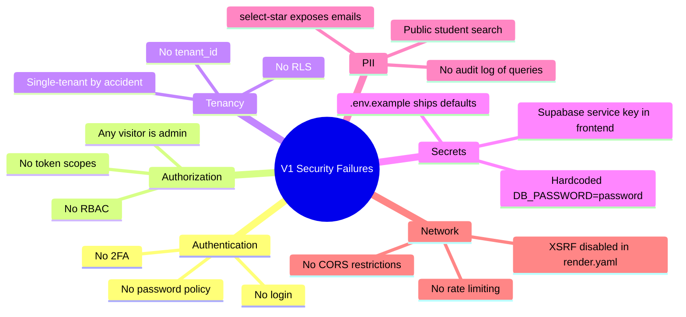
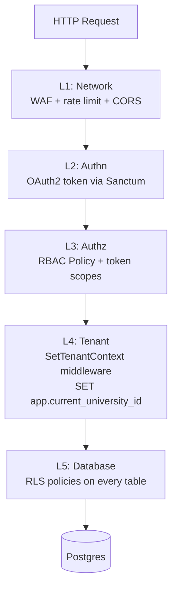

# 2.8. Missing Security and Multi-Tenancy

> [!abstract] What this note teaches you
> V1 had **no authentication, no authorization, no tenant separation, and exposed student PII to anyone with the URL**. The Supabase service key (which bypasses RLS) was bundled into the frontend. This note catalogs every V1 security failure and previews the V2 defense-in-depth model.

## The V1 security posture in one sentence

> [!danger] V1 security summary
> Anyone with the URL can: generate schedules, clear schedules, view any student's full exam schedule, view any professor's surveillance assignments, enumerate all student emails, and trigger unbounded database load. The Supabase service key (full admin access) is bundled in the frontend.

## The full failure catalogue



## 1. No authentication

There is no login form anywhere in V1. No `st.experimental_user`, no OAuth, no session token check. The `02_Admin_Planification.py` page — which can wipe and regenerate the entire schedule — is reachable from the Streamlit sidebar by **any visitor**.

The `render.yaml` deploy config explicitly disables XSRF protection:

```yaml
# bda_test_univ_exam/render.yaml
web: streamlit run src/frontend/app.py --server.port $PORT --server.address 0.0.0.0 --server.enableCORS false --server.enableXsrfProtection false
```

## 2. No authorization (RBAC)

The brief specifies 5 actor types (Vice-Doyen, Admin, Chef Dept, Student, Professor) but V1 enforces no role checks. Any visitor can access any page. The "Valider le planning" button on the Chef Dept page was a fake stub, but if it had been wired, any visitor could validate any department's schedule.

## 3. No tenant separation

V1 has **no `tenant_id`, `faculty_id`, or `university_id` column** on any table. The entire database is single-tenant. You cannot deploy V1 for two faculties without forking the database. The brief's mention of "200+ formations" and "7 departments" describes *one* faculty — V1 cannot model a second one.

V1 has `sessions_examen.annee_universitaire VARCHAR(9)` but no RLS policy restricts which sessions a user can see. Any visitor sees all sessions ever.

## 4. Supabase service key in the frontend

The `db_manager.py` reads `SUPABASE_URL` and `SUPABASE_KEY` from environment variables. Supabase has two key types:

- **anon key** — respects RLS policies, limited access.
- **service_role key** — bypasses RLS, full admin access.

The V1 seeder (`seed_data.py`) does `supabase.table("etudiants").delete().neq("id", 0).execute()` — bulk delete all rows. This only works with the `service_role` key. Since the seeder and the frontend use the same `db_manager` singleton, **the frontend is using the service_role key for all user requests**.

Anyone who can run the app can read/write anything in the database.

## 5. Hardcoded credentials

From `univ_exam_optimizer/src/backend/config.py`:

```python
class Config:
    DB_HOST = os.getenv("DB_HOST", "localhost")
    DB_PORT = os.getenv("DB_PORT", "5432")
    DB_NAME = os.getenv("DB_NAME", "univ_exam_db")
    DB_USER = os.getenv("DB_USER", "postgres")
    DB_PASSWORD = os.getenv("DB_PASSWORD", "password")  # Hardcoded default credentials
```

From `univ_exam_optimizer/.env.example`:

```
DB_HOST=localhost
DB_PORT=5432
DB_NAME=univ_exam_db
DB_USER=postgres
DB_PASSWORD=password
```

From `univ_exam_optimizer/docker-compose.yml`:

```yaml
environment:
  POSTGRES_USER: postgres
  POSTGRES_PASSWORD: password  # Hardcoded in version control
  POSTGRES_DB: univ_exam_db
```

A publicly accessible Postgres with password `password` is the textbook example of what not to do.

## 6. PII exposure

`etudiants.email` and `professeurs.email` are stored in plaintext, no encryption. The Consultation page lets **any visitor** look up any student's full exam schedule by matricule or surname substring:

```python
# Anyone can search any student by partial name
response = db.supabase.table("etudiants").select("*").ilike("nom", f"%{nom}%").execute()
```

This is a clear **GDPR violation** (EU) and **FERPA violation** (US). No audit log of who queried whom.

`schedule_logs` records action details as JSONB but does NOT record **who** triggered the action — no `user_id`, no `actor` field. There is no accountability.

## 7. SQL injection surface (small but present)

V1 mostly uses parameterized queries (Supabase fluent API, `%s` placeholders in psycopg2). But:

- `db.execute_procedure(proc_name, params)` in Branch B uses f-string interpolation: `cur.execute(f"CALL {proc_name}(%s, %s)", params)`. If `proc_name` ever comes from user input, it's SQL injection. Currently hardcoded, but the pattern is unsafe.
- Branch B's `dataset_generator.py` uses `cur.execute(f"INSERT INTO modules (code, name, formation_id) VALUES (%s, %s, %s) RETURNING id", ...)`. The f-string is unnecessary (parameters are bound). If a developer copy-pastes and adds a string interpolation, it becomes injectable.

## 8. Denial-of-service surface

`generate_schedule` has `SET LOCAL statement_timeout = 0` — a malicious visitor can launch an unbounded-cost DB operation by clicking "Generate" repeatedly. No auth, no rate limiting.

The `ilike("nom", f"%{nom}%")` search is a leading-wildcard LIKE — defeats B-tree indexes, forces seq scan on `etudiants`. With 13,000 rows it is OK; with 1,000,000 rows it is a DoS.

## The V2 defense-in-depth model

V2 enforces security at **five layers**, each independently sufficient to stop most attacks:



### Layer 1: Network

- AWS WAF (CloudFront) for SQL injection / XSS signatures.
- Rate limiting: 60 req/min per user, 1000 req/hour.
- CORS restricted to known origins.
- All endpoints behind HTTPS.

### Layer 2: Authentication (OAuth2 via Sanctum)

- Laravel Sanctum for SPA tokens (Streamlit, mobile).
- Laravel Fortify for login, 2FA, password reset.
- Laravel Socialite for SSO with Google/Microsoft/LDAP.
- Session timeout: 30 minutes idle.
- Password policy: 12+ chars, 1 upper, 1 lower, 1 digit, 1 symbol.

See [[6.3. OAuth2 with Sanctum Fortify Socialite]].

### Layer 3: Authorization (RBAC with 7 roles)

`spatie/laravel-permission` with 7 roles and per-action permissions. Laravel Policies enforce at the controller level. Token scopes (`tokenCan('schedule:write')`) enforce at the API level. See [[6.4. RBAC with spatie laravel-permission]].

### Layer 4: Tenant context

`SetTenantContext` middleware sets `app.current_university_id` Postgres session variable on every request:

```php
DB::statement("SET app.current_university_id = ?", [$request->user()->university_id]);
DB::statement("SET app.current_user_id = ?", [$request->user()->id]);
```

See [[6.2. Tenant Context Middleware]].

### Layer 5: Row-Level Security (RLS)

Every tenant-scoped table has RLS enabled with a policy like:

```sql
CREATE POLICY tenant_isolation_etudiants ON etudiants
    USING (university_id = current_setting('app.current_university_id', true)::bigint);
```

Even if the application layer forgets to filter by `university_id`, the database refuses to return rows from another tenant. See [[3.7. Row-Level Security for Multi-Tenancy]].

## Common junior developer mistakes

- **"I'll add auth later."** No. Add it first. Every other feature is built on the assumption that the caller is who they say they are.
- **Using the service_role key in the frontend.** This is the single most dangerous V1 mistake. The anon key exists for a reason — use it.
- **Hardcoded defaults in config files.** `os.getenv("DB_PASSWORD", "password")` is a footgun. If the env var is missing, the app silently connects with `password`. Fail loudly instead.
- **`select("*")` on PII tables.** Always list the columns you need. It documents the contract, prevents PII leaks, and lets the DB use covering indexes.
- **No audit log of who did what.** `schedule_logs` recorded *what* was done but not *who*. Every write should record `user_id`, `ip_address`, `user_agent`. See [[6.6. Audit Logging and Hash Chaining]].
- **Disabling XSRF protection to make Streamlit work.** The right fix is a proper auth layer, not disabling security.

## What to read next

- [[2.9. V1 Brief Compliance Scorecard]] — the final V1 verdict.
- [[6.1. Multi-Tenancy Models Compared]] — the V2 multi-tenant strategy.
- [[6.4. RBAC with spatie laravel-permission]] — the 7-role permission system.
- [[6.5. PII Redaction and GDPR FERPA Compliance]] — the V2 privacy layer.
