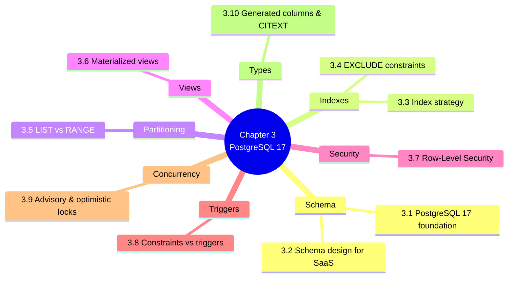

# 3. MOC — Database Layer Deep-Dive (PostgreSQL 17)

> [!abstract] Chapter goal
> PostgreSQL 17 is the foundation of the V2 redesign. This chapter teaches you the PostgreSQL features that V2 uses — not as a tutorial, but as the answer to specific V1 pathologies. By the end you will be fluent in RLS, partitioning, materialized views, EXCLUDE constraints, advisory locks, and the constraints-vs-triggers debate.

## Notes in this chapter

| Note | Title | What you learn |
|---|---|---|
| 3.1 | [[3.1. PostgreSQL 17 as the Foundation]] | Why Postgres (not MySQL, not Mongo), what version 17 specifically gives us, the extensions V2 enables. |
| 3.2 | [[3.2. Schema Design Principles for SaaS]] | The full V2 schema, organized by bounded context, with `tenant_id` everywhere, soft deletes, UUIDs + BIGINTs. |
| 3.3 | [[3.3. Index Strategy B-Tree Partial GIN BRIN GIST]] | When to use each index type. Why partial indexes are the V2 default. Why `idx_lieu_disponible` was a V1 highlight. |
| 3.4 | [[3.4. EXCLUDE Constraints and btree gist]] | The `EXCLUDE USING gist` constraint that V1 should have used for room/time overlap, with the `btree_gist` extension. |
| 3.5 | [[3.5. Table Partitioning LIST and RANGE]] | Why `inscriptions` is partitioned by `LIST (annee_universitaire)` and `audit_log` by `RANGE (created_at)`, with `pg_cron` auto-creating partitions. |
| 3.6 | [[3.6. Materialized Views and Refresh Strategies]] | `mv_module_enrollments` and `mv_module_conflicts`, why they need unique indexes for `CONCURRENTLY` refresh, and the refresh schedule. |
| 3.7 | [[3.7. Row-Level Security for Multi-Tenancy]] | How `current_setting('app.current_university_id')` plus a `USING` policy gives defense-in-depth tenant isolation. |
| 3.8 | [[3.8. Constraints vs Triggers When to Use Each]] | Why V2 uses 3 triggers total (down from V1's 4), and reserves triggers for cross-row invariants that can't be expressed declaratively. |
| 3.9 | [[3.9. Advisory Locks and Optimistic Locking]] | `pg_advisory_lock(session_id)` for scheduler mutual exclusion; `version INTEGER` column for optimistic locking on exams. |
| 3.10 | [[3.10. Generated Columns and CITEXT]] | `jour SMALLINT GENERATED ALWAYS AS (EXTRACT(ISODOW FROM date_examen)::SMALLINT) STORED`, `periode_ts TSTZRANGE GENERATED ALWAYS AS (...)`, CITEXT for case-insensitive emails. |

## Why this chapter is huge

V1's database is its weakest layer. The V2 redesign fixes more pathologies at the database layer than at any other — because the database is where multi-tenancy, integrity, and performance all live or die. Skipping this chapter means you will not understand why V2 works.

## Where to go next

After mastering the database layer, proceed to [[4. MOC|The Algorithmic Core CP-SAT Solver]] to learn how V2 replaces the greedy PL/pgSQL scheduler.
