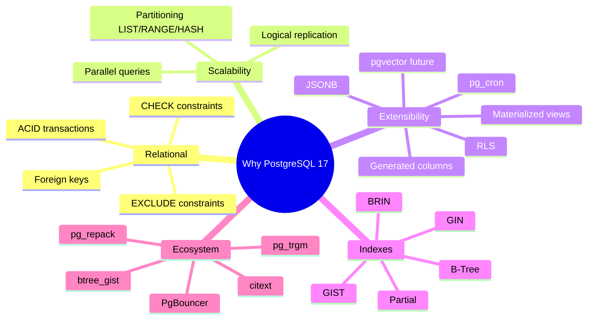
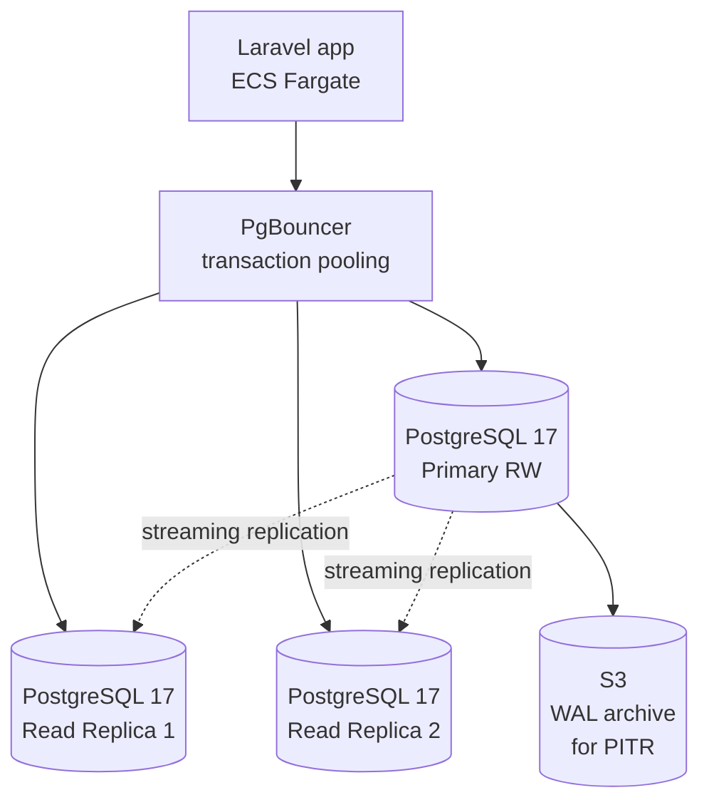

# 3.1. PostgreSQL 17 as the Foundation

> [!abstract] What this note teaches you
> Why V2 picks PostgreSQL 17 (not MySQL, not MongoDB, not a NoSQL store), what version 17 specifically gives us over 16, and the 6 extensions V2 enables. This is the foundation note for the entire database chapter.

## Why PostgreSQL

The V1 codebase used Supabase (which is Postgres under the hood) for Branch A and raw Postgres for Branch B. So the choice of Postgres was already made. But V2 makes the choice **deliberately**, with explicit reasoning.



### Why not MySQL

- **No EXCLUDE constraints.** MySQL has no equivalent of `EXCLUDE USING gist` for time-range overlap. You'd have to use triggers (the V1 anti-pattern).
- **Weaker partitioning.** MySQL partitioning is less mature; you cannot partition by an expression as cleanly.
- **No RLS.** MySQL has no row-level security. Multi-tenant isolation would have to be entirely app-enforced.
- **No generated columns of the same flexibility.** MySQL 5.7+ has generated columns but the syntax and capabilities are more limited.
- **JSONB is JSON.** Postgres JSONB is binary with indexing; MySQL JSON is text with limited indexing.

### Why not MongoDB

- **The data is fundamentally relational.** Students belong to formations, formations belong to departments, departments belong to universities. Modules have prereqs. Inscriptions link students to modules. Exams link modules to creneaux and rooms. These are joins, not embeds.
- **No ACID across collections.** Scheduling requires atomic swaps of exam sets. Postgres transactions give you this for free; MongoDB requires multi-document transactions (slower, more complex).
- **No EXCLUDE.** Same problem as MySQL.
- **No RLS.** Same problem.

### Why not a graph database (Neo4j)

The conflict graph is naturally graph-shaped, but:
- The OLTP workload (CRUD on students, modules, inscriptions) is fundamentally relational.
- The graph queries (find all modules sharing students with module X) can be expressed as SQL self-joins or materialized views.
- Adding a second database doubles the operational surface area for negligible benefit.

V2 keeps everything in Postgres and uses `mv_module_conflicts` as the materialized conflict graph.

## What PostgreSQL 17 specifically gives us

The source documents reference both PostgreSQL 16 (in CODE_REVIEW_AND_REDESIGN_01) and PostgreSQL 17 (in CODE_REVIEW_AND_REDESIGN_02, _03, and the user's task description). V2 standardizes on **PostgreSQL 17** because:

1. **Improved memory management for vacuum** — PG 17 reworks vacuum's memory tracking, significantly reducing bloat on large tables like `inscriptions` and `audit_log`.
2. **Faster `MERGE` command** — useful for the upsert patterns in the migration.
3. **Improved partition pruning** — better query plans on `inscriptions PARTITION BY LIST (annee_universitaire)`.
4. **`INCREMENTAL` materialized views** — future option for incrementally refreshing `mv_module_conflicts` instead of full refresh.
5. **Better statistics** — improved extended statistics help the planner on multi-column joins.
6. **SQL/JSON path improvements** — useful for the JSONB `details` columns in `schedule_conflicts` and `audit_log`.

> [!info] Reconciliation note
> The source documents disagreed on PG version (16 vs 17). V2 picks 17 because it is the latest stable at the time of writing and the PG 17 features directly benefit this workload. The schema and queries in this vault are valid on both 16 and 17 unless otherwise noted.

## The 6 extensions V2 enables

```sql
CREATE EXTENSION IF NOT EXISTS "pgcrypto";     -- for gen_random_uuid()
CREATE EXTENSION IF NOT EXISTS "btree_gist";   -- for EXCLUDE on (tsrange, id)
CREATE EXTENSION IF NOT EXISTS "pg_trgm";      -- for fast ILIKE search
CREATE EXTENSION IF NOT EXISTS "citext";       -- case-insensitive emails
CREATE EXTENSION IF NOT EXISTS "uuid-ossp";    -- legacy compat (gen_random_uuid is core in 13+)
CREATE EXTENSION IF NOT EXISTS pg_cron;        -- scheduled SQL jobs (MV refresh, partition creation)
```

### `pgcrypto`

Provides `gen_random_uuid()` (though this is in core PG 13+, the extension is still commonly declared for portability). Used in every UUID primary key.

### `btree_gist`

Required for `EXCLUDE USING gist` constraints that mix scalar columns (like `lieu_id`) with range columns (like `periode_ts TSTZRANGE`). Without `btree_gist`, GIST indexes can only operate on geometric/range types, not plain integers. See [[3.4. EXCLUDE Constraints and btree gist]].

### `pg_trgm`

Provides trigram-based fuzzy text search. V2 uses it for fast `ILIKE` queries on student and professor names:

```sql
CREATE INDEX idx_etudiants_nom_trgm ON etudiants USING GIN (nom gin_trgm_ops);
```

This turns `WHERE nom ILIKE '%ahmed%'` from a seq scan into an index scan. See [[3.3. Index Strategy B-Tree Partial GIN BRIN GIST]].

### `citext`

Case-insensitive text type. V2 uses it for email columns so that `'user@example.com'` and `'USER@example.com'` are treated as equal:

```sql
email CITEXT UNIQUE
```

Without `citext`, you'd need a `LOWER(email)` unique index, which is more verbose.

### `uuid-ossp`

Legacy compatibility. `gen_random_uuid()` is in core PG 13+, but some tools and ORMs expect the extension to be present. Harmless to declare.

### `pg_cron`

PostgreSQL's scheduled-job extension. V2 uses it for:
- Refreshing `mv_module_enrollments` nightly at 02:00.
- Auto-creating next year's partitions on January 1st.
- Optional: `REFRESH MATERIALIZED VIEW CONCURRENTLY mv_module_conflicts` on a schedule if no scheduling run is in progress.

See [[10.6. The pg-cron Scheduler for Background DB Jobs]].

## V2 deployment topology



- **Primary** serves all writes and the hot-path reads.
- **Read replicas** serve dashboard reads (which are 90% of the traffic).
- **PgBouncer** in transaction pooling mode multiplexes thousands of Laravel connections onto a small Postgres backend pool. See [[10.3. Connection Pooling with PgBouncer]].
- **WAL archive to S3** enables point-in-time recovery (PITR) — see [[6.7. Soft Deletes and Data Lifecycle]].

## Common junior developer mistakes

- **Choosing a database based on hype.** Pick the database that fits your data model. Exam scheduling is relational → Postgres. Not MongoDB, not Neo4j, not Redis-as-primary.
- **Enabling every extension "just in case".** Each extension adds catalog overhead. Enable only what you use.
- **Skipping `btree_gist`.** Without it, you cannot use `EXCLUDE` for time-range overlap, and you'll fall back to triggers (the V1 anti-pattern).
- **Forgetting to install `pg_cron` in the shared_preload_libraries.** The extension requires a server-level config change and a restart. Plan for it in your provisioning script, not after deploy.
- **Picking PG 16 when 17 is available.** Always run the latest stable minor version of the latest major. PG 17's vacuum and partitioning improvements are directly relevant to this workload.

## What to read next

- [[3.2. Schema Design Principles for SaaS]] — the full V2 schema on this foundation.
- [[3.3. Index Strategy B-Tree Partial GIN BRIN GIST]] — the V2 index plan.
- [[10.3. Connection Pooling with PgBouncer]] — how Laravel connects.
