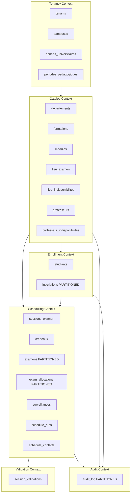

# 3.2. Schema Design Principles for SaaS

> [!abstract] What this note teaches you
> The complete V2 PostgreSQL schema, organized by bounded context. Every table has `tenant_id`, `public_uid UUID`, `id BIGINT`, `created_at`, `updated_at`, `deleted_at`. All FKs are `ON DELETE RESTRICT`. This note is the canonical reference for every other database note in the vault.

## Design principles

Before the schema itself, the principles that produced it:

1. **Every tenant-scoped table has `university_id BIGINT NOT NULL`.** This is the partition key for RLS and (in some tables) for LIST partitioning.
2. **Two IDs per table:** `id BIGINT GENERATED ALWAYS AS IDENTITY` (fast joins) + `public_uid UUID DEFAULT gen_random_uuid()` (unguessable URLs).
3. **Soft deletes everywhere:** `deleted_at TIMESTAMPTZ`. Never `ON DELETE CASCADE`.
4. **All FKs are `ON DELETE RESTRICT`.** You must soft-delete children before parents.
5. **`created_by BIGINT` on every mutable table** — for audit accountability.
6. **CHECK constraints over triggers** wherever possible. See [[3.8. Constraints vs Triggers When to Use Each]].
7. **Partial unique indexes** for soft-delete-aware uniqueness: `WHERE deleted_at IS NULL`.
8. **CITEXT for emails**, `TEXT + CHECK (char_length(...) <= N)` for bounded strings (not VARCHAR(N)).

## The schema by bounded context



## Reference tables (Tenancy context)

### `universities` (or `tenants`)

The top-level tenant. One row per university.

```sql
CREATE TABLE universities (
    id          BIGINT GENERATED ALWAYS AS IDENTITY PRIMARY KEY,
    public_uid  UUID NOT NULL DEFAULT gen_random_uuid() UNIQUE,
    nom         TEXT NOT NULL,
    code        TEXT NOT NULL,
    pays        TEXT,
    fuseau      TEXT NOT NULL DEFAULT 'Africa/Algiers',
    created_at  TIMESTAMPTZ NOT NULL DEFAULT NOW(),
    updated_at  TIMESTAMPTZ NOT NULL DEFAULT NOW(),
    deleted_at  TIMESTAMPTZ,
    UNIQUE (nom)
);
```

### `campuses`

Multi-campus support per university.

```sql
CREATE TABLE campuses (
    id            BIGINT GENERATED ALWAYS AS IDENTITY PRIMARY KEY,
    public_uid    UUID NOT NULL DEFAULT gen_random_uuid() UNIQUE,
    university_id BIGINT NOT NULL REFERENCES universities(id) ON DELETE RESTRICT,
    nom           TEXT NOT NULL,
    adresse       TEXT,
    created_at    TIMESTAMPTZ NOT NULL DEFAULT NOW(),
    updated_at    TIMESTAMPTZ NOT NULL DEFAULT NOW(),
    deleted_at    TIMESTAMPTZ,
    UNIQUE (university_id, nom)
);
```

### `annees_universitaires`

Academic years, modeled correctly (V1 stored them as `VARCHAR(9)` strings).

```sql
CREATE TABLE annees_universitaires (
    id            BIGINT GENERATED ALWAYS AS IDENTITY PRIMARY KEY,
    university_id BIGINT NOT NULL REFERENCES universities(id) ON DELETE RESTRICT,
    code          CHAR(9) NOT NULL CHECK (code ~ '^\d{4}-\d{4}$'),
    date_debut    DATE NOT NULL,
    date_fin      DATE NOT NULL,
    statut        TEXT NOT NULL DEFAULT 'planifiee'
                  CHECK (statut IN ('planifiee','active','closee')),
    created_at    TIMESTAMPTZ NOT NULL DEFAULT NOW(),
    UNIQUE (university_id, code),
    CHECK (date_fin > date_debut)
);
```

### `periodes_pedagogiques`

Curriculum periods (L1-S1, L1-S2, ..., M2-S2). Fixes V1's `modules.semestre INTEGER` hack.

```sql
CREATE TABLE periodes_pedagogiques (
    id            BIGINT GENERATED ALWAYS AS IDENTITY PRIMARY KEY,
    university_id BIGINT NOT NULL REFERENCES universities(id) ON DELETE RESTRICT,
    code          TEXT NOT NULL,
    niveau        TEXT NOT NULL CHECK (niveau IN ('L1','L2','L3','M1','M2','DOC')),
    semestre      SMALLINT NOT NULL CHECK (semestre IN (1,2)),
    annee_etude   SMALLINT NOT NULL,
    UNIQUE (university_id, code)
);
```

## Catalog context

### `departements`

```sql
CREATE TABLE departements (
    id            BIGINT GENERATED ALWAYS AS IDENTITY PRIMARY KEY,
    public_uid    UUID NOT NULL DEFAULT gen_random_uuid() UNIQUE,
    university_id BIGINT NOT NULL REFERENCES universities(id) ON DELETE RESTRICT,
    campus_id     BIGINT REFERENCES campuses(id) ON DELETE RESTRICT,
    nom           TEXT NOT NULL,
    code          TEXT NOT NULL,
    chef_dept_id  BIGINT,  -- FK added later (circular with professeurs)
    created_at    TIMESTAMPTZ NOT NULL DEFAULT NOW(),
    updated_at    TIMESTAMPTZ NOT NULL DEFAULT NOW(),
    deleted_at    TIMESTAMPTZ,
    UNIQUE (university_id, code)
);
```

### `modules`

```sql
CREATE TABLE modules (
    id                       BIGINT GENERATED ALWAYS AS IDENTITY PRIMARY KEY,
    public_uid               UUID NOT NULL DEFAULT gen_random_uuid() UNIQUE,
    university_id            BIGINT NOT NULL REFERENCES universities(id) ON DELETE RESTRICT,
    formation_id             BIGINT NOT NULL REFERENCES formations(id) ON DELETE RESTRICT,
    periode_pedagogique_id   BIGINT NOT NULL REFERENCES periodes_pedagogiques(id) ON DELETE RESTRICT,
    code                     TEXT NOT NULL,
    nom                      TEXT NOT NULL,
    credits                  SMALLINT NOT NULL DEFAULT 3 CHECK (credits BETWEEN 1 AND 12),
    duree_examen_minutes     SMALLINT NOT NULL DEFAULT 90 CHECK (duree_examen_minutes IN (60,90,120,180)),
    type_examen              TEXT NOT NULL DEFAULT 'ecrit' CHECK (type_examen IN ('ecrit','oral','tp','projet','mixte')),
    type_lieu_requis         TEXT NOT NULL DEFAULT 'any' CHECK (type_lieu_requis IN ('amphi','salle','labo','any')),
    equipements_requis       TEXT[],
    professeur_responsable_id BIGINT,  -- FK added later
    created_at               TIMESTAMPTZ NOT NULL DEFAULT NOW(),
    updated_at               TIMESTAMPTZ NOT NULL DEFAULT NOW(),
    deleted_at               TIMESTAMPTZ,
    UNIQUE (university_id, code)
);

CREATE INDEX idx_modules_formation ON modules (formation_id) WHERE deleted_at IS NULL;
CREATE INDEX idx_modules_periode ON modules (periode_pedagogique_id) WHERE deleted_at IS NULL;
CREATE INDEX idx_modules_equipements ON modules USING GIN (equipements_requis);
```

### `lieu_examen`

```sql
CREATE TABLE lieu_examen (
    id              BIGINT GENERATED ALWAYS AS IDENTITY PRIMARY KEY,
    public_uid      UUID NOT NULL DEFAULT gen_random_uuid() UNIQUE,
    university_id   BIGINT NOT NULL REFERENCES universities(id) ON DELETE RESTRICT,
    campus_id       BIGINT REFERENCES campuses(id) ON DELETE RESTRICT,
    nom             TEXT NOT NULL,
    code            TEXT NOT NULL,
    capacite        SMALLINT NOT NULL CHECK (capacite BETWEEN 1 AND 5000),
    type            TEXT NOT NULL CHECK (type IN ('amphi','salle','labo','exterieur')),
    batiment        TEXT,
    etage           SMALLINT,
    equipements     TEXT[],
    accessible_pmr  BOOLEAN NOT NULL DEFAULT TRUE,
    statut          TEXT NOT NULL DEFAULT 'actif' CHECK (statut IN ('actif','inactif','maintenance')),
    created_at      TIMESTAMPTZ NOT NULL DEFAULT NOW(),
    updated_at      TIMESTAMPTZ NOT NULL DEFAULT NOW(),
    deleted_at      TIMESTAMPTZ,
    UNIQUE (university_id, code)
);

CREATE INDEX idx_lieu_dispo_capacite ON lieu_examen (capacite DESC) WHERE statut = 'actif' AND deleted_at IS NULL;
CREATE INDEX idx_lieu_equipements ON lieu_examen USING GIN (equipements);
CREATE INDEX idx_lieu_type ON lieu_examen (type) WHERE statut = 'actif';
```

## Scheduling context

### `sessions_examen`

```sql
CREATE TABLE sessions_examen (
    id                       BIGINT GENERATED ALWAYS AS IDENTITY PRIMARY KEY,
    public_uid               UUID NOT NULL DEFAULT gen_random_uuid() UNIQUE,
    university_id            BIGINT NOT NULL REFERENCES universities(id) ON DELETE RESTRICT,
    annee_universitaire_id   BIGINT NOT NULL REFERENCES annees_universitaires(id),
    periode_pedagogique_id   BIGINT NOT NULL REFERENCES periodes_pedagogiques(id),
    nom                      TEXT NOT NULL,
    type                     TEXT NOT NULL CHECK (type IN ('normale','rattrapage','exceptionnelle')),
    date_debut               DATE NOT NULL,
    date_fin                 DATE NOT NULL,
    statut                   TEXT NOT NULL DEFAULT 'planification'
                             CHECK (statut IN ('planification','generation','genere','validation','valide','publie','en_cours','termine','annule')),
    created_by               BIGINT NOT NULL,
    created_at               TIMESTAMPTZ NOT NULL DEFAULT NOW(),
    updated_at               TIMESTAMPTZ NOT NULL DEFAULT NOW(),
    deleted_at               TIMESTAMPTZ,
    CHECK (date_fin > date_debut)
);

CREATE INDEX idx_sessions_univ_statut ON sessions_examen (university_id, statut) WHERE deleted_at IS NULL;
```

### `creneaux` (with generated columns)

```sql
CREATE TABLE creneaux (
    id            BIGINT GENERATED ALWAYS AS IDENTITY PRIMARY KEY,
    public_uid    UUID NOT NULL DEFAULT gen_random_uuid() UNIQUE,
    session_id    BIGINT NOT NULL REFERENCES sessions_examen(id) ON DELETE RESTRICT,
    date_examen   DATE NOT NULL,
    heure_debut   TIME NOT NULL,
    heure_fin     TIME NOT NULL,
    jour          SMALLINT GENERATED ALWAYS AS (EXTRACT(ISODOW FROM date_examen)::SMALLINT) STORED,
    periode_ts    TSTZRANGE GENERATED ALWAYS AS (
                    tstzrange((date_examen + heure_debut)::timestamptz,
                              (date_examen + heure_fin)::timestamptz)
                  ) STORED,
    created_at    TIMESTAMPTZ NOT NULL DEFAULT NOW(),
    UNIQUE (session_id, date_examen, heure_debut),
    CHECK (heure_fin > heure_debut)
);

CREATE INDEX idx_creneaux_session_date ON creneaux (session_id, date_examen, heure_debut);
```

The `periode_ts TSTZRANGE` generated column is what makes the `EXCLUDE USING gist` constraint on `examens` possible — see [[3.4. EXCLUDE Constraints and btree gist]].

### `examens` (partitioned)

```sql
CREATE TABLE examens (
    id                       BIGINT GENERATED ALWAYS AS IDENTITY,
    public_uid               UUID NOT NULL DEFAULT gen_random_uuid(),
    university_id            BIGINT NOT NULL,
    session_id               BIGINT NOT NULL,
    module_id                BIGINT NOT NULL,
    creneau_id               BIGINT NOT NULL,
    lieu_id                  BIGINT NOT NULL,
    surveillant_principal_id BIGINT,
    nb_etudiants_prevus      INTEGER NOT NULL,
    statut                   TEXT NOT NULL DEFAULT 'planifie'
                             CHECK (statut IN ('planifie','confirme','en_cours','termine','annule','lock')),
    version                  INTEGER NOT NULL DEFAULT 1,  -- optimistic locking
    notes                    TEXT,
    created_by               BIGINT NOT NULL,
    created_at               TIMESTAMPTZ NOT NULL DEFAULT NOW(),
    updated_at               TIMESTAMPTZ NOT NULL DEFAULT NOW(),
    deleted_at               TIMESTAMPTZ,
    annee_universitaire      CHAR(9) NOT NULL,
    PRIMARY KEY (id, annee_universitaire),
    UNIQUE (public_uid, annee_universitaire)
) PARTITION BY LIST (annee_universitaire);

CREATE TABLE examens_2024_2025 PARTITION OF examens FOR VALUES IN ('2024-2025');
CREATE TABLE examens_2025_2026 PARTITION OF examens FOR VALUES IN ('2025-2026');
CREATE TABLE examens_default PARTITION OF examens DEFAULT;
```

The critical partial unique indexes:

```sql
CREATE UNIQUE INDEX uq_examen_lieu_creneau
    ON examens (lieu_id, creneau_id)
    WHERE statut NOT IN ('annule') AND deleted_at IS NULL;

CREATE UNIQUE INDEX uq_examen_prof_creneau
    ON examens (surveillant_principal_id, creneau_id)
    WHERE surveillant_principal_id IS NOT NULL
      AND statut NOT IN ('annule')
      AND deleted_at IS NULL;

CREATE UNIQUE INDEX uq_examen_module_session
    ON examens (module_id, session_id)
    WHERE statut NOT IN ('annule') AND deleted_at IS NULL;
```

Note: this is the V2 schema for the "one room per exam" case. For split-room support, see the `exam_allocations` table in [[2.6. The Fatal UNIQUE Constraint]] and the CP-SAT model in [[4.4. The 16 Hard Constraints]].

## Validation context

### `session_validations`

Replaces V1's fake "Valider le planning" button with a real table.

```sql
CREATE TABLE session_validations (
    id              BIGINT GENERATED ALWAYS AS IDENTITY PRIMARY KEY,
    session_id      BIGINT NOT NULL REFERENCES sessions_examen(id) ON DELETE RESTRICT,
    departement_id  BIGINT NOT NULL REFERENCES departements(id) ON DELETE RESTRICT,
    statut          TEXT NOT NULL DEFAULT 'en_attente'
                    CHECK (statut IN ('en_attente','valide','rejete','a_reviser')),
    decided_by      BIGINT,
    decided_at      TIMESTAMPTZ,
    commentaire     TEXT,
    created_at      TIMESTAMPTZ NOT NULL DEFAULT NOW(),
    updated_at      TIMESTAMPTZ NOT NULL DEFAULT NOW(),
    UNIQUE (session_id, departement_id)
);
```

## Audit context

### `audit_log` (RANGE partitioned by year)

```sql
CREATE TABLE audit_log (
    id              BIGINT GENERATED ALWAYS AS IDENTITY,
    created_at      TIMESTAMPTZ NOT NULL DEFAULT NOW(),
    university_id   BIGINT NOT NULL,
    user_id         BIGINT,
    action          TEXT NOT NULL,
    entity_type     TEXT NOT NULL,
    entity_id       BIGINT,
    before_data     JSONB,
    after_data      JSONB,
    ip_address      INET,
    user_agent      TEXT,
    PRIMARY KEY (id, created_at)
) PARTITION BY RANGE (created_at);

CREATE TABLE audit_log_2025 PARTITION OF audit_log
    FOR VALUES FROM ('2025-01-01') TO ('2026-01-01');
CREATE TABLE audit_log_2026 PARTITION OF audit_log
    FOR VALUES FROM ('2026-01-01') TO ('2027-01-01');
CREATE TABLE audit_log_default PARTITION OF audit_log DEFAULT;

CREATE INDEX idx_audit_entity ON audit_log (entity_type, entity_id);
CREATE INDEX idx_audit_user ON audit_log (user_id, created_at DESC);
```

## What to read next

- [[3.3. Index Strategy B-Tree Partial GIN BRIN GIST]] — the index plan in detail.
- [[3.4. EXCLUDE Constraints and btree gist]] — the time-range overlap constraint.
- [[3.5. Table Partitioning LIST and RANGE]] — why `inscriptions` and `examens` are partitioned.
- [[3.7. Row-Level Security for Multi-Tenancy]] — the RLS policies on every tenant-scoped table.
