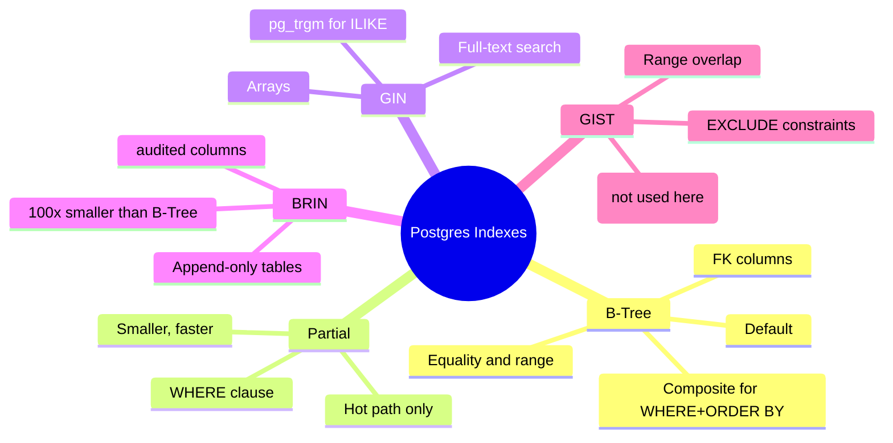

# 3.3. Index Strategy: B-Tree, Partial, GIN, BRIN, GIST

> [!abstract] What this note teaches you
> Postgres offers 5+ index types, each tuned for a different access pattern. V2 uses all 5 deliberately. This note explains when to use each, why V1 had good instincts (partial indexes) but missed hot paths, and how to read `EXPLAIN ANALYZE` to verify your choices.

## The 5 index types V2 uses



## B-Tree (the default)

Use for:
- Equality lookups (`WHERE x = ?`).
- Range lookups (`WHERE x > ? AND x < ?`).
- `ORDER BY` matching the index order.
- Foreign key columns (always index FKs — Postgres does NOT do this automatically).

V2 example:

```sql
CREATE INDEX idx_modules_formation ON modules (formation_id) WHERE deleted_at IS NULL;
```

> [!warning] Postgres does not auto-index FKs
> MySQL/InnoDB auto-creates indexes on foreign keys. Postgres does not. Every FK column needs an explicit `CREATE INDEX`. V1 Branch B (the `univ_exam_optimizer` skeleton) had zero indexes on FK columns — every join was a seq scan.

## Partial indexes

A partial index has a `WHERE` clause. It only indexes rows matching the predicate. Benefits:
- Smaller index (less disk, faster scans).
- Faster writes (fewer index entries to maintain).
- Can enforce uniqueness only on a subset of rows.

V2 uses partial indexes for **every hot-path query**:

```sql
-- Only active inscriptions
CREATE INDEX idx_inscriptions_module
    ON inscriptions (module_id, etudiant_id)
    WHERE statut IN ('inscrit','rattrapage') AND deleted_at IS NULL;

-- Only active rooms, ordered for the scheduler's hot query
CREATE INDEX idx_lieu_dispo_capacite
    ON lieu_examen (capacite DESC)
    WHERE statut = 'actif' AND deleted_at IS NULL;

-- Only non-cancelled exams (the scheduler's conflict check)
CREATE INDEX idx_examens_scheduled
    ON examens (creneau_id, lieu_id)
    WHERE statut != 'annule' AND deleted_at IS NULL;
```

> [!example] V1's partial indexes were a highlight
> V1 had `idx_inscriptions_active ... WHERE statut IN ('inscrit', 'rattrapage')` and `idx_lieu_disponible ON lieu_examen (capacite DESC) WHERE disponible = TRUE`. These were textbook partial indexes, well-chosen. V2 keeps the pattern and extends it to every table.

## GIN (Generalized Inverted Index)

Use for:
- Array columns (`TEXT[]`, `INTEGER[]`).
- Full-text search (`tsvector`).
- Trigram fuzzy search (`pg_trgm` extension).

V2 examples:

```sql
-- Array containment queries: "rooms that have a projector"
CREATE INDEX idx_lieu_equipements ON lieu_examen USING GIN (equipements);

-- Required-equipment matching for modules
CREATE INDEX idx_modules_equipements ON modules USING GIN (equipements_requis);

-- Fast ILIKE on student/professor names (avoids seq scan on leading-wildcard LIKE)
CREATE INDEX idx_etudiants_nom_trgm ON etudiants USING GIN (nom gin_trgm_ops);
CREATE INDEX idx_etudiants_prenom_trgm ON etudiants USING GIN (prenom gin_trgm_ops);
```

The trigram indexes are the V2 fix for V1's `ilike("nom", f"%{nom}%")` seq scan — see [[2.8. Missing Security and Multi-Tenancy]].

## BRIN (Block Range Index)

Use for:
- Append-only or mostly-append-only tables.
- Columns where adjacent rows have similar values (time-ordered, id-ordered).

BRIN stores only the min/max of each block (8MB by default), so the index is ~100× smaller than a B-Tree. The trade-off: BRIN is less precise — it tells you "the value might be in this block" rather than "the value is on this page".

V2 examples:

```sql
-- inscriptions is append-mostly; created_at is monotonic
CREATE INDEX idx_inscriptions_created_brin ON inscriptions USING brin (created_at);

-- audit_log is strictly append-only
-- (combined with RANGE partitioning by created_at for additional pruning)
```

V1 had no BRIN indexes — every append-only table used a B-Tree, wasting space and write throughput.

## GIST (Generalized Search Tree)

Use for:
- Range overlap (`&&` operator on `TSTZRANGE`, `DATERANGE`, etc.).
- `EXCLUDE USING gist` constraints.
- Geometric types (not used in V2).

V2 uses GIST for the **time-range overlap constraint** on `examens`:

```sql
-- Requires btree_gist extension
ALTER TABLE examens
    ADD CONSTRAINT excl_examen_room_slot
    EXCLUDE USING gist (
        lieu_id WITH =,
        periode_ts WITH &&
    ) WHERE (statut NOT IN ('annule','lock') AND deleted_at IS NULL);
```

See [[3.4. EXCLUDE Constraints and btree gist]] for the full treatment.

## Composite indexes

When a query has multiple predicates and an `ORDER BY`, a single composite index can serve both:

```sql
-- Dashboard query: WHERE university_id = ? ORDER BY date_debut DESC
CREATE INDEX idx_sessions_univ_statut
    ON sessions_examen (university_id, statut)
    WHERE deleted_at IS NULL;
```

The column order matters: equality columns first, then range/sort columns. A common junior mistake is to put the most-selective column first regardless of the query — this is wrong; the planner uses the index in the order it was defined.

## Covering indexes with INCLUDE

When a query needs a few extra columns that don't need to be in the search key, use `INCLUDE`:

```sql
-- Hot path: WHERE module_id = ? AND etudiant_id = ?; SELECT statut
CREATE INDEX idx_inscriptions_conflict
    ON inscriptions (module_id, etudiant_id) INCLUDE (statut);
```

The `statut` is stored in the index leaf, so the query is an **index-only scan** — no heap fetch. V1 had this on `idx_inscriptions_conflict` and it was a good instinct.

> [!warning] V1's redundant index mistake
> V1 also had `idx_inscriptions_active ON inscriptions (module_id, etudiant_id) WHERE statut IN ('inscrit', 'rattrapage')`. The partial index made the covering index largely redundant for active-row queries. V2 drops the redundant one and keeps the partial.

## How to verify your index choices

```sql
EXPLAIN ANALYZE
SELECT * FROM etudiants
WHERE university_id = 42
  AND nom ILIKE '%ahmed%'
  AND deleted_at IS NULL;
```

Read the output:
- **Seq Scan** → no index used. Bad if the table is large.
- **Index Scan** → index used, heap fetched. Good for selective queries.
- **Index Only Scan** → index used, heap not fetched. Best.
- **Bitmap Index Scan + Bitmap Heap Scan** → index used for bitmap, then heap fetched in bulk. Good for medium-selectivity.

If you see `Seq Scan` on a large table, you are missing an index (or the planner thinks the index isn't selective enough — check `ANALYZE` statistics).

See [[10.2. Query Plan Analysis with EXPLAIN ANALYZE]] for the full treatment.

## Common junior developer mistakes

- **Indexing every column individually.** A single-column index on `a` plus one on `b` does not help `WHERE a = ? AND b = ?` as much as a composite `(a, b)` index.
- **Forgetting to index FKs.** Postgres does not do this automatically. Every FK column needs an explicit index.
- **Using B-Tree for everything.** Arrays need GIN. Time ranges need GIST. Append-only tables benefit from BRIN.
- **No partial indexes on hot paths.** A full index on `examens (creneau_id, lieu_id)` wastes space on cancelled exams. Add `WHERE statut != 'annule'`.
- **Not running `ANALYZE` after big loads.** The planner's statistics are stale after a bulk insert. Run `ANALYZE etudiants;` after seeding.
- **Trusting the planner blindly.** `EXPLAIN ANALYZE` is your friend. If a query is slow, look at the plan before adding indexes.

## What to read next

- [[3.4. EXCLUDE Constraints and btree gist]] — the GIST use case in detail.
- [[3.5. Table Partitioning LIST and RANGE]] — how partition pruning interacts with indexes.
- [[10.2. Query Plan Analysis with EXPLAIN ANALYZE]] — reading query plans.
