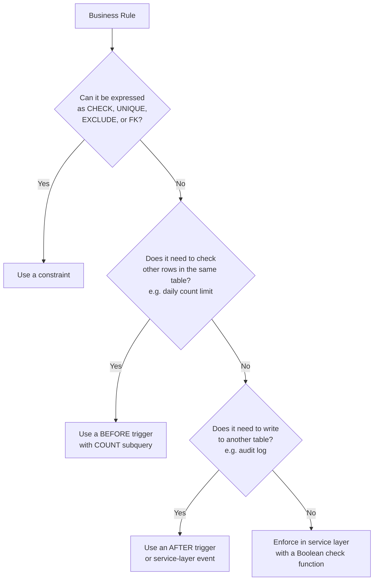

# 3.8. Constraints vs Triggers: When to Use Each

> [!abstract] What this note teaches you
> V1 used 4 triggers to enforce what should have been declarative constraints. V2 uses 3 triggers total — and only for rules that cannot be expressed declaratively. This note is the V2 policy on when to use CHECK / UNIQUE / EXCLUDE / FK (constraints) vs AFTER / BEFORE ROW triggers.

## The decision matrix



## Why constraints beat triggers

| Property | Constraint | Trigger |
|---|---|---|
| Declarative | Yes — part of schema | No — procedural code |
| Visible in `\d+` constraints | Yes | No (separate "Triggers" section) |
| Disable via `ALTER TABLE` | No (requires DROP CONSTRAINT) | Yes (`DISABLE TRIGGER`) |
| Performance | Index-based, O(log N) | Per-row, often O(N) |
| Error specificity | Mentions the failing constraint and row | Custom (whatever you RAISE) |
| Testability | Implicit (DB enforces) | Requires explicit test |
| Bypass risk | Only via DROP CONSTRAINT | Easy via DISABLE TRIGGER |

Constraints are strictly better whenever they can express the rule.

## V1's trigger inventory (and the V2 replacement)

| V1 Trigger | Rule | V2 Replacement |
|---|---|---|
| `trg_check_room_capacity` | `nb_etudiants_prevus ≤ lieu.capacite` | **CHECK constraint** (with generated column for `nb_inscrits_actifs`) |
| `trg_check_professor_availability` | No two exams same prof same time | **EXCLUDE USING gist** on `(surveillant_principal_id, periode_ts)` |
| `trg_check_professor_daily_limit` | Max 3 proctorings/day per prof | **Trigger retained** (cross-row count) |
| `trg_check_room_availability` | No two exams same room same time | **EXCLUDE USING gist** on `(lieu_id, periode_ts)` |
| `trg_examens_updated_at` | Maintain `updated_at` | **Trigger retained** (idiomatic) |

V1 had 5 triggers; V2 has 3. The 2 removed became declarative constraints.

## The 3 triggers V2 keeps

### 1. `trg_set_updated_at` (generic, idiomatic)

Every table with `updated_at` has this trigger. There is no declarative way to say "set this column to NOW() on UPDATE".

```sql
CREATE OR REPLACE FUNCTION trg_set_updated_at() RETURNS TRIGGER AS $$
BEGIN
    NEW.updated_at = NOW();
    RETURN NEW;
END;
$$ LANGUAGE plpgsql;

-- One trigger per table (created via a DO block)
CREATE TRIGGER set_updated_at BEFORE UPDATE ON examens
    FOR EACH ROW EXECUTE FUNCTION trg_set_updated_at();
```

### 2. `trg_check_prof_daily` (cross-row invariant)

The "max 3 proctorings per day per professor" rule is a count, not an overlap. EXCLUDE cannot enforce counts.

```sql
CREATE OR REPLACE FUNCTION check_professor_daily_limit() RETURNS TRIGGER AS $$
DECLARE
    v_date DATE;
    v_count INTEGER;
    v_max SMALLINT;
BEGIN
    IF NEW.surveillant_principal_id IS NULL THEN RETURN NEW; END IF;

    SELECT date_examen INTO v_date FROM creneaux WHERE id = NEW.creneau_id;
    SELECT max_surveillances_jour INTO v_max
    FROM professeurs WHERE id = NEW.surveillant_principal_id;

    SELECT COUNT(*) INTO v_count
    FROM examens e
    JOIN creneaux c ON e.creneau_id = c.id
    WHERE e.surveillant_principal_id = NEW.surveillant_principal_id
      AND c.date_examen = v_date
      AND e.statut NOT IN ('annule')
      AND e.deleted_at IS NULL
      AND e.id <> NEW.id;

    IF v_count >= v_max THEN
        RAISE EXCEPTION 'Professor % already has % exams on % (limit %)',
            NEW.surveillant_principal_id, v_count, v_date, v_max;
    END IF;
    RETURN NEW;
END;
$$ LANGUAGE plpgsql;

CREATE TRIGGER trg_check_prof_daily
    BEFORE INSERT OR UPDATE ON examens
    FOR EACH ROW
    WHEN (NEW.surveillant_principal_id IS NOT NULL AND NEW.statut NOT IN ('annule'))
    EXECUTE FUNCTION check_professor_daily_limit();
```

The `WHEN` clause is a guard that skips the trigger body for non-applicable rows — important for performance.

### 3. `audit_trigger_fn` (writes to another table)

The audit log trigger writes to `audit_log` AFTER any INSERT/UPDATE/DELETE on audited tables. This is a side effect, not an invariant — it cannot be a constraint.

```sql
CREATE OR REPLACE FUNCTION audit_trigger_fn() RETURNS TRIGGER AS $$
BEGIN
    INSERT INTO audit_log (university_id, user_id, action, entity_type, entity_id,
                           before_data, after_data, ip_address, user_agent)
    VALUES (
        COALESCE(NEW.university_id, OLD.university_id),
        current_setting('app.current_user_id', true)::bigint,
        TG_OP,
        TG_TABLE_NAME,
        COALESCE(NEW.id, OLD.id),
        CASE WHEN TG_OP = 'DELETE' OR TG_OP = 'UPDATE' THEN to_jsonb(OLD) END,
        CASE WHEN TG_OP = 'INSERT' OR TG_OP = 'UPDATE' THEN to_jsonb(NEW) END,
        NULL::inet,
        NULL
    );
    RETURN COALESCE(NEW, OLD);
END;
$$ LANGUAGE plpgsql;

CREATE TRIGGER audit_examens AFTER INSERT OR UPDATE OR DELETE ON examens
    FOR EACH ROW EXECUTE FUNCTION audit_trigger_fn();
```

## The STABLE Boolean function pattern

For rules that need cross-row validation but are called *before* the INSERT (not as a trigger), V2 uses a `STABLE` function that returns BOOLEAN. The caller checks the return value with a plain `IF`:

```sql
CREATE OR REPLACE FUNCTION verify_allocation_validity(
    p_module_id UUID, p_timeslot_id UUID, p_room_id UUID
) RETURNS BOOLEAN AS $$
DECLARE v_has_conflict BOOLEAN;
BEGIN
    SELECT EXISTS (
        SELECT 1 FROM exam_allocations alloc
        JOIN exams e ON alloc.exam_id = e.id
        WHERE e.timeslot_id = p_timeslot_id AND alloc.room_id = p_room_id
    ) INTO v_has_conflict;
    IF v_has_conflict THEN RETURN FALSE; END IF;

    SELECT EXISTS (
        SELECT 1 FROM inscriptions ins_active
        JOIN exams e_active ON ins_active.module_id = e_active.module_id
        WHERE e_active.timeslot_id = p_timeslot_id
          AND ins_active.student_id IN (
              SELECT student_id FROM inscriptions WHERE module_id = p_module_id
          )
    ) INTO v_has_conflict;
    IF v_has_conflict THEN RETURN FALSE; END IF;

    RETURN TRUE;
END;
$$ LANGUAGE plpgsql STABLE;
```

The `STABLE` marker tells the planner this function is read-only and can be cached within a transaction. The caller does:

```sql
IF verify_allocation_validity(m, t, r) THEN
    INSERT INTO exam_allocations ...;
ELSE
    -- handle conflict
END IF;
```

No exception, no subtransaction. This is the V2 replacement for V1's `EXCEPTION WHEN OTHERS` pattern — see [[2.5. PL-pgSQL Anti-Patterns]] anti-pattern 2.

## Common junior developer mistakes

- **Using a trigger when a CHECK would do.** `CHECK (capacite > 0)` is simpler, faster, and more visible than a trigger that raises an exception.
- **Using a trigger when EXCLUDE would do.** Time-range overlap is a textbook EXCLUDE use case.
- **Forgetting the `WHEN` clause on triggers.** A trigger that fires on every row but only does work for some rows wastes planner time.
- **Using a trigger to maintain a denormalized column** when a generated column would work. Generated columns are always consistent; triggers can be bypassed.
- **Writing audit logic in triggers AND in service layer.** Pick one. V2 uses triggers for audit because it catches even raw SQL inserts from migrations.
- **Not testing trigger order.** Multiple triggers on the same table fire alphabetically by name. If order matters, name them accordingly (`trg_01_audit`, `trg_02_validate`).

## What to read next

- [[3.4. EXCLUDE Constraints and btree gist]] — the declarative alternative to V1's overlap triggers.
- [[2.7. Trigger Abuse for Control Flow]] — the V1 anti-patterns this note replaces.
- [[6.6. Audit Logging and Hash Chaining]] — the audit trigger in context.
- [[3.10. Generated Columns and CITEXT]] — the alternative to "maintain this column via trigger".
