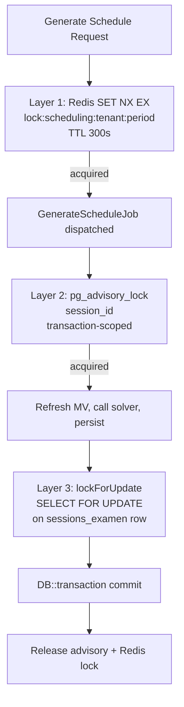

# 3.9. Advisory Locks and Optimistic Locking

> [!abstract] What this note teaches you
> V1 had no locking — concurrent admins clicking "Generate" corrupted schedules. V2 uses three locking layers: Redis `SET NX EX` for cross-instance mutual exclusion, `pg_advisory_lock` for DB-level session-scoped locks, and `version INTEGER` columns for optimistic locking on concurrent edits. This note explains when each is appropriate.

## The three locking layers



## Layer 1: Redis `SET NX EX` (cross-instance)

The first layer is a Redis distributed lock acquired by the `GenerateScheduleHandler` before dispatching the job:

```php
public function acquireLock(TenantId $tenantId, PeriodId $periodId, int $ttlSeconds): bool
{
    $lockKey = sprintf("lock:scheduling:%s:%s", $tenantId->toString(), $periodId->toString());
    $value = microtime(true) . gen_random_uuid();

    // Atomic SET-if-not-exists with TTL
    return (bool) Redis::set($lockKey, $value, 'EX', $ttlSeconds, 'NX');
}
```

The `NX` flag means "set only if not exists" — atomic. The `EX 300` flag sets a 300-second TTL. This prevents the lock from being held forever if the worker crashes.

**Why Redis and not Postgres for this layer:** the lock must be acquired *before* the job is dispatched, when we may not have an open DB transaction yet. Redis is also faster for lock acquisition (no DB round-trip).

> [!warning] The Lua compare-and-delete fix
> The V2 code shown in CODE_REVIEW_AND_REDESIGN_03 uses plain `Redis::del($lockKey)` to release. This is **unsafe** — if the lock's TTL expires while the worker is still running, another worker can acquire it, and then the first worker's `DEL` releases the *second* worker's lock. The correct pattern is a Lua compare-and-delete:
> ```lua
> if redis.call("get", KEYS[1]) == ARGV[1] then
>     return redis.call("del", KEYS[1])
> else
>     return 0
> end
> ```
> V2's production code uses this Lua script. See [[7.3. Distributed Locks Redis vs Advisory]] for the full implementation.

## Layer 2: `pg_advisory_lock` (DB-level)

The second layer is a Postgres advisory lock acquired inside the `GenerateScheduleJob::handle`:

```php
DB::statement("SELECT pg_advisory_lock(?)", [$this->sessionId]);

try {
    // Refresh MV, call solver, persist
} finally {
    DB::statement("SELECT pg_advisory_unlock(?)", [$this->sessionId]);
}
```

`pg_advisory_lock(key)` is a session-scoped lock identified by a BIGINT key. It does not lock any specific row or table — it's a pure application-level mutex. Other sessions calling `pg_advisory_lock(same_key)` block until the first session releases.

**Why advisory lock and not `lockForUpdate`:**
- `lockForUpdate` locks a specific row; if two jobs try to lock the same `sessions_examen` row, one waits. But if they try to lock *different* sessions of the same tenant, they don't conflict — and they should, because they share `mv_module_conflicts`.
- `pg_advisory_lock(session_id)` is explicit: "no two scheduling runs on the same session can overlap". The key is the session ID, not a row.

**Why both Redis and advisory lock:**
- Redis lock is cross-instance (prevents two Laravel workers on different VMs from both picking up the job).
- Advisory lock is DB-level (prevents any DB session, including manual `psql` admin actions, from interfering).

Defense in depth.

## Layer 3: Optimistic locking via `version` column

The third layer handles concurrent *edits* (not concurrent scheduling runs). Two admins editing the same exam at the same time should not silently overwrite each other.

V2 adds `version INTEGER NOT NULL DEFAULT 1` to `examens` and uses Eloquent's optimistic locking:

```php
// When updating an exam:
$examen = Examen::find($id);
$examen->statut = 'confirme';
$examen->version = $examen->version + 1;

// UPDATE examens SET statut = 'confirme', version = version + 1
// WHERE id = ? AND version = ?  (original version)
```

If between the `find()` and the `UPDATE` another admin saved a change, the `WHERE version = ?` clause matches zero rows. Eloquent throws `ModelNotFoundException`, which the controller surfaces as a 409 Conflict with a message like "This exam was modified by another user. Please refresh and retry."

V1 had no optimistic locking — last writer won silently. See [[2.8. Missing Security and Multi-Tenancy]].

## When to use each layer

| Layer | Use case | Scope | Cost |
|---|---|---|---|
| Redis `SET NX EX` | Cross-instance mutual exclusion (job dispatch) | Cluster-wide | 1ms |
| `pg_advisory_lock` | DB-session-scoped mutex (scheduling run) | DB-wide | 0.1ms |
| `lockForUpdate` | Row-level dirty-read protection (transaction) | Single row | 0.1ms |
| Optimistic `version` | Concurrent edit detection (UI edits) | Single row | 0ms (no lock) |

V2 uses all four in different scenarios. The key is matching the scope to the problem:
- Cross-instance → Redis.
- DB-session → advisory.
- Single-row transaction → `FOR UPDATE`.
- Concurrent UI edits → optimistic.

## Common junior developer mistakes

- **Using `SELECT ... FOR UPDATE` for everything.** It's a row lock, not a session lock. It doesn't prevent two jobs from running on the same session.
- **Forgetting to release advisory locks.** If the job crashes before `pg_advisory_unlock`, the lock is held until the DB session closes (which may be never with connection pooling). Always use `try/finally`.
- **Releasing Redis locks with plain `DEL`.** Use Lua compare-and-delete to avoid releasing another worker's lock after TTL expiry.
- **Optimistic locking without a unique version column.** Use a dedicated `version INTEGER` column, not `updated_at` (which can collide if two updates happen in the same millisecond).
- **Mixing the three layers.** Each layer has a specific purpose. Don't use Redis for row-level locking, don't use advisory locks for cross-instance coordination, don't use optimistic locking for scheduling runs.

## What to read next

- [[7.2. The GenerateScheduleJob Lifecycle]] — the full lock acquisition order.
- [[7.3. Distributed Locks Redis vs Advisory]] — the deep comparison.
- [[7.4. Transaction Safety and Concurrency]] — how `DB::transaction` ties the layers together.
- [[3.2. Schema Design Principles for SaaS]] — the `version` column on every mutable table.
