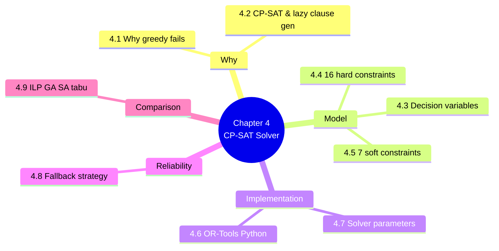

# 4. MOC — The Algorithmic Core (CP-SAT Solver)

> [!abstract] Chapter goal
> The scheduling engine is the heart of the platform. This chapter teaches you why the V1 greedy algorithm was the wrong choice, what CP-SAT (Constraint Programming with SAT backend) actually is, and how to formulate the entire exam scheduling problem as 16 hard constraints + 7 weighted soft constraints solved by Google OR-Tools.

## Notes in this chapter

| Note | Title | What you learn |
|---|---|---|
| 4.1 | [[4.1. Why Greedy Fails on NP-Hard Problems]] | Formal complexity analysis of the V1 greedy loop, the "Greedy Trap" example, and why no greedy variant can guarantee feasibility. |
| 4.2 | [[4.2. CP-SAT and Lazy Clause Generation]] | What CP-SAT is, how it differs from ILP/MIP, why lazy clause generation is the right algorithm for sparse constraint graphs. |
| 4.3 | [[4.3. Decision Variables x y z]] | The three Boolean variable families: `x[m,c]` (module→slot), `y[m,r,c]` (module→room→slot), `z[m,p,c]` (module→prof→slot), plus the `active_{e,t}` auxiliary. |
| 4.4 | [[4.4. The 16 Hard Constraints]] | Each constraint stated mathematically and as CP-SAT code: uniqueness, conflicts, capacity, room/prof availability, TD-room 20 cap, duration fit. |
| 4.5 | [[4.5. The 7 Soft Constraints and Objective]] | The weighted objective: W1=1000 (unscheduled), W2=100 (fairness), W3=10 (dept priority), W4=5 (spread), W5=3 (weekend), W6=1 (room match), W7=50 (overload). |
| 4.6 | [[4.6. OR-Tools Implementation in Python]] | The complete `ExamScheduler` class: `build_variables`, `add_hard_constraints`, `add_objective`, `solve(timeout=30)`. |
| 4.7 | [[4.7. Solver Parameters and Time Budgets]] | `max_time_in_seconds`, `num_search_workers=8`, `log_search_progress`, and how to reconcile the 30 s solver budget with the 45 s business target. |
| 4.8 | [[4.8. The Fallback Strategy]] | Five-level relaxation: drop soft constraints → allow 2 exams/day → allow cross-dept profs → allow room splitting → fall back to greedy + tabu. |
| 4.9 | [[4.9. Alternative Algorithms ILP GA SA Tabu]] | Why V2 rejected ILP (license cost, big-M), genetic algorithms (no convergence proof), simulated annealing (polish only), and kept tabu search as fallback level 5. |

## Why this chapter matters

If you understand only one chapter in this vault, make it this one. The CP-SAT formulation is what makes V2 actually solve the brief. Every other chapter is supporting infrastructure for this algorithm.

## Where to go next

After understanding the solver, proceed to [[5. MOC|Backend Architecture Laravel 12]] to see how the Laravel layer wraps and dispatches it.
