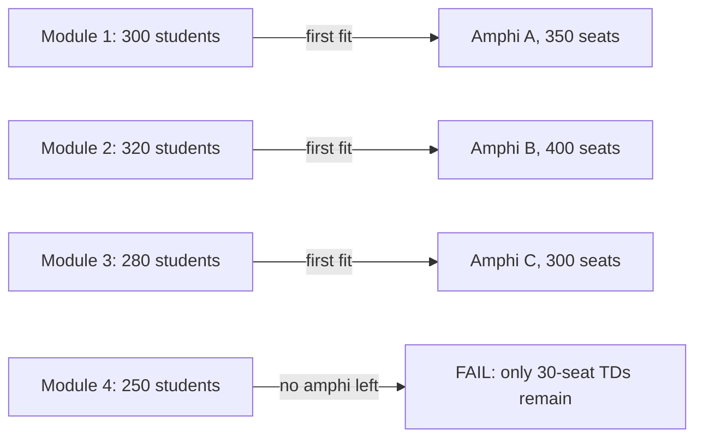

# 4.1. Why Greedy Fails on NP-Hard Problems

> [!abstract] What this note teaches you
> V1 used greedy first-fit — the simplest possible scheduling algorithm. This note explains formally why greedy cannot satisfy the brief's hard constraints, walks through the "Greedy Trap" example, and previews why CP-SAT (which backtracks) is the right replacement.

## What greedy first-fit does

The V1 greedy algorithm (see [[2.4. The Greedy First-Fit Scheduling Algorithm]]) processes modules in some order (largest-enrollment-first) and assigns each to the first creneau/room/professor that satisfies the constraints. Once an assignment is made, **it is never revisited**.

## The Greedy Trap: a worked example

Consider 5 modules and 4 amphis:

| Module | Students |
|---|---|
| M1 | 300 |
| M2 | 320 |
| M3 | 280 |
| M4 | 250 |
| M5 | 200 |

| Amphi | Capacity |
|---|---|
| A | 350 |
| B | 400 |
| C | 300 |
| D | 250 |

Total capacity: 1300. Total students: 1350. There is no feasible assignment because total students > total capacity (we need 1350 seats, have 1300).

Now consider the same modules but with one more amphi:

| Amphi | Capacity |
|---|---|
| A | 350 |
| B | 400 |
| C | 300 |
| D | 250 |
| E | 250 |

Total capacity: 1550. Total students: 1350. Feasible solutions exist (e.g. M1→A, M2→B, M3→C, M4→D, M5→E).

But greedy first-fit, processing modules in the order M1, M2, M3, M4, M5:

1. M1 (300) → A (350). ✓ (50 seats wasted)
2. M2 (320) → B (400). ✓ (80 seats wasted)
3. M3 (280) → C (300). ✓ (20 seats wasted)
4. M4 (250) → D (250). ✓ (0 seats wasted)
5. M5 (200) → E (250). ✓ (50 seats wasted)

OK, greedy works here. Now perturb the order — process M5 first:

1. M5 (200) → A (350). ✓ (150 seats wasted — greedy took the smallest-fitting amphi, but the order matters)
   
Wait, V1's `find_available_room` uses `ORDER BY capacite ASC`, so it picks the *smallest* fitting room. Let me redo:

1. M5 (200) → D (250). ✓ (50 wasted)
2. M4 (250) → C (300). ✓ (50 wasted)
3. M3 (280) → B (400). ✓ (120 wasted)
4. M2 (320) → A (350). ✓ (30 wasted)
5. M1 (300) → E (250). ✗ (E too small) → no room left → M1 unscheduled.

Greedy reports "M1 unscheduled" and moves on. But a feasible solution exists (M1→A, M2→B, M3→C, M4→D, M5→E). The greedy algorithm **cannot find it** because it committed to D, C, B, A for the smaller modules.

This is the Greedy Trap. The only way out is **backtracking**: undo the M5→D assignment, try M5→E instead, then re-evaluate.

## Why greedy cannot backtrack

Greedy is a "constructive" heuristic: it builds one solution incrementally and never revisits. There is no mechanism to undo a previous decision. The algorithm has no memory of alternative choices it could have made.

A **local search** algorithm (like tabu search or simulated annealing) starts from a complete (possibly invalid) solution and iteratively improves it by swapping assignments. This is the polish layer in V2's fallback level 5 — see [[4.8. The Fallback Strategy]].

A **constraint programming solver** like CP-SAT explores the search space systematically, with **lazy clause generation** recording why each partial assignment failed, so it can prune future search. This is the V2 default — see [[4.2. CP-SAT and Lazy Clause Generation]].

## The other greedy failures

Beyond the Greedy Trap, V1's greedy has these failures:

### No objective function

Greedy finds *a* feasible schedule. It does not try to find a *good* one. The brief's soft preferences (student spread, professor fairness, weekend avoidance, room utilization) are not modeled. See [[4.5. The 7 Soft Constraints and Objective]].

### No fairness

The brief requires equalized professor workload across the session. V1's `find_available_professor` picks the least-loaded prof *today*, which actively harms session-level fairness — the same few professors get assigned early and end up with all the work. See [[1.3. Hard Constraints and Business Rules]] constraint 5.

### No split rooms

The fatal `UNIQUE(module_id, creneau_id)` constraint makes splitting impossible. A 400-student module with no single 400-seat room is unschedulable. See [[2.6. The Fatal UNIQUE Constraint]].

### No fallback

If a module can't be scheduled under strict rules, V1 gives up. No retry with relaxed constraints. V2 has a 5-level fallback strategy — see [[4.8. The Fallback Strategy]].

### No infeasibility proof

When greedy reports "X unscheduled", you don't know whether:
- A feasible schedule exists but greedy didn't find it, OR
- No feasible schedule exists (constraints too tight).

CP-SAT distinguishes: `INFEASIBLE` is a mathematical proof that no schedule exists. `FEASIBLE` is a valid schedule. `OPTIMAL` is the best possible. Greedy gives you none of these guarantees.

## Complexity analysis of V1's greedy

Let:
- $M$ = modules (~1,200 baseline, ~5,000 max)
- $C$ = creneaux (~64)
- $R$ = rooms (~50)
- $P$ = professors (~200)
- $d$ = avg conflict degree (~20)

Per-iteration cost: $O(d + R + P)$ for the three pre-checks.
Total: $O(M \cdot C \cdot (d + R + P))$.

At baseline: $1200 \cdot 64 \cdot (20 + 50 + 200) \approx 21$M operations.
At max scale: $5000 \cdot 64 \cdot (50 + 200 + 1000) \approx 400$M operations.

These numbers are *achievable* in 30–60 seconds for the greedy loop itself. The problem isn't the operation count — it's that the greedy loop **produces a bad schedule** even when it finishes quickly.

CP-SAT's complexity is exponential in the worst case, but with lazy clause generation it prunes the search space aggressively. On real exam scheduling instances, it finds optimal or near-optimal solutions in 5–30 seconds — see [[4.7. Solver Parameters and Time Budgets]].

## Common junior developer mistakes

- **"Greedy is good enough for a demo."** It is — until the demo dataset hits a Greedy Trap and the demo fails live.
- **"We can add backtracking later."** You cannot retrofit backtracking onto a greedy loop. You have to replace the algorithm entirely. Pick the right algorithm from day 1.
- **"Greedy + tabu search is the same as CP-SAT."** It isn't. Greedy + tabu is a local search metaheuristic — it improves a feasible solution but cannot prove infeasibility. CP-SAT is a complete solver — it proves infeasibility or optimality.
- **"Let's just try more orderings."** Trying 100 random orderings of greedy is still greedy. You're sampling 100 points in a search space of $M!$ permutations. CP-SAT explores the space systematically.

## What to read next

- [[4.2. CP-SAT and Lazy Clause Generation]] — the V2 replacement algorithm.
- [[2.4. The Greedy First-Fit Scheduling Algorithm]] — the V1 algorithm in detail.
- [[4.5. The 7 Soft Constraints and Objective]] — what greedy's "no objective" misses.
- [[4.8. The Fallback Strategy]] — what V2 does when CP-SAT times out.
