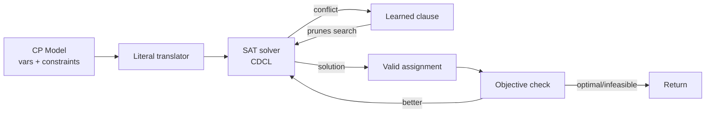

# 4.2. CP-SAT and Lazy Clause Generation

> [!abstract] What this note teaches you
> CP-SAT is Google OR-Tools' constraint programming solver with a SAT backend. It uses lazy clause generation — currently the best known algorithm for sparse constraint graphs like exam scheduling. This note explains what CP-SAT is, how it differs from ILP and greedy, and why it was chosen for V2.

## What CP-SAT is

CP-SAT (Constraint Programming with SAT backend) is a hybrid solver that combines:

1. **Constraint Programming (CP)** — model problems with Boolean and integer variables plus arbitrary constraints (not just linear).
2. **SAT solving** — translate the constraint problem into Boolean satisfiability (SAT) and use a modern CDCL (Conflict-Driven Clause Learning) SAT solver.
3. **Lazy clause generation** — generate SAT clauses on demand during search, recording why each partial assignment failed so the solver can prune future search.



## Why CP-SAT beats ILP for exam scheduling

Integer Linear Programming (ILP/MIP) is the classical approach for combinatorial optimization. Solvers like Gurobi and CPLEX are extremely fast. So why does V2 pick CP-SAT?

| Criterion | CP-SAT | ILP (Gurobi/CPLEX) |
|---|---|---|
| License cost | Free (Apache 2.0) | $$$$ (commercial) |
| Conditional constraints | Native (`OnlyEnforceIf`) | Requires big-M reformulation |
| Sparse constraint graphs | Excellent (lazy clause gen) | Good (presolve) |
| Timetabling benchmarks | Won ITC, PATAT | Also competitive |
| Python API | Excellent | Excellent |
| Setup complexity | pip install | License server |

The big-M problem is the key. In ILP, conditional constraints like "if `x[m,c]=1` then `y[m,r,c]=1`" require a "big-M" reformulation:

$$y_{m,r,c} \leq x_{m,c} + M \cdot (1 - x_{m,c})$$

where $M$ is a large constant. The LP relaxation of this is weak — the solver spends many branch-and-bound iterations proving the constraint. CP-SAT's `OnlyEnforceIf` is native and propagates tightly.

For exam scheduling, which has hundreds of conditional constraints (capacity, equipment, professor availability, etc.), this difference compounds. CP-SAT typically solves exam scheduling instances 2–5× faster than equivalent ILP models.

## Lazy clause generation: the key insight

The hardest part of NP-hard problems is **learning from failure**. When the solver tries an assignment that violates a constraint, it should record *why* the assignment failed, so it doesn't try similar assignments.

**Classical CP solvers** (like the original OR-Tools CP solver) use domain propagation: when a constraint is violated, they remove the offending value from the variable's domain. This is fast but doesn't learn — the same conflict can re-appear in a different branch of the search tree.

**SAT solvers** use clause learning: when a conflict is found, they derive a "learned clause" that explains the conflict in terms of Boolean literals. This clause prunes the search space globally — any future assignment that would re-trigger the same conflict is immediately rejected.

**Lazy clause generation** combines both: it runs CP-style propagation on the original constraints, but translates each propagation step into SAT clauses that the underlying SAT solver can learn from. This gives the best of both worlds:
- CP's expressive modeling (arbitrary constraints, not just linear).
- SAT's learning power (clauses prune globally).

For sparse constraint graphs (where each variable participates in few constraints), lazy clause generation is dramatically faster than either pure CP or pure ILP. Exam scheduling conflict graphs are sparse — each module conflicts with ~20 others on average, not all 1,200.

## What CP-SAT returns

When you call `solver.Solve(model)`, the return value is one of:

- `OPTIMAL` — the solver proved the solution is the best possible under the objective.
- `FEASIBLE` — the solver found a valid solution but did not prove optimality (time budget exhausted).
- `INFEASIBLE` — the solver proved no valid solution exists.
- `MODEL_INVALID` — the model itself has an error (e.g., contradictory constraints).
- `UNKNOWN` — the solver ran out of time without finding any solution or proving infeasibility.

V2's handling:

```python
if status == cp_model.OPTIMAL or status == cp_model.FEASIBLE:
    return ScheduleSolution.from_solver(solver, ...)
elif status == cp_model.INFEASIBLE:
    # Try the fallback strategy (relax constraints)
    return try_fallback(...)
else:  # UNKNOWN
    # Time budget exhausted without solution
    return try_fallback(...)
```

See [[4.8. The Fallback Strategy]].

## The solver API in 30 seconds

```python
from ortools.sat.python import cp_model

model = cp_model.CpModel()

# Create Boolean variables
x = {}
for m in modules:
    for c in creneaux:
        x[m, c] = model.NewBoolVar(f'x_{m}_{c}')

# Add constraints
for m in modules:
    model.Add(sum(x[m, c] for c in creneaux) <= 1)  # each module at most once

# Add objective
model.Minimize(sum(some_cost * x[m, c] for ...))

# Solve
solver = cp_model.CpSolver()
solver.parameters.max_time_in_seconds = 30.0
solver.parameters.num_search_workers = 8
status = solver.Solve(model)

if status in (cp_model.OPTIMAL, cp_model.FEASIBLE):
    for (m, c), var in x.items():
        if solver.Value(var) == 1:
            print(f'Module {m} scheduled at creneau {c}')
```

The full V2 implementation is in [[4.6. OR-Tools Implementation in Python]].

## Why V2 rejected other algorithms

### Genetic algorithms

GAs maintain a population of candidate solutions and evolve them via crossover and mutation. Rejected because:
- No convergence guarantee — you don't know when to stop.
- Hard to tune (mutation rate, population size, generations).
- Cannot prove infeasibility.
- Worse than CP-SAT on standard timetabling benchmarks.

### Simulated annealing

SA is a local search metaheuristic — it improves an existing solution by making small random changes. Rejected as a *primary* solver because:
- It's a polish algorithm, not a feasibility finder.
- Cannot prove infeasibility.
- Better used as a post-CP-SAT polish step (V2 fallback level 5).

### Tabu search

Tabu is a local search with memory — it avoids recently-visited solutions. Rejected as a *primary* solver for the same reasons as SA, but kept as V2 fallback level 5: "greedy + tabu search" as a last resort when CP-SAT times out.

### Pure ILP (Gurobi/CPLEX)

Excellent solvers, but:
- Commercial license cost ($10k+/year for production use).
- Big-M reformulations are slow for conditional constraints.
- Not materially better than CP-SAT on timetabling benchmarks.

See [[4.9. Alternative Algorithms ILP GA SA Tabu]] for the full comparison.

## Common junior developer mistakes

- **Setting `max_time_in_seconds` too low.** A 5-second budget is not enough for 1,000 modules. V2 uses 30s baseline, 120s max scale.
- **Not setting `num_search_workers`.** The default is 1; CP-SAT benefits from parallelism. V2 uses 8.
- **Modeling everything as a hard constraint.** Each hard constraint shrinks the feasible region exponentially. Express preferences as soft constraints (weighted objective terms).
- **Not logging search progress.** `solver.parameters.log_search_progress = True` prints valuable debugging info. Use it during development.
- **Comparing CP-SAT to ILP on small instances.** On small instances both are fast; the difference shows at scale. Always benchmark on production-sized instances.

## What to read next

- [[4.3. Decision Variables x y z]] — the V2 model's variables.
- [[4.4. The 16 Hard Constraints]] — the V2 model's constraints.
- [[4.6. OR-Tools Implementation in Python]] — the full code.
- [[4.9. Alternative Algorithms ILP GA SA Tabu]] — why the others were rejected.
