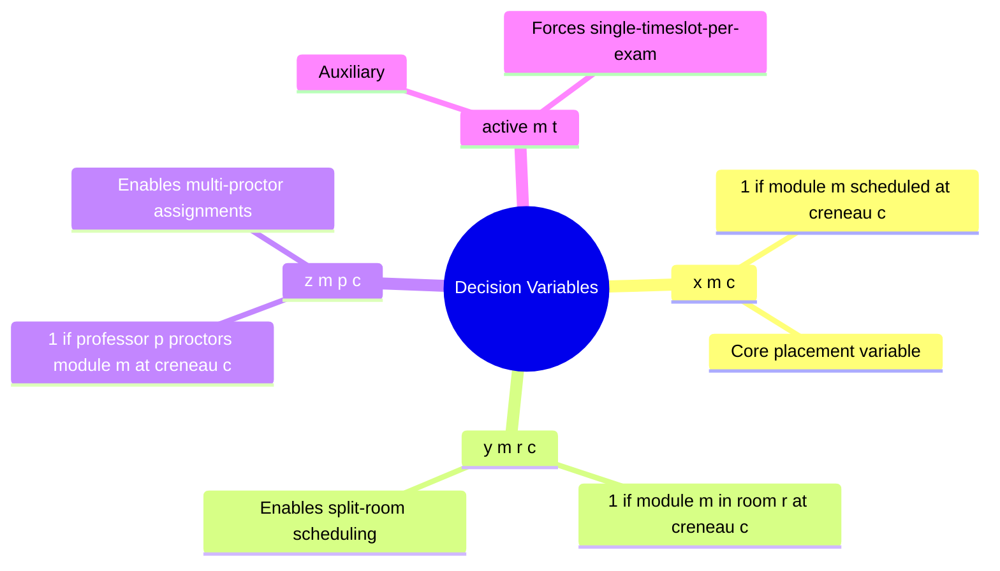

# 4.3. Decision Variables: x, y, z

> [!abstract] What this note teaches you
> The V2 CP-SAT model uses three families of Boolean decision variables — `x[m,c]`, `y[m,r,c]`, `z[m,p,c]` — plus the auxiliary `active_{m,t}`. This note explains what each variable represents, why there are three families instead of one, and how the solver's search space size is bounded.

## The three variable families



### `x[m, c]` — module placement

```python
x[m, c] ∈ {0, 1}
# x[m, c] = 1 iff module m is scheduled at creneau c
```

This is the core variable. The hard constraint `sum_c x[m, c] <= 1` (each module at most once) and the soft penalty `1000 * sum_m (1 - sum_c x[m, c])` (heavily penalize unscheduled modules) directly use `x`.

### `y[m, r, c]` — room assignment

```python
y[m, r, c] ∈ {0, 1}
# y[m, r, c] = 1 iff module m is in room r at creneau c
```

Why a separate variable for room? Because **one module can be in multiple rooms** (split-room scheduling — see [[2.6. The Fatal UNIQUE Constraint]]). The constraint `sum_r y[m, r, c] = x[m, c]` (when module is scheduled at creneau c, it occupies one or more rooms) links `y` to `x`.

### `z[m, p, c]` — professor assignment

```python
z[m, p, c] ∈ {0, 1}
# z[m, p, c] = 1 iff professor p proctors module m at creneau c
```

Similar to `y`, but for professors. A module can have one principal proctor plus secondary surveillants — `z` models all of them. The constraint `sum_p z[m, p, c] = x[m, c]` (when module is scheduled, at least one professor is assigned) links `z` to `x`.

### `active_{m, t}` — auxiliary for single-timeslot rule

```python
active[m, t] ∈ {0, 1}
# active[m, t] = 1 iff module m is scheduled at timeslot t (across any rooms)
```

This auxiliary variable enforces that **if a module is split across multiple rooms, all rooms must be in the same timeslot**. The constraints:

- `x[m, c] <= active[m, t(c)]` — if module is at creneau c, the timeslot t(c) is active.
- `sum_t active[m, t] == 1` — exactly one timeslot per module.

Without this, the solver could schedule module M in room R1 at creneau C1 (Monday 10:00) and room R2 at creneau C2 (Monday 14:00) — two different timeslots for the same exam, which is nonsensical.

## Why three families instead of one

You might wonder: why not just `y[m, r, c]` and derive `x[m, c] = max_r y[m, r, c]`?

Three reasons:

1. **Constraints are clearer.** "Each module scheduled at most once" is naturally expressed on `x`. "Room not double-booked" is naturally expressed on `y`. Mixing them in one variable makes the model harder to read.

2. **Objective terms are clearer.** The unscheduled penalty is `1000 * sum_m (1 - sum_c x[m, c])`. Writing this as `1000 * sum_m (1 - min(1, sum_{r,c} y[m, r, c]))` is awkward and produces a weaker LP relaxation.

3. **Performance.** CP-SAT's presolve can exploit the structure. Having `x` as a "summary" variable of `y` lets the solver propagate faster.

## Search space size

For a typical baseline instance:
- 1,200 modules × 64 creneaux = 76,800 `x` variables.
- 1,200 × 50 rooms × 64 creneaux = 3,840,000 `y` variables.
- 1,200 × 200 professors × 64 creneaux = 15,360,000 `z` variables.

Total: ~19.3 million Boolean variables. Naive enumeration: $2^{19.3M}$ — completely infeasible.

But CP-SAT doesn't enumerate. It uses **lazy clause generation** to prune the search space. In practice, the solver explores a tiny fraction of the space (typically $10^5$ to $10^8$ nodes) before finding an optimal or near-optimal solution.

To keep the variable count manageable, V2 only creates variables that could be non-zero:

```python
# Don't create y[m, r, c] if room r is too small for module m's enrollment
for r in self.data.rooms_for_module(m):
    if r.capacity >= m.enrollment:
        self.y[m.id, r.id, c.id] = self.model.NewBoolVar(...)

# Don't create z[m, p, c] if professor p is from a different department
# (unless cross-dept is allowed)
for p in self.data.profs_for_module(m):
    if p.departement_id == m.departement_id or allow_cross_dept:
        self.z[m.id, p.id, c.id] = self.model.NewBoolVar(...)
```

This pre-filtering reduces the variable count by 80–90% in practice.

## The implementation

```python
def build_variables(self):
    for m in self.data.modules:
        for c in self.data.creneaux_for_module(m):
            self.x[m.id, c.id] = self.model.NewBoolVar(f'x_{m.id}_{c.id}')
            for r in self.data.rooms_for_module(m):
                if r.capacity >= m.enrollment:
                    self.y[m.id, r.id, c.id] = self.model.NewBoolVar(f'y_{m.id}_{r.id}_{c.id}')
            for p in self.data.profs_for_module(m):
                self.z[m.id, p.id, c.id] = self.model.NewBoolVar(f'z_{m.id}_{p.id}_{c.id}')
```

See [[4.6. OR-Tools Implementation in Python]] for the full class.

## Common junior developer mistakes

- **Creating all variables upfront.** For 1,200 modules × 200 profs × 64 creneaux, you'd create 15M `z` variables. Pre-filter to feasible (module, prof, creneau) triples.
- **Using integer variables instead of Boolean.** CP-SAT is much faster with pure Boolean models. Use `NewBoolVar` and combine with `Add(sum(...) == k)` for cardinality, not `NewIntVar(0, k)`.
- **Forgetting the `active_{m,t}` auxiliary.** Without it, the solver will happily schedule the same exam in two different timeslots.
- **Not naming variables.** `NewBoolVar('x_42_13')` is much easier to debug than `NewBoolVar('')`. The name shows up in solver logs and conflict analysis.

## What to read next

- [[4.4. The 16 Hard Constraints]] — what these variables must satisfy.
- [[4.5. The 7 Soft Constraints and Objective]] — what the solver optimizes.
- [[4.6. OR-Tools Implementation in Python]] — the full code.
