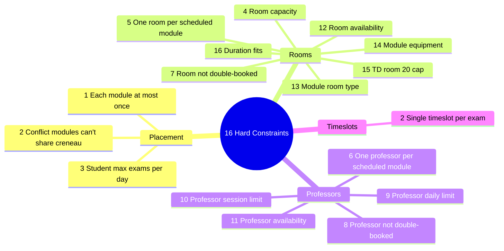

# 4.4. The 16 Hard Constraints

> [!abstract] What this note teaches you
> The V2 CP-SAT model has 16 hard constraints that every valid schedule must satisfy. Each maps directly to a brief requirement or a V1 pathology. This note lists all 16 with their mathematical formulation and CP-SAT code.

## The 16 constraints



## Constraint 1: Each module scheduled at most once

```python
for m in self.data.modules:
    self.model.Add(sum(self.x[m.id, c.id]
                       for c in self.data.creneaux_for_module(m)) <= 1)
```

A module is either scheduled (in one creneau, plus possibly multiple rooms in that creneau) or unscheduled. The `<= 1` (not `== 1`) allows the solver to leave a module unscheduled if infeasible; the soft penalty W1 (weight 1000) strongly discourages this.

## Constraint 2: Conflict modules can't share a creneau

```python
for (m1, m2) in self.data.conflicts:  # from mv_module_conflicts
    for c in self.data.creneaux:
        if (m1, c.id) in self.x and (m2, c.id) in self.x:
            self.model.Add(self.x[m1, c.id] + self.x[m2, c.id] <= 1)
```

If two modules share ≥1 student, they cannot be in the same creneau. The conflict pairs come from the `mv_module_conflicts` materialized view — see [[3.6. Materialized Views and Refresh Strategies]].

## Constraint 3: Student max exams per day

```python
for student, modules in self.data.student_modules.items():
    for day, day_creneaux in self.data.creneaux_by_day.items():
        terms = [self.x[m_id, c.id]
                 for m_id in modules
                 for c in day_creneaux
                 if (m_id, c.id) in self.x]
        if terms:
            self.model.Add(sum(terms) <= self.data.max_exams_per_day)
```

For each student and each day, the number of their modules scheduled on that day is ≤ `max_exams_per_day` (default 1 per the brief — see [[1.3. Hard Constraints and Business Rules]] constraint 1).

## Constraint 4: Room capacity

```python
for m in self.data.modules:
    for c in self.data.creneaux_for_module(m):
        for r in self.data.rooms_for_module(m):
            if (m.id, r.id, c.id) in self.y:
                if r.capacity < m.enrollment:
                    self.model.Add(self.y[m.id, r.id, c.id] == 0)
                # For split rooms, total capacity across rooms must fit:
                # (see constraint 5)
```

For non-split assignments, the room's capacity must be ≥ the module's enrollment. For split assignments, see constraint 5.

## Constraint 5: One room per scheduled module (or multiple for splits)

```python
for m in self.data.modules:
    for c in self.data.creneaux_for_module(m):
        if (m.id, c.id) not in self.x:
            continue
        rooms = [r for r in self.data.rooms_for_module(m)
                 if (m.id, r.id, c.id) in self.y]
        if rooms:
            # y sums to x: if module is scheduled at c, at least one room is assigned
            self.model.Add(
                sum(self.y[m.id, r.id, c.id] for r in rooms) == self.x[m.id, c.id]
            )
            # For split rooms, total capacity must fit enrollment
            self.model.Add(
                sum(self.y[m.id, r.id, c.id] * r.capacity for r in rooms) >=
                m.enrollment * self.x[m.id, c.id]
            )
```

This is the V2 fix for V1's fatal `UNIQUE(module_id, creneau_id)` constraint — see [[2.6. The Fatal UNIQUE Constraint]]. Multiple `y[m, r, c] = 1` for the same `(m, c)` means the exam is split across those rooms.

## Constraint 6: One professor per scheduled module

```python
for m in self.data.modules:
    for c in self.data.creneaux_for_module(m):
        if (m.id, c.id) not in self.x:
            continue
        profs = [p for p in self.data.profs_for_module(m)
                 if (m.id, p.id, c.id) in self.z]
        if profs:
            self.model.Add(
                sum(self.z[m.id, p.id, c.id] for p in profs) >= self.x[m.id, c.id]
            )
```

When a module is scheduled (`x[m,c] = 1`), at least one professor must be assigned (`sum z >= 1`). The `>=` (not `==`) allows secondary surveillants; the principal is one of them.

## Constraint 7: Room not double-booked

```python
for r in self.data.rooms:
    for c in self.data.creneaux:
        terms = [self.y[m.id, r.id, c.id]
                 for m in self.data.modules_at_creneau(c)
                 if (m.id, r.id, c.id) in self.y]
        if terms:
            self.model.Add(sum(terms) <= 1)
```

A room cannot host two different modules at the same creneau. This replaces V1's `trg_check_room_availability` trigger — see [[2.7. Trigger Abuse for Control Flow]].

## Constraint 8: Professor not double-booked

```python
for p in self.data.professors:
    for c in self.data.creneaux:
        terms = [self.z[m.id, p.id, c.id]
                 for m in self.data.modules_at_creneau(c)
                 if (m.id, p.id, c.id) in self.z]
        if terms:
            self.model.Add(sum(terms) <= 1)
```

A professor cannot proctor two different modules at the same creneau.

## Constraint 9: Professor daily limit

```python
for p in self.data.professors:
    for day, day_creneaux in self.data.creneaux_by_day.items():
        terms = [self.z[m.id, p.id, c.id]
                 for m in self.data.modules
                 for c in day_creneaux
                 if (m.id, p.id, c.id) in self.z]
        if terms:
            self.model.Add(sum(terms) <= p.max_surveillances_jour)
```

The brief's "max 3 proctorings per day per professor" — see [[1.3. Hard Constraints and Business Rules]] constraint 2.

## Constraint 10: Professor session limit

```python
for p in self.data.professors:
    terms = [self.z[m.id, p.id, c.id]
             for m in self.data.modules
             for c in self.data.creneaux
             if (m.id, p.id, c.id) in self.z]
    if terms:
        self.model.Add(sum(terms) <= p.max_surveillances_session)
```

Per-professor cap across the entire session (default 15).

## Constraint 11: Professor availability

```python
for p in self.data.professors:
    for unavailability in p.indisponibilites:  # from professeur_indisponibilites
        for c in self.data.creneaux_overlapping(unavailability):
            for m in self.data.modules:
                if (m.id, p.id, c.id) in self.z:
                    self.model.Add(self.z[m.id, p.id, c.id] == 0)
```

If a professor declared unavailability (vacation, conference, sick leave), they cannot be assigned to any exam overlapping that period. V1 had no `professeur_indisponibilites` table at all.

## Constraint 12: Room availability

```python
for r in self.data.rooms:
    for unavailability in r.indisponibilites:  # from lieu_indisponibilites
        for c in self.data.creneaux_overlapping(unavailability):
            for m in self.data.modules:
                if (m.id, r.id, c.id) in self.y:
                    self.model.Add(self.y[m.id, r.id, c.id] == 0)
```

Same for rooms (maintenance, other bookings).

## Constraint 13: Module room type requirement

```python
for m in self.data.modules:
    if m.type_lieu_requis == 'any':
        continue  # any room type is fine
    for c in self.data.creneaux_for_module(m):
        for r in self.data.rooms_for_module(m):
            if r.type != m.type_lieu_requis:
                if (m.id, r.id, c.id) in self.y:
                    self.model.Add(self.y[m.id, r.id, c.id] == 0)
```

A chemistry exam requiring a lab cannot be scheduled in a regular classroom. V1 had no `type_lieu_requis` column.

## Constraint 14: Module equipment requirement

```python
for m in self.data.modules:
    if not m.equipements_requis:
        continue
    for c in self.data.creneaux_for_module(m):
        for r in self.data.rooms_for_module(m):
            if not set(m.equipements_requis).issubset(set(r.equipements)):
                if (m.id, r.id, c.id) in self.y:
                    self.model.Add(self.y[m.id, r.id, c.id] == 0)
```

A module requiring a projector cannot be in a room without one. Uses the GIN-indexed `equipements` array — see [[3.3. Index Strategy B-Tree Partial GIN BRIN GIST]].

## Constraint 15: TD rooms ≤ 20 students (exam conditions)

```python
for m in self.data.modules:
    for c in self.data.creneaux_for_module(m):
        for r in self.data.rooms_for_module(m):
            if r.type == 'salle':  # TD room
                # Either don't use this room, or use it only if enrollment ≤ 20
                if m.enrollment > 20:
                    if (m.id, r.id, c.id) in self.y:
                        self.model.Add(self.y[m.id, r.id, c.id] == 0)
```

The brief's "Salles TD limitées à 20 étudiants max (en période d'examen)" — see [[1.3. Hard Constraints and Business Rules]] constraint 6. V1 missed this entirely.

## Constraint 16: Exam duration fits in creneau

```python
for m in self.data.modules:
    for c in self.data.creneaux_for_module(m):
        if c.duration_minutes < m.duree_examen_minutes:
            if (m.id, c.id) in self.x:
                self.model.Add(self.x[m.id, c.id] == 0)
```

A 90-minute exam cannot be scheduled in a 60-minute creneau. V1 had no check for this.

## How the constraints compose

The 16 constraints are not independent — they interact. For example:

- Constraint 5 (one room per module) + constraint 15 (TD 20 cap) means: a 40-student module cannot use a single TD room; it must split across 2 TD rooms or use an amphi.
- Constraint 3 (student max exams/day) + constraint 1 (each module at most once) means: a student cannot have the same exam twice in a day (trivially true) AND cannot have two different exams in the same day.

The CP-SAT solver propagates these jointly. A greedy algorithm would have to check them one at a time, often producing invalid partial schedules.

## Common junior developer mistakes

- **Adding too many hard constraints.** Every hard constraint shrinks the feasible region exponentially. Express preferences as soft constraints (weighted objective terms).
- **Forgetting to pre-filter infeasible variable assignments.** Setting `y[m, r, c] == 0` for infeasible (m, r, c) triples is correct but wasteful. Better to not create the variable at all.
- **Not modeling split rooms.** The `==` in constraint 5 prevents splits; `>=` allows them. V2 uses `>=` to enable the V2 fix for the fatal UNIQUE constraint.
- **Forgetting constraint 16 (duration fits).** A 90-minute exam in a 60-minute slot is a real bug. V1 missed this.

## What to read next

- [[4.3. Decision Variables x y z]] — the variables these constraints operate on.
- [[4.5. The 7 Soft Constraints and Objective]] — the objective that optimizes the feasible region.
- [[4.6. OR-Tools Implementation in Python]] — the full code with all 16 constraints.
