# 4.7. Solver Parameters and Time Budgets

> [!abstract] What this note teaches you
> CP-SAT has dozens of parameters. V2 uses 3 that matter: `max_time_in_seconds`, `num_search_workers`, and `log_search_progress`. This note explains each, how to reconcile the 30-second solver budget with the 45-second business target, and how to tune for production.

## The 3 parameters that matter

```python
solver = cp_model.CpSolver()
solver.parameters.max_time_in_seconds = 30.0   # 1
solver.parameters.num_search_workers = 8       # 2
solver.parameters.log_search_progress = True   # 3
```

### 1. `max_time_in_seconds`

The hard wall-clock limit. When the timer expires, the solver returns the best solution found so far (status `FEASIBLE`) or `UNKNOWN` if it found nothing.

V2 uses:
- **30 seconds** for the baseline 13k-student case.
- **120 seconds** for the max-scale 100k-student case.

These fit inside the business budget (45s baseline, 5min max scale) leaving room for MV refresh, persistence, and lock overhead — see [[1.5. Scale Targets and Performance Budget]].

### 2. `num_search_workers`

CP-SAT parallelizes the search across multiple workers, each running a different search strategy (literal routing, LP relaxation, etc.). The workers share learned clauses.

V2 uses **8 workers** (one per CPU core on the solver VM). The sweet spot is typically 4–16; beyond 16, the clause-sharing overhead dominates.

The default is 1 — always set this explicitly.

### 3. `log_search_progress`

When `True`, the solver prints progress to stderr: solutions found, bounds, conflict counts. Indispensable during development; can be turned off in production.

Sample output:

```
Starting CP-SAT solver v9.7
Parameters: max_time_in_seconds = 30 num_search_workers = 8 log_search_progress = true
Initial objective value = 0
[Diagnosis] Model too large to fit in memory: ...
[Search] #branch = 1234, #conflicts = 56, objective = 10500, bound = 9800, time = 5.2s
[Search] #branch = 5678, #conflicts = 89, objective = 10200, bound = 9900, time = 12.4s
[Search] Solution found: objective = 10100
[Search] #branch = 8901, #conflicts = 102, objective = 10100, bound = 10050, time = 20.1s
[Search] Optimal solution found: objective = 10050, time = 28.7s
```

## The time budget reconciliation

The source documents mentioned three different time budgets:

| Source | Budget | For |
|---|---|---|
| Project brief (PDF) | < 45 s | Total scheduling run (baseline) |
| CODE_REVIEW_AND_REDESIGN_01 | < 5 min | Total scheduling run (max scale) |
| CODE_REVIEW_AND_REDESIGN_02 | 30 s | CP-SAT solver timeout |
| CODE_REVIEW_AND_REDESIGN_03 | 120 s | CP-SAT solver timeout |
| CODE_REVIEW_AND_REDESIGN_03 | 600 s | Laravel job timeout |
| V1 source | 0 | `SET LOCAL statement_timeout = 0` (disabled) |

V2 reconciles these as follows:

```mermaid
gantt
    title V2 Scheduling Pipeline Time Budget (baseline 13k students)
    dateFormat X
    axisFormat %s sec
    
    section HTTP
    Auth + validate :0, 1
    section Async
    Redis lock :1, 1
    Advisory lock :2, 1
    Refresh MV :3, 3
    Load solver input :6, 1
    CP-SAT solve :7, 30
    Persist in transaction :37, 1
    Release locks :38, 1
    section Total
    38 seconds :0, 38
```



- **HTTP request**: ~100 ms (auth + validate + dispatch job). Returns immediately to the client.
- **Job overhead**: ~5 seconds (locks, MV refresh, data loading).
- **CP-SAT solver**: 30 seconds hard ceiling.
- **Persistence**: ~500 ms (soft-delete + insert in `DB::transaction`).
- **Total**: ~36 seconds, comfortably under the 45-second business target.

At max scale, the solver budget grows to 120s and total to ~5 minutes.

## Other parameters worth knowing

V2 doesn't tune these, but they're useful to know:

- `solver.parameters.max_memory_in_mb = 4096` — cap memory usage. Default is unlimited, which can OOM on large instances.
- `solver.parameters.num_search_workers = 8` — already discussed.
- `solver.parameters.linearization_level = 1` — how aggressively to linearize (0=off, 1=default, 2=aggressive).
- `solver.parameters.use_lns_only = False` — Large Neighborhood Search only. Experimental.
- `solver.parameters.share_all_clauses = True` — share all clauses across workers (default: share only shorter clauses).

For most scheduling problems, the defaults are fine. Don't tune what isn't measured.

## How to tune for production

1. **Start with the 3 V2 parameters** (`max_time_in_seconds`, `num_search_workers`, `log_search_progress`).
2. **Benchmark on production-sized instances.** Don't tune on the 13k demo if you're deploying to 100k.
3. **Look at the solver log.** If the solver consistently finds `OPTIMAL` in 5s, you can lower the budget. If it consistently times out with `FEASIBLE`, raise the budget or relax constraints.
4. **Don't tune to a single instance.** Run 10 different seeds and tune to the 90th percentile.

## Common junior developer mistakes

- **Setting `max_time_in_seconds` too high.** A 600-second budget means the user waits 10 minutes for a timeout. Cap at 2× your business target.
- **Setting it too low.** A 5-second budget on a 1,000-module instance means the solver never finishes the presolve phase.
- **Forgetting `num_search_workers`.** The default is 1; CP-SAT is single-threaded by default. Always set this.
- **Leaving `log_search_progress = True` in production.** It generates a lot of stdout. Turn it off in prod, on in staging.
- **Trying exotic parameters without benchmarks.** `use_lns_only = True` might help or hurt your instance. Measure before committing.

## What to read next

- [[4.6. OR-Tools Implementation in Python]] — the full code.
- [[1.5. Scale Targets and Performance Budget]] — the business budget.
- [[4.8. The Fallback Strategy]] — what to do when the solver times out.
- [[10.7. Load Testing with Locust and k6]] — how to benchmark at production scale.
