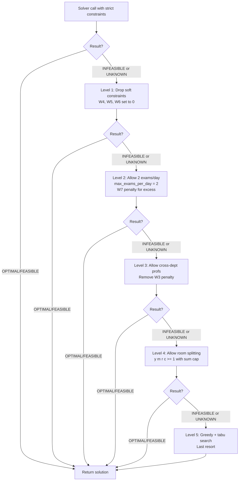

# 4.8. The Fallback Strategy

> [!abstract] What this note teaches you
> When CP-SAT returns `INFEASIBLE` or `UNKNOWN` (timeout without solution), V2 doesn't give up. It progressively relaxes constraints in 5 levels until a feasible schedule is found. This note explains each level, the order, and how the relaxation is logged for the admin.

## The 5-level fallback



## Level 1: Drop soft constraints

The cheapest relaxation. Set the weights for spread (W4), weekend (W5), and room match (W6) to 0. The solver now optimizes only for unscheduled penalty (W1), fairness (W2), cross-dept (W3), and daily overload (W7).

```python
def fallback_level_1(self):
    """Drop cosmetic soft constraints."""
    self.weights['W4'] = 0  # spread
    self.weights['W5'] = 0  # weekend
    self.weights['W6'] = 0  # room match
    self.solve(timeout_seconds=30)
```

This often produces a feasible solution because the solver is no longer trying to avoid weekends or match room sizes — it just needs to fit the exams somewhere.

## Level 2: Allow 2 exams per day per student

The brief's hard constraint 1 says "max 1 exam per day per student". For dense conflict graphs, this is impossible to satisfy. Level 2 relaxes to 2 exams/day with a penalty (W7 = 50) for each excess.

```python
def fallback_level_2(self):
    """Allow 2 exams per day with penalty."""
    self.data.max_exams_per_day = 2
    self.weights['W7'] = 50  # penalize each excess over 1
    self.solve(timeout_seconds=30)
```

The W7 penalty ensures the solver prefers keeping 1 exam/day when possible but accepts 2 when necessary.

## Level 3: Allow cross-department professors

The brief's constraint 4 says "Examens du département sont priorisés" — same-dept proctoring. Level 3 removes the W3 penalty for cross-dept assignments, allowing the solver to use any available professor.

```python
def fallback_level_3(self):
    """Remove cross-dept penalty."""
    self.weights['W3'] = 0
    self.solve(timeout_seconds=30)
```

This is a significant relaxation — it can produce schedules where professors proctor exams from other departments, which is inconvenient but not invalid.

## Level 4: Allow room splitting

The V2 schema supports split-room scheduling via `y[m, r, c] >= 1` (see [[2.6. The Fatal UNIQUE Constraint]]). Level 4 explicitly enables this for exams that couldn't fit in any single room:

```python
def fallback_level_4(self):
    """Explicitly allow split rooms for oversized exams."""
    for m in self.data.modules:
        if m.enrollment > self.data.largest_room_capacity:
            # Allow this module to be split across multiple rooms
            m.allow_split = True
    self.solve(timeout_seconds=60)  # longer timeout for split search
```

Split rooms are a real-world necessity — a 400-student module with no 400-seat amphi must be split. Level 4 makes this explicit rather than relying on the solver to discover it.

## Level 5: Greedy + tabu search (last resort)

If CP-SAT cannot find a feasible solution after all relaxations, V2 falls back to a classical algorithm: greedy first-fit (like V1) plus tabu search for post-optimization.

```python
def fallback_level_5(self):
    """Last resort: greedy + tabu search."""
    greedy_solution = greedy_first_fit(self.data)
    if greedy_solution.is_feasible:
        polished = tabu_search(greedy_solution, iterations=10000)
        return polished
    else:
        return ScheduleSolution.infeasible(
            reason="Even greedy + tabu could not find a feasible schedule. "
                   "The constraints are too tight — please add more creneaux or rooms."
        )
```

This is the only level where V2 uses a non-CP-SAT algorithm. It exists as a safety net — if CP-SAT fails completely, the system still returns *some* schedule (even if partial) rather than no schedule at all.

## Logging the relaxation

Each fallback level logs which constraints were relaxed, so the admin can see what was traded off:

```php
// In GenerateScheduleJob::handle
if ($solution->fallback_level > 0) {
    ScheduleConflict::create([
        'schedule_run_id' => $run->id,
        'type' => 'fallback_used',
        'severity' => 'soft',
        'entity_type' => 'session',
        'entity_id' => $this->sessionId,
        'details' => [
            'level' => $solution->fallback_level,
            'relaxed_constraints' => $solution->relaxed_constraints,
            'reason' => $solution->fallback_reason,
        ],
        'resolved' => false,
    ]);

    Log::warning('Schedule generation used fallback', [
        'session_id' => $this->sessionId,
        'fallback_level' => $solution->fallback_level,
        'relaxed_constraints' => $solution->relaxed_constraints,
    ]);
}
```

The admin UI shows a yellow banner: "⚠️ Schedule generated with relaxed constraints (Level 2: 2 exams/day allowed for 47 students)."

## Why this fallback strategy matters

V1 had no fallback. If the scheduler couldn't place a module, it reported "X unscheduled" and gave up. The admin had to manually fix the schedule or change the input data.

V2's fallback strategy means the system **always returns a schedule** (unless even greedy fails). The schedule may have relaxed constraints, but it's a starting point for manual adjustment. This is the difference between "the system doesn't work" and "the system works with caveats".

## Common junior developer mistakes

- **Giving up after one solver call.** Always have a fallback. The solver returning INFEASIBLE doesn't mean the problem is infeasible — it means the *constraints* are too tight.
- **Relaxing all constraints at once.** Progressive relaxation lets you find the minimum relaxation needed. If you drop everything at once, you lose the audit trail of what was actually relaxed.
- **Not logging relaxations.** The admin needs to know what was traded off. A schedule that violates the brief silently is worse than no schedule.
- **Forgetting the greedy fallback.** Even CP-SAT can fail. Have a non-CP-SAT algorithm as the last resort.
- **Treating fallback as a normal path.** If you're hitting level 3+ regularly, the input data is wrong (not enough creneaux, too many conflicts). Investigate the root cause.

## What to read next

- [[4.4. The 16 Hard Constraints]] — what gets relaxed.
- [[4.5. The 7 Soft Constraints and Objective]] — the weights that get set to 0.
- [[4.9. Alternative Algorithms ILP GA SA Tabu]] — the tabu search used in level 5.
- [[7.2. The GenerateScheduleJob Lifecycle]] — how the fallback is invoked from the job.
