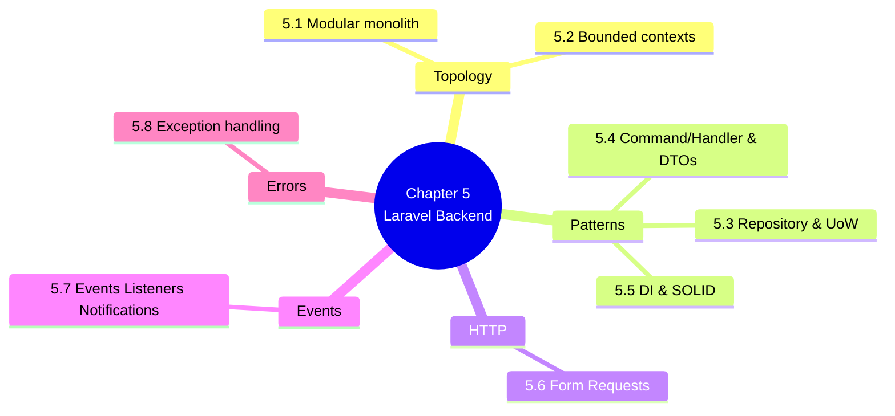

# 5. MOC — Backend Architecture (Laravel 12)

> [!abstract] Chapter goal
> V2's backend is a Laravel 12 modular monolith on PHP 8.4, organized by DDD bounded contexts, using the Repository and Command/Handler patterns. This chapter teaches you each pattern in context — why it exists, what V1 did instead, and how V2 applies it correctly.

## Notes in this chapter

| Note | Title | What you learn |
|---|---|---|
| 5.1 | [[5.1. The Modular Monolith Pattern]] | Why a single-deployable Laravel app with internal modules beats microservices for this scale, and how to keep module boundaries honest. |
| 5.2 | [[5.2. Bounded Contexts Tenancy Catalog Scheduling]] | The 8 bounded contexts (University, Catalog, Enrollment, Scheduling, Validation, Analytics, Audit, Auth) and what lives in each. |
| 5.3 | [[5.3. Repository Pattern and Unit of Work]] | `SchedulingRepositoryInterface` + `PostgresSchedulingRepository`, with `DB::transaction` as the Unit of Work. |
| 5.4 | [[5.4. Command Handler Pattern and DTOs]] | `GenerateScheduleCommand` (readonly DTO) + `GenerateScheduleHandler` (orchestrator). Why this beats controller-does-everything. |
| 5.5 | [[5.5. Dependency Injection and SOLID]] | Laravel's DI container, constructor injection, the Strategy pattern for solvers (`schedule_runs.algorithm`), the State pattern for session workflows. |
| 5.6 | [[5.6. Form Requests and Validation]] | `GenerateScheduleRequest` with `authorize()` (tokenCan) and `rules()` (max_exams_per_day min:1 max:2 with custom French message). |
| 5.7 | [[5.7. Laravel Events Listeners and Notifications]] | `ScheduleGenerated`, `ScheduleApproved`, `DepartmentValidated`, `ConflictDetected` events with `ShouldQueue` listeners and mail/database/broadcast notifications. |
| 5.8 | [[5.8. Exception Handling and Centralized Error Strategy]] | `BusinessException` → 422, `QueryException` → 500 with generic message + server-side log, never leak SQL to the client. |

## Why this chapter matters

V1's "backend" was a thin Python wrapper around Supabase RPCs. V2's backend is a real domain layer with real boundaries. Without this chapter, the V2 codebase will look like magic. With it, you will see that every class exists to enforce a specific SOLID principle or to fix a specific V1 pathology.

## Where to go next

After mastering the backend layer, proceed to [[6. MOC|Multi-Tenancy and Security]] to see how V2 enforces tenant isolation and access control.
