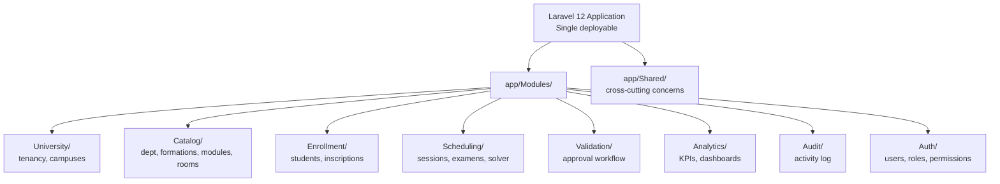

# 5.1. The Modular Monolith Pattern

> [!abstract] What this note teaches you
> V2 is a single Laravel 12 deployable organized internally by 8 bounded contexts as `app/Modules/*` subdirectories. This note explains why a modular monolith beats microservices for this scale, how to keep module boundaries honest, and what V1's unstructured monolith got wrong.

## What is a modular monolith?

A **modular monolith** is a single deployable application (one codebase, one process, one database) that is *internally* organized by bounded contexts as modules. Each module has its own models, controllers, services, and policies, and communicates with other modules only through well-defined interfaces.



## Why not microservices?

Microservices would split each bounded context into a separate deployable. For V2's scale (100k students, 100 tenants, ~100 RPS), microservices are overkill:

| Criterion | Modular monolith | Microservices |
|---|---|---|
| Operational complexity | Low (1 deploy) | High (8+ deploys, service mesh) |
| Network latency | In-process calls | HTTP/gRPC between services |
| Transactional integrity | ACID across modules | Distributed transactions (hard) |
| Team size needed | 2–5 engineers | 8+ engineers (one per service) |
| Debugging | Single stack trace | Distributed tracing required |
| Deployment cadence | Single CI/CD pipeline | Per-service pipelines |
| Cost | 1 set of infra | 8× infra |

The V2 review's verdict (verbatim): *"This is a single bounded context. Monolith with a separate Python scheduler worker is the right granularity."*

The Python CP-SAT solver *is* a separate microservice — but that's because it's a different language/runtime, not because it's a different bounded context.

## Why not V1's unstructured monolith?

V1 had all Python files under `src/backend/` with no module boundaries. Every file could import every other file. The result:

- `db_manager.py` was imported by every service and every Streamlit page.
- `analytics_service.py` and `scheduling_service.py` had no clear ownership boundaries.
- A change to one file could break anything.
- There was no way to extract a module into a microservice later if needed.

V2's modular structure makes boundaries explicit:

```
app/
├── Modules/
│   ├── University/
│   │   ├── Models/University.php, Campus.php
│   │   ├── Policies/UniversityPolicy.php
│   │   ├── Http/Controllers/UniversityController.php
│   │   └── Services/UniversityService.php
│   ├── Catalog/
│   │   ├── Models/Departement.php, Formation.php, Module.php, LieuExamen.php
│   │   ├── Http/Controllers/...
│   │   └── Services/...
│   ├── Scheduling/
│   │   ├── Models/Session.php, Examen.php, ScheduleRun.php
│   │   ├── Jobs/GenerateScheduleJob.php
│   │   ├── Services/ScheduleService.php, SchedulerClient.php
│   │   ├── Events/ScheduleGenerated.php
│   │   └── Policies/SessionPolicy.php
│   └── ...
├── Shared/
│   ├── Concerns/HasAudit.php, BelongsToUniversity.php
│   ├── Exceptions/BusinessException.php
│   └── Support/Decimal.php, DateRange.php
├── Http/
│   ├── Middleware/SetTenantContext.php, RequireRole.php
│   └── Resources/  (DTOs)
└── Providers/
```

## How to keep module boundaries honest

A modular monolith degrades into a ball of mud if modules import each other freely. V2 enforces boundaries via:

### 1. PSR-4 namespace conventions

Each module has its own namespace (`App\Modules\Scheduling\`, `App\Modules\Catalog\`, etc.). Cross-module imports must go through the other module's public API (controllers, services, events).

### 2. PHPStan level 6+ with forbidden namespace rules

A custom PHPStan rule forbids `Modules\Scheduling\Http\Controllers` from importing `Modules\Catalog\Models` directly. Cross-module access must go through `Modules\Catalog\Services\CatalogService`.

### 3. Database schema ownership

Each module owns its tables. The `Scheduling` module owns `sessions_examen`, `creneaux`, `examens`. The `Catalog` module owns `departements`, `formations`, `modules`, `lieu_examen`. Cross-module queries use SQL joins but cross-module *writes* go through the owning module's service.

### 4. Events as the primary cross-module communication

When `Scheduling` finishes a run, it fires `ScheduleGenerated($run)`. The `Analytics` module listens and updates KPIs. The `Validation` module listens and creates pending validation rows. The `Audit` module listens and logs.

This decoupling means `Scheduling` doesn't know who depends on it — adding a new consumer is just adding a new listener.

## The `Shared/` directory

Cross-cutting concerns that don't belong to any bounded context live in `app/Shared/`:

- `Concerns/HasAudit.php` — Eloquent trait adding `created_by`, `updated_by` to models.
- `Concerns/BelongsToUniversity.php` — Eloquent trait adding `university_id` scope.
- `Exceptions/BusinessException.php` — base class for domain exceptions (422 response).
- `Support/Decimal.php` — value object for monetary amounts (used by `note`).
- `Support/DateRange.php` — value object for `TSTZRANGE` columns.

The rule: `Shared/` contains only generic, module-agnostic code. Anything domain-specific belongs in a module.

## When to extract a microservice

The modular monolith is a *stepping stone*. If a module grows large enough or has different scaling characteristics, it can be extracted into a microservice with relatively low cost:

1. Move the module's code into a new repository.
2. Replace direct service calls with HTTP/gRPC.
3. Replace shared database access with API calls.
4. Replace events with a message broker (Redis Streams, Kafka).

V2's `Scheduling` module is the most likely candidate for future extraction — the CP-SAT solver is already a separate Python service. If the scheduling workload grows, the entire `Scheduling` module (Laravel + Python) could become its own deployable.

## Common junior developer mistakes

- **Putting everything in `app/Models/`, `app/Http/Controllers/`, etc.** This is the default Laravel structure but it doesn't scale. Use modules.
- **Allowing cross-module model imports.** `Modules\Scheduling\Models\Examen` should not be imported by `Modules\Catalog\Http\Controllers`. Use the service layer.
- **Putting domain logic in `Shared/`.** `Shared/` is for generic utilities. Domain logic belongs in modules.
- **No namespace conventions.** Without enforced namespaces, modules degrade into a ball of mud.
- **Extracting microservices too early.** Start with a modular monolith. Extract only when forced.

## What to read next

- [[5.2. Bounded Contexts Tenancy Catalog Scheduling]] — the 8 modules in detail.
- [[5.3. Repository Pattern and Unit of Work]] — the data access pattern within each module.
- [[5.4. Command Handler Pattern and DTOs]] — the service organization.
