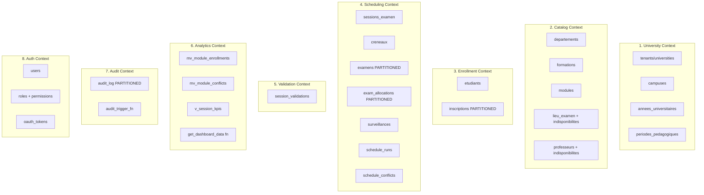

# 5.2. Bounded Contexts: Tenancy, Catalog, Scheduling

> [!abstract] What this note teaches you
> V2 organizes the domain into 8 bounded contexts. Each context owns a coherent slice of the schema, has its own models and services, and communicates with other contexts through events. This note is the inventory of what lives where.

## The 8 bounded contexts

## 1. University Context (Tenancy)

**Owns:** `universities` (or `tenants`), `campuses`, `annees_universitaires`, `periodes_pedagogiques`.

**Purpose:** the SaaS multi-tenant foundation. Every other context's tables have a `university_id` FK to `universities.id`.

**Services:** `UniversityService` (provisioning, activation), `TenantProvisioner` (creates new tenant + default partitions + RLS policies).

**Why it's separate:** tenancy is orthogonal to the academic domain. You can add a new university without touching the Catalog or Scheduling code.

## 2. Catalog Context

**Owns:** `departements`, `formations`, `modules`, `lieu_examen`, `lieu_indisponibilites`, `professeurs`, `professeur_indisponibilites`.

**Purpose:** the "what is being scheduled" — the static academic structure plus the physical resources (rooms, professors).

**Services:** `CatalogService` (CRUD), `RoomAvailabilityService` (queries `lieu_indisponibilites`), `ProfessorAvailabilityService`.

**Why it's separate:** catalog changes are infrequent (a new module is added maybe once per semester) but require careful validation (cross-references to formations, departments, prerequisites). Isolating them prevents accidental coupling to scheduling logic.

## 3. Enrollment Context

**Owns:** `etudiants`, `inscriptions` (partitioned).

**Purpose:** the "who is taking what" — student records and their module enrollments.

**Services:** `EnrollmentService` (CRUD), `InscriptionsImporter` (bulk import from CSV/SIS).

**Why it's separate:** enrollment data is owned by the registrar's office, not the scheduling team. Separating the context lets the registrar import/update enrollments without touching scheduling code.

## 4. Scheduling Context

**Owns:** `sessions_examen`, `creneaux`, `examens`, `exam_allocations`, `surveillances`, `schedule_runs`, `schedule_conflicts`.

**Purpose:** the core domain — generating, persisting, and tracking exam schedules.

**Services:** `ScheduleService` (orchestration), `SchedulerClient` (HTTP client to Python CP-SAT service), `ConflictDetector`.

**Jobs:** `GenerateScheduleJob` (the main async job).

**Events:** `ScheduleGenerated`, `ScheduleApproved`, `ConflictDetected`.

**Why it's separate:** this is the most complex context and the one most likely to be extracted into a microservice. Keeping it isolated makes that future extraction cheap.

## 5. Validation Context

**Owns:** `session_validations`.

**Purpose:** the department-head approval workflow. Each of the 7 departments must validate (or reject) the schedule before publication.

**Services:** `ValidationService` (records decisions, transitions session status when all 7 validate).

**Events:** `DepartmentValidated` (fired on each decision; the Scheduling module listens to check if all departments are done).

**Why it's separate:** validation is a workflow, not a CRUD. It has its own state machine (`en_attente → valide/rejete/a_reviser`) and its own policies (only `chef_dept` of the right department can validate).

## 6. Analytics Context

**Owns:** `mv_module_enrollments`, `mv_module_conflicts`, `v_session_kpis`, `get_dashboard_data` stored function.

**Purpose:** precomputed aggregates for dashboards. Read-only.

**Services:** `AnalyticsService` (queries the materialized views, caches results in Redis).

**Why it's separate:** analytics queries are fundamentally different from OLTP queries (aggregation vs. CRUD). Separating them lets you optimize each independently.

## 7. Audit Context

**Owns:** `audit_log` (partitioned by year), `audit_trigger_fn`.

**Purpose:** immutable record of every write operation. Compliance and accountability.

**Services:** `AuditQueryService` (for the audit log viewer UI).

**Why it's separate:** audit is a cross-cutting concern that must not be bypassed. Isolating it lets you enforce immutability (no `UPDATE` or `DELETE` on `audit_log`) without affecting other contexts.

## 8. Auth Context

**Owns:** `users`, `roles`, `permissions`, `oauth_tokens`, `password_resets`.

**Purpose:** authentication and authorization. Built on Laravel Sanctum + Fortify + spatie/laravel-permission.

**Services:** `AuthService` (login, logout, token issuance), `PermissionService` (role assignment).

**Why it's separate:** auth is a solved problem with off-the-shelf packages. Don't reinvent it. Isolate the auth code so it can be swapped (e.g. moving from Sanctum to JWT) without affecting the domain.

## The 7 roles (spatie/laravel-permission)

| Role | Description | Bounded context interactions |
|---|---|---|
| `super_admin` | All permissions, all tenants | All |
| `vice_doyen` | View all, validate final, publish | Scheduling, Validation, Analytics |
| `admin_planification` | Generate, clear, manual override | Scheduling |
| `chef_dept` | View dept, validate dept | Validation, Catalog (read) |
| `professeur` | View own schedule, declare availability | Scheduling (read own), Catalog (own prof) |
| `etudiant` | View own schedule | Scheduling (read own) |
| `invigilateur` | View assigned exams, take attendance | Scheduling (read assigned) |

See [[6.4. RBAC with spatie laravel-permission]] for the full permission matrix.

## Common junior developer mistakes

- **Putting everything in one context.** "Scheduling" should not own `etudiants` or `lieu_examen`. Those belong to Enrollment and Catalog respectively.
- **Cross-context model imports.** `Scheduling\Models\Examen` should not reference `Catalog\Models\Module` directly. Use the service layer or events.
- **No clear ownership.** If two contexts can both write to a table, you have a boundary violation. Each table has exactly one owning context.
- **Forgetting the Audit context.** Audit is a first-class concern, not an afterthought.
- **Putting auth in the Scheduling context.** Auth is orthogonal to the domain. Keep it separate.

## What to read next

- [[5.1. The Modular Monolith Pattern]] — the architectural style.
- [[5.3. Repository Pattern and Unit of Work]] — the data access pattern within contexts.
- [[6.4. RBAC with spatie laravel-permission]] — the 7 roles in detail.
