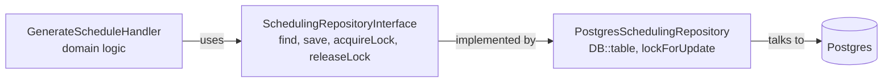

# 5.3. Repository Pattern and Unit of Work

> [!abstract] What this note teaches you
> V2 uses the Repository pattern to abstract persistence (`SchedulingRepositoryInterface`) and Laravel's `DB::transaction` as the Unit of Work. This note explains why this combination beats V1's direct Supabase calls, with the full PHP 8.4 readonly class implementation.

## What the Repository pattern is

A **repository** is an interface that abstracts persistence. The domain layer asks the repository to `find`, `save`, `delete` domain objects; it doesn't know or care whether they're stored in Postgres, MySQL, or a flat file.



## The V2 interface

```php
// app/Domain/Scheduling/Contracts/SchedulingRepositoryInterface.php
declare(strict_types=1);

namespace App\Domain\Scheduling\Contracts;

use App\Domain\Scheduling\Entities\ExamSchedule;
use App\Domain\Shared\ValueObjects\TenantId;
use App\Domain\Shared\ValueObjects\PeriodId;

interface SchedulingRepositoryInterface
{
    public function findActiveSchedule(TenantId $tenantId, PeriodId $periodId): ?ExamSchedule;
    public function save(ExamSchedule $schedule): void;
    public function acquireLock(TenantId $tenantId, PeriodId $periodId, int $ttlSeconds): bool;
    public function releaseLock(TenantId $tenantId, PeriodId $periodId): void;
}
```

The interface lives in `app/Domain/Scheduling/Contracts/` — the domain layer. The implementation lives in `app/Infrastructure/Scheduling/Repositories/` — the infrastructure layer. The handler depends on the interface, not the implementation.

## The V2 implementation

```php
// app/Infrastructure/Scheduling/Repositories/PostgresSchedulingRepository.php
declare(strict_types=1);

namespace App\Infrastructure\Scheduling\Repositories;

use App\Domain\Scheduling\Contracts\SchedulingRepositoryInterface;
use App\Domain\Scheduling\Entities\ExamSchedule;
use App\Domain\Shared\ValueObjects\TenantId;
use App\Domain\Shared\ValueObjects\PeriodId;
use Illuminate\Support\Facades\DB;
use Illuminate\Support\Facades\Redis;

final readonly class PostgresSchedulingRepository implements SchedulingRepositoryInterface
{
    public function findActiveSchedule(TenantId $tenantId, PeriodId $periodId): ?ExamSchedule
    {
        // Row-level lock to prevent dirty reads during the transaction
        $exams = DB::table('exams')
            ->where('tenant_id', $tenantId->toString())
            ->where('academic_period_id', $periodId->toString())
            ->lockForUpdate()
            ->get();

        if ($exams->isEmpty()) {
            return null;
        }

        return ExamSchedule::fromDatabaseCollection($exams);
    }

    public function save(ExamSchedule $schedule): void
    {
        DB::transaction(function () use ($schedule) {
            foreach ($schedule->allocations as $allocation) {
                DB::table('exam_allocations')->updateOrInsert(
                    [
                        'tenant_id' => $schedule->tenantId->toString(),
                        'exam_id' => $allocation->examId,
                        'room_id' => $allocation->roomId,
                    ],
                    [
                        'allocated_students' => $allocation->studentCount,
                    ]
                );
            }
        });
    }

    public function acquireLock(TenantId $tenantId, PeriodId $periodId, int $ttlSeconds): bool
    {
        $lockKey = sprintf("lock:scheduling:%s:%s", $tenantId->toString(), $periodId->toString());
        $value = microtime(true) . gen_random_uuid();

        return (bool) Redis::set($lockKey, $value, 'EX', $ttlSeconds, 'NX');
    }

    public function releaseLock(TenantId $tenantId, PeriodId $periodId): void
    {
        $lockKey = sprintf("lock:scheduling:%s:%s", $tenantId->toString(), $periodId->toString());
        // Production: use Lua compare-and-delete (see [[7.3. Distributed Locks Redis vs Advisory]])
        Redis::del($lockKey);
    }
}
```

Key features:
- `final readonly` — PHP 8.4 immutable class.
- `DB::transaction(fn () => ...)` — the Unit of Work.
- `lockForUpdate()` — row-level lock inside the transaction.
- Redis `SET NX EX` — distributed lock.

## Why this beats V1's direct Supabase calls

V1's `db_manager.py` was a singleton that exposed `db.supabase` as a public property. Every Streamlit page reached through it:

```python
# V1: tight coupling, untestable
response = db.supabase.table("etudiants").select("*").eq("matricule", matricule).execute()
```

The V2 repository pattern:

1. **Testable.** The handler depends on `SchedulingRepositoryInterface`. In tests, you inject a mock that returns canned data. No DB required.
2. **Swappable.** Want to switch from Postgres to MongoDB? Implement `MongoSchedulingRepository`. The domain layer doesn't change.
3. **Explicit boundaries.** The interface lists exactly what the domain can do. Adding a method is a deliberate decision, not an accident.
4. **Transactional.** `save()` wraps the operation in `DB::transaction`. V1 had no transaction support (Supabase client doesn't expose multi-statement transactions).
5. **Lockable.** `acquireLock` and `releaseLock` are explicit. V1 had no locking at all.

## Unit of Work via `DB::transaction`

The **Unit of Work** pattern tracks changes to domain objects and commits them atomically. Laravel's `DB::transaction` provides this:

```php
DB::transaction(function () use ($schedule) {
    foreach ($schedule->allocations as $allocation) {
        DB::table('exam_allocations')->updateOrInsert(...);
    }
});
```

If any `updateOrInsert` throws, the entire transaction rolls back. Either all allocations are saved or none.

V1 had no transactional boundaries. The Python `scheduling_service.clear()` + `scheduling_service.generate()` was two separate RPCs — if `clear()` succeeded and `generate()` failed, the schedule was gone. See [[2.3. The Anemic Service Layer]] and [[7.4. Transaction Safety and Concurrency]].

## When NOT to use the Repository pattern

The Repository pattern adds an interface and an implementation. For simple CRUD, this is overkill — Eloquent models are already repositories.

Use the Repository pattern when:
- The persistence logic is non-trivial (joins, locks, transactions).
- You need to swap implementations (e.g. for testing or for read replicas).
- The domain layer should not know about Eloquent.

Don't use it for:
- Simple `Model::find($id)` lookups.
- Read-only admin CRUD where Eloquent is fine.

V2 uses repositories only for the Scheduling context (complex persistence) and the Enrollment context (bulk imports). Other contexts use Eloquent directly.

## Common junior developer mistakes

- **Adding a repository for every model.** Most models don't need one. Use Eloquent directly.
- **Repository methods that return Eloquent models.** The repository should return domain entities or DTOs, not ORM objects. Otherwise the abstraction leaks.
- **No interface, just a concrete class.** The interface is what makes it testable. Without it, you can't mock.
- **`DB::transaction` outside the repository.** Transactions should be controlled by the service layer (or the repository), not by controllers.
- **Forgetting `lockForUpdate`.** Inside a transaction, `SELECT ... FOR UPDATE` prevents other transactions from modifying the rows you're about to update. Without it, you get race conditions.

## What to read next

- [[5.4. Command Handler Pattern and DTOs]] — the service layer that uses repositories.
- [[5.5. Dependency Injection and SOLID]] — how the interface is injected.
- [[7.4. Transaction Safety and Concurrency]] — `DB::transaction` in depth.
- [[7.3. Distributed Locks Redis vs Advisory]] — the lock implementation.
