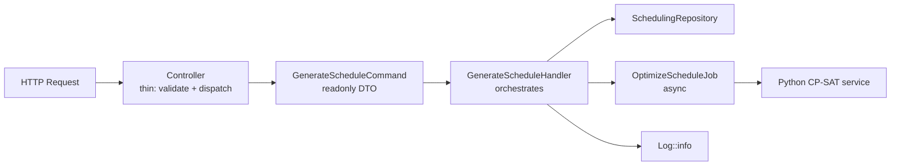

# 5.4. Command/Handler Pattern and DTOs

> [!abstract] What this note teaches you
> V2 organizes application logic as Command objects (readonly DTOs) + Handler classes (orchestrators). This pattern beats "fat controllers" and "anemic services" by making every operation an explicit, testable unit. This note shows the full PHP 8.4 readonly implementation.

## The pattern in one diagram



## The Command (readonly DTO)

A **command** is a value object representing an intent. It carries the parameters of the operation but no behavior.

```php
// app/Application/Scheduling/Commands/GenerateScheduleCommand.php
declare(strict_types=1);

namespace App\Application\Scheduling\Commands;

use App\Domain\Shared\ValueObjects\TenantId;
use App\Domain\Shared\ValueObjects\PeriodId;

final readonly class GenerateScheduleCommand
{
    public function __construct(
        public TenantId $tenantId,
        public PeriodId $periodId,
        public int $maxExamsPerDay,
        public bool $allowSplitRooms
    ) {}
}
```

Key features:
- `final readonly` — immutable; properties can't be modified after construction.
- `public` constructor properties — PHP 8.4 constructor promotion, no boilerplate getters.
- Value objects (`TenantId`, `PeriodId`) instead of raw strings — type safety at the boundary.

## The Handler

A **handler** receives a command and orchestrates the work: validation, repository calls, job dispatch, logging, events.

```php
// app/Application/Scheduling/Handlers/GenerateScheduleHandler.php
declare(strict_types=1);

namespace App\Application\Scheduling\Handlers;

use App\Application\Scheduling\Commands\GenerateScheduleCommand;
use App\Domain\Scheduling\Contracts\SchedulingRepositoryInterface;
use App\Infrastructure\Scheduling\Jobs\OptimizeScheduleJob;
use App\Domain\Shared\Exceptions\ConcurrencyLockException;
use Illuminate\Support\Facades\Log;

final readonly class GenerateScheduleHandler
{
    public function __construct(
        private SchedulingRepositoryInterface $repository
    ) {}

    /**
     * @throws ConcurrencyLockException
     */
    public function handle(GenerateScheduleCommand $command): void
    {
        $tenantId = $command->tenantId->toString();
        $periodId = $command->periodId->toString();

        Log::info("Attempting to acquire scheduling lock for tenant: {$tenantId}, period: {$periodId}");

        $acquired = $this->repository->acquireLock($command->tenantId, $command->periodId, 300);

        if (!$acquired) {
            Log::warning("Scheduling lock acquisition failed for tenant: {$tenantId}");
            throw new ConcurrencyLockException(
                "An optimization run is already in progress for this academic period."
            );
        }

        try {
            OptimizeScheduleJob::dispatch(
                $tenantId,
                $periodId,
                $command->maxExamsPerDay,
                $command->allowSplitRooms
            )->onQueue('optimization-workers');

            Log::info("Optimization job successfully dispatched to background queue for tenant: {$tenantId}");
        } catch (\Throwable $e) {
            $this->repository->releaseLock($command->tenantId, $command->periodId);
            Log::error("Failed to dispatch scheduling job: {$e->getMessage()}", ['exception' => $e]);
            throw $e;
        }
    }
}
```

Key features:
- Constructor injection of `SchedulingRepositoryInterface` (DI — see [[5.5. Dependency Injection and SOLID]]).
- `try/catch/finally` ensures the lock is released on failure.
- `Log::info/warning/error` at every decision point — observability built in.
- `OptimizeScheduleJob::dispatch(...)->onQueue('optimization-workers')` — async dispatch.

## The Controller (thin)

The controller's only job is to receive the HTTP request, validate it, authorize it, dispatch the command, and return a response. No business logic.

```php
// app/Modules/Scheduling/Http/Controllers/ScheduleController.php
class ScheduleController extends Controller
{
    public function __construct(
        private readonly GenerateScheduleHandler $handler
    ) {}

    public function generate(GenerateScheduleRequest $request, string $sessionId): JsonResponse
    {
        $command = new GenerateScheduleCommand(
            tenantId: TenantId::fromString($request->user()->tenant_id),
            periodId: PeriodId::fromString($sessionId),
            maxExamsPerDay: $request->validated('max_exams_per_day', 1),
            allowSplitRooms: $request->validated('allow_split_rooms', true),
        );

        $this->handler->handle($command);

        return response()->json([
            'message' => 'Schedule generation dispatched.',
            'status' => 'pending',
        ], 202);
    }
}
```

The controller is 15 lines. All the work is in the handler. The handler is testable without an HTTP context.

## Why this beats "fat controllers"

V1's `02_Admin_Planification.py` (the de facto controller) had:
- Validation logic.
- Direct Supabase RPC calls.
- Fake progress bar updates.
- Error handling.
- Result display.

~150 lines doing 5 different things. Untestable, unmaintainable.

V2's controller does 1 thing (dispatch). The handler does 1 thing (orchestrate). The repository does 1 thing (persist). Each is independently testable.

## Why this beats "anemic services"

V1's `SchedulingService.generate()` was:

```python
def generate(self, session_id: int, max_exams_per_day: int = 1) -> Dict:
    return db.generate_schedule(session_id, max_exams_per_day)
```

No validation, no locking, no audit, no error handling. See [[2.3. The Anemic Service Layer]].

V2's `GenerateScheduleHandler::handle()` does:
1. Acquire distributed lock.
2. Throw if lock not acquired (prevents concurrent runs).
3. Dispatch async job.
4. Release lock on failure.
5. Log every step.

Every step is a real responsibility, not a forward.

## The async job

The handler dispatches `OptimizeScheduleJob` to the `optimization-workers` queue. The job runs the actual CP-SAT solve — see [[7.2. The GenerateScheduleJob Lifecycle]] for the full trace.

```php
final class OptimizeScheduleJob implements ShouldQueue
{
    use Dispatchable, InteractsWithQueue, Queueable, SerializesModels;

    public int $tries = 3;
    public int $timeout = 600;  // 10-minute hard ceiling

    public function __construct(
        private string $tenantId,
        private string $periodId,
        private int $maxExamsPerDay,
        private bool $allowSplitRooms
    ) {}

    public function handle(PostgresSchedulingRepository $repository): void
    {
        // 1. Refresh mv_module_conflicts
        // 2. Call Python CP-SAT service via HMAC-signed HTTP
        // 3. Persist solution in DB::transaction
        // 4. Release lock in finally block
    }
}
```

## Common junior developer mistakes

- **Putting business logic in controllers.** Controllers should be thin. If your controller has more than 30 lines, refactor.
- **Commands with behavior.** A command is a DTO. No methods except maybe `__toString()` for logging.
- **Handlers that do too much.** If a handler is more than 50 lines, extract collaborators.
- **No `readonly`.** Mutable commands lead to bugs where a handler modifies the command mid-flight.
- **Forgetting to release locks in `finally`.** If the handler throws after acquiring a lock, the lock leaks. Always `try/finally`.
- **Dispatching jobs without `onQueue`.** Default queue is `default`. Use a dedicated queue per job type for prioritization.

## What to read next

- [[5.3. Repository Pattern and Unit of Work]] — the persistence abstraction the handler uses.
- [[5.5. Dependency Injection and SOLID]] — how the handler receives its dependencies.
- [[5.6. Form Requests and Validation]] — the request validation that feeds the command.
- [[7.2. The GenerateScheduleJob Lifecycle]] — the full async pipeline.
