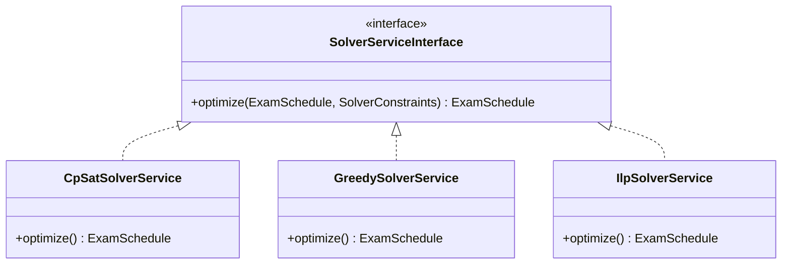

# 5.5. Dependency Injection and SOLID

> [!abstract] What this note teaches you
> V2 uses Laravel's DI container with constructor injection throughout. This note explains how DI makes the code testable and swappable, how the Strategy pattern supports multiple solver algorithms, and how the State pattern formalizes session status transitions. Each SOLID principle is illustrated with V2 code.

## What Dependency Injection is

**Dependency Injection (DI)** means: an object receives its dependencies from outside, rather than creating them itself.

```php
// Bad: the class creates its own dependency
class ScheduleService
{
    private $repository;
    
    public function __construct()
    {
        $this->repository = new PostgresSchedulingRepository();  // tight coupling
    }
}

// Good: the class receives its dependency
final readonly class GenerateScheduleHandler
{
    public function __construct(
        private SchedulingRepositoryInterface $repository  // loose coupling
    ) {}
}
```

Laravel's DI container resolves the interface to the concrete class based on a binding:

```php
// app/Providers/AppServiceProvider.php
public function register(): void
{
    $this->app->bind(
        SchedulingRepositoryInterface::class,
        PostgresSchedulingRepository::class
    );
}
```

In tests, you override the binding with a mock:

```php
$this->app->bind(
    SchedulingRepositoryInterface::class,
    fn () => Mockery::mock(SchedulingRepositoryInterface::class)
);
```

## The 5 SOLID principles in V2

### S — Single Responsibility

Each class has one reason to change.

| Class | Responsibility |
|---|---|
| `GenerateScheduleCommand` | Carry scheduling parameters |
| `GenerateScheduleHandler` | Orchestrate schedule generation |
| `PostgresSchedulingRepository` | Persist schedules to Postgres |
| `OptimizeScheduleJob` | Run the async solver |
| `SessionPolicy` | Authorize session actions |

V1's `02_Admin_Planification.py` had validation, RPC calls, progress bar updates, error handling, and display logic in one file — multiple reasons to change.

### O — Open/Closed

Open for extension, closed for modification. The Strategy pattern for solvers is the canonical example:

```php
interface SolverServiceInterface
{
    public function optimize(ExamSchedule $initial, SolverConstraints $constraints): ExamSchedule;
}

class CpSatSolverService implements SolverServiceInterface { ... }
class GreedySolverService implements SolverServiceInterface { ... }  // fallback
class IlpSolverService implements SolverServiceInterface { ... }    // future

// The handler doesn't care which solver:
public function __construct(
    private SolverServiceInterface $solver  // any implementation
) {}
```

The `schedule_runs.algorithm` column records which solver was used (`cp_sat`, `greedy`, `ilp`, `manual`). Adding a new algorithm = adding a new class + a new enum value. No existing code changes.

### L — Liskov Substitution

Subtypes must be substitutable for their base types. V2's repositories honor this: any `SchedulingRepositoryInterface` implementation behaves the same way. If you swap `PostgresSchedulingRepository` for `MongoSchedulingRepository`, the handler doesn't know or care.

### I — Interface Segregation

No class should be forced to depend on methods it doesn't use. V2 splits interfaces:

```php
interface SchedulingRepositoryInterface
{
    public function findActiveSchedule(...): ?ExamSchedule;
    public function save(ExamSchedule $schedule): void;
}

interface LockRepositoryInterface
{
    public function acquireLock(...): bool;
    public function releaseLock(...): void;
}
```

A handler that only needs to save doesn't depend on lock methods. (V2 combines them in `SchedulingRepositoryInterface` for simplicity, but the principle applies to other contexts.)

### D — Dependency Inversion

Depend on abstractions, not concretions. The handler depends on `SchedulingRepositoryInterface` (abstraction), not `PostgresSchedulingRepository` (concretion). The binding is in `AppServiceProvider`, not in the handler.

## The Strategy pattern for solvers



The `ScheduleRun` model records which strategy was used:

```php
$scheduleRun = ScheduleRun::create([
    'session_id' => $sessionId,
    'algorithm' => $request->algorithm ?? 'cp_sat',  // 'cp_sat', 'greedy', 'ilp', 'manual'
    'statut' => 'en_attente',
    ...
]);

// The factory picks the right strategy:
$solver = SolverFactory::make($scheduleRun->algorithm);
$solution = $solver->optimize($schedule, $constraints);
```

## The State pattern for session workflows

V2's `sessions_examen.statut` has 9 values with explicit transitions:

```
planification → generation → genere → validation → valide → publie → en_cours → termine
                ↑                ↓
                ←←←←←←←←←←←←←←←←  (revision requested)
```

Instead of `if ($session->statut === '...')` scattered through the code, V2 uses a State pattern:

```php
abstract class SessionState
{
    abstract public function transitionTo(Session $session, string $newStatus): void;
    abstract public function canGenerate(): bool;
    abstract public function canValidate(): bool;
    abstract public function canPublish(): bool;
}

class PlanificationState extends SessionState
{
    public function canGenerate(): bool { return true; }
    public function canValidate(): bool { return false; }
    public function canPublish(): bool { return false; }
    
    public function transitionTo(Session $session, string $newStatus): void
    {
        if (!in_array($newStatus, ['generation', 'annule'])) {
            throw new InvalidStateTransitionException("Cannot transition from planification to {$newStatus}");
        }
        $session->update(['statut' => $newStatus]);
    }
}

// ... one class per status
```

The `ScheduleService::validateSchedule` method delegates to the state:

```php
public function validateSchedule(int $sessionId, int $deptId, ...): void
{
    $session = Session::find($sessionId);
    $state = SessionStateFactory::make($session->statut);
    
    if (!$state->canValidate()) {
        throw new BusinessException("Session in {$session->statut} status cannot be validated.");
    }
    
    // ... proceed with validation
}
```

V1 had no state pattern — a stray UPDATE could send a `termine` session back to `planification`. See [[7.5. State Machines for Session and Validation]].

## Common junior developer mistakes

- **Using `new` inside a class.** `new SomeDependency()` in a constructor defeats DI. Use constructor injection.
- **Depending on concretions.** `PostgresSchedulingRepository` as a type hint binds you to Postgres. Use the interface.
- **No interface for strategies.** If you have `if ($algorithm === 'cp_sat') { ... } elseif ($algorithm === 'greedy') { ... }`, you don't have a strategy — you have a switch statement. Extract an interface.
- **God classes.** A class with 20 dependencies violates Single Responsibility. Split it.
- **Testing without DI.** If your tests require a real database, you're not using DI correctly. Mock the repositories.

## What to read next

- [[5.3. Repository Pattern and Unit of Work]] — the abstraction the DI container binds.
- [[5.4. Command Handler Pattern and DTOs]] — the handlers that receive DI'd dependencies.
- [[7.5. State Machines for Session and Validation]] — the State pattern in detail.
