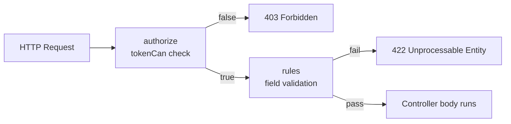

# 5.6. Form Requests and Validation

> [!abstract] What this note teaches you
> V1 had no input validation — `matricule` strings went straight to the DB. V2 uses Laravel Form Requests with explicit `authorize()` and `rules()` methods, including custom French error messages that prevent the "max 3 exams per day" footgun. This note is the V2 validation layer.

## What a Form Request is

A Laravel **Form Request** is a request object that encapsulates authorization and validation. The controller method-hints the Form Request class, and Laravel automatically:

1. Runs `authorize()` — if false, returns 403.
2. Runs `rules()` — if validation fails, returns 422 with errors.
3. Only if both pass, the controller body runs.



## The V2 `GenerateScheduleRequest`

```php
// app/Modules/Scheduling/Http/Requests/GenerateScheduleRequest.php
declare(strict_types=1);

namespace App\Modules\Scheduling\Http\Requests;

use Illuminate\Foundation\Http\FormRequest;
use Illuminate\Validation\Rule;

class GenerateScheduleRequest extends FormRequest
{
    public function authorize(): bool
    {
        // Token scope check — only tokens with 'schedule:write' can call this
        return $this->user()->tokenCan('schedule:write');
    }

    public function rules(): array
    {
        return [
            'session_id' => ['required', 'integer', Rule::exists('sessions_examen', 'id')],
            'algorithm' => ['sometimes', Rule::in(['cp_sat', 'greedy', 'ilp'])],
            'max_exams_per_day' => ['sometimes', 'integer', 'min:1', 'max:2'],
            'timeout_seconds' => ['sometimes', 'integer', 'min:5', 'max:300'],
            'soft_constraints' => ['sometimes', 'array'],
            'soft_constraints.*' => [Rule::in(['weekend_avoidance', 'spread', 'room_match'])],
            'allow_split_rooms' => ['sometimes', 'boolean'],
        ];
    }

    public function messages(): array
    {
        return [
            'session_id.exists' => 'La session spécifiée n\'existe pas.',
            'max_exams_per_day.max' => 'Le maximum d\'examens par jour est de 2 (la valeur 3 violerait les règles académiques).',
            'algorithm.in' => 'Algorithme non supporté. Choisissez parmi: cp_sat, greedy, ilp.',
        ];
    }
}
```

## The `max_exams_per_day` footgun fix

V1's `02_Admin_Planification.py` had:

```python
max_exams = st.slider("Max exams/jour/étudiant", 1, 3, 1)
```

A slider allowing values 1, 2, 3 with no warning. The brief explicitly requires 1 exam per day. Setting it to 3 silently violates the brief.

V2's Form Request rejects values > 2 with a French message explaining *why*:

```php
'max_exams_per_day' => ['sometimes', 'integer', 'min:1', 'max:2'],
// ...
'max_exams_per_day.max' => 'Le maximum d\'examens par jour est de 2 (la valeur 3 violerait les règles académiques).',
```

The value 2 is allowed as a relaxation (see [[4.8. The Fallback Strategy]] level 2), but 3 is rejected outright. The Streamlit slider is now `st.slider("Max exams/jour", 1, 2, 1, help="La valeur 2 est un assouplissement (à éviter).")`.

## The `authorize()` method

```php
public function authorize(): bool
{
    return $this->user()->tokenCan('schedule:write');
}
```

This checks the OAuth2 token's scope. A token with only `schedule:read` scope cannot call this endpoint. The scope is set at token-issuance time by Laravel Sanctum.

For more complex authorization (e.g. "user can generate for this specific session"), the Form Request delegates to a Policy:

```php
public function authorize(): bool
{
    $session = Session::find($this->session_id);
    return $this->user()->can('generate', $session);
}
```

The `SessionPolicy::generate` method checks both the role and the tenant:

```php
class SessionPolicy
{
    public function generate(User $user, Session $session): bool
    {
        return $user->university_id === $session->university_id
            && $user->can('scheduling.generate');
    }
}
```

See [[6.4. RBAC with spatie laravel-permission]].

## Why this beats V1's no-validation approach

V1's `04_Consultation_Planning.py` did:

```python
matricule = st.text_input("Entrez votre matricule")
response = db.supabase.table("etudiants").select("*").eq("matricule", matricule).execute()
```

No validation. The user could type anything — empty string, SQL-like pattern, 10000-character string — and it went to Supabase.

V2's Form Request:
- Validates type (integer, string, boolean).
- Validates range (`min:1`, `max:2`).
- Validates existence (`Rule::exists`).
- Validates enum membership (`Rule::in`).
- Authorizes via token scope and Policy.
- Returns French error messages.

## Custom validation rules

V2 has custom rules for cross-field validation:

```php
// rules/ValidSessionStatusRule.php
class ValidSessionStatusRule implements ValidationRule
{
    public function validate(string $attribute, mixed $value, Closure $fail): void
    {
        $session = Session::find($this->session_id);
        if ($session && $session->statut !== 'planification') {
            $fail('La session doit être en statut "planification" pour générer un planning.');
        }
    }
}

// In GenerateScheduleRequest:
public function rules(): array
{
    return [
        'session_id' => ['required', 'integer', new ValidSessionStatusRule],
        // ...
    ];
}
```

This is how V2 enforces "you can only generate a schedule for a session in `planification` status" — see [[7.5. State Machines for Session and Validation]].

## Common junior developer mistakes

- **Validation in controllers.** Form Requests exist for a reason. Use them.
- **No `authorize()` method.** The default returns `true`, which means anyone can call the endpoint. Always implement it.
- **Generic error messages.** "The given data was invalid" is useless. Custom messages help users fix the problem.
- **No token scopes.** Sanctum tokens without scopes are all-or-nothing. Use scopes (`schedule:read`, `schedule:write`) for fine-grained control.
- **Trusting client-side validation.** The frontend can be bypassed. Always validate server-side.
- **Forgetting `Rule::exists`.** Validating that a foreign key exists prevents "integrity constraint violation" errors later.

## What to read next

- [[6.3. OAuth2 with Sanctum Fortify Socialite]] — the token system that `tokenCan` checks.
- [[6.4. RBAC with spatie laravel-permission]] — the role/permission system.
- [[7.5. State Machines for Session and Validation]] — the status transitions.
- [[2.8. Missing Security and Multi-Tenancy]] — the V1 anti-pattern this fixes.
